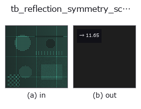
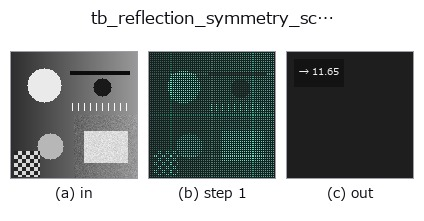

# tb_reflection_symmetry_score — 2D `typed` op

- **データ種**: `points` → `feature`
- **呼び出し**: `fullseye.apply(img, "tb_reflection_symmetry_score", a=0.5, b=0.5)` (2-D は 1 画像 + 2 スカラつまみ `a,b∈[0,1]` のモデル)



*図は合成の入力 128×128 で実際に走らせた出力。左が入力、右が出力。点群は上から見た散布(明るさ = z)、1-D 列は折れ線、体積は z 方向の最大値投影、動画は中央フレーム、複素画像は振幅、絵にならない返り値は値そのもの。*

*つまみ a は出力を変えない(実測: 0.1 / 0.5 / 0.9 で同一)。*

*つまみ b は出力を変えない(実測: 0.1 / 0.5 / 0.9 で同一)。*

**段階**(前置きの op → この op。左から順):



## 使い方

反射対称スコア = chamfer(鏡映, 元) / 中央値最近傍間隔(小さいほど対称、スケール不変)。→ float。

    ``reflect_points`` で点群を平面で鏡映し、元の点群との対称 Chamfer 距離(``chamfer_distance``:
    双方向の最近傍距離の平均の平均)を、元の点群の最近傍間隔の中央値で割る。「鏡像が元の点から
    点間隔の何倍ずれているか」という無次元量なので、座標を定数倍しても値は変わらない。

    - ``points``: (N,3) 点群。``plane_point`` / ``plane_normal``: 候補平面(法線は内部で正規化)。
    - fail-closed: 点群が空・(N,3) でない(``chamfer_distance`` が ``ValueError``)、全点が一致して
      間隔が定義できない(``ValueError``)。重複点で中央値間隔が 0 になる場合だけ、重心からの RMS
      半径 × 1e-12 を床にする。

    読み方の注意: 厳密に対称な形でも、鏡像の点が元のサンプル点にぴったり重なるわけではないので
    スコアは 0 にならず、点間隔程度が床になる(実測値は ``detect_reflection_symmetry`` の表を参照)。
    閾値で採否を決めるより、複数候補を掃引して最小値と 2 位との差(``margin``)を見る。PCA の
    3 軸以外の候補面を試したいときは、この関数を平面パラメータで直接掃引する。

2-D 進化レジストリへ橋渡しした 3d の op ``reflection_symmetry_score``。実装は同じで、呼び出し規約だけ ``op(v, a, b)`` に合わせてある。この op に調整点は無く、``a`` も ``b`` も使われない。

## 参考(サンプルデータ・文献)

- [サンプルデータ カタログ(DL URL / ライセンス)](../../SAMPLES.md) — 2-D は skimage.data(BSD/public)+ 合成、3-D は実データ源(Stanford/PDS 等)の DL URL。
- [演算子の来歴・参考文献](../../../REFERENCES.md) — この op 族の元になった研究/手法の出典。

## Studio で試す

下のプログラムは実際に走ることを確かめてある(図と同じ入力)。Studio のヘルプではこのブロックがボタンになり、その場で読み込んで実行できる。

```program
img_to_points 0.50 0.50
tb_reflection_symmetry_score 0.50 0.50
```

## 実行できる例(この op を実際に呼ぶ検証済みサンプル)

次の例は元の台帳 op `reflection_symmetry_score` を呼ぶもの。この橋渡し op は同じ実装を `fn(v, a, b)` 規約に合わせただけなので、挙動はそのまま当てはまる(呼び出し形だけ違う)。
- [dl_mesh_symmetry](../../../../examples_3d/dl_mesh_symmetry.py) — `py -3.11 examples_3d/dl_mesh_symmetry.py`
- [reflection_symmetry](../../../../examples_3d/reflection_symmetry.py) — `py -3.11 examples_3d/reflection_symmetry.py`

## 型が繋がる次の op(`feature` を入力に取れる)

[identity](../misc/identity.md)

## 同カテゴリ(`typed`)

[tb_points_to_voxel](tb_points_to_voxel.md) · [tb_estimate_point_normals](tb_estimate_point_normals.md) · [tb_iss_keypoints](tb_iss_keypoints.md) · [tb_project_points](tb_project_points.md) · [tb_render_point_depth](tb_render_point_depth.md) · [tb_statistical_outlier_removal](tb_statistical_outlier_removal.md) · [tb_radius_outlier_removal](tb_radius_outlier_removal.md) · [tb_voxel_grid_downsample](tb_voxel_grid_downsample.md)

---
*Provenance: ops.py — 2D operator registry. この per-op ノートは `tools/opdocs.py md` が自動生成(手編集しない)。*

© 2026 Kazufumi Furuse — Fullseye operator documentation. Licensed under Apache-2.0.
