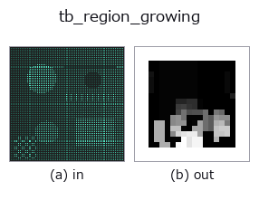
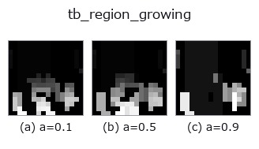
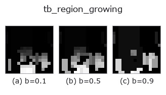
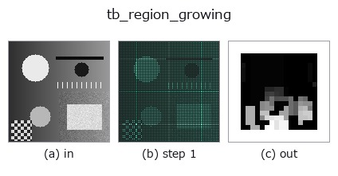
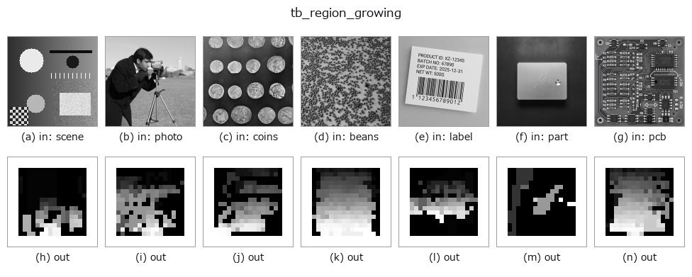

# tb_region_growing — 2D `typed` op

- **データ種**: `points` → `volume`
- **呼び出し**: `fullseye.apply(img, "tb_region_growing", a=0.5, b=0.5)` (2-D は 1 画像 + 2 スカラつまみ `a,b∈[0,1]` のモデル)



*図は合成の入力 128×128 で実際に走らせた出力。左が入力、右が出力。点群は上から見た散布(明るさ = z)、1-D 列は折れ線、体積は z 方向の最大値投影、動画は中央フレーム、複素画像は振幅、絵にならない返り値は値そのもの。*

**つまみ a を振る**(0.1 / 0.5 / 0.9、もう一方は既定):



**つまみ b を振る**(0.1 / 0.5 / 0.9、もう一方は既定):



**段階**(前置きの op → この op。左から順):



**別の画像でも**(合成シーン / 写真 / 硬貨。上段が入力、下段がその出力。つまみは既定):



**動き**(GIF: フレーム / 視点 / スライスを順に。静止の図が完成形で、GIF は補助):


## 使い方

法線類似で領域成長し連結した平滑領域へ同ラベルを付す(曲率ゲート無し変種)。

    各点を k 近傍グラフ上で BFS 成長させ、隣接点 q を「法線 n_p と n_q の成す角が
    ``angle_thresh_deg`` 未満」のときだけ同領域に加える。平面内の法線はほぼ平行なので
    同一領域に連結し、向きの違う面の境界では角度が開いて連結が切れる → 面ごとに別領域。
    法線は符号不定(PCA 由来)なので ``|n_p·n_q|`` で判定(表裏を同一視)。

    Args:
        points: (N,3) 点群。
        normals: (N,3) 単位法線。None なら :func:`pointcloud.estimate_normals` で PCA 推定。
        angle_thresh_deg: 隣接法線角度の許容上限[度]。(0,180) の範囲。
        k: 近傍数(kNN グラフの次数)。

    Returns:
        labels: (N,) int。連結平滑領域ごとに 0,1,2,... を付与。**min_region_size 未満の
        小領域(孤立点・向き不一致のゴミ)は -1(ノイズ/未割当)** = 統一契約(-1=ノイズ)に従う。
        空入力は shape (0,) を返す。

2-D 進化レジストリへ橋渡しした 3d の op ``region_growing``。実装は同じで、呼び出し規約だけ ``op(v, a, b)`` に合わせてある。``a`` が ``angle_thresh_deg``(既定 15)、``b`` が ``k``(既定 20)を振る。

## 参考(サンプルデータ・文献)

- [サンプルデータ カタログ(DL URL / ライセンス)](../../SAMPLES.md) — 2-D は skimage.data(BSD/public)+ 合成、3-D は実データ源(Stanford/PDS 等)の DL URL。
- [演算子の来歴・参考文献](../../../REFERENCES.md) — この op 族の元になった研究/手法の出典。

## Studio で試す

下のプログラムは実際に走ることを確かめてある(図と同じ入力)。Studio のヘルプではこのブロックがボタンになり、その場で読み込んで実行できる。

```program
img_to_points 0.50 0.50
tb_region_growing 0.50 0.50
```

## 実行できる例(この op を実際に呼ぶ検証済みサンプル)

次の例は元の台帳 op `region_growing` を呼ぶもの。この橋渡し op は同じ実装を `fn(v, a, b)` 規約に合わせただけなので、挙動はそのまま当てはまる(呼び出し形だけ違う)。
- [sensor_seg](../../../../examples_3d/sensor_seg.py) — `py -3.11 examples_3d/sensor_seg.py`

## 型が繋がる次の op(`volume` を入力に取れる)

[identity](../misc/identity.md) · [vol_gaussian](../3d/vol_gaussian.md) · [vol_median](../3d/vol_median.md) · [vol_erode](../3d/vol_erode.md) · [vol_dilate](../3d/vol_dilate.md) · [vol_threshold](../3d/vol_threshold.md) · [vol_reg_dilate](../3d/vol_reg_dilate.md) · [vol_reg_erode](../3d/vol_reg_erode.md)

## 同カテゴリ(`typed`)

[tb_points_to_voxel](tb_points_to_voxel.md) · [tb_estimate_point_normals](tb_estimate_point_normals.md) · [tb_iss_keypoints](tb_iss_keypoints.md) · [tb_project_points](tb_project_points.md) · [tb_render_point_depth](tb_render_point_depth.md) · [tb_statistical_outlier_removal](tb_statistical_outlier_removal.md) · [tb_radius_outlier_removal](tb_radius_outlier_removal.md) · [tb_voxel_grid_downsample](tb_voxel_grid_downsample.md)

---
*Provenance: ops.py — 2D operator registry. この per-op ノートは `tools/opdocs.py md` が自動生成(手編集しない)。*

© 2026 Kazufumi Furuse — Fullseye operator documentation. Licensed under Apache-2.0.
