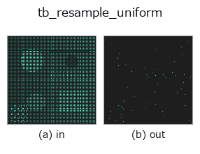
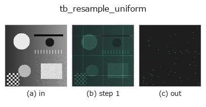
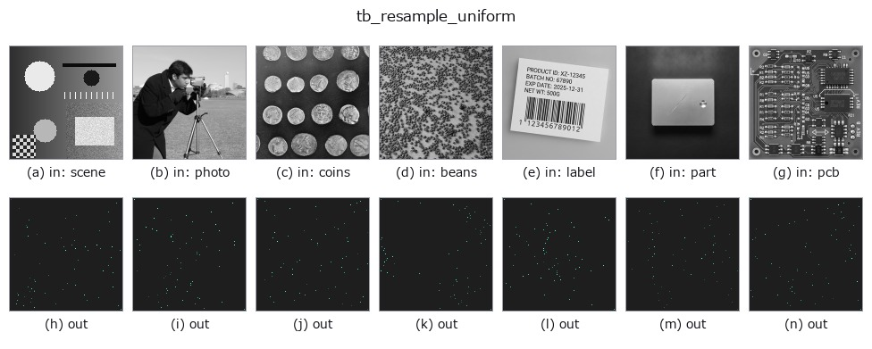

# tb_resample_uniform — 2D `typed` op

- **データ種**: `points` → `points`
- **呼び出し**: `fullseye.apply(img, "tb_resample_uniform", a=0.5, b=0.5)` (2-D は 1 画像 + 2 スカラつまみ `a,b∈[0,1]` のモデル)



*図は合成の入力 128×128 で実際に走らせた出力。左が入力、右が出力。点群は上から見た散布(明るさ = z)、1-D 列は折れ線、体積は z 方向の最大値投影、動画は中央フレーム、複素画像は振幅、絵にならない返り値は値そのもの。*

*つまみ a は出力を変えない(実測: 0.1 / 0.5 / 0.9 で同一)。*

*つまみ b は出力を変えない(実測: 0.1 / 0.5 / 0.9 で同一)。*

**段階**(前置きの op → この op。左から順):



**別の画像でも**(合成シーン / 写真 / 硬貨。上段が入力、下段がその出力。つまみは既定):



## 使い方

弧長で等間隔に n 点へ再サンプル(線形補間)。→ (n,3)。

    ``arc_length`` の累積弧長をパラメータとして ``np.linspace(0, total, n)`` の位置を
    取り、x・y・z を独立に ``np.interp`` で線形補間する。出力は float64 の (n,3)。
    始点と終点は入力の先頭・末尾に一致し、中間点は折れ線上に乗る(元の点を通るとは限らない)。

    - ``n``: 出力点数。1 なら始点 1 点、0 なら空の (0,3)。入力より多くしても情報は増えず
      折れ線を細かく刻むだけ。
    - 全長が 1e-12 未満(全点一致)のときは先頭点を n 回複製して返す。
    - 出力列数は 3 に固定されており、入力が (N,3) 以外だと列数不足で失敗するか余剰列が
      捨てられる。形状検証は無い。
    - 閉曲線は閉じない(終点→始点の区間は補間対象外)。重複点があっても ``np.interp`` は
      通るが、その区間は長さ 0 として扱われる。

    ``curvature_torsion`` / ``frenet_frame`` は index パラメータの差分なので、間隔が不均一な
    点列はこの op で等間隔化してから渡すと数値微分が安定する。滑らかに補間したい場合は
    ``fit_spline_curve``。

2-D 進化レジストリへ橋渡しした 3d の op ``resample_uniform``。実装は同じで、呼び出し規約だけ ``op(v, a, b)`` に合わせてある。この op に調整点は無く、``a`` も ``b`` も使われない。

## 参考(サンプルデータ・文献)

- [サンプルデータ カタログ(DL URL / ライセンス)](../../SAMPLES.md) — 2-D は skimage.data(BSD/public)+ 合成、3-D は実データ源(Stanford/PDS 等)の DL URL。
- [演算子の来歴・参考文献](../../../REFERENCES.md) — この op 族の元になった研究/手法の出典。

## Studio で試す

下のプログラムは実際に走ることを確かめてある(図と同じ入力)。Studio のヘルプではこのブロックがボタンになり、その場で読み込んで実行できる。

```program
img_to_points 0.50 0.50
tb_resample_uniform 0.50 0.50
```

## 実行できる例(この op を実際に呼ぶ検証済みサンプル)

次の例は元の台帳 op `resample_uniform` を呼ぶもの。この橋渡し op は同じ実装を `fn(v, a, b)` 規約に合わせただけなので、挙動はそのまま当てはまる(呼び出し形だけ違う)。
- [bspline_freeform](../../../../examples_3d/bspline_freeform.py) — `py -3.11 examples_3d/bspline_freeform.py`

## 型が繋がる次の op(`points` を入力に取れる)

[identity](../misc/identity.md) · [tb_points_to_voxel](tb_points_to_voxel.md) · [tb_estimate_point_normals](tb_estimate_point_normals.md) · [tb_iss_keypoints](tb_iss_keypoints.md) · [tb_project_points](tb_project_points.md) · [tb_render_point_depth](tb_render_point_depth.md) · [tb_statistical_outlier_removal](tb_statistical_outlier_removal.md) · [tb_radius_outlier_removal](tb_radius_outlier_removal.md)

## 同カテゴリ(`typed`)

[tb_points_to_voxel](tb_points_to_voxel.md) · [tb_estimate_point_normals](tb_estimate_point_normals.md) · [tb_iss_keypoints](tb_iss_keypoints.md) · [tb_project_points](tb_project_points.md) · [tb_render_point_depth](tb_render_point_depth.md) · [tb_statistical_outlier_removal](tb_statistical_outlier_removal.md) · [tb_radius_outlier_removal](tb_radius_outlier_removal.md) · [tb_voxel_grid_downsample](tb_voxel_grid_downsample.md)

---
*Provenance: ops.py — 2D operator registry. この per-op ノートは `tools/opdocs.py md` が自動生成(手編集しない)。*

© 2026 Kazufumi Furuse — Fullseye operator documentation. Licensed under Apache-2.0.
