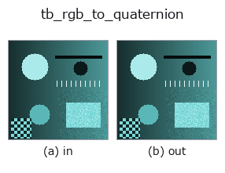
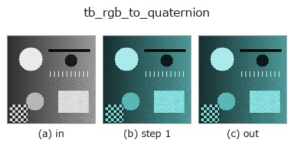
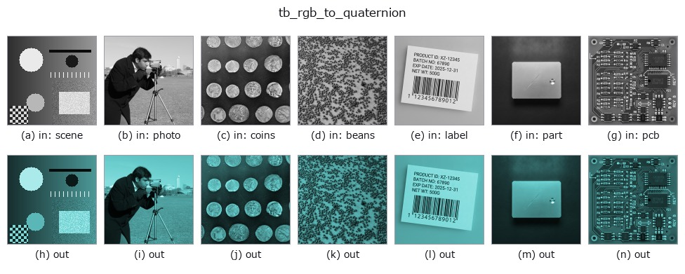

# tb_rgb_to_quaternion — 2D `typed` op

- **データ種**: `rgbimage` → `qimage`
- **呼び出し**: `fullseye.apply(img, "tb_rgb_to_quaternion", a=0.5, b=0.5)` (2-D は 1 画像 + 2 スカラつまみ `a,b∈[0,1]` のモデル)



*図は合成の入力 128×128 で実際に走らせた出力。左が入力、右が出力。点群は上から見た散布(明るさ = z)、1-D 列は折れ線、体積は z 方向の最大値投影、動画は中央フレーム、複素画像は振幅、絵にならない返り値は値そのもの。*

*つまみ a は出力を変えない(実測: 0.1 / 0.5 / 0.9 で同一)。*

*つまみ b は出力を変えない(実測: 0.1 / 0.5 / 0.9 で同一)。*

**段階**(前置きの op → この op。左から順):



**別の画像でも**(合成シーン / 写真 / 硬貨。上段が入力、下段がその出力。つまみは既定):



## 使い方

Embed a colour image as pure quaternions ``0 + R i + G j + B k``. → (H, W, 4).

    Sangwine's 1996 encoding, and the entry point of the whole colour half of
    this module: once a pixel is a quaternion, ``q x conj(q)`` rotates its colour
    and :func:`qft2` transforms the three channels as **one** hypercomplex signal
    instead of three unrelated real ones.

    The scalar (``w``) component is set to exactly zero — a *pure* quaternion —
    because that is what makes the conjugation a 3-D rotation. Values are not
    clamped: linear RGB after black-level subtraction legitimately goes negative,
    and clipping it would change the colour direction, which is the quantity
    every operator downstream reads.

    **Raises** ``ValueError``: *image_rgb* is not a finite ``(H, W, 3)`` numeric
    array, is complex / bool / string-typed / masked, or exceeds
    :data:`MAX_PIXELS`.

Typed bridge of the quat op ``rgb_to_quaternion`` into the 2-D evolution registry: the same implementation, called under the ``op(v, a, b)`` convention. This op has no tunable parameter; ``a`` and ``b`` are unused.

## 参考(サンプルデータ・文献)

- [サンプルデータ カタログ(DL URL / ライセンス)](../../SAMPLES.md) — 2-D は skimage.data(BSD/public)+ 合成、3-D は実データ源(Stanford/PDS 等)の DL URL。
- [演算子の来歴・参考文献](../../../REFERENCES.md) — この op 族の元になった研究/手法の出典。

## Studio で試す

下のプログラムは実際に走ることを確かめてある(図と同じ入力)。Studio のヘルプではこのブロックがボタンになり、その場で読み込んで実行できる。

```program
img_to_rgb 0.50 0.50
tb_rgb_to_quaternion 0.50 0.50
```

## 実行できる例(この op を実際に呼ぶ検証済みサンプル)

次の例は元の台帳 op `rgb_to_quaternion` を呼ぶもの。この橋渡し op は同じ実装を `fn(v, a, b)` 規約に合わせただけなので、挙動はそのまま当てはまる(呼び出し形だけ違う)。
- [quaternion_monogenic](../../../../examples/quaternion_monogenic.py) — `py -3.11 examples/quaternion_monogenic.py`

## 型が繋がる次の op(`qimage` を入力に取れる)

[identity](../misc/identity.md) · [tb_quaternion_to_rgb](tb_quaternion_to_rgb.md) · [tb_quat_norm](tb_quat_norm.md) · [tb_quat_conjugate_image](tb_quat_conjugate_image.md) · [tb_quat_normalize_image](tb_quat_normalize_image.md) · [tb_monogenic_amplitude](tb_monogenic_amplitude.md) · [tb_monogenic_phase](tb_monogenic_phase.md) · [tb_monogenic_orientation](tb_monogenic_orientation.md)

## 同カテゴリ(`typed`)

[tb_points_to_voxel](tb_points_to_voxel.md) · [tb_estimate_point_normals](tb_estimate_point_normals.md) · [tb_iss_keypoints](tb_iss_keypoints.md) · [tb_project_points](tb_project_points.md) · [tb_render_point_depth](tb_render_point_depth.md) · [tb_statistical_outlier_removal](tb_statistical_outlier_removal.md) · [tb_radius_outlier_removal](tb_radius_outlier_removal.md) · [tb_voxel_grid_downsample](tb_voxel_grid_downsample.md)

---
*Provenance: ops.py — 2D operator registry. この per-op ノートは `tools/opdocs.py md` が自動生成(手編集しない)。*

© 2026 Kazufumi Furuse — Fullseye operator documentation. Licensed under Apache-2.0.
