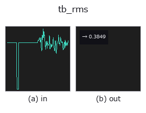
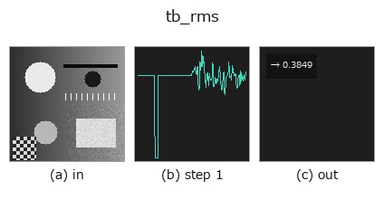

# tb_rms — 2D `typed` op

- **データ種**: `signal` → `feature`
- **呼び出し**: `fullseye.apply(img, "tb_rms", a=0.5, b=0.5)` (2-D は 1 画像 + 2 スカラつまみ `a,b∈[0,1]` のモデル)



*図は合成の入力 128×128 で実際に走らせた出力。左が入力、右が出力。点群は上から見た散布(明るさ = z)、1-D 列は折れ線、体積は z 方向の最大値投影、動画は中央フレーム、複素画像は振幅、絵にならない返り値は値そのもの。*

*つまみ a は出力を変えない(実測: 0.1 / 0.5 / 0.9 で同一)。*

*つまみ b は出力を変えない(実測: 0.1 / 0.5 / 0.9 で同一)。*

**段階**(前置きの op → この op。左から順):



## 使い方

RMS level. Scalar for the whole signal, or a framewise array when *frame*
    is given (a vibration/energy envelope over time).

Typed bridge of the 1d op ``rms`` into the 2-D evolution registry: the same implementation, called under the ``op(v, a, b)`` convention. This op has no tunable parameter; ``a`` and ``b`` are unused.

## 参考(サンプルデータ・文献)

- [サンプルデータ カタログ(DL URL / ライセンス)](../../SAMPLES.md) — 2-D は skimage.data(BSD/public)+ 合成、3-D は実データ源(Stanford/PDS 等)の DL URL。
- [演算子の来歴・参考文献](../../../REFERENCES.md) — この op 族の元になった研究/手法の出典。

## Studio で試す

下のプログラムは実際に走ることを確かめてある(図と同じ入力)。Studio のヘルプではこのブロックがボタンになり、その場で読み込んで実行できる。

```program
img_to_signal 0.50 0.50
tb_rms 0.50 0.50
```

## 実行できる例(この op を実際に呼ぶ検証済みサンプル)

次の例は元の台帳 op `rms` を呼ぶもの。この橋渡し op は同じ実装を `fn(v, a, b)` 規約に合わせただけなので、挙動はそのまま当てはまる(呼び出し形だけ違う)。
- [lens_design_demo](../../../../examples/lens_design_demo.py) — `py -3.11 examples/lens_design_demo.py`
- [lightfield_depth](../../../../examples/lightfield_depth.py) — `py -3.11 examples/lightfield_depth.py`
- [piv_field_analysis_tour](../../../../examples/piv_field_analysis_tour.py) — `py -3.11 examples/piv_field_analysis_tour.py`
- [piv_flow_from_particles](../../../../examples/piv_flow_from_particles.py) — `py -3.11 examples/piv_flow_from_particles.py`
- [poc_battery_electrode_breathing](../../../../examples/poc_battery_electrode_breathing.py) — `py -3.11 examples/poc_battery_electrode_breathing.py`
- [poc_bilateral_asymmetry](../../../../examples/poc_bilateral_asymmetry.py) — `py -3.11 examples/poc_bilateral_asymmetry.py`
- [poc_bump_coplanarity](../../../../examples/poc_bump_coplanarity.py) — `py -3.11 examples/poc_bump_coplanarity.py`
- [poc_cad_scan_deviation](../../../../examples/poc_cad_scan_deviation.py) — `py -3.11 examples/poc_cad_scan_deviation.py`
- [poc_camera_calibration](../../../../examples/poc_camera_calibration.py) — `py -3.11 examples/poc_camera_calibration.py`
- [poc_dimensional_inspection](../../../../examples/poc_dimensional_inspection.py) — `py -3.11 examples/poc_dimensional_inspection.py`
- [poc_exoplanet_transit](../../../../examples/poc_exoplanet_transit.py) — `py -3.11 examples/poc_exoplanet_transit.py`
- [poc_fabric_defect](../../../../examples/poc_fabric_defect.py) — `py -3.11 examples/poc_fabric_defect.py`
- [poc_focus_stacking](../../../../examples/poc_focus_stacking.py) — `py -3.11 examples/poc_focus_stacking.py`
- [poc_gear_tooth_metrology](../../../../examples/poc_gear_tooth_metrology.py) — `py -3.11 examples/poc_gear_tooth_metrology.py`
- [poc_machine_condition_fusion](../../../../examples/poc_machine_condition_fusion.py) — `py -3.11 examples/poc_machine_condition_fusion.py`
- [poc_panorama_drift](../../../../examples/poc_panorama_drift.py) — `py -3.11 examples/poc_panorama_drift.py`
- [poc_print_registration](../../../../examples/poc_print_registration.py) — `py -3.11 examples/poc_print_registration.py`
- [poc_real_stereo_depth](../../../../examples/poc_real_stereo_depth.py) — `py -3.11 examples/poc_real_stereo_depth.py`
- [poc_river_surface_velocity](../../../../examples/poc_river_surface_velocity.py) — `py -3.11 examples/poc_river_surface_velocity.py`
- [poc_screw_thread_metrology](../../../../examples/poc_screw_thread_metrology.py) — `py -3.11 examples/poc_screw_thread_metrology.py`
- [poc_solar_limb_darkening](../../../../examples/poc_solar_limb_darkening.py) — `py -3.11 examples/poc_solar_limb_darkening.py`
- [poc_strain_history](../../../../examples/poc_strain_history.py) — `py -3.11 examples/poc_strain_history.py`
- [poc_surface_roughness](../../../../examples/poc_surface_roughness.py) — `py -3.11 examples/poc_surface_roughness.py`
- [poc_symmetry_restoration](../../../../examples/poc_symmetry_restoration.py) — `py -3.11 examples/poc_symmetry_restoration.py`
- [poc_water_level](../../../../examples/poc_water_level.py) — `py -3.11 examples/poc_water_level.py`
- [profile_shape_inspection](../../../../examples/profile_shape_inspection.py) — `py -3.11 examples/profile_shape_inspection.py`

## 型が繋がる次の op(`feature` を入力に取れる)

[identity](../misc/identity.md)

## 同カテゴリ(`typed`)

[tb_points_to_voxel](tb_points_to_voxel.md) · [tb_estimate_point_normals](tb_estimate_point_normals.md) · [tb_iss_keypoints](tb_iss_keypoints.md) · [tb_project_points](tb_project_points.md) · [tb_render_point_depth](tb_render_point_depth.md) · [tb_statistical_outlier_removal](tb_statistical_outlier_removal.md) · [tb_radius_outlier_removal](tb_radius_outlier_removal.md) · [tb_voxel_grid_downsample](tb_voxel_grid_downsample.md)

---
*Provenance: ops.py — 2D operator registry. この per-op ノートは `tools/opdocs.py md` が自動生成(手編集しない)。*

© 2026 Kazufumi Furuse — Fullseye operator documentation. Licensed under Apache-2.0.
