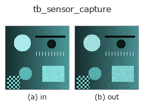
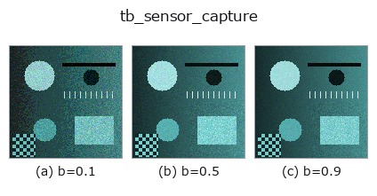
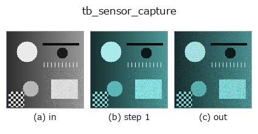
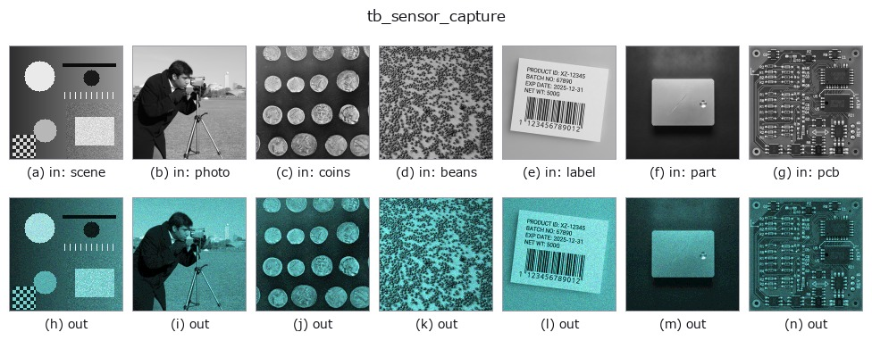

# tb_sensor_capture — 2D `typed` op

- **データ種**: `rgbimage` → `rgbimage`
- **呼び出し**: `fullseye.apply(img, "tb_sensor_capture", a=0.5, b=0.5)` (2-D は 1 画像 + 2 スカラつまみ `a,b∈[0,1]` のモデル)



*図は合成の入力 128×128 で実際に走らせた出力。左が入力、右が出力。点群は上から見た散布(明るさ = z)、1-D 列は折れ線、体積は z 方向の最大値投影、動画は中央フレーム、複素画像は振幅、絵にならない返り値は値そのもの。*

**つまみ a を振る**(0.1 / 0.5 / 0.9、もう一方は既定):


**つまみ b を振る**(0.1 / 0.5 / 0.9、もう一方は既定):



**段階**(前置きの op → この op。左から順):



**別の画像でも**(合成シーン / 写真 / 硬貨。上段が入力、下段がその出力。つまみは既定):



## 使い方

放射輝度 → 実センサの出力(ショット雑音・読み出し雑音・飽和・量子化)。

    光子数 = radiance · exposure_ms · gain_e_per_unit / 1000 を平均とする Poisson。
    そこへ読み出し雑音(正規)を足し、``full_well_e`` で**飽和**させ、``bit_depth``
    で量子化する。飽和は clip であって折り返さない(白飛びは白のまま)。

    返り値は 0..2^bit_depth−1 の整数配列。``seed`` を固定すれば決定的。

2-D 進化レジストリへ橋渡しした optics の op ``sensor_capture``。実装は同じで、呼び出し規約だけ ``op(v, a, b)`` に合わせてある。``a`` が ``exposure_ms``(既定 10)、``b`` が ``gain_e_per_unit``(既定 50000)を振る。

## 参考(サンプルデータ・文献)

- [サンプルデータ カタログ(DL URL / ライセンス)](../../SAMPLES.md) — 2-D は skimage.data(BSD/public)+ 合成、3-D は実データ源(Stanford/PDS 等)の DL URL。
- [演算子の来歴・参考文献](../../../REFERENCES.md) — この op 族の元になった研究/手法の出典。

## Studio で試す

下のプログラムは実際に走ることを確かめてある(図と同じ入力)。Studio のヘルプではこのブロックがボタンになり、その場で読み込んで実行できる。

```program
img_to_rgb 0.50 0.50
tb_sensor_capture 0.50 0.50
```

## 実行できる例(この op を実際に呼ぶ検証済みサンプル)

次の例は元の台帳 op `sensor_capture` を呼ぶもの。この橋渡し op は同じ実装を `fn(v, a, b)` 規約に合わせただけなので、挙動はそのまま当てはまる(呼び出し形だけ違う)。
- [vision_layout_from_catalog](../../../../examples/vision_layout_from_catalog.py) — `py -3.11 examples/vision_layout_from_catalog.py`

## 型が繋がる次の op(`rgbimage` を入力に取れる)

[identity](../misc/identity.md) · [tb_wetness](tb_wetness.md) · [tb_specular_diffuse_split](tb_specular_diffuse_split.md) · [tb_specular_coefficient_map](tb_specular_coefficient_map.md) · [tb_specular_free_transform](tb_specular_free_transform.md) · [tb_rgb_to_quaternion](tb_rgb_to_quaternion.md)

## 同カテゴリ(`typed`)

[tb_points_to_voxel](tb_points_to_voxel.md) · [tb_estimate_point_normals](tb_estimate_point_normals.md) · [tb_iss_keypoints](tb_iss_keypoints.md) · [tb_project_points](tb_project_points.md) · [tb_render_point_depth](tb_render_point_depth.md) · [tb_statistical_outlier_removal](tb_statistical_outlier_removal.md) · [tb_radius_outlier_removal](tb_radius_outlier_removal.md) · [tb_voxel_grid_downsample](tb_voxel_grid_downsample.md)

---
*Provenance: ops.py — 2D operator registry. この per-op ノートは `tools/opdocs.py md` が自動生成(手編集しない)。*

© 2026 Kazufumi Furuse — Fullseye operator documentation. Licensed under Apache-2.0.
