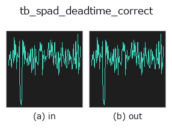
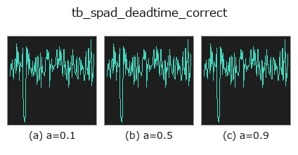
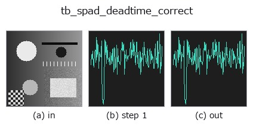
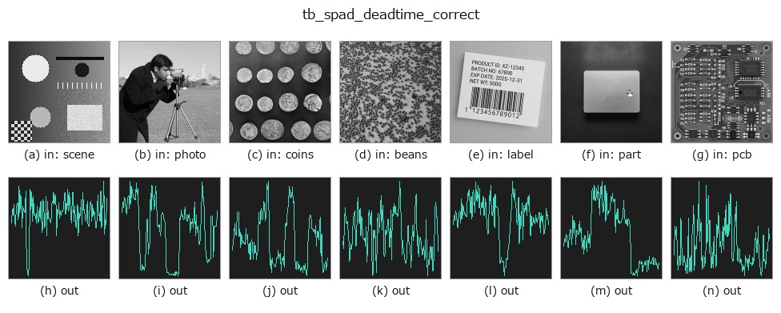

# tb_spad_deadtime_correct — 2D `typed` op

- **データ種**: `counts` → `counts`
- **呼び出し**: `fullseye.apply(img, "tb_spad_deadtime_correct", a=0.5, b=0.5)` (2-D は 1 画像 + 2 スカラつまみ `a,b∈[0,1]` のモデル)



*図は合成の入力 128×128 で実際に走らせた出力。左が入力、右が出力。点群は上から見た散布(明るさ = z)、1-D 列は折れ線、体積は z 方向の最大値投影、動画は中央フレーム、複素画像は振幅、絵にならない返り値は値そのもの。*

**つまみ a を振る**(0.1 / 0.5 / 0.9、もう一方は既定):



*つまみ b は出力を変えない(実測: 0.1 / 0.5 / 0.9 で同一)。*

**段階**(前置きの op → この op。左から順):



**別の画像でも**(合成シーン / 写真 / 硬貨。上段が入力、下段がその出力。つまみは既定):



## 使い方

Recover the true photon rate from a dead-time-distorted measured rate.

    The exact inverse of the **non-paralysable** law of
    :func:`spad_deadtime_apply`::

        n = m / (1 - m*tau)

    A round trip ``apply -> correct`` is exact to machine precision (measured max
    elementwise relative error 6.0e-16 over 2000 rates spanning 1e3 to 5e7 Hz at
    ``tau = 50 ns``, where the measured rate reaches 71.4% of the 20 MHz
    saturation rate).

    **There is deliberately no paralysable inverse.** ``m = n*exp(-n*tau)`` is not
    injective — every measured rate below the maximum ``1/(e*tau)`` corresponds to
    *two* true rates, one below and one above ``1/tau`` — so returning one of them
    would be a fabrication dressed as a correction. Resolve the branch with an
    independent measurement (e.g. an attenuator step) and invert it yourself.

    *measured_hz* is a 1-D array of measured rates in counts per second;
    *dead_time_ns* the dead time in nanoseconds (default 50, the same
    placeholder :func:`spad_deadtime_apply` uses — replace it with the
    datasheet value). Returns the corrected true rates as a float64 1-D array.

    **Raises** ``ValueError``: negative, non-finite or non-1-D *measured_hz*, a
    non-positive *dead_time_ns*, and — instead of returning ``inf`` or a negative
    rate — any measured rate at or above the saturation rate ``1/tau``, which no
    non-paralysable detector can ever produce.

Typed bridge of the photon op ``spad_deadtime_correct`` into the 2-D evolution registry: the same implementation, called under the ``op(v, a, b)`` convention. ``a`` drives ``dead_time_ns`` (default 50); ``b`` is unused.

## 参考(サンプルデータ・文献)

- [サンプルデータ カタログ(DL URL / ライセンス)](../../SAMPLES.md) — 2-D は skimage.data(BSD/public)+ 合成、3-D は実データ源(Stanford/PDS 等)の DL URL。
- [演算子の来歴・参考文献](../../../REFERENCES.md) — この op 族の元になった研究/手法の出典。

## Studio で試す

下のプログラムは実際に走ることを確かめてある(図と同じ入力)。Studio のヘルプではこのブロックがボタンになり、その場で読み込んで実行できる。

```program
img_to_counts 0.50 0.50
tb_spad_deadtime_correct 0.50 0.50
```

## 実行できる例(この op を実際に呼ぶ検証済みサンプル)

次の例は元の台帳 op `spad_deadtime_correct` を呼ぶもの。この橋渡し op は同じ実装を `fn(v, a, b)` 規約に合わせただけなので、挙動はそのまま当てはまる(呼び出し形だけ違う)。
- [photon_timeresolved](../../../../examples/photon_timeresolved.py) — `py -3.11 examples/photon_timeresolved.py`

## 型が繋がる次の op(`counts` を入力に取れる)

[identity](../misc/identity.md) · [tb_spad_deadtime_apply](tb_spad_deadtime_apply.md) · [tb_tcspc_coates_correct](tb_tcspc_coates_correct.md) · [tb_tcspc_irf_convolve](tb_tcspc_irf_convolve.md) · [tb_tcspc_background_subtract](tb_tcspc_background_subtract.md) · [tb_dtof_depth](tb_dtof_depth.md) · [tb_countrate_to_counts](tb_countrate_to_counts.md) · [tb_counts_to_countrate](tb_counts_to_countrate.md)

## 同カテゴリ(`typed`)

[tb_points_to_voxel](tb_points_to_voxel.md) · [tb_estimate_point_normals](tb_estimate_point_normals.md) · [tb_iss_keypoints](tb_iss_keypoints.md) · [tb_angle_3points](tb_angle_3points.md) · [tb_project_points](tb_project_points.md) · [tb_render_point_depth](tb_render_point_depth.md) · [tb_statistical_outlier_removal](tb_statistical_outlier_removal.md) · [tb_radius_outlier_removal](tb_radius_outlier_removal.md)

---
*Provenance: ops.py — 2D operator registry. この per-op ノートは `tools/opdocs.py md` が自動生成(手編集しない)。*

© 2026 Kazufumi Furuse — Fullseye operator documentation. Licensed under Apache-2.0.
