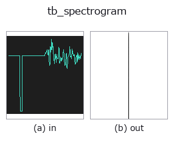
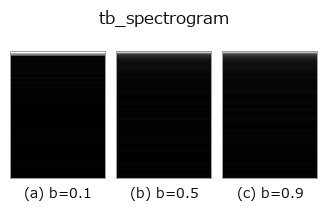
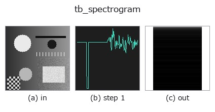
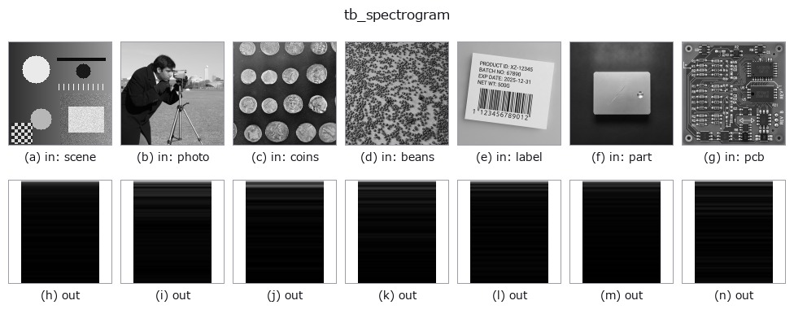

# tb_spectrogram — 2D `typed` op

- **データ種**: `signal` → `image`
- **呼び出し**: `fullseye.apply(img, "tb_spectrogram", a=0.5, b=0.5)` (2-D は 1 画像 + 2 スカラつまみ `a,b∈[0,1]` のモデル)



*図は合成の入力 128×128 で実際に走らせた出力。左が入力、右が出力。点群は上から見た散布(明るさ = z)、1-D 列は折れ線、体積は z 方向の最大値投影、動画は中央フレーム、複素画像は振幅、絵にならない返り値は値そのもの。*

*つまみ a は出力を変えない(実測: 0.1 / 0.5 / 0.9 で同一)。*

**つまみ b を振る**(0.1 / 0.5 / 0.9、もう一方は既定):



**段階**(前置きの op → この op。左から順):



**別の画像でも**(合成シーン / 写真 / 硬貨。上段が入力、下段がその出力。つまみは既定):



## 使い方

STFT magnitude spectrogram -> ``(freqs, times, S)`` with ``S`` shape
    ``(n_freqs, n_frames)``. Hann-windowed; *hop* defaults to ``win//2``.

    **Same raw convention as :func:`spectrum`, but a different divisor.** Each
    column is the unnormalised ``|rfft(frame * hann(win))|``, so it is not an
    amplitude either — and dividing by ``2/win`` is *wrong* here, because the
    Hann window has already thrown away part of the signal. The correct one-sided
    amplitude conversion divides by the window's coherent gain::

        w = np.hanning(win)
        amp = S * (2.0 / w.sum())        # bins 1 .. win/2-1; DC / Nyquist: 1/w.sum()

    Measured on a unit sine at a bin centre (``rate = 16000`` Hz, 1000 Hz,
    amplitude exactly 1.0, ``win = 256``): the raw column peak is
    ``63.7497786196906``; ``* 2/win`` gives ``0.49804514546633283`` (too small by
    exactly the Hann coherent gain ``sum(w)/win = 0.498046875``), while
    ``* 2/sum(w)`` gives ``0.9999965273676957``. Only the second one is the
    amplitude that was actually in the signal.

    Peak *positions*, frame-to-frame ratios and any dB *difference* are unaffected
    by either factor. This function returns magnitudes only — the phase is
    discarded, so it cannot be inverted; use ``acoustics.stft`` / ``acoustics.istft``
    for a round-trip.

Typed bridge of the 1d op ``spectrogram`` into the 2-D evolution registry: the same implementation, called under the ``op(v, a, b)`` convention. ``a`` drives ``rate`` (default 1) and ``b`` drives ``win`` (default 256).

## 参考(サンプルデータ・文献)

- [サンプルデータ カタログ(DL URL / ライセンス)](../../SAMPLES.md) — 2-D は skimage.data(BSD/public)+ 合成、3-D は実データ源(Stanford/PDS 等)の DL URL。
- [演算子の来歴・参考文献](../../../REFERENCES.md) — この op 族の元になった研究/手法の出典。

## Studio で試す

下のプログラムは実際に走ることを確かめてある(図と同じ入力)。Studio のヘルプではこのブロックがボタンになり、その場で読み込んで実行できる。

```program
img_to_signal 0.50 0.50
tb_spectrogram 0.50 0.50
```

## 実行できる例(この op を実際に呼ぶ検証済みサンプル)

- (まだありません)

## 型が繋がる次の op(`image` を入力に取れる)

[identity](../misc/identity.md) · [gaussian](../smoothing/gaussian.md) · [mean_box](../smoothing/mean_box.md) · [bilateral](../smoothing/bilateral.md) · [unsharp](../smoothing/unsharp.md) · [median](../rank/median.md) · [min_filter](../rank/min_filter.md) · [max_filter](../rank/max_filter.md)

## 同カテゴリ(`typed`)

[tb_points_to_voxel](tb_points_to_voxel.md) · [tb_estimate_point_normals](tb_estimate_point_normals.md) · [tb_iss_keypoints](tb_iss_keypoints.md) · [tb_project_points](tb_project_points.md) · [tb_render_point_depth](tb_render_point_depth.md) · [tb_statistical_outlier_removal](tb_statistical_outlier_removal.md) · [tb_radius_outlier_removal](tb_radius_outlier_removal.md) · [tb_voxel_grid_downsample](tb_voxel_grid_downsample.md)

---
*Provenance: ops.py — 2D operator registry. この per-op ノートは `tools/opdocs.py md` が自動生成(手編集しない)。*

© 2026 Kazufumi Furuse — Fullseye operator documentation. Licensed under Apache-2.0.
