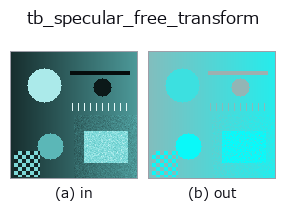
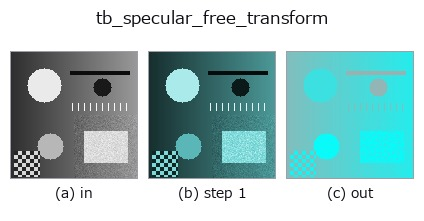
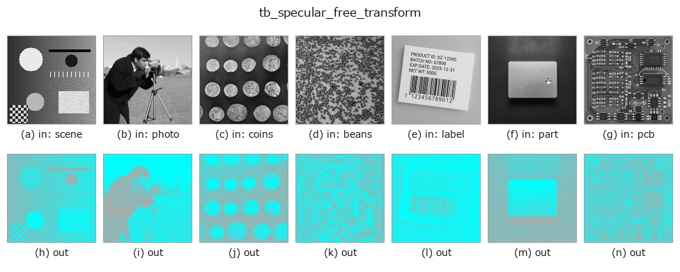

# tb_specular_free_transform — 2D `typed` op

- **データ種**: `rgbimage` → `rgbimage`
- **呼び出し**: `fullseye.apply(img, "tb_specular_free_transform", a=0.5, b=0.5)` (2-D は 1 画像 + 2 スカラつまみ `a,b∈[0,1]` のモデル)



*図は合成の入力 128×128 で実際に走らせた出力。左が入力、右が出力。点群は上から見た散布(明るさ = z)、1-D 列は折れ線、体積は z 方向の最大値投影、動画は中央フレーム、複素画像は振幅、絵にならない返り値は値そのもの。*

*つまみ a は出力を変えない(実測: 0.1 / 0.5 / 0.9 で同一)。*

*つまみ b は出力を変えない(実測: 0.1 / 0.5 / 0.9 で同一)。*

**段階**(前置きの op → この op。左から順):



**別の画像でも**(合成シーン / 写真 / 硬貨。上段が入力、下段がその出力。つまみは既定):



## 使い方

Project out the illuminant direction: the part of the image a highlight cannot touch. → (H, W, 3).

    ``I - (I.G) G`` for the unit illuminant colour ``G``. Under the dichromatic
    model the interface term is ``m_s * G``, so it lies entirely in the removed
    direction and the result is **invariant to any specular term whatsoever** —
    exactly, for any lobe shape, any strength, any spatial pattern. That is the
    specular-invariant subspace of Mallick et al. (2005); this operator is the
    projection itself, with no rotation into named channels, so it stays in RGB
    and composes with the rest of the family.

    Use it when the *shape* of the specular lobe is unknown or the surface is
    textured — feature matching, edge detection and correlation all work in this
    subspace without any of the assumptions
    :func:`specular_diffuse_split` needs.

    **This is a projection, not a picture.** The result loses one of three
    degrees of freedom (its component along ``G`` is exactly zero everywhere)
    and, for an image with negative values after black-level subtraction, keeps
    them. It is not a displayable "highlight-removed photo" and does not claim
    to be; for that, use :func:`specular_diffuse_split`.

    **Raises** ``ValueError``: *image_rgb* is not a valid ``(H, W, 3)`` linear
    RGB image (see :func:`specular_diffuse_split`); *illuminant_rgb* is not a
    non-zero 3-vector.

Typed bridge of the specular op ``specular_free_transform`` into the 2-D evolution registry: the same implementation, called under the ``op(v, a, b)`` convention. This op has no tunable parameter; ``a`` and ``b`` are unused.

## 参考(サンプルデータ・文献)

- [サンプルデータ カタログ(DL URL / ライセンス)](../../SAMPLES.md) — 2-D は skimage.data(BSD/public)+ 合成、3-D は実データ源(Stanford/PDS 等)の DL URL。
- [演算子の来歴・参考文献](../../../REFERENCES.md) — この op 族の元になった研究/手法の出典。

## Studio で試す

下のプログラムは実際に走ることを確かめてある(図と同じ入力)。Studio のヘルプではこのブロックがボタンになり、その場で読み込んで実行できる。

```program
img_to_rgb 0.50 0.50
tb_specular_free_transform 0.50 0.50
```

## 実行できる例(この op を実際に呼ぶ検証済みサンプル)

次の例は元の台帳 op `specular_free_transform` を呼ぶもの。この橋渡し op は同じ実装を `fn(v, a, b)` 規約に合わせただけなので、挙動はそのまま当てはまる(呼び出し形だけ違う)。
- [poc_leaf_disease_area](../../../../examples/poc_leaf_disease_area.py) — `py -3.11 examples/poc_leaf_disease_area.py`
- [specular_photometric](../../../../examples/specular_photometric.py) — `py -3.11 examples/specular_photometric.py`

## 型が繋がる次の op(`rgbimage` を入力に取れる)

[identity](../misc/identity.md) · [tb_wetness](tb_wetness.md) · [tb_sensor_capture](tb_sensor_capture.md) · [tb_specular_diffuse_split](tb_specular_diffuse_split.md) · [tb_specular_coefficient_map](tb_specular_coefficient_map.md) · [tb_rgb_to_quaternion](tb_rgb_to_quaternion.md)

## 同カテゴリ(`typed`)

[tb_points_to_voxel](tb_points_to_voxel.md) · [tb_estimate_point_normals](tb_estimate_point_normals.md) · [tb_iss_keypoints](tb_iss_keypoints.md) · [tb_angle_3points](tb_angle_3points.md) · [tb_project_points](tb_project_points.md) · [tb_render_point_depth](tb_render_point_depth.md) · [tb_statistical_outlier_removal](tb_statistical_outlier_removal.md) · [tb_radius_outlier_removal](tb_radius_outlier_removal.md)

---
*Provenance: ops.py — 2D operator registry. この per-op ノートは `tools/opdocs.py md` が自動生成(手編集しない)。*

© 2026 Kazufumi Furuse — Fullseye operator documentation. Licensed under Apache-2.0.
