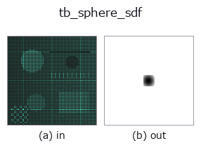
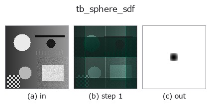
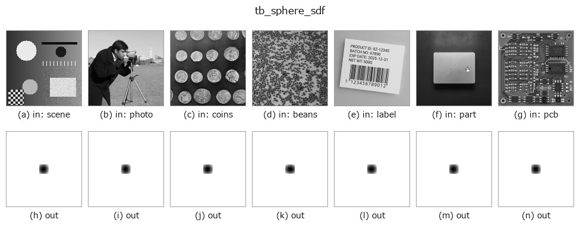
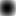

# tb_sphere_sdf — 2D `typed` op

- **データ種**: `points` → `volume`
- **呼び出し**: `fullseye.apply(img, "tb_sphere_sdf", a=0.5, b=0.5)` (2-D は 1 画像 + 2 スカラつまみ `a,b∈[0,1]` のモデル)



*図は合成の入力 128×128 で実際に走らせた出力。左が入力、右が出力。点群は上から見た散布(明るさ = z)、1-D 列は折れ線、体積は z 方向の最大値投影、動画は中央フレーム、複素画像は振幅、絵にならない返り値は値そのもの。*

*つまみ a は出力を変えない(実測: 0.1 / 0.5 / 0.9 で同一)。*

*つまみ b は出力を変えない(実測: 0.1 / 0.5 / 0.9 で同一)。*

**段階**(前置きの op → この op。左から順):



**別の画像でも**(合成シーン / 写真 / 硬貨。上段が入力、下段がその出力。つまみは既定):



**動き**(GIF: フレーム / 視点 / スライスを順に。静止の図が完成形で、GIF は補助):



## 使い方

球の符号付き距離場: ``|p - center| - R``(内側負・外側正)。

    ``grid`` は最終軸が 3 の座標配列 (..., 3)(``grid_coords`` の出力や (N,3) 点群)。
    ``center`` は長さ3、``R>=0`` は半径。返り値の shape は ``grid.shape[:-1]``。厳密な SDF
    (勾配ノルム 1)。``sdf_offset(sphere_sdf(g,c,R), r) == sphere_sdf(g,c,R+r)``。

    Raises ValueError for R<0 or malformed grid/center。

    計算: ``np.linalg.norm(grid - center, axis=-1) - R``。座標の単位はそのまま距離の
    単位になる(``grid_coords`` の world 座標を渡せば world 単位)。座標の成分順は
    ``grid`` の最終軸の順(``grid_coords`` なら ``(x, y, z)``)で、``center`` も同じ順。

    引数と検証(``ValueError``):
    - ``grid``: 最終軸が 3 の float 配列 ``(..., 3)``(1-D の ``(3,)`` も可。0-D や
      最終軸が 3 以外は拒否)。
    - ``center``: 要素数 3(``reshape(3)`` できなければ numpy の ``ValueError``)。
    - ``R``: ``float()`` できるスカラ。回転行列などを渡した場合も ``ValueError``
      (この引数は半径であって姿勢ではない)。``R < 0`` は拒否、``R = 0`` は
      中心からの距離場そのもの。

    返り値: ``grid.shape[:-1]`` の float64(``grid_coords`` の出力なら
    ``(nx, ny, nz)``)。中心で ``-R``、表面で 0、外側で正。

    使いどころ: ``grid_coords`` で格子 → ``sphere_sdf`` / ``box_sdf`` → ``sdf_union`` /
    ``sdf_subtract`` で CSG → ``<= 0`` を占有として marching cubes(``voxel_to_mesh``
    に ``-sdf`` を渡し ``iso=0`` 相当で等値面)。

2-D 進化レジストリへ橋渡しした 3d の op ``sphere_sdf``。実装は同じで、呼び出し規約だけ ``op(v, a, b)`` に合わせてある。この op に調整点は無く、``a`` も ``b`` も使われない。

## 参考(サンプルデータ・文献)

- [サンプルデータ カタログ(DL URL / ライセンス)](../../SAMPLES.md) — 2-D は skimage.data(BSD/public)+ 合成、3-D は実データ源(Stanford/PDS 等)の DL URL。
- [演算子の来歴・参考文献](../../../REFERENCES.md) — この op 族の元になった研究/手法の出典。

## Studio で試す

下のプログラムは実際に走ることを確かめてある(図と同じ入力)。Studio のヘルプではこのブロックがボタンになり、その場で読み込んで実行できる。

```program
img_to_points 0.50 0.50
tb_sphere_sdf 0.50 0.50
```

## 実行できる例(この op を実際に呼ぶ検証済みサンプル)

次の例は元の台帳 op `sphere_sdf` を呼ぶもの。この橋渡し op は同じ実装を `fn(v, a, b)` 規約に合わせただけなので、挙動はそのまま当てはまる(呼び出し形だけ違う)。
- [annotate3d_figure](../../../../examples_3d/annotate3d_figure.py) — `py -3.11 examples_3d/annotate3d_figure.py`
- [gear_metrology](../../../../examples_3d/gear_metrology.py) — `py -3.11 examples_3d/gear_metrology.py`
- [molecule_atom_count](../../../../examples_3d/molecule_atom_count.py) — `py -3.11 examples_3d/molecule_atom_count.py`
- [procedural_hand](../../../../examples_3d/procedural_hand.py) — `py -3.11 examples_3d/procedural_hand.py`
- [render_beauty](../../../../examples_3d/render_beauty.py) — `py -3.11 examples_3d/render_beauty.py`
- [sdf_csg](../../../../examples_3d/sdf_csg.py) — `py -3.11 examples_3d/sdf_csg.py`
- [sfm_recon](../../../../examples_3d/sfm_recon.py) — `py -3.11 examples_3d/sfm_recon.py`

## 型が繋がる次の op(`volume` を入力に取れる)

[identity](../misc/identity.md) · [vol_gaussian](../3d/vol_gaussian.md) · [vol_median](../3d/vol_median.md) · [vol_erode](../3d/vol_erode.md) · [vol_dilate](../3d/vol_dilate.md) · [vol_threshold](../3d/vol_threshold.md) · [vol_reg_dilate](../3d/vol_reg_dilate.md) · [vol_reg_erode](../3d/vol_reg_erode.md)

## 同カテゴリ(`typed`)

[tb_points_to_voxel](tb_points_to_voxel.md) · [tb_estimate_point_normals](tb_estimate_point_normals.md) · [tb_iss_keypoints](tb_iss_keypoints.md) · [tb_project_points](tb_project_points.md) · [tb_render_point_depth](tb_render_point_depth.md) · [tb_statistical_outlier_removal](tb_statistical_outlier_removal.md) · [tb_radius_outlier_removal](tb_radius_outlier_removal.md) · [tb_voxel_grid_downsample](tb_voxel_grid_downsample.md)

---
*Provenance: ops.py — 2D operator registry. この per-op ノートは `tools/opdocs.py md` が自動生成(手編集しない)。*

© 2026 Kazufumi Furuse — Fullseye operator documentation. Licensed under Apache-2.0.
