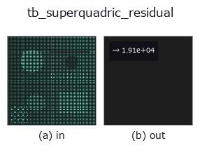
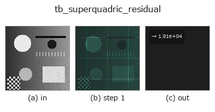

# tb_superquadric_residual — 2D `typed` op

- **データ種**: `points` → `feature`
- **呼び出し**: `fullseye.apply(img, "tb_superquadric_residual", a=0.5, b=0.5)` (2-D は 1 画像 + 2 スカラつまみ `a,b∈[0,1]` のモデル)



*図は合成の入力 128×128 で実際に走らせた出力。左が入力、右が出力。点群は上から見た散布(明るさ = z)、1-D 列は折れ線、体積は z 方向の最大値投影、動画は中央フレーム、複素画像は振幅、絵にならない返り値は値そのもの。*

*つまみ a は出力を変えない(実測: 0.1 / 0.5 / 0.9 で同一)。*

*つまみ b は出力を変えない(実測: 0.1 / 0.5 / 0.9 で同一)。*

**段階**(前置きの op → この op。左から順):



## 使い方

Gross-Boult 体積補正残差 mean( (sqrt(a1 a2 a3)(F^eps1 - 1))^2 )。

    ``inside_outside(points, a, eps, R, t)`` で各点の内外関数 F を求め、点ごとの残差
    ``r_i = sqrt(a1*a2*a3) * (F_i**eps1 - 1)`` の 2 乗平均を float で返す。表面上の点は ``F=1`` なので
    残差 0、内側は負・外側は正の残差になる(2 乗するので符号は消える)。``fit_superquadric`` が
    最小化しているのと同じ量で、返り dict の ``residual`` もこの値。

    - ``points``: (N,3) にリシェイプできる点群(world 座標)。
    - ``a``: 半径 (a1,a2,a3)。``eps``: 形状指数 (eps1,eps2)(F の計算には両方、外側の ``F**eps1`` には
      ``eps1`` だけを使う)。
    - ``R``/``t``: 姿勢(``X_body = R.T @ (X - t)``)。``None`` なら単位回転 / 原点。

    数値保護: F は [0, 1e12] にクリップし、``a1*a2*a3`` は 1e-12 以上に持ち上げてから sqrt を取る
    (退化パラメータで inf/NaN にならないため。表面近傍の値には影響しない)。
    次元: ``sqrt(a1 a2 a3)`` は長さの 3/2 乗、``F^eps1 - 1`` は無次元なので、返り値は長さの 3 乗の
    次元を持ち点群のスケールに依存する。大きさの違う物体どうしの比較には向かない。真の点-表面
    ユークリッド距離ではなく半径距離近似であること、外れ値に無防備なことはモジュール docstring
    のとおり。

2-D 進化レジストリへ橋渡しした 3d の op ``superquadric_residual``。実装は同じで、呼び出し規約だけ ``op(v, a, b)`` に合わせてある。この op に調整点は無く、``a`` も ``b`` も使われない。

## 参考(サンプルデータ・文献)

- [サンプルデータ カタログ(DL URL / ライセンス)](../../SAMPLES.md) — 2-D は skimage.data(BSD/public)+ 合成、3-D は実データ源(Stanford/PDS 等)の DL URL。
- [演算子の来歴・参考文献](../../../REFERENCES.md) — この op 族の元になった研究/手法の出典。

## Studio で試す

下のプログラムは実際に走ることを確かめてある(図と同じ入力)。Studio のヘルプではこのブロックがボタンになり、その場で読み込んで実行できる。

```program
img_to_points 0.50 0.50
tb_superquadric_residual 0.50 0.50
```

## 実行できる例(この op を実際に呼ぶ検証済みサンプル)

次の例は元の台帳 op `superquadric_residual` を呼ぶもの。この橋渡し op は同じ実装を `fn(v, a, b)` 規約に合わせただけなので、挙動はそのまま当てはまる(呼び出し形だけ違う)。
- [superquadric_fit](../../../../examples_3d/superquadric_fit.py) — `py -3.11 examples_3d/superquadric_fit.py`

## 型が繋がる次の op(`feature` を入力に取れる)

[identity](../misc/identity.md)

## 同カテゴリ(`typed`)

[tb_points_to_voxel](tb_points_to_voxel.md) · [tb_estimate_point_normals](tb_estimate_point_normals.md) · [tb_iss_keypoints](tb_iss_keypoints.md) · [tb_angle_3points](tb_angle_3points.md) · [tb_project_points](tb_project_points.md) · [tb_render_point_depth](tb_render_point_depth.md) · [tb_statistical_outlier_removal](tb_statistical_outlier_removal.md) · [tb_radius_outlier_removal](tb_radius_outlier_removal.md)

---
*Provenance: ops.py — 2D operator registry. この per-op ノートは `tools/opdocs.py md` が自動生成(手編集しない)。*

© 2026 Kazufumi Furuse — Fullseye operator documentation. Licensed under Apache-2.0.
