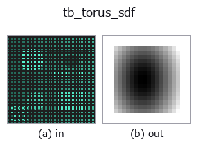
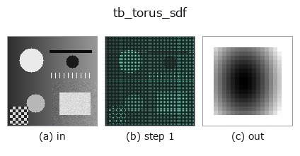
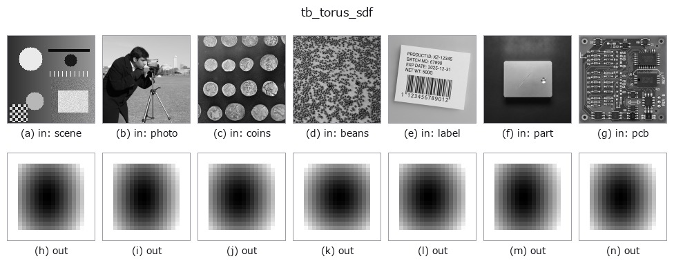

# tb_torus_sdf — 2D `typed` op

- **データ種**: `points` → `volume`
- **呼び出し**: `fullseye.apply(img, "tb_torus_sdf", a=0.5, b=0.5)` (2-D は 1 画像 + 2 スカラつまみ `a,b∈[0,1]` のモデル)



*図は合成の入力 128×128 で実際に走らせた出力。左が入力、右が出力。点群は上から見た散布(明るさ = z)、1-D 列は折れ線、体積は z 方向の最大値投影、動画は中央フレーム、複素画像は振幅、絵にならない返り値は値そのもの。*

*つまみ a は出力を変えない(実測: 0.1 / 0.5 / 0.9 で同一)。*

*つまみ b は出力を変えない(実測: 0.1 / 0.5 / 0.9 で同一)。*

**段階**(前置きの op → この op。左から順):



**別の画像でも**(合成シーン / 写真 / 硬貨。上段が入力、下段がその出力。つまみは既定):



**動き**(GIF: フレーム / 視点 / スライスを順に。静止の図が完成形で、GIF は補助):


## 使い方

トーラス(ドーナツ)の**厳密**な符号付き距離場(内側負・外側正)。

    ``sdf(p) = ‖(r - major_radius, t)‖ - minor_radius``(``r`` は軸からの半径、``t`` は
    軸方向の距離)。芯線が半径 ``major_radius`` の円で、その周りに半径 ``minor_radius``
    の管が付いた形なので、**フィレット(隅の丸み)の解析形**としてそのまま使える。

    引数と検証(``ValueError``):
    - ``grid`` / ``center`` / ``axis``: :func:`cylinder_sdf` と同じ(軸はドーナツの穴の向き)。
    - ``major_radius``: 芯線の半径(負は拒否)。
    - ``minor_radius``: 管の半径(負は拒否)。``minor_radius >= major_radius`` だと穴が
      潰れた形になるが、距離場としては正しいので**拒否しない**。

    返り値: ``grid.shape[:-1]`` の float64。

    使いどころ: ``sdf_subtract`` で内隅にフィレットを削り出す / ``sdf_union`` で O リング溝の
    形を作る。角を丸めるだけなら ``sdf_smooth_union`` のほうが手軽だが、あちらは丸みの
    半径が形状に依存する —— **半径を設計値として持ちたいときはこちら**。

2-D 進化レジストリへ橋渡しした 3d の op ``torus_sdf``。実装は同じで、呼び出し規約だけ ``op(v, a, b)`` に合わせてある。この op に調整点は無く、``a`` も ``b`` も使われない。

## 参考(サンプルデータ・文献)

- [サンプルデータ カタログ(DL URL / ライセンス)](../../SAMPLES.md) — 2-D は skimage.data(BSD/public)+ 合成、3-D は実データ源(Stanford/PDS 等)の DL URL。
- [演算子の来歴・参考文献](../../../REFERENCES.md) — この op 族の元になった研究/手法の出典。

## Studio で試す

下のプログラムは実際に走ることを確かめてある(図と同じ入力)。Studio のヘルプではこのブロックがボタンになり、その場で読み込んで実行できる。

```program
img_to_points 0.50 0.50
tb_torus_sdf 0.50 0.50
```

## 実行できる例(この op を実際に呼ぶ検証済みサンプル)

次の例は元の台帳 op `torus_sdf` を呼ぶもの。この橋渡し op は同じ実装を `fn(v, a, b)` 規約に合わせただけなので、挙動はそのまま当てはまる(呼び出し形だけ違う)。
- [sdf_csg](../../../../examples_3d/sdf_csg.py) — `py -3.11 examples_3d/sdf_csg.py`

## 型が繋がる次の op(`volume` を入力に取れる)

[identity](../misc/identity.md) · [vol_gaussian](../3d/vol_gaussian.md) · [vol_median](../3d/vol_median.md) · [vol_erode](../3d/vol_erode.md) · [vol_dilate](../3d/vol_dilate.md) · [vol_threshold](../3d/vol_threshold.md) · [vol_reg_dilate](../3d/vol_reg_dilate.md) · [vol_reg_erode](../3d/vol_reg_erode.md)

## 同カテゴリ(`typed`)

[tb_points_to_voxel](tb_points_to_voxel.md) · [tb_estimate_point_normals](tb_estimate_point_normals.md) · [tb_iss_keypoints](tb_iss_keypoints.md) · [tb_angle_3points](tb_angle_3points.md) · [tb_project_points](tb_project_points.md) · [tb_render_point_depth](tb_render_point_depth.md) · [tb_statistical_outlier_removal](tb_statistical_outlier_removal.md) · [tb_radius_outlier_removal](tb_radius_outlier_removal.md)

---
*Provenance: ops.py — 2D operator registry. この per-op ノートは `tools/opdocs.py md` が自動生成(手編集しない)。*

© 2026 Kazufumi Furuse — Fullseye operator documentation. Licensed under Apache-2.0.
