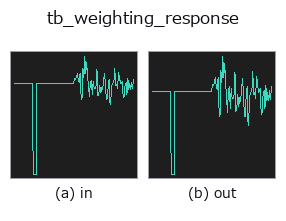
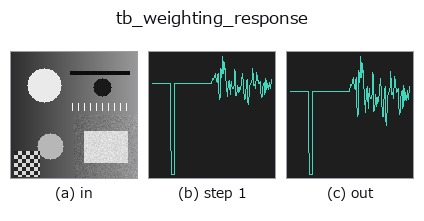
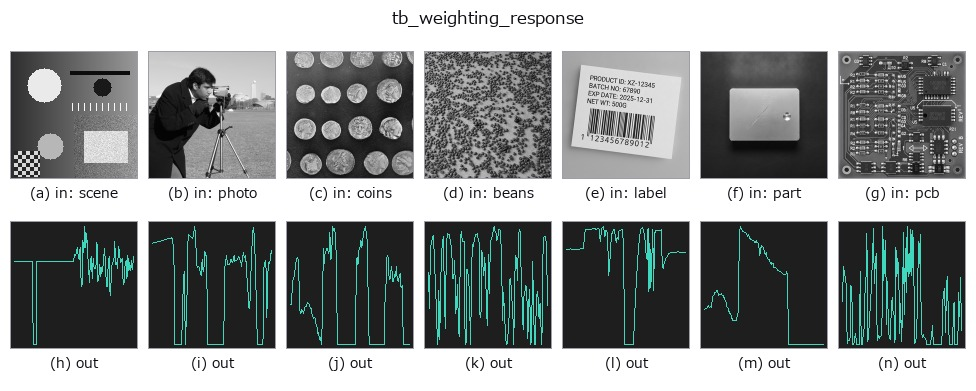

# tb_weighting_response — 2D `typed` op

- **データ種**: `signal` → `signal`
- **呼び出し**: `fullseye.apply(img, "tb_weighting_response", a=0.5, b=0.5)` (2-D は 1 画像 + 2 スカラつまみ `a,b∈[0,1]` のモデル)



*図は合成の入力 128×128 で実際に走らせた出力。左が入力、右が出力。点群は上から見た散布(明るさ = z)、1-D 列は折れ線、体積は z 方向の最大値投影、動画は中央フレーム、複素画像は振幅、絵にならない返り値は値そのもの。*

*つまみ a は出力を変えない(実測: 0.1 / 0.5 / 0.9 で同一)。*

*つまみ b は出力を変えない(実測: 0.1 / 0.5 / 0.9 で同一)。*

**段階**(前置きの op → この op。左から順):



**別の画像でも**(合成シーン / 写真 / 硬貨。上段が入力、下段がその出力。つまみは既定):



## 使い方

The A / C / Z frequency-weighting curve, in dB, at the given frequencies.

    Computed from the four pole frequencies that *define* the networks and
    normalised so that the response at 1 kHz is exactly 0 dB **by construction**
    — the curve is divided by its own value at 1 kHz rather than having a
    published offset constant added to it. That is why the tests can assert
    equality at 1 kHz to 0.0 rather than to a tolerance, and why no standard's
    table of attenuations appears anywhere in this repository.

    The response depends on ``f`` only through ``f**2``, so it is an even
    function and negative frequencies are evaluated at ``|f|`` — that is the
    definition, not a repair. ``f = 0`` has zero response (both curves have a
    zero at DC) and is reported as ``floor_db`` rather than ``-inf``.

    Measured (computed, then printed — these are outputs, not transcriptions):

    ========  =========  =========
    f (Hz)    A (dB)     C (dB)
    ========  =========  =========
    10        -70.4304   -14.3300
    31.5      -39.5250    -3.0305
    100       -19.1428    -0.2996
    1000        0.0000     0.0000
    4000        0.9633    -0.8260
    10000      -2.4918    -4.4055
    20000      -9.3469   -11.2786
    ========  =========  =========

    ``A(1000)`` and ``C(1000)`` are exactly ``0.0`` — the Python float, not a
    rounding — because of the construction. The low-frequency asymptote is a
    closed form and is asserted in the tests: ``A`` falls at exactly
    80 dB/decade as ``f -> 0`` (``f**4`` over three constants) and ``C`` at
    exactly 40 dB/decade (``f**2``). Measured between 0.001 and 0.01 Hz with the
    floor lowered out of the way: **79.999998** and **39.999998** dB/decade.

    That last caveat is real and is why the floor is an argument: with the
    default ``floor_db = -200`` the A curve reaches the floor below about
    0.35 Hz (unfloored, ``A(0.1) = -228.55`` dB), so the asymptote measured
    against the default floor comes out as 0.0 dB/decade between 0.01 and
    0.1 Hz — a clamp, correctly reported, that would look like a bug if the
    floor were not visible.

    Returns a float64 array the same shape as *freqs*.

    **Raises** ``ValueError``: a non-1-D / non-finite / complex / masked
    ``freqs``, an unknown ``kind``.

Typed bridge of the acoustics op ``weighting_response`` into the 2-D evolution registry: the same implementation, called under the ``op(v, a, b)`` convention. This op has no tunable parameter; ``a`` and ``b`` are unused.

## 参考(サンプルデータ・文献)

- [サンプルデータ カタログ(DL URL / ライセンス)](../../SAMPLES.md) — 2-D は skimage.data(BSD/public)+ 合成、3-D は実データ源(Stanford/PDS 等)の DL URL。
- [演算子の来歴・参考文献](../../../REFERENCES.md) — この op 族の元になった研究/手法の出典。

## Studio で試す

下のプログラムは実際に走ることを確かめてある(図と同じ入力)。Studio のヘルプではこのブロックがボタンになり、その場で読み込んで実行できる。

```program
img_to_signal 0.50 0.50
tb_weighting_response 0.50 0.50
```

## 実行できる例(この op を実際に呼ぶ検証済みサンプル)

次の例は元の台帳 op `weighting_response` を呼ぶもの。この橋渡し op は同じ実装を `fn(v, a, b)` 規約に合わせただけなので、挙動はそのまま当てはまる(呼び出し形だけ違う)。
- [acoustic_condition_monitoring](../../../../examples/acoustic_condition_monitoring.py) — `py -3.11 examples/acoustic_condition_monitoring.py`

## 型が繋がる次の op(`signal` を入力に取れる)

[identity](../misc/identity.md) · [tb_create_funct_1d_array](tb_create_funct_1d_array.md) · [tb_smooth_funct_1d_gauss](tb_smooth_funct_1d_gauss.md) · [tb_smooth_funct_1d_mean](tb_smooth_funct_1d_mean.md) · [tb_derivate_funct_1d](tb_derivate_funct_1d.md) · [tb_integrate_funct_1d](tb_integrate_funct_1d.md) · [tb_zero_crossings_funct_1d](tb_zero_crossings_funct_1d.md) · [tb_abs_funct_1d](tb_abs_funct_1d.md)

## 同カテゴリ(`typed`)

[tb_points_to_voxel](tb_points_to_voxel.md) · [tb_estimate_point_normals](tb_estimate_point_normals.md) · [tb_iss_keypoints](tb_iss_keypoints.md) · [tb_project_points](tb_project_points.md) · [tb_render_point_depth](tb_render_point_depth.md) · [tb_statistical_outlier_removal](tb_statistical_outlier_removal.md) · [tb_radius_outlier_removal](tb_radius_outlier_removal.md) · [tb_voxel_grid_downsample](tb_voxel_grid_downsample.md)

---
*Provenance: ops.py — 2D operator registry. この per-op ノートは `tools/opdocs.py md` が自動生成(手編集しない)。*

© 2026 Kazufumi Furuse — Fullseye operator documentation. Licensed under Apache-2.0.
