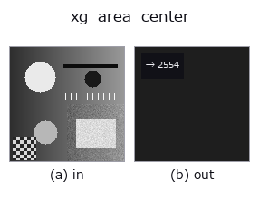
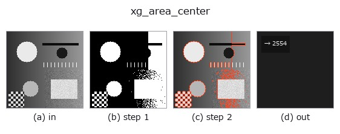

# xg_area_center — 2D `xldgeom` op

- **データ種**: `contour` → `feature`
- **呼び出し**: `fullseye.apply(img, "xg_area_center", a=0.5, b=0.5)` (2-D は 1 画像 + 2 スカラつまみ `a,b∈[0,1]` のモデル)
- **HALCON 相当**: `area_center_points_xld`(意味・パラメータは HALCON リファレンスが参考になる)



*図は合成の入力 128×128 で実際に走らせた出力。左が入力、右が出力。点群は上から見た散布(明るさ = z)、1-D 列は折れ線、体積は z 方向の最大値投影、動画は中央フレーム、複素画像は振幅、絵にならない返り値は値そのもの。*

*つまみ a は出力を変えない(実測: 0.1 / 0.5 / 0.9 で同一)。*

*つまみ b は出力を変えない(実測: 0.1 / 0.5 / 0.9 で同一)。*

**段階**(前置きの op → この op。左から順):



## 使い方

Polygon area of the contour(s) via the shoelace formula (summed abs).

輪郭辞書 ``{"shape": (H, W), "cs": [Nx2 の (row, col) 点列, ...]}`` の各輪郭を
多角形とみなし、靴ひも公式 ``0.5*|Σ(x_i*y_{i+1} - x_{i+1}*y_i)|`` で面積を
求めて全輪郭の合計を返す。点が 3 個未満の輪郭は 0 として無視。``a``, ``b`` は
未使用。

返り値は ``numpy.float64``(単位は画素²、正規化なし)。輪郭が無い・辞書で
ない・非有限値を含む輪郭は読み飛ばされ、合計に寄与しない(空なら 0.0)。
開いた輪郭でも「最後の点と最初の点を結んで閉じた多角形」の面積になる点に
注意(直線状の開輪郭では 0、折れ線の開輪郭でも非零になる)。絶対値を取る
ので点列の向き(時計回り/反時計回り)は結果に影響しない。自己交差する輪郭では
交差で符号が打ち消しあい、真の面積より小さく出る。名前に反して重心は
返さない(面積のみ)。同じ点集合の 2 次モーメントは ``xg_moments``、bbox の
縦横比は ``xg_height_width_ratio``。

## 詳しい使い方ガイド

- [gallery2d_geometry ファミリ ガイド](../guides/gallery2d_geometry.md)

## 参考(サンプルデータ・文献)

- [サンプルデータ カタログ(DL URL / ライセンス)](../../SAMPLES.md) — 2-D は skimage.data(BSD/public)+ 合成、3-D は実データ源(Stanford/PDS 等)の DL URL。
- [演算子の来歴・参考文献](../../../REFERENCES.md) — この op 族の元になった研究/手法の出典。
- アルゴリズムの正典(著者・年)と用途は上記**ファミリ使い方ガイド**に記載。

## Studio で試す

下のプログラムは実際に走ることを確かめてある(図と同じ入力)。Studio のヘルプではこのブロックがボタンになり、その場で読み込んで実行できる。

```program
threshold 0.50 0.50
sk_find_contours 0.50 0.50
xg_area_center 0.50 0.50
```

## 実行できる例(この op を実際に呼ぶ検証済みサンプル)

- [gallery2d_geometry](../../../../examples/gallery2d_geometry.py) — `py -3.11 examples/gallery2d_geometry.py`

## 型が繋がる次の op(`feature` を入力に取れる)

[identity](../misc/identity.md)

## 同カテゴリ(`xldgeom`)

[xg_moments](xg_moments.md) · [xg_eccentricity](xg_eccentricity.md) · [xg_orientation](xg_orientation.md) · [xg_elliptic_axis](xg_elliptic_axis.md) · [xg_height_width_ratio](xg_height_width_ratio.md) · [xg_regress_contours](xg_regress_contours.md) · [xg_clip_contours](xg_clip_contours.md) · [xg_gen_polygons](xg_gen_polygons.md)

---
*Provenance: ops.py — 2D operator registry. この per-op ノートは `tools/opdocs.py md` が自動生成(手編集しない)。*

© 2026 Kazufumi Furuse — Fullseye operator documentation. Licensed under Apache-2.0.
