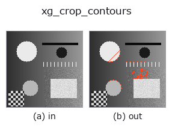
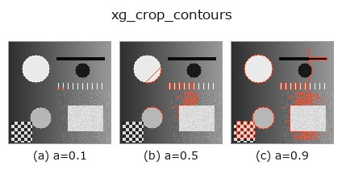
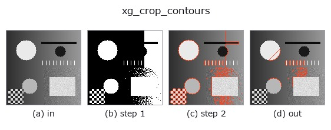
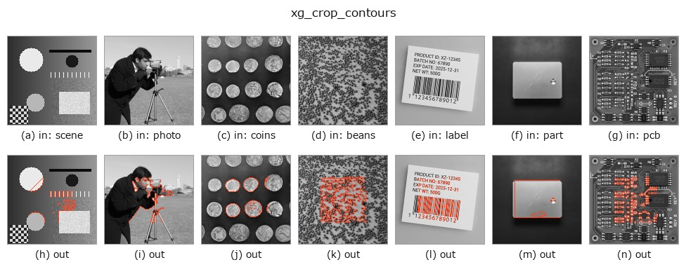

# xg_crop_contours — 2D `xldgeom` op

- **データ種**: `contour` → `contour`
- **呼び出し**: `fullseye.apply(img, "xg_crop_contours", a=0.5, b=0.5)` (2-D は 1 画像 + 2 スカラつまみ `a,b∈[0,1]` のモデル)



*図は合成の入力 128×128 で実際に走らせた出力。左が入力、右が出力。点群は上から見た散布(明るさ = z)、1-D 列は折れ線、体積は z 方向の最大値投影、動画は中央フレーム、複素画像は振幅、絵にならない返り値は値そのもの。*

**つまみ a を振る**(0.1 / 0.5 / 0.9、もう一方は既定):



*つまみ b は出力を変えない(実測: 0.1 / 0.5 / 0.9 で同一)。*

**段階**(前置きの op → この op。左から順):



**別の画像でも**(合成シーン / 写真 / 硬貨。上段が入力、下段がその出力。つまみは既定):



## 使い方

Keep only contour points inside the central a-fraction window of the shape.

画像中心に置いた、高さ ``a*H``、幅 ``a*W`` の矩形窓の内側にある輪郭点だけを
残す(``a`` は [0,1] に clip、``b`` は未使用)。窓は行 ``[(0.5-a/2)H, (0.5+a/2)H]``、
列 ``[(0.5-a/2)W, (0.5+a/2)W]`` の閉区間。``H, W`` は辞書の ``shape`` から取り、
無ければ全点の最大座標+1 で代用する。

返り値は ``{"shape": (H, W), "cs": [...]}``。窓内に 1 点も残らない輪郭は捨て、
``a=0`` では中心線上に正確に乗る点しか残らないためほぼ空、``a=1`` で全点が
残る。

注意: 窓に切られた輪郭は分割されない。残った点をそのまま 1 本の折れ線として
繋ぐので、輪郭が窓を出入りするたびに「窓の縁を飛び越える辺」が生まれ、
``xg_area_center`` の面積や折れ線長が実際より大きく出る。切り口を正しく
扱いたいなら、領域の段階で ``r3_clip_region`` を掛けてから輪郭を取り直す。
座標は (row, col)。長さで輪郭ごと選別するのは ``xg_clip_contours``。

## 詳しい使い方ガイド

- [gallery2d_geometry ファミリ ガイド](../guides/gallery2d_geometry.md)

## 参考(サンプルデータ・文献)

- [サンプルデータ カタログ(DL URL / ライセンス)](../../SAMPLES.md) — 2-D は skimage.data(BSD/public)+ 合成、3-D は実データ源(Stanford/PDS 等)の DL URL。
- [演算子の来歴・参考文献](../../../REFERENCES.md) — この op 族の元になった研究/手法の出典。
- アルゴリズムの正典(著者・年)と用途は上記**ファミリ使い方ガイド**に記載。

## Studio で試す

下のプログラムは実際に走ることを確かめてある(図と同じ入力)。Studio のヘルプではこのブロックがボタンになり、その場で読み込んで実行できる。

```program
threshold 0.50 0.50
sk_find_contours 0.50 0.50
xg_crop_contours 0.50 0.50
```

## 実行できる例(この op を実際に呼ぶ検証済みサンプル)

- [gallery2d_geometry](../../../../examples/gallery2d_geometry.py) — `py -3.11 examples/gallery2d_geometry.py`

## 型が繋がる次の op(`contour` を入力に取れる)

[identity](../misc/identity.md) · [select_contours](../contour/select_contours.md) · [smooth_contours](../contour/smooth_contours.md) · [fit_line_contours](../contour/fit_line_contours.md) · [contours_to_region](../contour/contours_to_region.md) · [count_contours](../features/count_contours.md) · [total_length](../features/total_length.md) · [select_contours_xld](../contour/select_contours_xld.md)

## 同カテゴリ(`xldgeom`)

[xg_moments](xg_moments.md) · [xg_area_center](xg_area_center.md) · [xg_eccentricity](xg_eccentricity.md) · [xg_orientation](xg_orientation.md) · [xg_elliptic_axis](xg_elliptic_axis.md) · [xg_height_width_ratio](xg_height_width_ratio.md) · [xg_regress_contours](xg_regress_contours.md) · [xg_clip_contours](xg_clip_contours.md)

---
*Provenance: ops.py — 2D operator registry. この per-op ノートは `tools/opdocs.py md` が自動生成(手編集しない)。*

© 2026 Kazufumi Furuse — Fullseye operator documentation. Licensed under Apache-2.0.
