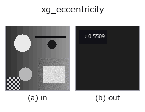
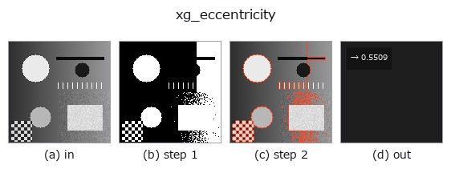

# xg_eccentricity — 2D `xldgeom` op

- **データ種**: `contour` → `feature`
- **呼び出し**: `fullseye.apply(img, "xg_eccentricity", a=0.5, b=0.5)` (2-D は 1 画像 + 2 スカラつまみ `a,b∈[0,1]` のモデル)
- **HALCON 相当**: `eccentricity_points_xld`(意味・パラメータは HALCON リファレンスが参考になる)



*図は合成の入力 128×128 で実際に走らせた出力。左が入力、右が出力。点群は上から見た散布(明るさ = z)、1-D 列は折れ線、体積は z 方向の最大値投影、動画は中央フレーム、複素画像は振幅、絵にならない返り値は値そのもの。*

*つまみ a は出力を変えない(実測: 0.1 / 0.5 / 0.9 で同一)。*

*つまみ b は出力を変えない(実測: 0.1 / 0.5 / 0.9 で同一)。*

**段階**(前置きの op → この op。左から順):



## 使い方

Eccentricity sqrt(1 - lambda_min/lambda_max) from the point covariance.

輪郭辞書 ``{"shape", "cs"}`` の全輪郭の点を 1 つの点集合にまとめ、その
(row, col) 座標の母共分散行列の固有値 ``λ_min <= λ_max`` から離心率
``e = sqrt(1 - λ_min/λ_max)`` を返す。閉輪郭の重複した終点(先頭と同じ点)は
数えない。``a``, ``b`` は未使用。

返り値は ``numpy.float64`` で [0, 1]。真円・正方形など等方な点配置で 0、
一直線上の点(``λ_min = 0``)で 1。点が 2 個未満、または ``λ_max <= 1e-12``
(全点同一)なら 0.0。輪郭が複数あればそれらをまとめた分布の離心率になり、
個々の輪郭の形ではなく配置の広がりも混ざる(輪郭ごとに評価したいなら先に
``select_contours_xld`` などで 1 本に絞る)。輪郭点の密度に依存する(点が
密な部分が重く効く)点は面積ベースの指標と異なる。軸比そのものは
``xg_elliptic_axis``、主軸の向きは ``xg_orientation``。

## 詳しい使い方ガイド

- [gallery2d_geometry ファミリ ガイド](../guides/gallery2d_geometry.md)

## 参考(サンプルデータ・文献)

- [サンプルデータ カタログ(DL URL / ライセンス)](../../SAMPLES.md) — 2-D は skimage.data(BSD/public)+ 合成、3-D は実データ源(Stanford/PDS 等)の DL URL。
- [演算子の来歴・参考文献](../../../REFERENCES.md) — この op 族の元になった研究/手法の出典。
- アルゴリズムの正典(著者・年)と用途は上記**ファミリ使い方ガイド**に記載。

## Studio で試す

下のプログラムは実際に走ることを確かめてある(図と同じ入力)。Studio のヘルプではこのブロックがボタンになり、その場で読み込んで実行できる。

```program
threshold 0.50 0.50
sk_find_contours 0.50 0.50
xg_eccentricity 0.50 0.50
```

## 実行できる例(この op を実際に呼ぶ検証済みサンプル)

- [gallery2d_geometry](../../../../examples/gallery2d_geometry.py) — `py -3.11 examples/gallery2d_geometry.py`

## 型が繋がる次の op(`feature` を入力に取れる)

[identity](../misc/identity.md)

## 同カテゴリ(`xldgeom`)

[xg_moments](xg_moments.md) · [xg_area_center](xg_area_center.md) · [xg_orientation](xg_orientation.md) · [xg_elliptic_axis](xg_elliptic_axis.md) · [xg_height_width_ratio](xg_height_width_ratio.md) · [xg_regress_contours](xg_regress_contours.md) · [xg_clip_contours](xg_clip_contours.md) · [xg_gen_polygons](xg_gen_polygons.md)

---
*Provenance: ops.py — 2D operator registry. この per-op ノートは `tools/opdocs.py md` が自動生成(手編集しない)。*

© 2026 Kazufumi Furuse — Fullseye operator documentation. Licensed under Apache-2.0.
