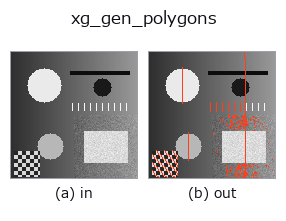
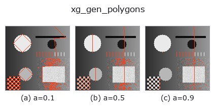
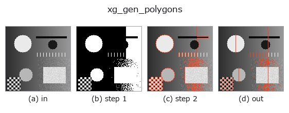
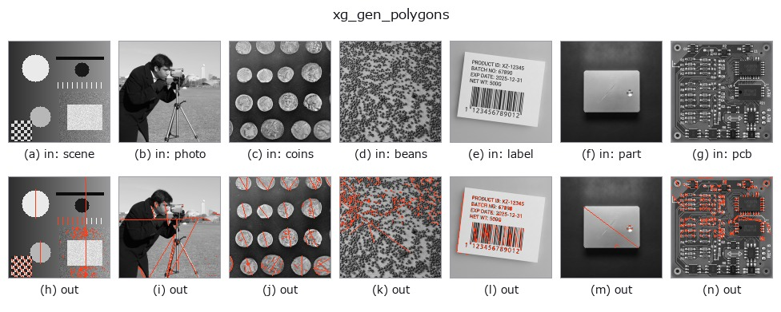

# xg_gen_polygons — 2D `xldgeom` op

- **データ種**: `contour` → `contour`
- **呼び出し**: `fullseye.apply(img, "xg_gen_polygons", a=0.5, b=0.5)` (2-D は 1 画像 + 2 スカラつまみ `a,b∈[0,1]` のモデル)
- **HALCON 相当**: `gen_polygons_xld`(意味・パラメータは HALCON リファレンスが参考になる)



*図は合成の入力 128×128 で実際に走らせた出力。左が入力、右が出力。点群は上から見た散布(明るさ = z)、1-D 列は折れ線、体積は z 方向の最大値投影、動画は中央フレーム、複素画像は振幅、絵にならない返り値は値そのもの。*

**つまみ a を振る**(0.1 / 0.5 / 0.9、もう一方は既定):



*つまみ b は出力を変えない(実測: 0.1 / 0.5 / 0.9 で同一)。*

**段階**(前置きの op → この op。左から順):



**別の画像でも**(合成シーン / 写真 / 硬貨。上段が入力、下段がその出力。つまみは既定):



## 使い方

Douglas-Peucker polyline simplification; eps = a * contour bbox diagonal.

各輪郭を Ramer-Douglas-Peucker 法で間引いて頂点数の少ない折れ線(多角形)に
する。始点と終点は必ず残し、区間の弦から最も離れた点の距離が ``eps`` を
超えればその点を採用して再帰的に分割する。``eps`` は輪郭ごとに、その輪郭の
bbox の対角長 ``hypot(Δrow, Δcol)`` に ``a``([0,1] に clip)を掛けた値。
``a=0`` で ``eps=0``(弦上に完全に乗る点だけ落ちる)、``a`` を上げるほど粗く
なり、``a=1`` では両端の 2 点だけになる。``b`` は未使用。

返り値は ``{"shape", "cs"}`` の輪郭辞書。点が 3 個未満の輪郭はコピーのまま。
閉輪郭(先頭=末尾)は始点と終点が同じ点なので、``a`` が大きいと 2 点(同一点)に
退化し、面積や向きの特徴量が 0 になる。閉輪郭の形を保ちたい場合は ``a`` を
小さめにする(実測では半径 5〜8 の楕円 101 点が ``a=0.05`` で 9 点)。
間引きは元の点の部分集合を返し、新しい点は作らない。後段の ``xg_area_center``
や ``xg_regress_contours`` の計算量を減らす前処理、折れ線の角(頂点)検出に。

## 詳しい使い方ガイド

- [gallery2d_geometry ファミリ ガイド](../guides/gallery2d_geometry.md)

## 参考(サンプルデータ・文献)

- [サンプルデータ カタログ(DL URL / ライセンス)](../../SAMPLES.md) — 2-D は skimage.data(BSD/public)+ 合成、3-D は実データ源(Stanford/PDS 等)の DL URL。
- [演算子の来歴・参考文献](../../../REFERENCES.md) — この op 族の元になった研究/手法の出典。
- アルゴリズムの正典(著者・年)と用途は上記**ファミリ使い方ガイド**に記載。

## Studio で試す

下のプログラムは実際に走ることを確かめてある(図と同じ入力)。Studio のヘルプではこのブロックがボタンになり、その場で読み込んで実行できる。

```program
threshold 0.50 0.50
sk_find_contours 0.50 0.50
xg_gen_polygons 0.50 0.50
```

## 実行できる例(この op を実際に呼ぶ検証済みサンプル)

- [gallery2d_geometry](../../../../examples/gallery2d_geometry.py) — `py -3.11 examples/gallery2d_geometry.py`

## 型が繋がる次の op(`contour` を入力に取れる)

[identity](../misc/identity.md) · [select_contours](../contour/select_contours.md) · [smooth_contours](../contour/smooth_contours.md) · [fit_line_contours](../contour/fit_line_contours.md) · [contours_to_region](../contour/contours_to_region.md) · [count_contours](../features/count_contours.md) · [total_length](../features/total_length.md) · [select_contours_xld](../contour/select_contours_xld.md)

## 同カテゴリ(`xldgeom`)

[xg_moments](xg_moments.md) · [xg_area_center](xg_area_center.md) · [xg_eccentricity](xg_eccentricity.md) · [xg_orientation](xg_orientation.md) · [xg_elliptic_axis](xg_elliptic_axis.md) · [xg_height_width_ratio](xg_height_width_ratio.md) · [xg_regress_contours](xg_regress_contours.md) · [xg_clip_contours](xg_clip_contours.md)

---
*Provenance: ops.py — 2D operator registry. この per-op ノートは `tools/opdocs.py md` が自動生成(手編集しない)。*

© 2026 Kazufumi Furuse — Fullseye operator documentation. Licensed under Apache-2.0.
