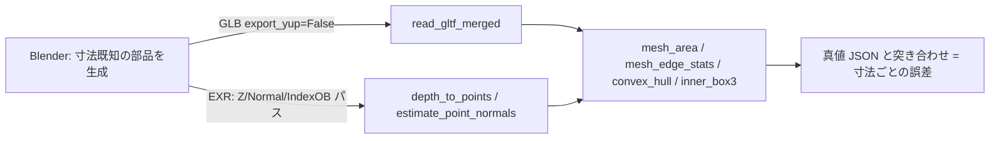

# Blender との併用 — 形を作って fullseye で測る(軸・単位・正解データの罠)

fullseye は Blender を**取り込まない**(`import bpy` しない・同梱しない・依存にも入れない)。
この文書は、**手元に Blender があるなら**どう組み合わせると寸法の真値つきの 3-D データが
作れるか、そのとき**例外が出ずにもっともらしく間違う**箇所はどこか、を書いた教材である。
併用するかどうかは利用者の自由で、Blender が無くても fullseye は完全に動く。

書いてあることは全部、Blender 4.5.10 LTS(Windows 11)で**実際に走らせて数字を突き合わせた**
結果である(2026-09-05)。版が変われば数字も変わりうる。

---

## 0. 分担 —— Blender は「作る」、物理は fullseye

| Blender が向く | Blender に**やらせない** |
|---|---|
| ジオメトリの作成・シーン配置・カメラ姿勢・被写界深度・配光 | 分光光学(Cycles は RGB 三刺激値。波長ごとの屈折率は扱えない) |
| 正解パス(深度・法線・オブジェクト ID) | センサ物理(QE・フルウェル・読出雑音・ダーク電流) |
| 形式変換(STL/OBJ/PLY/FBX/USD → GLB) | **ビット一致の基準**(レンダは版・GPU・サンプル数で変わる) |

**ジオメトリの書き出しは決定的、レンダは非決定的。** 真値はジオメトリから取り、
レンダ画像は一度作ったものを固定資産として配る側に置く。



---

## 1. 罠 1 — 既定で書き出すと Y と Z が入れ替わり、符号が反転する

軸ごとに**寸法も位置も違う**箱で測った(立方体を原点に置くと軸の入れ替わりに気づけない):

```python
bpy.ops.mesh.primitive_cube_add(size=2.0, location=(10.0, 20.0, 30.0))
ob.scale = (1.0, 0.5, 0.25)      # 真値: X=2.0  Y=1.0  Z=0.5 [m]、中心 (10, 20, 30)
```

| 書き出し | `read_gltf_merged` が読む寸法 | 中心 |
|---|---|---|
| `export_scene.gltf(...)` **既定** | `(2.0, 0.5, 1.0)` | `(10, 30, −20)` |
| `export_scene.gltf(..., export_yup=False)` | `(2.0, 1.0, 0.5)` | `(10, 20, 30)` |

Blender は Z-up、glTF の規格は Y-up。エクスポータの `export_yup` は既定 `True` なので
**何も指定しないと X 軸まわりに −90° 回る**:

```
(x, y, z)_glTF = ( x,  z, −y )_Blender        逆: (x, −z, y)
```

これは**例外にならない**。寸法 `2.0 / 1.0 / 0.5` が `2.0 / 0.5 / 1.0` として返るだけで、
型も形も正しい。計測値を読んだ人は気づけない。

**判断**: 自分で作って自分で読むなら **`export_yup=False` を必ず付ける**。
外部に配る GLB は規格どおり Y-up にし、どちらなのかをファイル名か側の JSON に書く。

## 2. 罠 2 — 単位はメートルだが、`scale_length` は形状に何もしない

`unit_settings.system='METRIC'`、`scale_length=1.0`(既定)で、glTF もメートル。
既定同士なら **1.0 = 1 m で素通し**する。

`scale_length` を 1.0 → 0.001 に変えても、**頂点座標・`obj.dimensions`・glTF/OBJ の
出力座標は 1 つも変わらなかった**。これは UI の数値表示にしか効かない**表示専用**の設定で、
「mm で作業するつもりで scale_length を 0.001 にした」人の期待どおりには動かない。
mm の部品が欲しければ、座標を mm の数値で作る(そして GLB は "mm を m と読む" と側に書く)。

## 3. 罠 3 — 立方体の頂点は 8 でなく 24 になる

glTF は頂点あたり 1 組の法線/UV しか持てないので、面ごとに法線が違う角では頂点が複製される。
立方体は 6 面 × 4 = 24。UV 球(segments=8, ring_count=6)は 42 → 176。
**頂点数が変わった = 形が変わった、ではない。**

## 4. 罠 4 — モディファイアは既定で適用されず、適用すると寸法が変わる

`export_apply` の宣言された既定は **`False`**。半径 0.5 の UV 球に Subdivision(1 段)を付けて:

| | 頂点 | 読み出した寸法 |
|---|---:|---|
| `export_apply=False`(既定) | 176 | `(1.000, 1.000, 1.000)` |
| `export_apply=True` | 704 | **`(0.862, 0.952, 0.862)`** |

Catmull-Clark の極限曲面は制御点を**内挿しない**ので、細分化を適用すると **14% 縮む**。
しかも**方向で縮み方が違う**(極の軸だけ 0.952)ので、係数を掛けて戻すこともできない。

**判断**: 計測の真値に使う部品に Subdivision を掛けない。滑らかさが要るなら分割数を上げた
プリミティブ(頂点が理論面の上に乗る)。掛けたなら、真値は**書き出したメッシュから測り直す**。

## 5. 罠 5 — 分割数が真値の誤差の下限を決める

プリミティブの `size` / `radius` / `depth` は**外接**基準で頂点座標に正確に一致する。
誤差源は多角形近似だけで、円柱・球で実測:

| 分割数 | 外接と内接の差 |
|---:|---:|
| 8 | 7.61 % |
| 32 | 0.48 % |
| 128 | 0.03 % |

「半径 5.000 の円柱」を 8 分割で作って `fit_cylinder_ransac` に掛けると、**アルゴリズムが
完璧でも 7.6 % ずれる**。真値の側の誤差を先に決めてから、計測の誤差を語ること。

## 6. 罠 6 — スクリプトが例外で落ちても Blender の exit code は 0

```
blender --background --factory-startup --python-exit-code 1 --python gen.py -- out.glb
```

* **`--python-exit-code 1` を付けないと、未処理の例外もファイル未存在も exit 0 で終わる**。
  無人運用の門番にならない
* `sys.argv` には **Blender 自身のコマンドライン全部**が入る。`sys.argv[sys.argv.index("--")+1:]` で切る
* `--factory-startup` は利用者の設定ファイル(startup.blend)を読まない。アドオンの有効化までは止めない
* `bpy.ops.*` はウィンドウ・選択状態という暗黙のコンテキストに依存し、無人だと壊れる。
  `bpy.data` と `obj.evaluated_get(depsgraph)` を主経路にする。`matrix_world` は
  `view_layer.update()` を呼ぶまで**古い値**を返す

## 7. 正解データ(レンダパス)—— 何が真値で、何が真値でないか

| パス | 実測で分かったこと |
|---|---|
| Z(深度) | **視線軸方向の距離**。カメラから 10 m の平面は中央も隅も `10.000000`(放射距離なら隅が大きい) |
| Z / IndexOB の縁 | **中間値は出ない**(サンプル数 1/64、フィルタ幅 1.5/0.01 のどれでも硬い縁)。ただし部分被覆の情報は丸ごと失う。Combined(見た目)は滑らかに混ざる |
| Normal | **ワールド空間**(カメラの向きを変えても同じベクトル) |
| PNG 書き出し | 0..1 に**潰れる**(16 bit でも)。メートルの深度は往復しない → **OpenEXR** |
| 色管理 | 既定 AgX のままだと線形 0.18 が 117/255 に写る。**測光には View Transform = Raw/Standard + EXR** |
| `Image.pixels`(Python) | colorspace 設定を**無視**して生の格納値を返す |

深度パスから点群を作って fullseye の `(depth, row, col)` 規約へ写す**半画素の原点**は、
まだ実測していない(§10)。

## 8. カメラと照明 —— 実機の諸元を写すときの罠

* **mm/px** = `(作動距離[mm] × センサ幅[mm] / 焦点距離[mm]) / 横画素数` は検算と 0.25 % で一致
* **`sensor_fit='AUTO'` は解像度の縦横比で基準軸を勝手に変える**。同じ 36×24 mm / 50 mm を
  横長 128×64 と縦長 64×128 で描くと、視野が変わって 7 個中 6 個のマーカーが画面外に出た。
  固定実機の模倣では **HORIZONTAL / VERTICAL を明示**する
* 被写界深度は方向は合うが**絶対量は薄肉レンズの錯乱円の式と合わない**(f/1.4 vs f/22 の
  ぼけ幅比: 式 15.7 倍、実測 1.69 倍)。使うなら実測で較正する
* 標準カメラに**歪曲パラメータは無い**。入れるなら fullseye の側で
* **既定の GI(`diffuse_bounces=4`)が影のコントラストを潰す**(白い床で影の底が 0.31)。
  暗視野・リング照明の再現では `diffuse_bounces=0` か床を暗く
* POINT の逆二乗、SUN の距離非依存は正確。同軸落射で正反射 vs 斜め照明のコントラスト比は 10⁸ 倍

## 9. fullseye が読めない形式は Blender に変換させる

```python
>>> fullseye.formats_available()
{'gltf': True, 'las': True, 'laz': True, 'pcd': True}
```

メッシュは **glTF/GLB のみ**。STL / OBJ / PLY を Blender で読み直して GLB にすると、
寸法は 3 経路とも完全に保たれた(`export_yup=False` の場合)。**逆向き(fullseye → Blender)は
書き出し口が無い** —— 座標を `.npy`/JSON で渡して Blender 側で `bmesh` で組む。

`read_gltf` が読むのはジオメトリだけ(材質・テクスチャ・法線・カメラ・アニメーションは読まない)。
法線が要るなら `estimate_point_normals` で作る。

## 10. 現状の穴(正直に)

* Blender → 深度 EXR → `depth_to_points` → `measure3d` の**閉ループ**は未実証。
  ここが通って初めて「寸法ごとの誤差」を数字で言える
* 深度パスの画素中心が `(0,0)` か `(0.5,0.5)` か —— fullseye 側の半画素規約と合わせて要実測
* Cryptomatte の復号、EEVEE の縁の挙動、DOF の較正は未
* Blender 5.x での差分は未測(この文書は 4.5 LTS)

## 11. 診断表 —— 症状から原因へ

| 症状 | まず疑う原因 | 確かめ方 |
|---|---|---|
| 寸法の Y と Z が入れ替わり、片方の符号が負 | glTF 既定の Y-up 変換(§1) | `export_yup=False` で書き直して比べる |
| 頂点数が Blender の 3 倍 | 角での頂点複製(§3) | 面数は変わっていないはず |
| 球が 14 % 小さい、しかも軸で違う | Subdivision を `export_apply=True` で焼き込んだ(§4) | モディファイア無しで書き出す |
| 円柱の半径が数 % 小さい | 分割数の多角形近似(§5) | 分割数を上げて差が縮むか |
| 無人ジョブが「成功」なのに出力が無い | exit code 0 で例外が隠れた(§6) | `--python-exit-code 1` |
| 深度が 0..1 に潰れている | PNG で書き出した(§7) | EXR に |
| 深度が隅で大きく見えない | 正常。Z は視線軸方向(§7) | 放射距離が要るなら自分で換算 |
| レンダの絵が測光と合わない | AgX の見た目変換(§7) | Raw/Standard + EXR |
| 視野が縦横で変わる | `sensor_fit=AUTO`(§8) | HORIZONTAL/VERTICAL を明示 |
| 影が薄く、暗視野で背景が浮く | 既定 GI の bounce(§8) | `diffuse_bounces=0` |
| STL/OBJ を fullseye が読めない | 読み手は glTF のみ(§9) | Blender で GLB に変換 |

## 12. ライセンスの境界

Blender は GPL、生成物(GLB / EXR / JSON)は縛られない。fullseye(Apache-2.0)は
`import bpy` を**しない**。Blender は `--background` で別プロセスとして呼び、
`bpy` を使うスクリプトを配るなら GPL のヘッダを付けて fullseye パッケージの**外**に置く。

## 13. 最小手順(コピーして使える)

```python
# gen_gauge.py  —— Blender 側(GPL-2.0-or-later。bpy を import するため)
# blender --background --factory-startup --python-exit-code 1 --python gen_gauge.py -- out.glb
import json, sys, bpy
out = sys.argv[sys.argv.index("--") + 1]
bpy.ops.wm.read_factory_settings(use_empty=True)
bpy.ops.mesh.primitive_cube_add(size=2.0, location=(10.0, 20.0, 30.0))
ob = bpy.context.active_object; ob.scale = (1.0, 0.5, 0.25)
bpy.ops.object.transform_apply(scale=True)
bpy.ops.export_scene.gltf(filepath=out, export_format="GLB", export_yup=False)
json.dump({"extent": [2.0, 1.0, 0.5], "center": [10, 20, 30], "unit": "m",
           "axes": "blender-zup (export_yup=False)"}, open(out + ".truth.json", "w"))
```

```python
# fullseye 側(Apache-2.0)
import json, numpy as np, fullseye as F
V, Fc = F.read_gltf_merged("out.glb")
truth = json.load(open("out.glb.truth.json"))
lo, hi = V.min(0), V.max(0)
print("extent", np.round(hi - lo, 4), "truth", truth["extent"])     # → [2. 1. 0.5]
print("center", np.round((hi + lo) / 2, 4), "truth", truth["center"])  # → [10. 20. 30.]
```

真値を GLB の**隣に JSON で置く**。後から検算できないデータは、真値つきとは言えない。

---

## 出典

* 実測: Blender 4.5.10 LTS(<https://download.blender.org/release/Blender4.5/> の
  `blender-4.5.10-windows-x64.msi`、winget 経由で導入)/ Windows 11 / fullseye 0.1.9(2026-09-05)。
  同梱の `license/license.md` と `copyright.txt` を実読
* glTF 2.0 仕様(Khronos Group)<https://registry.khronos.org/glTF/specs/2.0/glTF-2.0.html>:
  座標系は Y-up・右手系・メートル
* Collins らの三フレーム差分、Zhang(2000)のカメラ校正 —— 本文で引いた式の出どころ
* blender.org の License / FAQ ページは自動取得できなかったため(403)、本文の引用は
  検索結果の要約経由。**一次確認は未**
