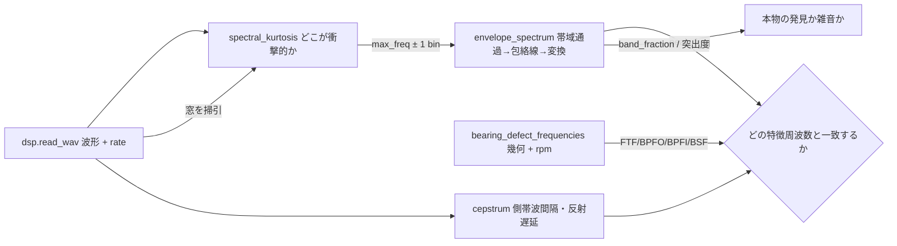
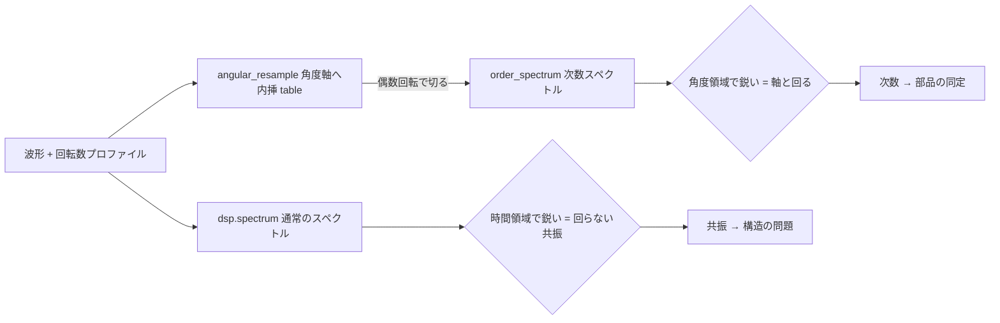
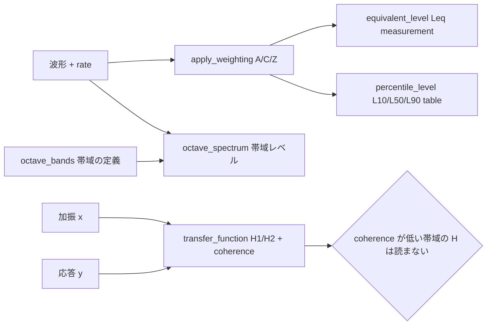

# 音響状態監視・音響指標(機械の音から欠陥と騒音を出す) — 使い方ガイド

## この族が答えている問い

きっかけはユーザーの一言でした ――「**1D が扱えるなら音響データも扱えるよね**」。

答えは「扱えるが、道具になっていなかった」です。素材は前からありました。`dsp` が音声 I/O(`read_wav` / `read_audio` / `write_wav`)と基本 DSP(`spectrum` / `spectrogram` / `lowpass` / `highpass` / `bandpass` / `envelope` / `rms` / `find_peaks` / `signal_features` / `resample` / `zero_crossing_rate`)を持っていて、440 Hz の正弦を入れればスペクトルにピークが立ちます。ですが登録名 1661 個に対して `stft` / `mel` / `mfcc` / `octave` / `acoust` / `beamform` は**どの表面にも 1 件もヒットしませんでした**。つまり「波形を読んで周波数を見る」まではできて、**現場が音に対して実際に投げる問いには 1 つも答えられない**状態でした。

その問いは、生スペクトルより狭くて難しいものです。

- **どの欠陥か。** 転がり軸受の外輪剥離は欠陥周波数で鳴りません。数 kHz の構造共振が、200 Hz 以下の欠陥周波数で**振幅変調**されて届きます。欠陥周波数は生スペクトルに**成分として存在しません**(実測: 生の単側振幅 4.3e-16)。
- **そのピークは次数か共振か。** 回転数が動けば、軸に同期した成分は滲み、固定共振はその場に残ります。同じ信号を角度領域に置き直すと立場が厳密に逆転します。
- **何 dB か、誰の定義で。** 基準値と周波数重み付けを言わない dB は数ではありません。
- **その振動はこの加振から来たのか。** 2 チャネル、伝達関数、そして**その答えをどこまで信じてよいか**を言うコヒーレンス。

この族はその 4 つに答える道具箱です。19 op / 6 カテゴリ(numpy + scipy のみ、台帳は `opsacoustics.py`、実体は `acoustics.py`):

- **transform(3)** — `stft` / `istft` / `stft_cola_check`: 位相を保つ短時間フーリエ変換と、**厳密に戻る**逆変換。`dsp.spectrogram` は強度だけなので、時間周波数平面で信号を加工して戻る経路がライブラリ内に 1 本も無かった、その 1 本です。
- **synthesis(2)** — `synthesize_bearing_signal` / `synthesize_speed_ramp`: 前方モデル。**測る前に答えが分かっている**入力を作るためのもので、この族の全主張はこの 2 つに対して測ってあります。
- **bearing(4)** — `envelope_spectrum` / `bearing_defect_frequencies` / `spectral_kurtosis` / `cepstrum`: 復調して欠陥率を出す、幾何から特徴周波数を出す、**復調帯域を機械に選ばせる**、周波数軸の周期構造(反射遅延・側帯波間隔)を quefrency 軸で拾う。
- **order(2)** — `angular_resample` / `order_spectrum`: 時間軸を**軸回転角**の軸に置き直す計算次数追跡。
- **level(6)** — `octave_bands` / `octave_spectrum` / `weighting_response` / `apply_weighting` / `equivalent_level` / `percentile_level`: 分数オクターブ帯域の定義と帯域レベル、A/C/Z 周波数重み付け、等価騒音レベル、統計レベル。
- **dual(2)** — `coherence` / `transfer_function`: Welch 平均の H1/H2 推定と、それを読んでよいかを言う序数コヒーレンス。

データ種は**既存語彙の再利用だけ**で、新語は 1 つも作っていません: **signal**(波形・重み付け後の波形・重み付け曲線)、**table**(STFT 一式・スペクトル系の束・運動学の 4 レート・角度領域記録・2 チャネル推定)、**measurement**(`equivalent_level` の dB 実スカラ)。その判断の根拠は「正直な限界」節に書きます。

## 既存 op との棲み分け(重複させていないもの)

| やりたいこと | 使う op | 置き場所 |
|---|---|---|
| 音声の読み書き、Butterworth 帯域通過、生スペクトル、Hilbert 包絡線、RMS、リサンプル、ピーク検出 | `read_wav` / `bandpass` / `spectrum` / `envelope` / `rms` / `resample` / `find_peaks` | `dsp`(**1 つも作り直していない**。`envelope_spectrum` は `dsp.bandpass` と `dsp.envelope` を呼び出しており、テストが `dsp` の素材から結果を再計算して 1e-12 で一致することを確かめる) |
| 汎用 1-D 関数代数(平滑・微分・積分・零交差・マッチング) | `smooth_funct_1d_gauss` / `derivate_funct_1d` / `zero_crossings_funct_1d` | `funct1d`(この族の返す配列は素の 1-D float64 なので、そのまま食える。ラップし直さない) |
| **映像**から微小振動を見せる/測る | `motion_magnify` / `phase_displacement` / `displacement_series` | `motionmag`(**同じ物理量を別の計器で測る**。後述の専用節を参照) |
| コヒーレント**狭帯域 RF** のアレイ処理、遅延和ビームフォーミング、到来方向 | `beamform_delay_sum` / `beamform_doa` / `range_doppler_map` | `rangedoppler`(**所有権を渡した**。理由は下記) |

**`dsp` から再利用できなかったもの**は、できなかった理由のほうが情報量があります。

| 使えなかった `dsp` op | 理由 |
|---|---|
| `spectrogram` | 強度だけを返すので**原理的に逆変換できない**。加えて窓が `np.hanning` = **対称形**で、これは hop=win/2 で COLA を満たしません(周期形なら満たす)。表示には十分で、可逆変換には使えない。だから `stft` を書いた |
| `resample` | 新しい**一様**サンプリング周波数への Fourier リサンプル。次数追跡が要るのは**非一様な角度格子**への内挿なので別物 |
| `find_peaks` | 両方のピーク報告 op が使っていない。単側振幅正規化と DC 除外を先に適用する必要があり、返すのは自前の雑音床に対する突出度だから |
| `rms` | `percentile_level` は**厳密に `window_s` 幅の非重複ブロック**が要る。`dsp.rms` のフレーム版は既定が 50 % 重複で、そのまま使うと相関した標本上のパーセンタイルになってしまう |

**音響ビームフォーマは意図的に置いていません。** `rangedoppler` が複素ベースバンドのビートキューブと単一搬送波長の位相ランプで組んだ遅延和を既に持っています。広帯域の実信号を扱うマイクアレイは別レジームで(操舵遅延が素子ごとの位相 1 個ではなく**非整数サンプル遅延**になる)、互換性のない 2 つ目のビームフォーマを repo に足すのは 0 個より悪い。将来やるなら**既存の隣に置いて操舵行列のコードを共有する**のが筋です。

## ファミリ共通の入力契約(fail-closed)— 見つけた実バグ 5 件

全 op が入力を検証してから計算します。探したのは「例外が出る」ことではなく「**黙って間違った数字を返す**」ことでした。以下は敵対監査で**実際に見つかったバグ**と、それを塞ぐために仕掛けた罠です。

### 1. パッドを跨ぐフレームが「最も衝撃的」に見えて、白色雑音から過渡を捏造する

`stft` は逆変換を厳密にするために信号の両端を窓 1 つ分ゼロで埋めます。その結果、先頭と末尾のフレームは**半分が空**になります。半分が空のフレームというのは、この世でいちばん衝撃的な信号です。`spectral_kurtosis` が全フレームを平均していたので、**中身が何もない白色雑音から強い過渡が生えました**。嘘の大きさはパッドがフレームに占める割合で決まります(内側だけの平均、パッド込みの平均、パッド込みの最大値):

| n | win | hop | フレーム | パッド割合 | 内側のみ | パッド込み | パッド込み最大 |
|---:|---:|---:|---:|---:|---:|---:|---:|
| 8192 | 64 | 16 | 517 | 1.5 % | −0.0444 | −0.0264 | +0.1915 |
| 2048 | 256 | 64 | 37 | 21.6 % | −0.0814 | +0.1996 | +1.7865 |
| 1024 | 256 | 128 | 11 | 36.4 % | −0.2176 | +0.2816 | **+4.0856** |
| 512 | 256 | 128 | 7 | 57.1 % | −0.4913 | +0.4324 | +2.7730 |

3 行目を見てください。純粋な白色雑音、中に何も無い信号に対して、マスク無しだと **SK = +4.09** の帯域を報告します。強い反復過渡があるという主張です。例外は出ません。対策は `stft` が `interior` 真偽マスクを返すようにして `spectral_kurtosis` がそれを使うこと。同じ罠はスペクトル密度にも出ます: 16384 点の白色雑音(win 1024 / hop 512)で `"density"` を積分すると、全 35 フレームでは 0.9073、内側 31 フレームでは 0.9933(記録自身の分散は 0.9923)。

### 2. 窓が長すぎると、スペクトル尖度が真実の逆を報告する

衝撃の**間隔より短い**フレームでないと、どのフレームにも衝撃が 1 個ずつ入り、その帯域は構成上「定常」に見えます。9.35 ms ごとに衝撃が来る軸受信号(真の共振 3000 Hz)で:

| win | フレーム長 | 最大 SK | その周波数 | bin 幅 |
|---:|---:|---:|---:|---:|
| 16 | 0.62 ms | 29.58 | 6400 Hz | 1600 Hz |
| 32 | 1.25 ms | 12.86 | 1600 Hz | 800 Hz |
| 64 | 2.50 ms | 5.38 | 2000 Hz | 400 Hz |
| 128 | 5.00 ms | 1.66 | 1600 Hz | 200 Hz |
| **256** | **10.00 ms** | **−0.13** | **12200 Hz** | 100 Hz |

最後の行が失敗の形です。10 ms のフレームを 9.35 ms 間隔の衝撃に当てると、**負の**尖度を、共振とまったく関係ない 12200 Hz で報告します。**ここでも例外は出ません。** 対策は既定窓を短く(上限 256 → 64)し、`window_seconds` を返して「期待する反復周期と比べてください」と言えるようにしたこと。窓を掃引することはこの op の**使い方の一部**であって最適化ではない、と明記しました。掃引を超えて残るのは 1 本の bin ではなく**帯域**です(雑音入り信号の win=64 での上位 6 bin は 2000 / 2400 / 1600 / 4000 / 3600 / 1200 Hz で、真の 3000 Hz を挟むがどれも 3000 ではない)。それで十分で、`max_freq ± 1 bin` をそのまま `envelope_spectrum` に渡すと **107.0000 Hz** が出ます。

### 3. 何もないところからピーク周波数を返す

`envelope_spectrum` は**必ず**ピーク周波数を返します。中身が無いときも返します。**定数**信号を 100–2000 Hz で帯域通過すると、包絡線は丸め誤差でできていて、この op は `peak_freq = 8.0000 Hz` を報告しました。例外も NaN も出ず、8 Hz は書き留めるのに何の違和感もない数字です。

ここで**閾値を発明しなかった**のが設計上の判断です。雑音に 20 dB 埋もれた欠陥は本物の発見であり、それを拒否するのは報告するより悪い。かわりに**区別できる数を返す**ことにしました ―― 突出度(ピーク / スペクトル中央値)と `band_fraction`(帯域通過後の RMS / 入力の RMS = 記録のうちどれだけがその復調帯域に居るか)。実測、4 つの入力は返り値の上で分かれます:

| 入力 | peak Hz | peak amp | 突出度 | band_fraction |
|---|---:|---:|---:|---:|
| AM、欠陥 107 Hz | 107.0000 | 4.997e-01 | 10018.6 | 9.999e-01 |
| 衝撃 + 雑音 | 107.0000 | 1.968e-01 | 9384.7 | 9.201e-01 |
| 白色雑音 | 128.0000 | 2.785e-02 | 365.2 | 3.745e-01 |
| **定数信号** | **8.0000** | **1.691e-12** | 173.0 | **1.995e-12** |

`peak_freq` だけを見ると 1 行目と 4 行目は区別できません。`band_fraction` は 9 桁離れています。カットオフを置く代わりに数を返す、が答えでした。

### 4. 小さい入力が 92 MB を確保する

`stft(x[1000], win=256, nfft=2**20)` は係数の上限(11 フレーム × 524289 bin = 577 万 < 1677 万)を**通過し**、8 kB の入力から **92.3 MB** を確保しました。11500 倍の増幅です。対策は `MAX_NFFT_RATIO = 16`。ゼロ埋めはスペクトルを内挿するだけで情報を増やさないのに、確保量は `nfft` に比例して増えるからです(2〜8 倍のゼロ埋めは通常の使い方なので通します)。

### 5. 半整数の次数が黙って 36 % 失われる

`order_spectrum` は最初、記録に収まる最大の整数回転数(この例では 79 回転)で切っていました。次数 `o` が bin にちょうど乗るのは `o × 回転数` が整数のときだけで、3.5 × 79 = 276.5 は乗りません。結果、次数 3.5 の振幅は真値 1.0 に対して **0.636961**、しかもすぐ隣の bin にほぼ同じ高さのピーク(次数 3.4937 で 0.6370、3.5063 で 0.6353)が並びます。ピーク位置は正しく、大きさだけが 36 % 小さい。例外は出ません。対策は `revolutions` 引数を足して**偶数回転で切れる**ようにしたこと:

| revolutions | 分解能 | 次数 1.0 の振幅 | 次数 3.5 の振幅 |
|---:|---:|---:|---:|
| 79(既定) | 0.012658 | 0.999967 | **0.636961** |
| 78(偶数) | 0.012821 | 1.000009 | 0.999371 |

### 塞いである罠(上記以外)

- **サンプリング周波数の型** — `float("16000")` は成功してしまうので、`rate` の**文字列は `ValueError`**(未パースの設定値がサンプリング周波数として通り抜けるのを止める)。**bool も拒否**(`True == 1` は 1 Hz のタイムベースという別物)。**complex も拒否**(虚部の無言切り捨て)。配列側は complex / masked / NaN / Inf をすべて `ValueError`。
- **エイリアシングは折り返さず拒否** — Nyquist 以上の搬送波、**上側変調側帯波 `f_c + f_d`**(搬送波単体は収まるのに変調が収まらない場合)、ランプの**最速点**での次数、Nyquist を超える帯域端・`f_max`、そして記録の Nyquist が支えられない `samples_per_rev`。`photoncount.dtof_cube_simulate` が一意測距範囲を超えた距離を拒否するのと同じ規律です。
- **窓と正規化を明示させる** — 窓を変えると生スペクトルの振幅が変わります。実測、振幅 0.7 の 1 kHz 正弦の生の `|Z|` は窓によって 19.3159(flattop)から 89.6000(boxcar)まで **4.6 倍**ばらつきます。`scaling="amplitude"` を指定すれば 5 種類の窓すべてで 0.700000(最大差 1.11e-16)。正規化を明示しない dB は、もっともらしく間違います。
- **dB の基準を明示させる** — `ref` は信号と同じ単位の振幅で、既定 1.0 は「渡した単位の 1 に対する dB」です。**dB SPL ではありません**(このライブラリはマイクの校正を見たことがないので、dB SPL と書けば捏造になります)。パスカルなら `ref=20e-6` を渡してください。`ref <= 0` は拒否。
- **`log(0)` は `-inf` でなく床** — 無音・ゼロ平均の帯域・空のオクターブ帯域は現実に起きるケースであってエラーではありません。`-inf` はその後に取る平均を全部壊すので `FLOOR_DB`(既定 −200 dB)に落とし、落としたことを `clamped` で返します。
- **1 フレームのコヒーレンスは返さず拒否** — 平均を取らないコヒーレンスは Cauchy–Schwarz により**恒等的に 1.0** です。何も入っていない満点で、拒否しないと「完璧に相関しています」と報告し続けます。
- **退化した幾何を拒否** — `element_diameter >= pitch_diameter`(引数の取り違えが原因で、放置すると負の保持器速度ともっともらしい内輪速度が返る)、`|contact_angle_deg| >= 90`、回転数プロファイルが 0 に触れる場合(角度は速度の積分なので軸が非単調になり、内挿が逆走する)、`modulation >= 1` の AM(包絡線が `|1 + m cos|` に整流されて `2 f_d` に線が立ち、欠陥率を 2 倍で報告する)。
- **サイズ上限は float64 昇格の前に** — `MAX_SAMPLES`(2²⁴)/ `MAX_WINDOW`(2²⁰)/ `MAX_STFT_ELEMENTS`(2²⁴)/ `MAX_NFFT_RATIO`(16)/ `MAX_BANDS`(4096)/ `MAX_ANGULAR_SAMPLES`(2²⁴)。上限超の int8 記録は 8 倍のコピーを**作る前に**拒否します(メッセージがその事実を名指しし、テストがメッセージで固定しています)。

## 零点との比較 — この族を足す理由が測定に出ている

新しい op を足す理由は、既存のやり方が壊れる場所が測定に現れることです。この族には 2 つあります。

**その 1: 欠陥はそこに無い。** 3000 Hz の共振を 107 Hz で変調度 0.5 の振幅変調にした軸受信号で:

| 見方 | 107 Hz での単側振幅 |
|---|---:|
| 生スペクトル(`dsp.spectrum`) | **4.3e-16** ← 成分として存在しない |
| 包絡線スペクトル(`envelope_spectrum`) | **0.499677**(ピーク位置 107.000000 Hz) |

生スペクトルのエネルギーは搬送波 3000 Hz(振幅 1.000000)と側帯波 2893 / 3107 Hz(各 0.250000 = ちょうど m/2)に居ます。包絡線が返す 0.499677 は**変調度 m そのもの**で、これはこの信号の解析包絡線が厳密に `1 + 0.5 cos(2π·107 t)` だからです。

**その 2: 回転数が動くと、素朴なスペクトルが壊れる。** 600 → 1800 rpm、4 秒、5 kHz、次数 1.0 と 3.5(どちらも振幅 1.0)、固定共振 400 Hz(振幅 1.0)の走行記録で:

| 量 | 通常のスペクトル | 次数スペクトル |
|---|---|---|
| 次数 3.5 のピーク振幅 | **0.070203**(真値 1.0 の 7 %) | **0.999371**(99.94 %) |
| その −3 dB 幅 | 66.50 Hz(= 3.33 次数) | **0.00000 次数**(1 bin) |
| 400 Hz 共振の振幅 | 1.0000、鋭い 1 本 | 0.0517、26.7 次数に散る |

**逆転**が診断そのものです。角度領域で鋭いものは軸と一緒に回り、時間領域で鋭いものは回らない。だから 2 つのスペクトルを両方計算する価値があります。

その他、閉形式の真値と一致することを確かめてある主張(すべて `tests/test_acoustics.py` と `examples/acoustic_condition_monitoring.py` で再現):

| 主張 | 実測 |
|---|---|
| STFT 往復(窓・ホップ・nfft 8 通り) | 8.88e-16 〜 1.33e-15 |
| 軸受運動学 `BPFO + BPFI − N·f_r` / `BPFO − N·FTF` | どちらも **0.000e+00**(厳密) |
| ケプストラム、200 サンプルの反射 | quefrency 0.025000 s = 添字ちょうど **200** |
| ケプストラム、50 Hz 間隔の線スペクトル | 0.020000 s = **50.00 Hz** |
| A / C 特性の 1 kHz | 厳密に `0.0`(構成上。規格の数表は 1 つも転記していない) |
| A / C の低域漸近 | **79.999998** / **39.999998** dB/decade(理論 80 / 40) |
| 1/3 オクターブ帯域レベル vs `10log10(0.7²/2)` | 差 **2.665e-15** dB |
| オクターブ帯域の `upper/lower` vs `G^(1/b)` | 差 **2.2e-16** |
| 正弦の `L_eq` vs `10log10(A²/2)` | 差 2.2e-15 dB、振幅 2 倍で **+6.020600** dB |
| 50:50 の 2 値信号の `L10 − L90` | **20.000000** dB(構成レベルそのもの) |
| `y = 2.5x` の `\|H\|` | 最大偏差 **1.776e-15**、コヒーレンス 1.0000000000 |
| 既知遅延 37 サンプルの群遅延 | **37.000004** サンプル |
| `\|H1/H2\|` とコヒーレンスの一致 | **5.6e-16**(厳密な恒等式) |
| スペクトル尖度の基準ケース | 白色雑音 −0.0444(推定器の標準偏差 0.1773)、純音 **−1.0000** |

## 代表的なパイプライン(op の繋がり)

軸受を 1 個、音だけで診断する筋(検証済み `examples/acoustic_condition_monitoring.py` そのもの)。共振の位置を人が知らなくても閉じます。



回転数が動く記録は角度領域へ回します。**時間領域と角度領域を両方見て、どちらで鋭いかを比べる**のが読み方です。



騒音側と 2 チャネル側は独立した 2 本です。



## 使い方(最小の 1 本)

```python
import acoustics as A

# 共振 3 kHz を 107 Hz で振幅変調した軸受(答えを知っている入力を作る)
x = A.synthesize_bearing_signal(25600.0, 1.0, carrier_hz=3000.0,
                                defect_hz=107.0, modulation=0.5)

# 共振の位置を知っているなら、帯域はそのまま渡す
env = A.envelope_spectrum(x, 25600.0, 2000.0, 4000.0)
print(env["peak_freq"], env["band_fraction"])    # 107.0 と 0.9999 = 本物

# 知らないなら機械に選ばせる。帯域は spectral_kurtosis が組み立てて返す
# (band_lo / band_hi。max_freq ± bin_hz を手で組んではいけない ―― 後述)
sk = A.spectral_kurtosis(x, 25600.0)
auto = A.envelope_spectrum(x, 25600.0, sk["band_lo"], sk["band_hi"])
print(sk["max_kurtosis"], sk["noise_sigma"])     # -0.2725 と 0.1001 = 発見なし
print(auto["peak_freq"], auto["band_fraction"])  # 1.0 と 5.08e-05 = 中身なし

# 幾何から出した特徴周波数と突き合わせる(1 % 程度のすべりは呼び出し側の裁量)
b = A.bearing_defect_frequencies(1800.0, 9, 8.0, 40.0)
print(b["bpfo_hz"], b["bpfi_hz"])                # 108.0, 162.0 [Hz]

# 騒音側: 基準値は明示する(1.0 = 渡した単位の 1 に対する dB。dB SPL ではない)
print(A.equivalent_level(x, 25600.0, weighting="A", ref=1.0))
```

## `motionmag` との関係 — 同じ振動を、別の計器で測る

`motionmag` と `acoustics` は**同じ物理量(微小振動)を別の経路で測っています**。あちらの観測量は向きつきサブ帯域の局所位相で、答えは画素単位の変位。こちらの観測量は音圧で、答えは Hz 単位の変調率。補完関係であって重複ではありません。

**橋は実在して、テストで示してあります。** `motionmag.displacement_series` の返り `(T, 2)` は普通の 1-D 信号です。`tests/test_acoustics.py::test_a_motionmag_displacement_waveform_is_an_ordinary_acoustic_signal` が、その `dx` 列を取って合成した 8 Hz を取り戻し、`stft` → `istft` で 1e-12 の往復を確かめ、`equivalent_level` を通します。つまり**カメラが見た振動を、この族の道具でそのまま解析できます**。

帯域の分かれ目は好みではなく物理です。240 fps のカメラは 120 Hz まで、48 kHz のマイクは 24 kHz まで。軸受が実際に鳴る構造共振は数 kHz にあるので、**軸受診断は音響の問題**であり、モード形状の可視化(どこがどう揺れているかの空間分布)は**光学の問題**です。

**相互検証の提案**(実装するかは未定): 同じ構造を加振して、同時に撮影と録音を行う。`displacement_series → cepstrum` あるいは `→ envelope_spectrum` で出した変調率と、マイク側の `envelope_spectrum` が出した変調率が**一致しなければならない**。この 2 経路はコードを 1 行も共有していないので、一致は絶対的な検算になります。

## アルゴリズムの正典(著者・年)

- **STFT と重み付き重畳加算による厳密な逆変換**: Allen & Rabiner, *A Unified Approach to Short-Time Fourier Analysis and Synthesis*, Proc. IEEE 65(11), 1977; Griffin & Lim, IEEE TASSP 32(2), 1984。厳密な再構成に必要なのは **NOLA**(窓の二乗和がどこでも正)であって COLA ではありません。COLA は「割り算をしない素の重畳加算」が成り立つ条件で、`stft_cola_check` が別に報告します。
- **高周波共振法(包絡線解析)**: Darlow, Badgley & Hogg, *Applications of High-Frequency Resonance Techniques for Bearing Diagnostics*, 1974; Randall & Antoni, *Rolling element bearing diagnostics — a tutorial*, MSSP 25(2), 2011。
- **軸受欠陥の運動学**: 標準的な遊星無すべり導出(例 Harris, *Rolling Bearing Analysis*)。**数表からではなく幾何から**再導出しています。保持器が両輪面速度の平均で進むことから、`r = d/D·cos α` を使って FTF / BPFO / BPFI / BSF が出ます。
- **角度リサンプルによる計算次数追跡**: Fyfe & Munck, *Analysis of Computed Order Tracking*, MSSP 11(2), 1997。
- **ケプストラム**: Bogert, Healy & Tukey, *The Quefrency Alanysis of Time Series for Echoes*, 1963; Randall, *A history of cepstrum analysis*, MSSP 97, 2017。
- **スペクトル尖度**: Antoni, *The spectral kurtosis: a useful tool for characterising non-stationary signals*, MSSP 20(2), 2006。正規化は複素循環ガウス雑音で 0、純音で −1 になるように取ってあります。
- **分数オクターブ帯域**: 幾何構成 `f_c = f_ref · G^(x/b)`(b が奇数)/ `f_ref · G^((2x+1)/(2b))`(b が偶数)、帯域端は `f_c · G^(∓1/(2b))`。`G = 10^(3/10)`(base 10)または `G = 2`(base 2)。**定義式から計算**しており、公表された帯域表は 1 つも転記していません。
- **A / C 周波数重み付け**: 古典的な重み付け回路の極周波数(20.598997 / 107.65265 / 737.86223 / 12194.217 Hz)から計算し、**公表オフセット定数を足すのではなく自身の 1 kHz 値で割る**ことで 1 kHz が構成上ちょうど 0 dB になるようにしてあります。だからテストが許容誤差ではなく `== 0.0` を主張できます。
- **Welch 平均、H1 / H2 推定、序数コヒーレンス**: Welch, IEEE TAE 15(2), 1967; Bendat & Piersol, *Random Data: Analysis and Measurement Procedures*。

## 正直な限界(この族でできないこと)

- **`rate` の取り違えは型では守れません。** サンプリング周波数は配列の中に入っておらず、別のスカラです。実測、**同じ正しい録音**を 25600 Hz でなく 48000 Hz だと言って渡すと、欠陥周波数の報告が **107.0000 Hz から 200.6250 Hz** に動き、A 特性の `L_eq` が −1.2708 から −2.2506 dB に動き、最大 1/3 オクターブ帯域が 3162.3 から 6309.6 Hz に動きます。**例外も NaN も警告も出ません。全部もっともらしい数字です。** 守れるのは「文字列 / bool / complex の `rate`」という**無言で誤りが入り込む経路**だけで、そこは fail-closed にしてあります。
- **専用の型語彙を作りませんでした。** 判定基準は本 repo 共通の「既存語彙で宣言すると型レベルの嘘になるか」です。`counts`(負の光子数はあり得ないので、`signal` を渡すと必ず拒否される)と違い、**任意の実数 1-D は本当に正当な音響信号**です ―― 実測、ファザーの `signal`(正弦 + 雑音、負値あり)を `signal` を取る 18 op 全部に流して、**型に起因する拒否も非有限漏れも 1 件も出ませんでした**。嘘にならない代わりに守るものも無く、専用型は `dsp` / `funct1d` との接続を切る損だけが残ります。危険は型ではなく `rate` にあり、そちらで守っています。
- **`angular_resample` の返りを `signal` プールに出していません。** その配列は**角度**で添字づけられているので、`rate` を取る op に渡すと「回転数で測った軸から Hz が出る」= 例外も NaN も無く間違った数字が返ります。新語を 1 つ増やして狭い sort を作る代わりに、**危険な産物を dict に包んでプールに出さない**手を採りました(先例 = `motionmag.motion_magnify` が video アダプタを意図的に置かないこと)。`["signal"]` を取り出すのは呼び出し側の明示的な行為になり、そのとき `samples_per_rev` が同じ dict にあります。
- **`transfer_function` にアダプタを付けていません。** 応答だけを剥がして受け取れる経路は、この族の中心的な正直さを迂回する道になります。実測、出力雑音 0 dB のもとで真値 2.5 に対し H1 は 2.523390(誤差 0.94 %)、**H2 は 5.043020** ―― 理論どおりちょうど 2 倍のずれですが、**5.04 という数字を単体で見て変だと思う理由はどこにもありません**。コヒーレンス(この条件で平均 0.509143)と一緒に読むしかないので、一緒に返します。
- **無相関な 2 本はコヒーレンス 0 を返しません。** 有限のフレーム数には偏りがあり、実測 31 フレームで平均 0.035640(偏り `1/31 = 0.0323`)。`bias` を返すのはそのためで、0.03 を「少し結合がある」と読むのがこの数字で防ぎたい誤りです。
- **NOLA が薄いホップでは精度が落ちます。** `hop = win − 1` は NOLA を満たしますが、窓の二乗和の最小値が 2.27e-08 まで落ち、再構成はそれで割ります。往復誤差は他の設定の 1.33e-15 に対して **2.73e-12** ―― 4 桁悪い。だから `nola_min` を検査するだけでなく**返して**います。小さいが正の NOLA 最小値は条件数の警告であって、それが警告でなくなる閾値は無いので、閾値を発明していません。
- **偶数分数のオクターブ系に 1 kHz 帯域はありません。** `fraction` が奇数(1/1, 1/3)なら 1000.0 Hz ちょうどを**中心**とする帯域がありますが、偶数(1/2, 1/6, 1/12, 1/24)では指数のオフセットにより 1000.0 Hz は**帯域端**になり、1 kHz 帯域は存在しません(`fraction` = 1, 2, 3, 6, 12, 24 で実測、いずれも `rtol=1e-12`)。これは定義であって不具合ではありませんが、「1 kHz でのレベル」を引用するときは、偶数系ではその数が隣り合う 2 つの半端な帯域のどちらかから来ていることになります。
- **`nominal` は公表された呼称系列ではありません。** 厳密な中心を有効数字 3 桁に丸めただけのラベルで、実測、オクターブ中心は 31.6 / 63.1 / **126.0** / **251.0** / 501.0 / 1000.0 / 2000.0 / 3980.0 / 7940.0 / 15800.0 になります(公表系列は 126 / 251 のところが 125 / 250)。計算には `centers` を使い、報告書の表記を合わせる必要があるならラベルは自前で用意してください。
- **`spectral_kurtosis` が返すのは帯域であって線ではありません。** 上の表のとおり最大値の位置は窓とともに動きます。復調帯域の候補を出す道具として使い、共振周波数の測定器として使わないでください。
- **ケプストラムは広帯域信号を要求します。** AM の純音は線が 3 本しか無く、他の bin は全部床打ちするので、`1/50 s` のラーモニックは**そもそも存在しません**。また最大値が基本周期とは限りません ―― 1/107 s で繰り返す衝撃列で、2 ms 以上の最大ラーモニックは 0.037383 s = **4/107**(第 4 次)でした。ケプストラムは**族**を報告するので、最大値だけを読むと整数倍ちょうど外した、まったくもっともらしい答えが出ます。低 quefrency 側はスペクトル包絡が支配するため、`min_quefrency` による除外(リフタリング)は呼び出し側の判断として明示引数にしてあります。

---

© 2026 Kazufumi Furuse — Fullseye operator documentation. Licensed under Apache-2.0.
