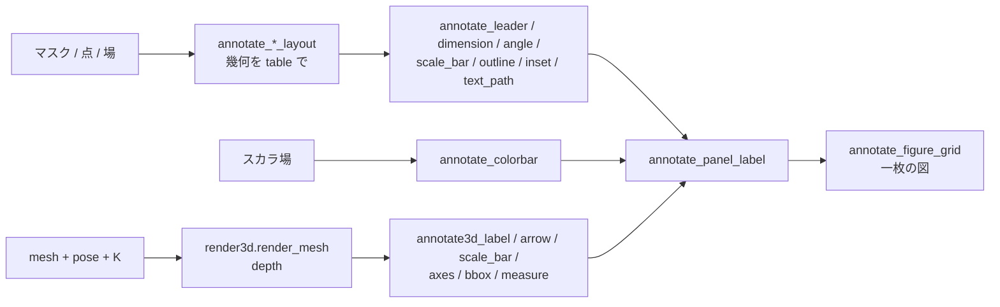

# 図注(figure annotation)— 学術図に「どこに何があるか」を描く 使い方ガイド

## この族は何をする道具箱か

論文・報告書の図は「どこに何があるか」を**矢印や線で示す**のが作法です。Fullseye の `annotate` 族(台帳 `opsannotate.py`、46 op / 7 カテゴリ)は、その作法を op として持ちます。numpy + scipy(文字だけ Pillow)で動き、matplotlib は使いません。

- **部品(25 op)** — `text_box` / `arrow` / `leader_line` / `label_points` / `crosshair` / `legend_box` / `color_bar` / `scale_bar` / `axes_transform` … `plot_series` / `overlay_mask` / `overlay_labels` / `zoom_inset` / `compare_frame` / `panel_grid` / `rounded_rect` / `filled_polygon` / `arc` / `ellipse`。
- **学術図の作法(paper、21 op、2026-09-03)** — 部品を組み合わせた**作法そのもの**:
  - 指し示す: `annotate_leader`(肘つき引き出し線、複数点の**衝突回避**)、`annotate_markers` + `annotate_legend`(番号つき丸マーカーと、同じ番号の凡例)
  - 測る: `annotate_dimension`(両端矢じりの寸法線 + 補助線 + 値と単位)、`annotate_angle`(3 点のなす角の弧 + 値)、`annotate_scale_bar`(画素分解能から **1/2/5×10^k の切りのよい長さ**を選ぶ隅置き)、`annotate_orientation`(方位/向きの矢印)
  - 領域: `annotate_outline`(マスク → 境界の閉折れ線 + 重心のラベル)、`annotate_inset`(隅への拡大差し込み、対応角を結ぶ)、`annotate_text_path`(折れ線に沿う文字)
  - 場と組版: `annotate_colorbar`(スカラ場の色分け重ね + カラーバー)、`annotate_panel_label`(`(a)`/`(b)`)、`annotate_figure_grid`(画像 + 見出しを一定余白で組む)
  - **`*_layout`(8 op)** — `annotate_leader_layout` / `annotate_dimension_layout` / `annotate_angle_layout` / `annotate_scale_bar_layout` / `annotate_inset_layout` / `annotate_outline_layout` / `annotate_text_path_layout` / `annotate_figure_grid_layout`: **描かずに幾何だけ**を `table`(dict)で返す。描く op に `layout=` で渡せば同じ配置を別の絵に使い回せ、テストは肘・寸法値・角度・バー長・輪郭面積・セル矩形を**数字で検算**できる。
- **3-D(`ops3d` の `annotate3d` カテゴリ、7 op、モジュール `annotate3d.py`)** — 3-D のアンカーを `pose`(4x4、`render3d.look_at`)と `K`(`render3d.intrinsics_from_fov`)で射影して描く: `annotate3d_project`(画素・前方距離・画像内・遮蔽の表)/ `annotate3d_arrow` / `annotate3d_label`(引き出し線つき文字)/ `annotate3d_scale_bar`(メッシュ単位の長さのバーを面上に置いて射影 = **短縮を正直に**)/ `annotate3d_axes`(座標軸 gnomon)/ `annotate3d_bbox`(軸平行の箱の 12 辺)/ `annotate3d_measure`(2 点の 3-D 距離を値で)。`depth=` に `render_mesh` の深度を渡すと、**隠れたアンカーは破線 + 白抜き印**で描かれる(消さない)。

## ファミリ共通の契約(fail-closed)

- 画像は `(H,W)` か `(H,W,C)` の float [0,1]。**点は (x,y) = (col,row)**、矩形は `(x,y,w,h)` 左上基準。全 op は入力を破壊せず新しい配列を返し、**決定的**(乱数・時刻を使わない)。
- 文字は**測ってから描く**: 板が画像からはみ出す / 文字が収まらない / 地とのコントラスト不足は `ValueError`(黙って切らない・黙って消えない)。
- 数値引数は `bool` / `str` を**数に変換しない**(`width=True`、`units_per_pixel="0.5"` は `ValueError`)。真偽引数は `"yes"` のような文字列を拒否する。
- 引き出し線は「置き場が無い」を例外にする(`allow_overlap` のような黙認は無い)。寸法線は 2 点一致 / `offset=0` を拒否。角度は頂点と一致する腕を拒否。輪郭は真の画素が無いマスクを拒否。経路文字は経路より長い文字列を拒否。
- 3-D: カメラの後ろ(前方距離 ≤ 0)の点、退化した姿勢、3x3 でない `K`、画像と形の違う `depth` は `ValueError`。`camera.project_points` の +Z 慣習の姿勢を渡すと「後ろ」と判定される(render3d の -Z 慣習に揃えること)。
- 線は**アンチエイリアス**(線分までの距離 → 被覆率 → α 合成)。破線は弧長で区切る。文字は Pillow の AA マスク。

## 代表的なパイプライン(op の繋がり)



## 使い方

### 2-D: 引き出し線・寸法・角度・スケールバー・輪郭

```python
import numpy as np
import annotate as A

img = np.full((240, 320, 3), 0.15)                       # (H,W,3) float [0,1]
mask = np.zeros((240, 320), bool); mask[70:150, 70:150] = True

# 幾何を先に決める(table)→ 描く。同じ layout を別の絵にも渡せる
pts = [(110, 110), (240, 60)]
lay = A.annotate_leader_layout(img.shape[:2], pts, ["disk", "bar"], gap=24)
out = A.annotate_leader(img, pts, ["disk", "bar"], gap=24, layout=lay)
assert lay["items"][0]["elbow"] == (110 + lay["items"][0]["side"][0] * 24,
                                    110 + lay["items"][0]["side"][1] * 24)

out = A.annotate_dimension(out, (60, 200), (160, 200), 0.4, "mm", offset=-24)   # 40.0 mm
out = A.annotate_angle(out, (260, 150), (210, 150), (210, 100), radius=30)      # 90.0°
sb = A.annotate_scale_bar_layout(img.shape[:2], 0.4, "mm", corner="rb")          # 切りのよい長さ
out = A.annotate_scale_bar(out, 0.4, "mm", corner="rb", layout=sb)
out = A.annotate_outline(out, mask, label="ROI")                                 # 輪郭 + 重心ラベル
out = A.annotate_markers(out, [(80, 40), (280, 200)], start=1)
out = A.annotate_legend(out, ["defect", "reference"], (310, 230), anchor="rb", start=1)
out = A.annotate_panel_label(out, "a")
print(sb["length"], sb["px"], A.annotate_outline_layout(mask)["area"])
```

### 2-D: 図の組版

```python
import numpy as np
import annotate as A

panels = [np.full((120, 160, 3), v) for v in (0.3, 0.5, 0.7)]
lay = A.annotate_figure_grid_layout([p.shape[:2] for p in panels], ncols=2, pad=12, caption_h=30)
fig = A.annotate_figure_grid(panels, ["before", "after", "difference"], ncols=2, pad=12, caption_h=30)
assert fig.shape[:2] == lay["size"]           # 大きさは閉形式
assert lay["letters"] == ["(a)", "(b)", "(c)"]
```

### 3-D: レンダリングの上に射影して描く

```python
import numpy as np
import annotate3d as T
import render3d

K = render3d.intrinsics_from_fov(45.0, 320, 240)
pose = render3d.look_at((0.0, 0.0, 10.0), (0.0, 0.0, 0.0), up=(0.0, 1.0, 0.0))
img = np.full((240, 320, 3), 0.2)
out = T.annotate3d_axes(img, pose, K, length=1.0)
out = T.annotate3d_bbox(out, ((-1, -1, -1), (1, 1, 1)), pose, K)
out = T.annotate3d_label(out, "apex", (0.0, 1.0, 0.0), pose, K, offset=(30, -26))
out = T.annotate3d_scale_bar(out, (-1.0, -2.0, 0.0), (1, 0, 0), 2.0, pose, K, unit="mm")
out = T.annotate3d_measure(out, (-1.0, 0.0, 0.0), (1.0, 0.0, 0.0), pose, K, unit="mm")

tab = T.annotate3d_project([(1.0, 2.0, 0.0)], pose, K, shape=(240, 320))
f, cx, cy = K[0, 0], K[0, 2], K[1, 2]
assert np.allclose(tab["uv"][0], (f * 1.0 / 10 + cx, cy - f * 2.0 / 10), atol=1e-9)
# render_mesh(...)["depth"] を depth= に渡すと tab["hidden"] が立ち、ラベルは破線になる
```

## 台帳での呼び方

```python
import opsannotate, ops3d
opsannotate.list_ops("paper")                  # 21 op
opsannotate.call("annotate_scale_bar_layout", (240, 320), 0.4, "mm")
ops3d.list_ops("annotate3d")                   # 7 op
```

## 正直な限界

- 引き出し線の衝突回避は**貪欲**(固定順の候補を先着で埋める)で、最適配置(全体の交差最小化)ではない。候補が尽きれば例外。
- 線の AA は距離被覆率の近似(端点は丸い)。`imagedraw` の 1 画素線(非 AA)と混在させると太さの見えが違う。
- `annotate_text_path` は 1 文字ずつ回転して置くので、カーニングは無く、急カーブでは字間が開く。
- 遮蔽判定は**アンカー 1 画素の深度比較**(`occlusion_tol` の相対許容)。線が途中で面の裏に入る場合は「両端が隠れたときだけ破線」で、部分遮蔽は表現しない。
- `annotate3d_scale_bar` は線分の射影であり、面の傾きで縮む。**画素長から長さを読み取る図ではない**(値は文字で示す)。像面に平行に置きたいときは `direction` を視線に直交させること。
- 例: 2-D は `examples/paper_figure.py`、3-D は `examples_3d/annotate3d_figure.py`(どちらも閉形式との一致を assert する)。
