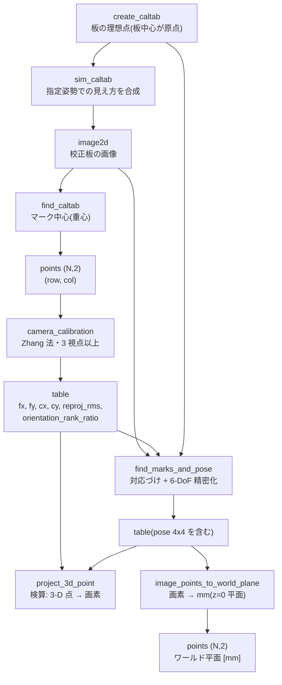

# カメラ校正(画素を実寸に結びつける) — 使い方ガイド

## この族は何をする道具箱か

**画素の座標を、実世界の長さと向きに結びつける**層です。ここが決まらないと、
どんなに精密にエッジを測っても答えは「画素」のままで、mm になりません。

21 op / 5 カテゴリ(numpy と scipy のみ。台帳は `opscalib.py`、実体は
`calib.py` / `caltab.py` / `fit_transform.py`):

- **project(3)** — `project_3d_point` / `project_point_hom_mat3d` /
  `project_hom_point_hom_mat3d`: 3-D 点 → 画素 `(row, col)`。校正結果の**検算**に使う。
- **plane(5)** — `image_to_world_plane` / `image_points_to_world_plane` /
  `contour_to_world_plane_xld` / `gen_image_to_world_plane_map` /
  `gen_radial_distortion_map`: 画素 ↔ ワールド平面(z=0)。平面上の寸法を実寸で読む。
- **target(6)** — `caltab_points` / `create_caltab` / `gen_caltab` / `sim_caltab` /
  `disp_caltab` / `find_caltab`: 校正板を作る・描く・投影をシミュレートする・見つける。
- **calibrate(3)** — `camera_calibration`(Zhang 法で内部行列)/
  `find_marks_and_pose`(板の 6 自由度姿勢)/ `hand_eye_calibration`(Tsai-Lenz、AX=XB)。
- **fit(4)** — `vector_to_rigid` / `vector_to_similarity` / `vector_angle_to_rigid` /
  `hom_vector_to_proj_hom_mat2d`: 対応点から 2-D 変換(Kabsch / Umeyama / DLT)。

## 座標規約 —— ここを外すと例外なしに間違う

**画素は `(row, col)`、ワールド平面の点は `(x, y)`。**
`camera_calibration` の `object_points` は `(x, y)`、`image_points_list` は
`(row, col)` です。入れ替えて渡すと `fx` と `fy`、`cx` と `cy` が**そのまま
入れ替わった K** が返り、**再投影誤差は小さいまま**なので気づけません
(`tests/test_calib.py::test_xy_image_points_would_swap_axes` がその結果を固定しています)。

## 流れ



## 最初の 1 本

```python
import numpy as np
import fullseye as fs

K = {"fx": 500.0, "fy": 500.0, "cx": 128.0, "cy": 128.0}
board = fs.ledger.create_caltab(7, 7, 10.0)          # 7x7、10 mm ピッチ

pose = np.eye(4)                                      # 板を傾けて置く
pose[:3, :3] = np.array([[1, 0, 0], [0, 0.98, -0.2], [0, 0.2, 0.98]])
pose[:3, 3] = [0.0, 0.0, 600.0]

sim = fs.ledger.sim_caltab(board, K, pose, 256)       # 見え方を合成
found = fs.ledger.find_marks_and_pose(sim["image"], K, board)

print(found["n_marks"], found["reproj_rms"])          # 49, 0.1 px 未満
print(found["pose"][:3, 3])                           # ≈ [0, 0, 600]
```

## 落とし穴(実測に基づく)

1. **再投影誤差は配置の良し悪しを映さない。** 2026-09-06 の実測で、同じ 10 視点・
   同じ雑音 0.05 px のまま板の傾きだけを 32 度から 2 度に変えると、再投影 RMS は
   0.0690 → 0.0688(比 1.00 倍)なのに `fx` の誤差は 0.026 % → **7.33 %(281 倍)**に
   なりました。配置を見たいなら `camera_calibration` が返す
   `orientation_rank_ratio`(大きいほど良い)を読んでください。

2. **退化検出の門は、歪みのあるレンズでは鳴りません。** 歪みが無ければ設計どおり
   働きます(傾き 0 度で比 3.8e-14 を拒否)。しかし樽型歪み `k1=-0.18` を入れると
   比が傾きに関係なく 1.9e-06 前後に張り付き、分ける線が引けません。
   しきい値では直せないので、**比を返して判断材料を渡す**形にしてあります。

3. **平面 1 枚では `fx`/`fy` の比を検証できません**(Zhang 2000: 平面 1 枚の
   ホモグラフィは内部パラメータに 2 つしか拘束を与えない)。誤った `fy` は
   姿勢 6 自由度にほとんど吸収されます。内部パラメータを確かめたいなら
   **視点を 3 枚以上**取るか、非平面のターゲットを使ってください。

4. **`camera_calibration` は歪みを推定しません。** 閉形式は歪みを無視するので、
   `k1=-0.18` のレンズでは傾き 5 度で `fx` を 41 % 誤ります。初期値としては
   使えますが、そのまま K として使わないこと。

くわしい実測は [`examples/poc_camera_calibration.py`](../../../../examples/poc_camera_calibration.py)
が章立てで示します(「再投影誤差 0.05 px は何も保証しない」)。

## この族に**入れなかった**もの

`mosaic.py` の歪み込み RANSAC・球面モザイク・バンドル調整、
`caltab.binocular_calibration`、`calib.vector_to_hom_mat2d` などは、
名乗りと中身が食い違うか同名で規約が違うため台帳に載せていません。
理由は [`docs/MATURITY_INTERNAL.md`](../../../MATURITY_INTERNAL.md) に並べてあります。

---

Copyright (c) 2026 Kazufumi Furuse. Licensed under the Apache License, Version 2.0.
