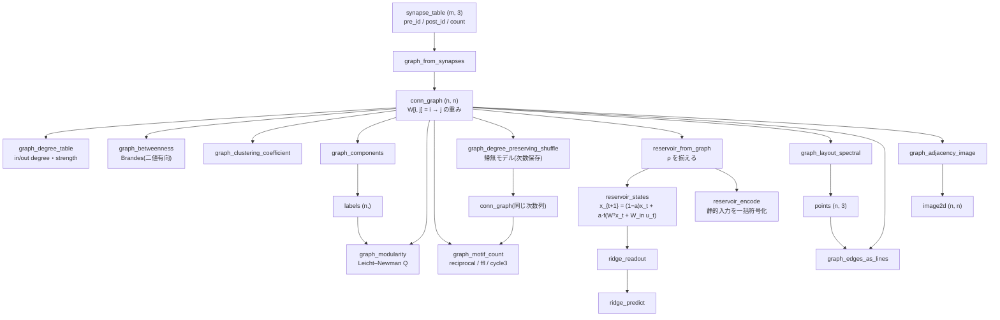

# 結合グラフ解析(コネクトームを数えて揺らして回す) — 使い方ガイド

## この族は何をする道具箱か

**重みつき有向グラフを「結合表」として扱う**層です。入力は n×n の隣接行列 `conn_graph`(`W[i, j]` = i → j の重み、NaN 禁止)か、シナプス表 `synapse_table`(`(pre_id, post_id, count)` の m×3)。出力は**ノードごとの列**(次数・媒介中心性・成分ラベル)、**グラフ 1 つのスカラ**(クラスタ係数・モジュラリティ・モチーフ数)、そして **Studio で見られる出口**(点群の配置・線分の表・隣接行列の画像)です。

コネクトーム解析の定番の連鎖 —— *シナプス表を隣接行列にする → 次数と中心性を測る → 次数を保ったまま辺を繋ぎ替えた帰無モデルと比べる → 結合行列を reservoir として信号を回し、リッジ回帰で読み出す* —— がこの族です。

20 op / 4 カテゴリ(numpy のみ。台帳は `opsconngraph.py`、実体は `conngraph.py`):

- **build(3)** — `graph_from_synapses` / `graph_degree_preserving_shuffle` / `graph_binarize`: 表 → 行列、**次数保存シャッフル(帰無モデル)**、二値化。
- **stats(9)** — `graph_degree_table` / `graph_clustering_coefficient` / `graph_betweenness` / `graph_laplacian_spectrum` / `graph_spectral_radius` / `graph_components` / `graph_modularity` / `graph_rich_club` / `graph_motif_count`: 教科書の閉形式だけ(Brandes の媒介中心性、Watts–Strogatz のクラスタ係数、Leicht–Newman の有向モジュラリティ、Milo のモチーフ)。
- **reservoir(5)** — `reservoir_from_graph` / `reservoir_states` / `reservoir_encode` / `ridge_readout` / `ridge_predict`: 結合行列をスペクトル半径 ρ に揃え、時系列の状態列か静的入力の一括符号化を作り、`(XᵀX + αI)⁻¹XᵀY` で読み出す(echo state network の閉形式)。
- **view(3)** — `graph_layout_spectral` / `graph_edges_as_lines` / `graph_adjacency_image`: Fiedler ベクトルの配置(`points`)、辺の線分表(`table`)、隣接行列の絵(`image2d`)。

## 二値と重み —— どの op がどちらを見るか

**構造**を見る op(次数・媒介中心性・成分・rich club・モチーフ・シャッフル・配置)は `W != 0` の二値構造を使い、**対角(自己結合)は無視**します。重みを使うのは strength(`graph_degree_table` の 2 列)・`graph_modularity`・`graph_spectral_radius`・reservoir 系・`graph_adjacency_image` だけ。「重みつきの媒介中心性」は距離の定義(重み = 強さか長さか)で答えが反転するので、この第 1 陣には入れていません。

NaN は**入口で拒否**します。隣接行列の NaN は「辺が無い」とも「未計測」とも読めるので、黙って 0 に潰すと次数もモジュラリティももっともらしく間違うからです。

## 流れ



## 使う順序

op は `fullseye.ledger.<名前>` から呼べます(この族の公開経路。実体を直に触るなら `import conngraph`)。

```python
import numpy as np
import fullseye as fs

# 実データの代わりに、2 つの集団(各 6 個)が内側で密に結合し、集団間は 2 本だけの結合表
rows = []
for base in (0, 6):
    for i in range(6):
        for j in range(6):
            if i != j:
                rows.append((base + i, base + j, 1 + (i * 7 + j * 3) % 5))   # シナプス数
rows += [(5, 6, 1), (11, 0, 1)]                                            # 集団をつなぐ 2 本
syn = np.array(rows, dtype=np.float64)

W = fs.ledger.graph_from_synapses(syn)                 # 1) 表 → 隣接行列 (12, 12)
deg = fs.ledger.graph_degree_table(W)                  # 2) 次数と strength
bc = fs.ledger.graph_betweenness(W)                    #    媒介中心性(橋の 4 個が高い)
lab = fs.ledger.graph_components(W)                    # 3) 弱連結成分(ここでは 1 つ)
q = fs.ledger.graph_modularity(W, np.arange(12) // 6)  #    真の分割で Q > 0.4

# 4) 帰無モデル: 次数を保ったまま辺を繋ぎ替え、モチーフ数を比べる
ffl = fs.ledger.graph_motif_count(W, motif="ffl")
null = [fs.ledger.graph_motif_count(fs.ledger.graph_degree_preserving_shuffle(W, seed=s), motif="ffl")
        for s in range(20)]
z = (ffl - np.mean(null)) / max(np.std(null), 1e-12)   # 観測の FFL 数が帰無より多いか

# 5) reservoir: 結合行列で信号を回し、1 ステップ先を読み出す
R = fs.ledger.reservoir_from_graph(W, rho=0.9)
u = np.sin(np.linspace(0, 12 * np.pi, 400))[:, None]
X = fs.ledger.reservoir_states(R, u, in_scale=0.5, leak=0.3, washout=50)
Wout = fs.ledger.ridge_readout(X[:-1], u[51:], alpha=1e-3)
pred = fs.ledger.ridge_predict(X[:-1], Wout)

# 6) 見る: 配置 → 線分 → 隣接行列の絵(Studio に渡す型)
P = fs.ledger.graph_layout_spectral(W)                 # points (12, 3)、各軸 [0, 1]
lines = fs.ledger.graph_edges_as_lines(W, P)           # 辺ごとの x0 y0 z0 x1 y1 z1 weight
img = fs.ledger.graph_adjacency_image(W, order="degree")   # (12, 12) の [0, 1]
```

## 活動を「いつ・どこで」に読む(activity、2026-09-20)

reservoir の状態列 (T, n) は数字の表のままでは何も見えない。座標(soma の位置、または
`graph_layout_spectral` の配置)があれば、**刺激の波が配線を伝わる様子**にできる:

```python
w_in = np.zeros((n, 1)); w_in[stim, 0] = 2.0            # 刺激するノードの指示子(列 = 入力チャネル)
U = np.zeros((36, 1)); U[0:3, 0] = 1.0                    # t = 0..2 にパルス
X = fs.reservoir_states(fs.reservoir_from_graph(W, rho=1.0), U, leak=0.6, W_in=w_in)
lat = fs.graph_activation_latency(X)                      # 各ノードが初めて点いたステップ(−1 = 点かない)
tab = fs.graph_activity_spread(X, P, stim.astype(int))    # step / mean_distance / active_fraction / source_fraction
V = fs.points_activity_video(P, X, colors=side_rgb, substeps=2, background=P_all)   # (F, H, W, 3) 回る動画
V3 = fs.points_activity_video(P, X, colors=side_rgb, views=((0, 0), (90, 0), (0, 90)))   # 背側・側面・体軸方向を横に並べる
```

尺度は 3 op とも **1 つ**(全体の最大値)。ノードごとに伸ばすと動かないノードの丸め屑が
「点いた」になり、コマごとに伸ばすと動いていないものがちらつく。対照(`graph_degree_preserving_shuffle`)
を**同じ刺激・同じ W_in** で回して隣に並べるのが作法 —— MaleCNS の soma 座標で右視葉に刺激を入れると、
コネクトームでは活動が視葉 → 中枢 → 下行と順に進み(平均距離 88 → 230 µm を 17 步かけて、上位 3,000 体・36 步では VNC に届かない)、
次数保存 shuffle では 3 步で全体に散る(88 → 300 µm、遠い 1/4 のノードの 93 % が点く)。`examples/poc_malecns_activity_wave.py`。

## 真値で確かめてある性質(`tests/test_conngraph.py`)

| グラフ | op | 厳密な値 |
|---|---|---|
| リング(n = 8) | `graph_laplacian_spectrum` | 2 − 2cos(2πk/n) |
| スター(n = 7) | `graph_betweenness` | 中心 (n−1)(n−2)/2 = 15、葉 0 |
| 完全グラフ(n = 5) | `graph_clustering_coefficient` / `graph_spectral_radius` / `graph_rich_club(k=1)` | 1 / n−1 = 4 / 1 |
| 2 つの 4 クリーク | `graph_components` / `graph_modularity` | [0,0,0,0,1,1,1,1] / 真の分割で 0.5、1 群で 0 |
| FFL 1 個 + 3 巡回 1 個 | `graph_motif_count` | ffl 1 / cycle3 1 |
| 線形 reservoir | `reservoir_states` / `reservoir_encode` | 手で書いた再帰 / X W_inᵀ(steps 1)に一致 |
| Y = XB + 1 | `ridge_readout` → `ridge_predict` | α = 1e-8 で 1e-6 以内に復元 |
| 有向の鎖 0→1→2→3 + 孤立 | `graph_activation_latency` / `graph_activity_spread` | 潜時 [0,1,2,3,−1] / 平均距離 [0,2,4,6] |
| 同上を x 軸に置く | `points_activity_video` | 点いたノードの側が明るい、状態を 10 倍しても同じ絵 |

## 罠

- **`graph_modularity` の重みは非負**。抑制性を負で入れた行列(`graph_from_synapses(..., sign=-1)`)はそのまま渡せない —— `graph_binarize` か `abs` を先に。
- **`graph_degree_preserving_shuffle` が保つのは二値の次数列**。重みは辺に付いて動くので strength は変わる。保ちたいのが strength なら別の帰無モデル(未実装)。
- **`reservoir_from_graph` はスペクトル半径 0 を拒否**する(DAG や空グラフは何倍しても 0)。
- **配置は成分ごと**。非連結グラフでは零固有空間が縮退して Fiedler ベクトルが成分を分けるとは限らないので、成分を明示的に分けて格子に並べる。
