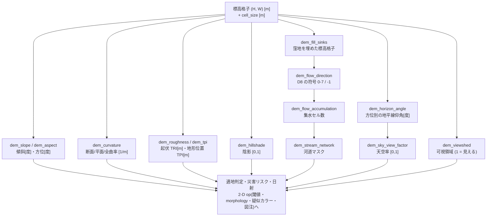

# 数値標高モデルの解析(傾斜・水の流れ・見通し) — 使い方ガイド

## この族は何をする道具箱か

**高さの格子から、地形の性質を読み出す**層です。入力は `(H, W)` の実数配列(各セルの標高、単位メートル)とセルの大きさ(メートル)。出力は傾斜・方位・曲率・陰影・流れ・見通しといった、そのまま**リスク評価や適地判定に使える量**です。

13 op / 4 カテゴリ(numpy のみ。台帳は `opsdem.py`、実体は `demops.py`):

- **surface(5)** — `dem_slope` / `dem_aspect` / `dem_curvature` / `dem_roughness` / `dem_tpi`: 局所 3x3 で閉じる 1 次・2 次の微分量。傾斜[度]、斜面方位[度]、断面/平面/全曲率[1/m]、起伏指数 TRI[m]、地形位置指数 TPI[m]。
- **shading(1)** — `dem_hillshade`: 光源方向を与えた反射[0,1]。地図の陰影であると同時に、日射の粗い目安になります。
- **hydrology(4)** — `dem_fill_sinks` / `dem_flow_direction` / `dem_flow_accumulation` / `dem_stream_network`: 格子**全体**に及ぶ大域演算。窪地を埋め(優先度キュー)、最急降下 1 方向を決め、上流セル数を数え(トポロジカル順)、閾値で河道を切ります。
- **visibility(3)** — `dem_horizon_angle` / `dem_sky_view_factor` / `dem_viewshed`: 視線が地形に遮られるか。日射・眺望・電波見通し・都市の放射冷却に効きます。

**新しい依存は 1 つも要りません。** DEM は深度画像そのもの(メートルの高さ格子)なので、この repo にとって新しい対象ではなく、既存の `depth` と同じ格子を地形の語彙で扱っているだけです。

## 使う順序



水文だけが**直列**です(埋める → 流向 → 集水 → 河道)。残りは標高格子から独立に出ます。`dem_flow_accumulation` は既定で内部から `dem_fill_sinks` を呼ぶので、埋めた格子を別用途にも使うのでなければ 1 行で済みます。

## 最小の例(そのまま動きます)

```python
import numpy as np

import demops

# 東へ 5 %、北へ 12 % 下る平面と、そこにガウス丘を 1 つ載せた地形
h, w, cell = 64, 64, 2.0                      # セル 2 m
row, col = np.mgrid[0:h, 0:w]
x, y = col * cell, (h - 1 - row) * cell       # 行 0 が北 = y は北向き
plane = -0.05 * x - 0.12 * y
dem = plane + 30.0 * np.exp(-((x - 60.0) ** 2 + (y - 70.0) ** 2) / (2 * 20.0 ** 2))

slope = demops.dem_slope(plane, cell)                  # [度]
aspect = demops.dem_aspect(plane, cell)                # 北 0 度・東回り
shade = demops.dem_hillshade(dem, cell, azimuth_deg=315.0, altitude_deg=45.0)
acc = demops.dem_flow_accumulation(dem, cell)          # 集水セル数
streams = demops.dem_stream_network(dem, cell, threshold_cells=100.0)
svf = demops.dem_sky_view_factor(dem, cell, n_azimuth=8)

# 平面の傾斜は閉形式に一致する: atan(sqrt(0.05^2 + 0.12^2)) = 7.4069 度
assert abs(slope[32, 32] - np.degrees(np.arctan(np.hypot(0.05, 0.12)))) < 1e-9
# 東へも北へも下るので、下り(= 方位)は**北東**。atan2(東成分, 北成分) = 22.62 度
assert abs(aspect[32, 32] - np.degrees(np.arctan2(0.05, 0.12))) < 1e-9
assert 0.0 <= shade.min() and shade.max() <= 1.0
assert acc.max() > 100.0 and np.nansum(streams) > 0    # 谷筋に水が集まる
assert 0.0 <= svf.min() and svf.max() <= 1.0

# ★ slope / aspect を **plane** で見ているのは意図。Horn の 3x3 は格子の縁で
#   打ち切られるので、角のセル (0, 0) では**勾配が半分**になり、傾斜は
#   atan(hypot(0.025, 0.06)) = 3.72 度 になる(角度が半分になるのではない)。
#   「端は端」であって実装の誤りではないが、閉形式と突き合わせるなら
#   内側のセルを見ること。
```

`assert` を飾りで置いていません —— **この 6 行は平面の閉形式から出る値**で、規約(北 0 度・東回り、行 0 が北)を 1 つでも取り違えると落ちます。

## いちばん大事な規約(取り違えると静かに間違う)

| 規約 | 値 | 破ったときに何が起きるか |
|---|---|---|
| 標高・セル寸法の単位 | **メートル** | 傾斜が桁で狂う。例外は出ない |
| `cell_size` | **必須引数**(既定値なし) | ← これを既定 1.0 にしていたら、上の事故が既定値として起きる |
| 方位の基準 | **北 0 度・東回り** | 数学の反時計回りと 90 度ずれ、南北が鏡像になる |
| 行 0 | **北**(画像の上端が北) | 同上。DEM タイルの規約に合わせてある |
| 欠測 | **`nan`** のみ | `-9999` のような番兵は**受け取らない**(実数として扱うと傾斜が巨大な嘘になる) |
| 平坦セルの方位 | `ASPECT_FLAT = -1.0` | 0 を使うと**北向き斜面と区別できない** |

**セル寸法は緯度で変わります。** Web メルカトルのタイルを使う場合、地上分解能は

```
cell_size [m/px] = 156543.03392804097 * cos(latitude) / 2**zoom
```

で、東京(北緯 35.68 度)の z=15 では **3.880 m** です。赤道の値(4.777 m)をそのまま使うと傾斜が 23 % 過小になります。緯度を無視した定数を渡すのが、この族でいちばんありがちな事故です。

## 正しさの確かめ方 —— 解析解と突き合わせる

地形解析は「それらしい絵」が必ず出るので、**目視は検証になりません**。この族は閉形式の答えを持つ曲面を基準にしています(`tests/test_demops.py`、64 件):

| 曲面 | 閉形式 | 実測の一致 |
|---|---|---|
| 傾いた平面 | 傾斜 = `atan(|grad|)`、方位は一定 | 1e-13 以下 |
| 円錐 | 傾斜が一定、方位が放射状 | 1e-12 以下 |
| ガウス丘 | 断面/平面曲率が閉形式 | 中央部で 1e-3 以下 |
| 平坦面 | 天空率 = 1、陰影 = `cos(天頂角)` | 1e-15 以下 |
| 一様傾斜面の集水量 | 列ごとに単調増加(D8 の定義から) | 厳密 |

ガウス丘の曲率だけ 1e-3 なのは**離散化の誤差**です。手法の誤りと区別するために、格子を細かくすると誤差が **2 次で**小さくなることも固定してあります。「1e-3 だから多分こんなもの」で済ませると、係数を 1 つ間違えたコードが同じ 1e-3 で通ってしまいます。

### 書いた本人が踏んだ罠 — 鏡像は実装ではなくテストの側だった

方位のテストを 5 通りの平面で書いたところ、**5 件すべてで期待値が `180 - A` になり**、実装が南北反転しているように見えました。実装を疑って読み直しても間違いが見つからず、テストの平面生成を確かめたら `e, n = sin(ar), cos(ar)` とすべきところで符号を取り違えていました。**実装は最初から正しく、テストのほうが鏡像**でした。

そのため今は `test_aspect_is_not_mirrored_north_south` という、北向き斜面を名指しで確かめるテストが別に立っています。「規約が鏡像になっていないか」は、規約そのものを使って書いたテストでは捕まえられません。

## 欠測(`nan`)の扱い —— 埋める選択肢を置かない理由

水面はレーザが返らないので、実データには**必ず**欠測が出ます。`NODATA_POLICIES` は 3 つ:

- `"error"`(既定) — 拒否する。何が正しいかは対象次第なので、黙って決めない。
- `"outlet"` — **流出口**として扱う。水域はまさにこれで、流れ込んだ水はそこで系を出る。欠測セル自身の集水量は `nan`。
- `"barrier"` — 壁として扱う。流れは入らず、迂回する。

**中央値などで埋める選択肢は用意していません。** 埋めると存在しない平原ができ、例外を出さずに水を通すからです。

ただし効果の大きさは正直に書きます。同じ実データ(東京湾岸、1024x1024、欠測 3.83 %)で 3 通りを比べた**最大集水セル数**:

| 方針 | 最大集水セル数 | 全体比 |
|---|---:|---:|
| 流出口 | 312,108 | 29.8 % |
| 中央値で穴埋め | 338,188 | 32.3 % |
| 壁 | 315,023 | 30.0 % |

最初に穴埋めだけを見て「1 セルが全体の 3 割を集めるのは穴埋めの産物だ」と書いたのは**誇張**でした。対照を取ったら効果は 8 % で、**3 割集まること自体はこの地形の実際**です(平坦な埋立地は実際に一箇所へ集まる)。埋める選択肢を置かないのは、数字が桁で変わるからではなく、**どこが実際の地形でどこが穴埋めか区別できなくなる**からです。

## 既存 op との棲み分け(重複させていないもの)

| やりたいこと | 使う op | 置き場所 |
|---|---|---|
| 地形を**作る**(fBm 変位・岩の散布・凹凸法線) | `mesh_displace_fbm` / `mesh_scatter_boulders` / `bump_normals_fbm` | `3d`。名前が紛らわしいので明記します — あちらは**作る**側、この族は**測る**側で向きが逆です。両方を混ぜると「自分で作った地形を自分で測って合っていた」になりかねないので、検証は上の解析曲面で行っています |
| 深度画像から法線・点群を出す | `normals_from_depth` / `depth_to_points` / `depth_to_organized_points` | `3d`。同じ格子を**カメラの語彙**で扱います。`dem_slope` は法線の天頂角と等価ですが、返すのは度で表した傾斜であって法線ベクトルではありません |
| 深度のノイズ除去 | `bilateral_filter_depth` | `3d`。DEM にもそのまま使えます(前処理として有効) |
| メッシュの遮蔽・影 | `ambient_occlusion` / `cast_shadow` | `3d`。あちらは**三角形メッシュ**が対象で、レイトレースします。`dem_sky_view_factor` は格子上の**方位別地平線角**から解析的に積分するので、メッシュ化も光線も要りません |
| 法線マップの陰影付け | `normal_map_shade` | `gfx2d`。あちらは接空間の法線マップが入力。`dem_hillshade` は**標高そのもの**が入力で、途中で法線を作りません |
| 日射・大気・散乱の物理 | `optics` 各種 | あちらは**光学系の設計**。この族の陰影は Lambert 反射 1 行で、放射伝達は扱いません |

## ファミリ共通の入力契約(fail-closed)

全 op が計算の前に検証します。

- **2-D でなければ拒否** — `(H, W)` 以外は形を添えて `ValueError`。
- **セル寸法は有限の正数** — 0 や負や `inf` は拒否(傾斜が `inf` や符号反転になる)。
- **番兵の拒否** — `-9999` のような値が入っていたら、それが実標高でないことを疑って**明示的に落とします**。「たまたま深い海」と区別できないため、`nan` へ直してから渡すことを求めます。
- **欠測があって `nodata="error"`(既定)なら拒否** — 静かに 0 を入れて流したりしません。
- **選択肢は表で検証** — `method` / `units` / `kind` / `nodata` は綴り違いを黙って既定に落とさず、許容値を列挙して落とします。

## 実データでの速度(参考値)

国土地理院の標高タイル(dem5a、z=15)を 4x4 枚モザイクした **1024x1024**(セル 3.880 m、標高 -8.57〜36.02 m、欠測 3.83 %)での実測:

| op | 時間 |
|---|---:|
| `dem_tpi` | 27.2 ms |
| `dem_slope` | 46.9 ms |
| `dem_roughness` | 59.5 ms |
| `dem_curvature` | 69.0 ms |
| `dem_aspect` | 69.9 ms |
| `dem_hillshade` | 87.3 ms |
| `dem_fill_sinks` | 1.42 s |
| `dem_flow_accumulation` | 2.39 s |

局所演算(上 6 つ)は全部ベクトル化されていて 100 ms を切ります。水文の 2 つが 2 桁遅いのは**アルゴリズムの形**によるもので、優先度キューとトポロジカル順の掃引はどちらも逐次依存があり、素直にはベクトル化できません。グラフの構築(流向 → 行き先の 1 次元添字、入次数)は配列演算に直しましたが、**2.71 s → 2.39 s の 12 % しか縮みませんでした** — 支配しているのは掃引の Python ループのほうです。ここは正直に書いておきます。1024x1024 を超える格子を常用するなら、掃引を別実装に移す価値があります。

## データの入手について

この族は**データを同梱しません**。国土地理院の標高タイルはログイン不要で取得でき(`https://cyberjapandata.gsi.go.jp/xyz/dem5a/{z}/{x}/{y}.txt`、256x256 の CSV、欠測は `e`)、`fullseye samples` の DEM 項目に URL と条件を載せてあります。**成果物には出典(国土地理院)の明示が必要**です。

同じ地点には PNG 版(`dem5a_png`)もありますが、**CSV 版と最大 12.94 m 食い違います**(差は急傾斜のセルに集中しており、再標本化の違いと見られます)。どちらが正しいかを確かめないまま混ぜると、比較不能な標高が同じ格子に載るので、この族の検証はすべて CSV 版で行っています。

## 連鎖ファザーでの到達状況

`typed_catalog` に載せた直後の実測(`--cover-all`、900 op):**dem 13/13 が到達し、「呼べたが毎回拒否」も「必須引数が組めない」も 0 件**。入力は既存の `depth` 種((32,32) の高さ格子)をそのまま使い、必須の `cell_size` / `azimuth_deg` / `observer_rc` は `PARAM_HINTS` で束縛しています。

台帳に載せる作業と `PARAM_HINTS` を書く作業は別物で、**前者だけやると 13 op すべてが「引数が組めない」で静かにスキップされます**。この repo は 2026-09-02 に同じ形で 192 op を取りこぼしており(「発見ゼロ」に見えて実際は一度も実行されていなかった)、その再発を防ぐために両方を同じコミットに入れています。
