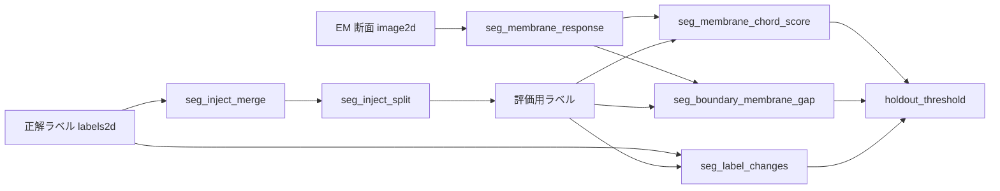

# EM 連結体校正のセカンドオピニオン(膜はラベルの境界にしか無いはず) — 使い方ガイド

## この族は何をする道具箱か

電子顕微鏡(EM)の連続断面からニューロンを切り出した自動分割には、**融合**(別々の 2 細胞が 1 つの id)と**分断**(1 細胞が途中で 2 つの id)が残ります。校正(proofreading)は人がそれを探して直す作業で、先行研究(MergeNet 2017、Zung 2017、Dmitriev 2018、ConnectomeBench 2025)はどれも深層学習で候補を出します。この族は **学習なし・閉形式・ノブつき** で同じ 2 種類の疑いを数え、深層学習の第 1 意見に原理の違う第 2 意見を並べます。前提はひとつ —— **細胞膜(暗い稜線)は本来ラベルの境界にしか無い**。

7 op / 4 カテゴリ(numpy + scipy.ndimage のみ。台帳は `opsemproof.py`、実体は `emproof.py`):

- **response(1)** — `seg_membrane_response`: 生 EM → 膜応答(ガウス平滑した Hessian の固有値 λ1 − |λ2|、Steger の線検出の閉形式)。暗い塊(ミトコンドリア内部)は打ち消し合って 0 に近い。断面ごとに 99.5 percentile で正規化。scikit-image があるならレジストリの `sk_frangi` も同じ席に入る。
- **suspect(2)** — `seg_membrane_chord_score`(融合の疑い: ラベルの**内部**を横切る膜の弦の長さ / ラベルの径。穴を持つ膜成分 = 閉じた輪は除く)/ `seg_boundary_membrane_gap`(分断の疑い: 隣接ラベルの境界画素のうち膜応答が閾値未満の割合)。
- **inject(3)** — `seg_inject_merge` / `seg_inject_split` / `seg_label_changes`: 評価用に正解ラベルへ人工の融合・分断を仕込み、2 枚のラベルの差を対として取り出す。
- **evaluate(1)** — `holdout_threshold`: 閾値を訓練側のスコアで選び(負例の偽陽性率 ≤ target_fpr)、評価は別の側で AUC / TPR / FPR を返す。

## 連鎖



```python
import fullseye as fs
L = fs.ledger

M = L.seg_membrane_response(raw, sigma=2.0)                       # 4 nm/px なら膜の半幅 ≈ 2 px
cut = L.seg_inject_split(L.seg_inject_merge(labels, n=1, seed=0), n=1, seed=0)
truth = L.seg_label_changes(labels, cut)                          # 仕込んだ対(答え)
chord = L.seg_membrane_chord_score(cut, M, tau=0.2, band=4)       # 融合の疑い(score 降順)
gap = L.seg_boundary_membrane_gap(cut, M, tau=0.2, min_len=60)    # 分断の疑い(gap_fraction 降順)
r = L.holdout_threshold(train_pos, train_neg, test_pos, test_neg, target_fpr=0.05)
print(r["tau"], r["test_auc"], r["test_tpr"], r["test_fpr"])
```

## 実測(CREMI sample A、512² 断面 12 枚、閾値は前半 6 枚で選び後半 6 枚で測る)

| 検出器 | 評価 AUC | 乱数 | 大きさだけ |
|---|---|---|---|
| 分断 = 膜の無い境界 | **1.00**(TPR 1.00 / FPR 0.11) | 0.65 | 0.54 |
| 融合 = 内部の膜の弦(面積で揃えた負例) | 0.83(TPR 0.12 / FPR 0.01) | 0.53 | 0.70 |

分断は膜の有無だけでほぼ確実に指せます。融合は弱い —— 内部に膜の多い細胞(ミトコンドリアが詰まった太い軸索、細胞体)が弦と同じ形で高く出るのが偽陽性の主因で、閉じた輪は穴で除けても切れた弧は除けません。人工の融合は「大きな 2 ラベルの和」なので**面積で揃えずに測ると「大きいラベル = 怪しい」だけで AUC 0.87 が出てしまう**(揃えると 0.70)。評価側の数字だけを主張に使うのが `holdout_threshold` を op にした理由です。

## 型の話

新しい型は作りません。断面のラベルは blob 族の `labels2d`(2-D 整数)、膜応答と生 EM は `image2d`、疑いの表と差分と評価は `table`(列名 → 配列 / 名前 → スカラ)。`holdout_threshold` は 4 本の `signal`。生データ(CREMI)は repo に入れず、集計と図だけを置きます(`examples/poc_em_second_opinion.py`、手元に無ければ合成の代替で同じ経路)。
