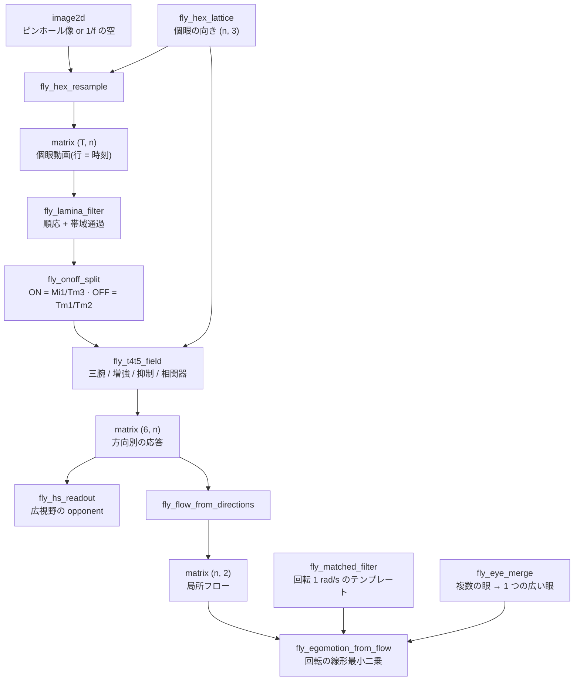

# ハエの視葉(複眼から「自分がどう回ったか」まで) — 使い方ガイド

## この族は何をする道具箱か

**広い視野・低い解像度・少ないニューロンで、運動と衝突時間と進行方向を出す**ための層です。
fullseye は視覚系の**設計**側(`optics` / `visiondesign`)と、点群・姿勢・シーンフローの**処理**側を
持っていましたが、「複眼でものを見る側の処理経路」がありませんでした。この族がそれです。

大事なのは、**どれも学習網ではなく閉じた式**だということ。一本ずつに、突き合わせる厳密な恒等式が
あります(六角格子の個眼数、ガウス受容野の MTF、相関器の定常応答、η の最大時刻、Weber の不変性、
三腕モデルの積の恒等式、整合フィルタの `sin`)。学習で決めた数は 1 つも入っていません。
コネクトームを固定して残りを勾配で学習するモデル(flyvis 系)とは、そこが違います
—— 2026 年になって、その手の学習モデルは**初期値を変えると別の解に落ち、課題誤差の最良と生理的な
妥当さが一致しない**という報告が出ています。閉じた式には再現性の問題がありません。

16 op / 10 カテゴリ(numpy + scipy のみ。台帳は `opsflyvision.py`、実体は `flyvision.py`):

- **lattice / stimulus / sample(4)** — `fly_hex_lattice`(眼の幾何。`n = 3r(r+1)+1` 個眼)/
  `fly_sky_1f`(1/f の空)/ `fly_hex_resample`(ガウス受容野で像を個眼に落とす)/ `fly_hex_quantize`。
- **lamina(2)** — `fly_lamina_filter` / `fly_onoff_split`: 明るさを捨てて対比にし、ON と OFF に分ける。
- **motion / direction(3)** — `fly_emd_response`(2 個眼の相関器)/ `fly_t4t5_field`(六角の 6 方向すべてで
  方向選択)/ `fly_flow_from_directions`(6 方向 → 1 本のベクトル)。
- **looming(2)** — `fly_lgmd_eta` / `fly_tau_from_expansion`: 膨張する角度から衝突の時刻を読む。
- **integrate / tuning / selfmotion(5)** — `fly_hs_readout`(広視野の opponent 読み出し)/ `fly_dsi` /
  `fly_matched_filter` / `fly_egomotion_from_flow` / `fly_eye_merge`。

## 光の流れ(この順に繋ぐ)



## 使ってみる

```python
import numpy as np
import fullseye as fs

L = fs.ledger
lat = L.fly_hex_lattice(radius=6, dphi_deg=5.0)          # 127 個眼、視野 ±30 度
n = lat["dirs"].shape[0]
dt = 0.01

# 方位に正弦の縞を流す(回転ドラムの中にいるハエ)
az = np.asarray(lat["az_rad"])
t = np.arange(150) * dt
movie = 1.0 + 0.3 * np.sin(2 * np.pi / np.deg2rad(30.0) * (az[None, :] - 0.4 * t[:, None]))

contrast = L.fly_lamina_filter(movie, dt, tau_adapt_s=0.1, tau_lp_s=0.02)
onoff = L.fly_onoff_split(contrast, dt)
field = (L.fly_t4t5_field(onoff[:, :n], lat, dt, tau_s=0.05)
         + L.fly_t4t5_field(onoff[:, n:], lat, dt, tau_s=0.05))
flow = L.fly_flow_from_directions(field, lat)
est = L.fly_egomotion_from_flow(flow, lat, axes=[[0.0, 0.0, 1.0]])
print(est["yaw_rad_s"], est["condition"])                # 向きは合う。大きさは対比に依存する
```

## 読むときの注意(測ったこと)

* **相関器は速度計ではない。** `fly_emd_response` も `fly_t4t5_field` も応答が対比の 2 乗に比例するので、
  「低対比で速い」と「高対比で遅い」が同じ値になります。`fly_egomotion_from_flow` が返すのは
  **回転に比例する量**であって rad/s ではありません。単位が要るなら、既知の回転で利得を 1 つ較正して、
  **別の場面で**使ってください。
* **狭い眼は自然な景色で符号を間違える。** 1/f の景色の対比は少数の大きな特徴が握っているので、
  視野 80° の 1 つの眼だと、同じ回転でも景色を変えると推定がばらつきます(PoC の実測: 同じ +0.5 rad/s を
  12 枚の別々の景色で測ると散らばり(標準偏差/平均)1.05、**12 枚中 4 枚は符号すら逆**)。
  `fly_eye_merge` で 3 つの眼を 250° に束ねると 0.44 / 0 枚。**複眼が広いことは飾りではありません。**
* **当てはまったことと識別できたことは別。** `fly_egomotion_from_flow` は条件数を必ず返します。
  狭い前向きの眼では 3 軸を分けられないので、`axes=[[0, 0, 1]]` のようにヨーだけを聞くのが正直な使い方です。
* **整流をどこでやるかは主張です。** L1/L2 自体は線形だという記録があるので、`fly_onoff_split` の
  `rectify` は選べるようにしてあります。既定の `True` は「下流で整流される」という読みです。
