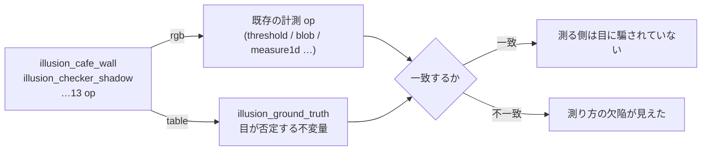

# 絵を作る側(錯視・無限描画・循環動画) — 使い方ガイド

## この族は何をする道具箱か

Fullseye のほとんどの op は**与えられた画像を測る**側にいます。この族だけが
反対側にいて、**画像を作ります**。ただし作るのは「素材」ではなく、
**真値が最初から付いている画像**です。

3 つの入口があります。

| 入口 | 何が出るか | 何を主張するか |
|---|---|---|
| 錯視(13 op) | 1 枚の `rgb` | **目が否定する不変量**(平行・等長・同値・共線)を、厳密に守っている |
| 無限描画(12 op) | 1 枚の `rgb` | 絵とは独立に成り立つ**恒等式**を持っている |
| 循環動画(2 op)+ 状態(3 op) | `rgbvideo` / `table` | **継ぎ目が無いこと**を、構成から保証している |

新しい型語は 1 つも作っていません。返りは既存の `rgb`(H,W,3)・
`rgbvideo`(T,H,W,3)・`table` だけです。**「錯視画像」という特別な型を作らない**
のが設計の中心で、作った絵に既存の 2,000 以上の op がそのまま掛かることが、
この族の値打ちそのものだからです。

## なぜ検査ライブラリが錯視を持つのか

装飾だからではありません。**錯視は「見た目は確かめの役に立たない」ことの、
最も純粋な実例**だからです。

`illusion_cafe_wall` の目地は**厳密な水平線**です。`illusion_muller_lyer` の
2 本の軸は**厳密に等長**です。`illusion_checker_shadow` の 2 マスは**浮動小数
として同じ値**です。見えているものが違う、というだけ。

そして面白いのはここから先で —— **錯視は人間の目だけを騙すのではありません**。
`illusion_muller_lyer` の図で「行の黒い区間」を素朴に測ると、2 本の軸は
**223 画素と 225 画素**になります(矢羽根の反エイリアスの裾が軸の端に乗る)。
素朴な計測も 2 画素ずれる。だからこの族は、測る側の**採点表**として使えます。



## 無限に描き続けるものを、どう採点するか

`perpetual_ten_print`(Commodore 64 の一行プログラム)、
`perpetual_elementary_ca`(Wolfram の 256 規則)、`perpetual_langtons_ant`、
`perpetual_chaos_game`、`perpetual_apollonian`、`perpetual_harmonograph`、
`perpetual_ifs_attractor`、`perpetual_flow_field`、
`perpetual_reaction_diffusion`、`perpetual_plasma`、`perpetual_truchet` ——
どれも「いつ止めても途中」なので、**絵の見た目では採点できません**。

そこで、絵とは独立に成り立つ主張を持つものだけを入れました。
`perpetual_identities` が 6 本まとめて実測で返します。

| 系 | 恒等式 | 実測の残差 |
|---|---|---|
| 規則 90 | 第 n 行 = `C(n,k) mod 2`(リュカの定理) | `0.000e+00` |
| ラングトンの蟻 | 周期 104 で同じ斜め (2,2) を繰り返す | `0.000e+00` |
| アポロニウス | `(Σk)² = 2Σk²`(デカルトの円定理) | `1.19e-16` |
| 流れ場 | `div(curl ψ) = 0`(非圧縮) | `6.95e-17` |
| 反応拡散 | 餌も死も 0 なら総量保存 | `1.98e-16` |
| プラズマ | 4 隅は最後まで書き換えられない | `0.000e+00` |

## 「無限」を op でどう持つか

1 枚返す生成器だけでは「無限に描き続ける」ことになりません。だから
**状態 → 進める → 描く**の 3 本組を置いてあります ——
`perpetual_state` / `perpetual_step` / `perpetual_render`。
**op の側は「いつ止めるか」を決めません。**

```python
import fullseye as fs

s = fs.ledger.perpetual_state("langtons_ant", size=301)
s = fs.ledger.perpetual_step(s, 12_000)       # 好きなだけ回してよい
img = fs.ledger.perpetual_render(s)           # 何歩目で描いてもよい

ident = fs.ledger.perpetual_identities()      # 絵を見ずに採点する
print(dict(zip(ident["system"], ident["residual"])))
```

状態の宣言型は `table` ですが、**table は広い型**です。無関係な表を渡されたら
`KeyError` ではなく「これは perpetual の状態ではない」と明示的に拒否します
(fail-closed)。

## 時間軸で循環する画像

`perpetual_loop` は**継ぎ目の無い**動画を返します。ここは作り方が要点で、
「最後に頭へ戻す」のではありません。時間依存の量を**すべて θ の関数**にして
θ = 2πt/T を回すと、t = T は t = 0 と**同じ式**になります —— つまり継ぎ目は
最初から存在しません。編集で消す種類のものではなく、構成から従います。

`perpetual_loop_seam` がそれを数で出します。読み方に注意が要ります:

> **比が 0 ではなく 1 に近いのが正解。** 比 = (最後のまたぎの差) ÷ (ふつうの
> コマ間の差)。1 なら「最後のまたぎが、ほかのまたぎと見分けが付かない」。
> 0 なら継ぎ目が無いのではなく、**動きが止まっている**という意味になります。

```python
v = fs.ledger.perpetual_loop("plasma_orbit", frames=48, size=360)
m = fs.ledger.perpetual_loop_seam(v)
print(float(m["ratio"][0]))        # 0.99〜1.02 なら継ぎ目なし
```

## 向くところ / 向かないところ

**向く**: 測る側の採点(錯視図 + `illusion_ground_truth`)、尽きない試験入力、
周期境界を持つ時間方向 op の素材、真値つきの合成データ。

**向かない**: 「作品」としての完成度。この族は**主張が検算できる図**だけを
持っていて、美しいが検算できない図は入れていません
(`illusion_ebbinghaus` / `illusion_zollner` / `illusion_ponzo` /
`illusion_poggendorff` / `illusion_fraser_spiral` / `illusion_kanizsa` /
`illusion_hermann_grid` / `illusion_scintillating_grid` /
`illusion_simultaneous_contrast` はいずれも不変量を持ちます)。

## 作っている途中で出た欠陥(3 件)

どれも**絵を見ても気づけない**型でした。

1. 二項係数を `int64` で積んでいて、`C(62,31)×31` で**黙って溢れた**。
   リュカの定理「`C(n,k)` が奇 ⟺ `(n&k)==k`」に置き換えて、桁あふれの余地を消した。
2. `illusion_checker_shadow` で**対にするマスを間違えていた**(同じ明暗のマスを
   2 つ選んでいた。差 0.31)。対にすべきは「影の外の暗マス」と「影の中の明マス」。
3. 定数の配列でも `std()` は厳密に 0 になりません(平均を引く途中で 1 ulp 残る、
   実測 5.6e-17)。「全部同じ値」を厳密に言うなら `ptp`(最大 − 最小)を使います。
