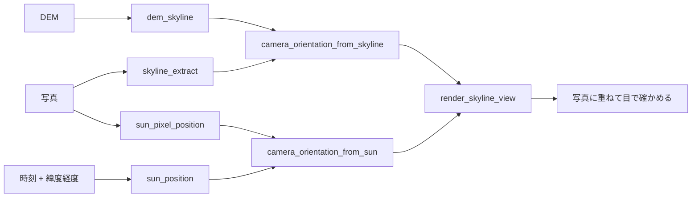

# 固定カメラの向きを写真から決める(太陽とスカイライン) — 使い方ガイド

## この族は何をする道具箱か

**位置は分かっているが向きが分からない固定カメラ**(道路・気象・観光の公共カメラ、工場の定点カメラ)の (yaw, pitch, roll) を、**写真そのものから、学習なしで**決める層です。向きが決まると、写真を地図・DEM・3D 都市に置ける(逆に、向きが無いと置けない —— 公開されているカメラ一覧の多くは位置だけで、向きは道路の増減方向や手校正しかありません)。

手掛かりは 2 つで、どちらも閉形式に近い:

- **太陽**: 太陽の見かけの位置は時刻と場所の関数(NOAA の太陽計算、Meeus 1998)。時刻つきの写真で太陽の画素を 2 点以上拾えば、回転は Wahba 問題の SVD 解(Kabsch 1976)で一意に決まる。先行 = Lalonde・Narasimhan・Efros, IJCV 2010(webcam 22 台で 3° 以内)、Jacobs ら WACV 2008。
- **スカイライン**: カメラ位置から DEM で描いた 360° の稜線と、写真から動的計画法(Lie・Lin・Hsu 2005)で抜いた空と地形の境界を照合する。先行 = Baatz・Saurer・Köser・Pollefeys, ECCV 2012(位置未知の大規模版)。この族は**位置既知・1 台**に絞り、代わりに**曖昧さ(yaw の谷が複数)を返す**。

7 op / 3 カテゴリ(numpy + scipy。台帳は `opsgeocam.py`、実体は `geocam.py`):

- **sun(3)** — `sun_position` / `sun_pixel_position` / `camera_orientation_from_sun`: 時刻 → 太陽の方位・仰角(屈折込み)、写真 → 太陽の画素、太陽の画素 ≥ 2 点 → 姿勢。
- **skyline(3)** — `dem_skyline` / `skyline_extract` / `render_skyline_view`: DEM の 1 点 × 全方位の地平線仰角、写真 → 列ごとの境界の行、姿勢 → その向きの空のマスク(重ね描き・合成)。
- **orientation(1)** — `camera_orientation_from_skyline`: 境界 + DEM スカイライン → 姿勢 + yaw の残差曲線 + 曖昧さ。

## 規約(ここが姿勢の定義)

世界 = ENU(東・北・上)、方位は北 0° 時計回り、仰角は水平 0°。カメラ = OpenCV(右・下・前)、K = (fx, fy, cx, cy)。**yaw** = 光軸の方位、**pitch** = 光軸の仰角(上が正)、**roll** = 光軸まわり(正でカメラが右に傾く)。`R_wc = Rz(−yaw)·Rx(pitch)·Ry(roll)·B`。DEM は行 0 が北端。太陽の方位・仰角も同じ規約なので、2 経路の答えはそのまま比べられます。

## パイプライン



## 走る例

```python
import numpy as np
import fullseye as fs

dem = ...                                   # (H, W) 標高 [m]、行 0 が北端
K = (280.0, 280.0, 160.0, 120.0)            # fx, fy, cx, cy
sky = fs.ledger.dem_skyline(dem, 30.0, (150, 150), eye_height=5.0, az_step_deg=0.5)
rows = fs.ledger.skyline_extract(photo)     # (W,) 列ごとの空と地形の境界の行
est = fs.ledger.camera_orientation_from_skyline(rows, K, sky)
print(est["yaw_deg"], est["pitch_deg"], est["roll_deg"], est["ambiguous"], est["margin_deg"])

# 同じカメラを太陽で検算(同じ日の朝と夕の 2 枚があれば足りる)
uv = np.vstack([fs.ledger.sun_pixel_position(morning), fs.ledger.sun_pixel_position(evening)])
est2 = fs.ledger.camera_orientation_from_sun(uv, [t_morning, t_evening], lat, lon, K)
sky_mask = fs.ledger.render_skyline_view(sky, K, photo.shape, est["yaw_deg"], est["pitch_deg"], est["roll_deg"])
```

## 真値で確かめてある性質(tests/test_geocam.py)

- `sun_position`: 春分の正午に仰角 = 90 − |緯度|、夏至の正午に赤道で 90 − 23.44°、方位が東 → 南 → 西と単調、赤緯は ±23.44° 以内。
- 姿勢の往復: `_rotation` → `_pose_from_rotation` が 1e−9 で戻る。画面の上の画素は仰角が高く、yaw 90° で光軸は東。
- **描いて → 抜いて → 当てる**: 合成 DEM で `render_skyline_view` した空のマスクに雑音を足し、`skyline_extract` → `camera_orientation_from_skyline` で yaw / pitch / roll が 0.1° 以内に戻る。
- 太陽: 真の姿勢で投影した太陽の画素(0.5 px の雑音)から `camera_orientation_from_sun` が 0.05° 以内に戻る。1 点・共線(同じ時刻)は ValueError。
- 平地の DEM ではスカイラインが全方位で同じ → `ambiguous=True`(黙って 1 つを返さない)。

## 罠(honest)

- **スカイラインは山があってこそ**。平地・海・都市の建物(DEM に無い)では谷が複数、margin が小さい。`ambiguous` を必ず読む。
- **太陽は写っていてこそ**。曇天・夜・太陽が画角外の向きでは `sun_pixel_position` が ValueError。太陽より明るい人工光源がある夜景では使えない。
- DEM の分解能より細かい稜線は描けない(30 m DEM で仰角 ≈ 0.1° の粗さ)。遠い山は地球の丸みと屈折で沈む(`earth_curvature=True` が既定)。
- 内部行列 K は要る(EXIF の焦点距離か、既知の画角から `fx = W / (2 tan(fov/2))`)。K の誤りは pitch と roll に化ける。
- 生の公開カメラ画像は repo に入れない(ライセンスと人物・車両)。この族は幾何だけを扱い、写っているものの認識はしない。
