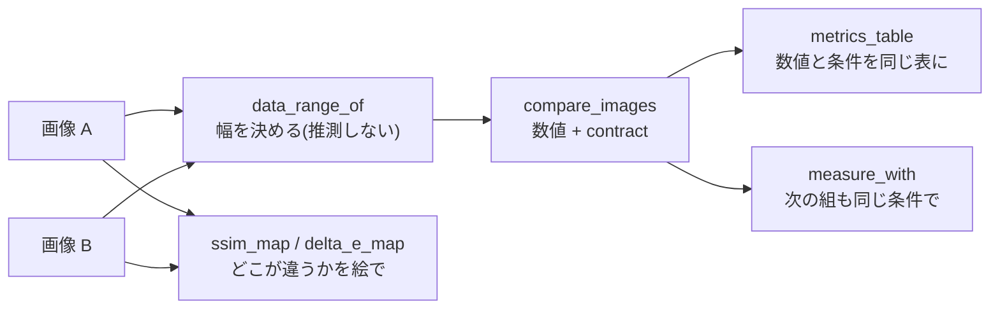

# 画質・差分指標の知識 — 数字が動く前に、たいてい条件が動いている

「この処理で良くなりました」を数字で言う場面の教材である。
`imgmetrics` 族（24 op）の使い方であると同時に、**他所のライブラリで測った数字を
受け取ったとき、それが比較可能かどうかを見抜く**ための知識でもある。

この族が他と違うのは **答え合わせが外からできる**ことで、そのぶん
「合っているのに比べられない」という失敗のほうが起きやすい。
指標の値が動いたとき、**動いたのはたいてい対象ではなく測定条件**である。

関連: `2d/guides/colorimetry.md`（色差の手前にある物理）、
`math/guides/measurement_uncertainty.md`（そもそも「精度」とは何か）。

---

## 0. 測る流れ



```python
import numpy as np
import imgmetrics as M

a = np.random.default_rng(0).random((128, 128))
b = np.clip(a + 0.02 * np.random.default_rng(1).standard_normal(a.shape), 0.0, 1.0)

# 数値だけでなく contract(測定条件)も一緒に返る
rep = M.compare_images(a, b)
for name, value in M.metrics_table(rep):
    print(f"{name:34s} {value}")
# → psnr 34.108 / ssim 0.9976 / 条件: data_range 1.0, ssim_win_size 11, bins 64 …

# 別の組を「まったく同じ条件で」測り直す。条件が消えないので並べて比べられる
rep2 = M.measure_with(rep, a, np.clip(a + 0.05, 0.0, 1.0))
print(rep["psnr"], "->", rep2["psnr"])          # 34.108 -> 26.173

# 足場(実装を疑ったらまずこれ): I(X;X) == H(X)
print(M.mutual_information(a, a), M.image_entropy(a), M.joint_entropy(a, a))  # 5.9973 x3

# 色は RGB の差ではなく知覚的な色差で測る
rgb1 = np.zeros((8, 8, 3)); rgb1[..., 0] = 0.80
rgb2 = np.zeros((8, 8, 3)); rgb2[..., 0] = 0.82
print(float(M.delta_e_map(rgb1, rgb2).mean()))  # dE00 = 1.057
print(M.rgb_to_lab(rgb1)[0, 0])                 # (42.52, 67.70, 56.80)
```

`rgb_to_xyz` / `xyz_to_lab` / `lab_to_rgb` も同じ族にある（`lab_to_rgb` は色域外を
切り詰めるので、往復が一致するのは色域内だけ）。

---

## 1. 最初に決めるもの — `data_range`

PSNR も SSIM も「画素値が取りうる幅」で正規化する。ここを取り違えると:

```
[0, 1] の float を [0, 255] だと思って PSNR を測ると
  20 · log10(255) = 48.13 dB    ずれる
```

**例外は出ない。それらしい数値が出る。** だから比較の前に必ず幅を宣言する。

fullseye は推測しない（`data_range_of`）:

| 入力 | 挙動 |
| --- | --- |
| 整数 dtype | dtype から一意（`uint8` → 255、`uint16` → 65535） |
| float で `[0, 1]` に収まる | 1.0 とみなす |
| float で 1.0 超 / 負値を含む | **`data_range` の明示を要求して例外**（「たぶん 255」で進まない） |

### 他所のライブラリを受け取るとき（★実務で最も効く一次情報）

scikit-image の `structural_similarity` / `peak_signal_noise_ratio` は
`data_range` の既定が **dtype からの推定**で、しかもドキュメントに明記がある:

> "By default, this is estimated from the image data-type. However for
> floating-point image data, this estimate yields a result double the value of
> the desired range" — **"it is recommended to always pass this scalar value explicitly"**

つまり **float 画像に `data_range` を渡していない skimage の SSIM/PSNR は、
既定のまま使うと想定の 2 倍の幅で正規化されている**。他人の数字を見たら、
まずここを訊く。

---

## 2. SSIM は「実装が同じ」でないと比べられない

`ssim` の既定は原論文（Wang, Bovik, Sheikh & Simoncelli, IEEE TIP 13(4), 2004）の設定
—— **11×11 ガウシアン窓 σ=1.5、K1=0.01、K2=0.03、重み付き母分散**。

skimage で原論文に合わせるには、ドキュメントの記載どおり
`gaussian_weights=True` / `sigma=1.5` / `use_sample_covariance=False` に加えて
`data_range` を明示する必要がある。**既定のままでは原論文の SSIM ではない。**

### 値が変わる 4 つのつまみ（どれも「バグ」ではない）

| つまみ | 何が起きるか |
| --- | --- |
| **縁の扱い** | 窓が端に掛かると、鏡像で埋めた画素が統計に混ざる。fullseye は `crop_border=True` で窓半径ぶん落としてから平均する。**落とす／落とさないで値が変わり、小さい絵ほど差が出る** |
| 標本分散 vs 母分散 | `n/(n-1)` 補正の有無。原論文は母分散 |
| 色の扱い | チャネルごとに計算して平均するのか、輝度 1 枚で測るのか。**同じ「SSIM」という名前で別の数字**になる |
| 窓の形 | 一様窓（7×7 など）とガウシアン窓（11×11 σ=1.5）は別物 |

### MS-SSIM は段数が命

5 段の縮小を経るので、最終段で 11 画素の窓が成立するには **各辺 176 px** 要る
（`(win_size−1)·2^(n−1) + 2^(n−1)` = 10·16 + 16）。
足りないときに **段数を黙って減らす実装がある**。段数の違う MS-SSIM は
別の指標であり、並べた時点で嘘になる。fullseye は減らさずに例外を投げる。

なお公表されている 5 段の重みは和が **1 ではなく 1.0001**（原論文が 4 桁で丸めた値）。
fullseye は黙って正規化しない —— 他所との 1e-4 のずれの出所がここだと分かるようにしてある。

---

## 3. 何を測る指標かで選ぶ

| 指標 | 見ているもの | 向く場面 | 外す場面 |
| --- | --- | --- | --- |
| `mse` / `rmse` | 画素値の差の大きさ | 物理量の残差、最適化の目的関数 | 見た目の良し悪し |
| `psnr` | 同上を dB で | 圧縮・復元の定量比較（**同じ `data_range` で**） | 1 px のずれで大きく落ちる。構造の一致 |
| `ssim` / `ssim_map` | 局所の輝度・コントラスト・構造 | 「どこが似ていないか」を絵で見る | 幾何ずれ、大域的な明るさの違い |
| `ms_ssim` | 上を多尺度で | 縮小耐性が要るとき | 小さい画像（176 px 未満で例外） |
| `mutual_information` | 2 枚の**統計的な依存**（値の対応が線形でなくてよい） | **モダリティが違う画像の位置合わせ**（X 線と可視、深度と輝度） | 絶対値の比較（`bins` で変わる） |
| `ncd` | 圧縮で測る「情報の重なり」 | 事前知識なしの粗い類似度 | 微小な差の判定 |
| `delta_e_2000` | **知覚的な色差** | 色の合否判定 | 形・テクスチャの違い |

**RGB の平均二乗誤差を「色の差」と呼ばない。** 色差は `delta_e_map` の仕事で、
その手前に光源・観測者・白色点の話がある（`2d/guides/colorimetry.md`）。

### 相互情報量の換算と足場

* `bins` を変えると値が変わる。**`bins` を書かない相互情報量は比較できない。**
* 足場になる既知値: `I(X;X) = H(X)`、独立な一様乱数 2 枚なら `I ≈ 0`。
  実装を疑ったらまずこの 2 つを測る。
* 正規化版（`normalized_mutual_information`）は定義が複数ある
  （`2I/(H(X)+H(Y))` 型か `I/√(H(X)H(Y))` 型か）。**どの正規化かを書く。**
* 分布そのものを見たいときは `joint_histogram`。位置合わせが効いていれば
  対角に集まる —— 数字が動かない理由は、たいていこの絵に出ている。

---

## 4. 学習系の指標（fullseye の外だが、仕事では必ず出てくる）

### LPIPS —— 入力の約束を外すと静かに壊れる

* 入力は **`Nx3xHxW` の RGB を `[-1, 1]` に正規化**したもの（公式実装の明記）。
  `[0, 1]` のまま入れても例外は出ず、**それらしい数字が出る**。
* バックボーンは SqueezeNet / AlexNet（既定・forward スコア用）/ VGG（最適化用）。
  公式は「アーキテクチャ間で似たスコア」としつつ、**どれを使ったか明記せよ**としている。
* `version` 引数がある（現行 0.1、初版 0.0）。**論文・報告には版も書く。**

### FID —— リサイズ実装だけで生成品質より大きな差が立つ

clean-fid（Parmar et al.）の実測が決定的である。FFHQ を 256×256 にリサイズして、
**同じ画像集合をリサイズ実装だけ変えて**比べると:

| リサイズ | FID |
| --- | --- |
| PIL-bicubic（基準・エイリアシングなし） | ~0 |
| PIL-Lanczos / bilinear / box | ≤ 0.75 |
| **OpenCV-bicubic / PyTorch-bicubic / TensorFlow-bicubic（antialias なし）** | **≥ 6.0** |

論文の指摘は「多くの実装が**固定幅の前置フィルタ**を使っており、縮小率に応じて
フィルタ幅を変える信号処理の原則を破っている」こと。
**モデルを一切変えずに FID が 6 動く。** 論文で報告される改善幅と同じ桁である。

JPEG も効く: StyleGAN2 / LSUN Church で、学習集合が品質 75 のとき、
生成画像を **品質 87 で保存したときに FID が最良（3.48）** になる。
「実画像側が圧縮されているなら、生成画像も圧縮したほうが FID が良くなる」。

実務の結論: **FID の絶対値は引用しない。** 同じ前処理コード・同じ枚数
（50k が慣例）で測った値どうしだけを比べる。

### 無参照指標（NIQE / BRISQUE）は「自然画像」の物差し

NIQE は原論文の言葉で "a simple and successful space domain **natural scene
statistic (NSS)** model" に基づき、その特徴量は "derived from a corpus of
**natural, undistorted images**" である。

したがって —— これは原論文の主張ではなく、そこからの帰結として ——
**外観検査画像・医用画像・顕微鏡画像・天体画像は、その物差しが想定する分布の外**にある。
使ってはいけないという意味ではないが、**値の大小を「品質」と読み替える前に、
自分の対象で目視順位との相関を取る**こと。相関が無ければその指標は使えない。

---

## 5. 報告のしかた —— 数字だけ写すと条件が消える

この repo で実際に起きた事故の型がこれである。**別々に測った 2 つの PSNR を
並べたとき、片方が `data_range=1.0`、もう片方が `255` なら、48.13 dB の差が
「改善」に見える。**

だから `imgmetrics` は次の形にしてある:

* `compare_images(a, b)` は数値と一緒に **`contract`**（`data_range` / `bins` /
  `crop_border` / SSIM の窓）を返す。
* `measure_with(report, a2, b2)` は **前の測定と厳密に同じ条件で**測り直す。
  条件を持ち回れば、比べられない組合せがそもそも作れない。
* `metrics_table(report)` は数値行と `条件: …` 行を**同じ表に**並べる。
  数字だけの表を作れないようにしてある。

図注・スライド・論文表に指標を書くときは、**指標名・`data_range`・窓・`bins`・
枚数**を同じ場所に書く。これが無い数字は、半年後の自分にも再現できない。

---

## 6. 診断表 — 症状から原因へ

| 症状 | まず疑う | 確かめ方 |
| --- | --- | --- |
| PSNR が 48 dB 前後ずれている | `data_range` の取り違え（1.0 ↔ 255） | 両方の測定の `data_range` を突き合わせる。`20·log10(255) = 48.13` |
| 他所の SSIM と値が合わない | 窓・縁・分散・色の扱いのどれか | 相手の設定を訊く。skimage なら `gaussian_weights` / `use_sample_covariance` / `data_range` |
| 小さい画像だけ SSIM が高く出る | 縁を落としていない（鏡像画素が統計に混入） | `crop_border` を切り替えて差を見る |
| MS-SSIM が他所より高い／低い | 段数が違う（黙って減らす実装がある） | 段数と重みを訊く。fullseye は 176 px 未満で例外 |
| 画像を触っていないのに FID が動いた | リサイズ実装・JPEG 品質・枚数 | 前処理コードを共有して測り直す。PIL の antialias 付きに揃える |
| LPIPS が妙に小さい／大きい | 入力レンジが `[0,1]` のまま（要 `[-1,1]`）／バックボーン違い | 入力の min/max を印字する。`net` と `version` を揃える |
| 相互情報量が実験ごとに違う | `bins` が違う／`data_range` が違う | `bins` を固定。`I(X;X) = H(X)` で足場を確認 |
| 「色差」が現場感覚と合わない | RGB 距離を色差と呼んでいる／式が CIE76 | `delta_e_2000` に替える。閾値は自社の弁別実験で決め直す（`2d/guides/colorimetry.md`） |
| 無参照指標が検査画像で当てにならない | 自然画像統計の外にある対象 | 目視順位との順位相関を測る。相関が無ければ使わない |
| 指標は改善したが見た目は悪化 | 指標が見ているものと目的がずれている | §3 の表で選び直す。`ssim_map` / `delta_e_map` を**絵で**見る |

---

## 7. fullseye での現在地（正直に）

| ある | 無い |
| --- | --- |
| MSE / RMSE / PSNR / SSIM / SSIM マップ / MS-SSIM | LPIPS・FID などの学習ベース指標（torch 依存になるため入れていない） |
| 相互情報量・結合ヒストグラム・エントロピー・正規化相互情報量 | 無参照指標（NIQE / BRISQUE） |
| `delta_e_76` / `delta_e_2000` / `delta_e_map`（CIEDE2000 は Sharma らの 34 組で検証） | ΔE94。動画の時間方向の指標（VMAF 等） |
| 圧縮距離（`compressed_size` / `ncd`） | 分光ベースの色差 |
| 条件を持ち回る報告（`compare_images` / `measure_with` / `metrics_table`） | — |

---

## 出典

* Z. Wang, A. C. Bovik, H. R. Sheikh, E. P. Simoncelli,
  *Image quality assessment: from error visibility to structural similarity*,
  IEEE Trans. Image Processing 13(4):600–612, 2004（SSIM の原設定）
* Z. Wang, E. P. Simoncelli, A. C. Bovik, *Multiscale structural similarity for
  image quality assessment*, Asilomar Conf. Signals, Systems & Computers, 2003
  （MS-SSIM の 5 段の重み）
* scikit-image `skimage.metrics` API リファレンス（`data_range` の既定と
  「float では望む範囲の 2 倍になる」注意、原論文に合わせる設定） —
  <https://scikit-image.org/docs/stable/api/skimage.metrics.html>
* G. Parmar, R. Zhang, J.-Y. Zhu, *On Aliased Resizing and Surprising Subtleties
  in GAN Evaluation*（clean-fid。リサイズ実装差で FID が 6 以上動く、JPEG 品質の効果） —
  <https://arxiv.org/abs/2104.11222> ／ <https://github.com/GaParmar/clean-fid>
* R. Zhang et al., *The Unreasonable Effectiveness of Deep Features as a
  Perceptual Metric*（LPIPS。入力は `[-1,1]`、バックボーンと版の明記） —
  <https://github.com/richzhang/PerceptualSimilarity>
* A. Mittal, R. Soundararajan, A. C. Bovik, *Making a 'Completely Blind' Image
  Quality Analyzer*, IEEE Signal Processing Letters 20(3), 2013（NIQE は自然画像
  統計モデルに基づき、特徴量は無歪みの自然画像コーパスから導かれる） —
  <https://live.ece.utexas.edu/publications/2013/mittal2013.pdf>
* G. Sharma, W. Wu, E. N. Dalal, *The CIEDE2000 color-difference formula*,
  Color Research & Application 30(1):21–30, 2005（34 組の検証対） —
  <https://hajim.rochester.edu/ece/sites/gsharma/papers/CIEDE2000CRNAFeb05.pdf>
