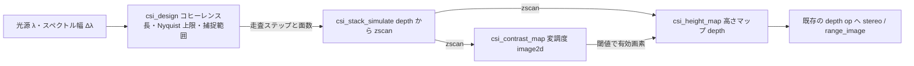
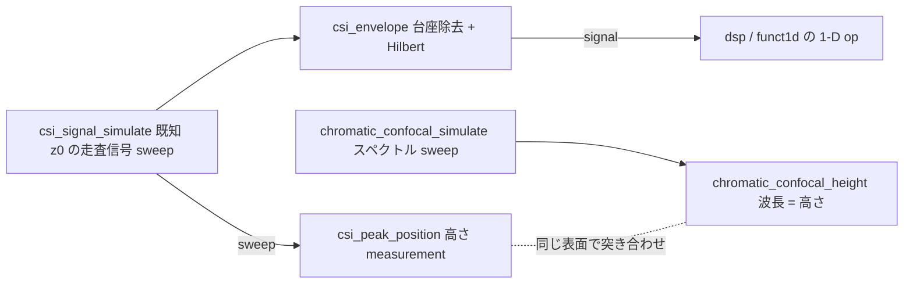

# コヒーレンス走査干渉・クロマティック共焦点 — 使い方ガイド

## この族は何をする道具箱か

**位相ではなく、コヒーレンス包絡線のピークで高さを出す**道具箱です。

高さを光で測る方法は 2 つあります。fullseye には既に片方 — `fringe` の**位相シフト法** — があり、縞の**位相**から高さを読みます。極めて精密ですが、位相は 2π の周期を持つので原理的に不定性を抱えます。この族はもう片方で、対物レンズを縦に振りながら撮った干渉縞の**コントラストが最大になる位置**を高さとします。包絡線には周期が無いので、縞次数を数え違えることも、アンラップすることもありません。**その差が測定に出ていることが、この族を足した理由そのもの**です(次節)。

9 op / 6 カテゴリ(numpy + scipy のみ、台帳は `opsinterferometry.py`、実体は `interferometry.py`):

- **simulate(3)** — `csi_signal_simulate` / `csi_stack_simulate` / `chromatic_confocal_simulate`: 前方モデル、つまり**真値の供給源**。z 走査信号は `a + b·V(z−z₀)·cos(4π(z−z₀)/λ)` の形で、この **4π**(2π ではない)は光が表面まで往復するぶんです。1 縞は波長ではなく **λ/2 の高さ**に対応し、この係数を間違えると全高さがきれいに 2 倍ずれます。`csi_stack_simulate` は `depth` マップから `(Z, H, W)` の走査スタックを作り、`chromatic_confocal_simulate` は既知高さの共焦点戻りスペクトルを作ります。
- **envelope(1)** — `csi_envelope`: 直流台座を抜いてから解析信号(Hilbert)の絶対値を取ります。台座を抜くのは飾りではなく、抜かないと**返るのは台座そのもの**です(実測: 抜いて 1.83e-07、抜かずに 0.500 = 台座の高さちょうど)。
- **locate(1)** — `csi_peak_position`: 包絡線ピークの位置 = 高さ。推定量 4 種(`peak` / `centroid` / `parabolic` / `gaussian`)を持ち、その順位が雑音で逆転します(後述)。
- **surface(2)** — `csi_height_map` / `csi_contrast_map`: 走査スタック全体に対する同じ反転。前者が高さマップ、後者が画素ごとのフリンジ変調度で、これは**有効画素マスク兼反射率マップ**として使います。
- **chromatic(1)** — `chromatic_confocal_height`: 走査しない従兄弟。色収差を意図的に持たせた対物では波長ごとに合焦高さが違うので、ピンホールを通って戻った**波長がそのまま高さ**になります(`z = z_ref + (λ − λ_ref)·分散`)。
- **design(1)** — `csi_design`: 買う前に決まってしまう限界。光源のスペクトル幅からコヒーレンス長・走査軸上の包絡線幅・縞周期・走査ステップの Nyquist 上限・捕捉範囲・スタックの容量を返します。`visiondesign` が横方向にやっていることの**縦方向版**です。

データ種は既存語彙の再利用が基本です: **depth**(高さマップ)、**image2d**(変調度マップ)、**signal**(包絡線 = 1-D の実関数)、**measurement**(単一画素の高さ)、**table**(設計値の dict)。新語は 2 つ、**zscan**(`(Z,H,W)`、走査軸が先頭)と **sweep**(掃引軸に沿った非負 1-D 強度で局在ピークを 1 つ持つもの — 干渉信号とスペクトルの 2 種を同じ語彙に入れています)。どちらを足すかは推測ではなく実測で決めました(後述)。

## 零点との比較 — この族を足す理由が測定に出ている

**同じ合成表面**を位相シフト法(既存 `fringe`、`synthesize_fringes` → `decode_fringe` を `phase_gain = 4π/λ` で干渉計として駆動)とコヒーレンス法の両方に食わせた結果です。λ = 0.60 µm、したがって λ/4 = 0.15 µm、λ/2 = 0.30 µm。

| 真の段差 | 位相シフト法(既存 `fringe`) | コヒーレンス法(この族) |
|---|---|---|
| 0.050 µm | +0.0500(誤差 +0.0000) | +0.0500(誤差 −0.0000) |
| 0.100 µm | +0.1000(誤差 +0.0000) | +0.1000(誤差 +0.0000) |
| 0.150 µm | +0.1500(誤差 −0.0000) | +0.1500(誤差 +0.0000) |
| 0.200 µm | **−0.1000(誤差 −0.3000 = −λ/2 × 1)** | +0.2000(誤差 +0.0000) |
| 0.300 µm | **−0.0000(誤差 −0.3000 = −λ/2 × 1)** | +0.3000(誤差 +0.0000) |
| 0.500 µm | **−0.1000(誤差 −0.6000 = −λ/2 × 2)** | +0.5000(誤差 +0.0000) |
| 1.000 µm | **+0.1000(誤差 −0.9000 = −λ/2 × 3)** | +1.0000(誤差 +0.0000) |

読み方が 3 つあります。

1. **壊れ始めは λ/4 = 0.15 µm ちょうど**です。0.15 µm は厳密に正しく、0.20 µm で破綻します。0.05〜0.40 µm を 0.01 µm 刻みで掃いて境界を実測した結果で、丸めではありません。
2. **誤差は常に λ/2 の整数倍**です。−1 倍、−1 倍、−2 倍、−3 倍。これは縞次数(fringe order)の飛びで、ランダムな誤差ではなく**構造を持った嘘**です。
3. **例外も NaN も警告も出ません**。`decode_fringe` は 0.200 µm の段差に対して −0.1000 µm という有限で、もっともらしく、λ/4 の範囲に収まった数を返します。出力だけを見て間違いに気づく方法はありません。

さらに、この境界が**波長に紐づいている**ことも確かめてあります。λ = 0.8 µm に変えると破綻点も 0.20 µm(= 0.8/4)へ移動しました。定数を 1 つ当てたのではなく、物理の比が出ています。

この 3 点が「なぜ既存の族の隣にもう 1 つ置くのか」の答えです。**「既存版が壊れる」ことを測定に出さないと、新しい族を足す理由が測定に現れません。** 突き合わせは主張ではなくテスト(`tests/test_interferometry.py::TestAgainstPhaseShifting`)として置いてあり、同一の合成表面から両方を駆動しています。

## 既存 op との棲み分け(重複させていないもの)

| やりたいこと | 使う op | 置き場所 |
|---|---|---|
| 位相シフト法・縞投影で高さを出す(N-step、Gray code) | `wrapped_phase` / `unwrap_phase_2d` / `phase_to_height` / `decode_fringe` / `synthesize_fringes` | `fringe`(この族は wrapped phase を一度も計算しません) |
| 2-D 位相アンラップ | `phase_unwrap` / `unwrap_phase_2d` | `complexops` / `fringe`(**アンラップしなくて済むのがこの族の存在理由**なので、ここには置きません) |
| 任意 1-D 信号の包絡線 | `envelope`(登録名は 2-D 版の `xsp_hilbert_env`) | `dsp`(`csi_envelope` は**これをそのまま呼び**、干渉縞に固有の台座除去だけを足しています) |
| 走査信号の帯域通過・スペクトル・リサンプル | `bandpass` / `spectrum` / `resample` ほか | `dsp` / `funct1d`(走査信号は素の 1-D float64 なので直接使えます。ラップし直しません) |
| 到達時刻ヒストグラムから距離を出す(dToF) | `dtof_depth` / `dtof_cube_depth` | `photoncount`(あちらは `(H,W,T)` で**時間軸が最後**、こちらは `(Z,H,W)` で**走査軸が先頭**) |
| ビート信号から距離と速度を同時に出す | `range_doppler_map` ほか | `rangedoppler`(FMCW のコヒーレント測距。同じ「干渉」でも掃引するのは周波数であって位置ではありません) |
| 時系列の微小変位を増幅・計測する | `motion_magnify` / `phase_displacement` | `motionmag`(`(T,H,W)` の先頭軸は**時間**です) |
| 光学設計(焦点距離・被写界深度・回折・MTF) | `thin_lens` / `depth_of_field` / `mtf_diffraction` ほか | `optics` / `visiondesign`(`csi_design` はその軸方向版で、横方向は複製しません) |

**入口は共有できませんが、出口の `depth` は意図的に共有しています。**

- 入口を分ける理由: `fringe` が食う `(N,H,W)` は**位相が既知の等間隔シフト**で、順序そのものが答えです(δₙ = 2πn/N)。`zscan` の `(Z,H,W)` は**位置が既知の等間隔走査**で、間隔 `z_step_um` は Nyquist 判定に使われます。前者に後者を渡せば「241-step 位相シフト」として解釈され、後者に前者を渡せば 4 plane の走査になります。決定的なのは、**段差 0.20 µm で片方が −0.1000 µm、もう片方が +0.2000 µm を返す**ことです。同じ型を名乗る 2 つが同じ物理量について整数倍ずれた答えを返すなら、その型は嘘です。
- 出口を共有する理由: `csi_height_map` が返すのは `(H,W)` の高さマップで、これは `stereo` / `range_image` / `photoncount` が扱う `depth` と**同じ量**です。下流の depth op へそのまま流せることに実利があり、型レベルの嘘もありません。`csi_stack_simulate` が `depth → zscan` の入口になっているので、既存 depth プールが在るだけで新語彙に到達できます。

## fail-closed の入力契約 — なぜその罠を仕掛けたか

全 op が入力を検証してから計算します。以下は 2026-09-01 の敵対監査で**実際に見つかった 5 件のバグ**と、それを塞いだ設計です。探したのは「例外が出る」ではなく「**黙って間違った数字を返す**」ケースです。

### 1. 端で切れた包絡線が 76% 間違った高さを黙って返す(最悪の 1 件)

12 µm の走査(241 plane × 0.05 µm)の中で、表面が 0.500 µm にある場合。包絡線の一部が走査の外に出ているので、Hilbert 変換(有限区間の**大域**変換です)が返す包絡線は本物とは別のものになります。返る値は **0.1189 µm** ―― 有限で、もっともらしく、76% 間違っています。

**厄介なのは「先頭/末尾 plane に張り付いたら拒否する」という素直な検査が発動しないこと**です。実測すると argmax は **plane 2 of 241**、つまり内部にあります。有限区間の解析信号は自分の端点で振幅が抑えられるので、走査の完全に外(−3.0 µm)にある表面ですら argmax は plane 1 に来ます。端検査は**バックストップであって主力ではない**、というのが実測から出た結論です。

そこで `max_edge_envelope`(既定 0.05)を置きました。中央値を基準にした端レベル `(max(env[0], env[−1]) − median) / (max − median)` で、しきい値は表から決めています:

| 端レベル | 表面の位置 | `gaussian` の誤差 |
|---|---|---|
| 0.0000 | 6.00 µm(走査中央) | 3e-14 µm |
| 0.0000 | 4.32 µm | 1.9e-06 µm |
| 0.0107 | 2.77 µm | 7.8e-03 µm |
| 0.1746 | 2.00 µm | 2.7e-02 µm |
| 0.6364 | 0.50 µm | **−0.38 µm(0.1189 を返す)** |

中央値を基準にしたのも実測の結果です。素の `max(ends)/max` は**雑音床を切断と読み違え**ます — 完全に中央に置いた 1% 雑音つき走査で 0.0586 を示し、どんなしきい値も誤爆します。中央値基準なら同じデータで 0.0000、5% 雑音でも 0.0000 です(雑音は端と中央値を同じだけ持ち上げるので相殺します)。

なお**直すのではなく拒否した**のも測定に基づきます。ゼロ詰めと鏡像詰めをどちらも試しましたが、端レベル 0.1746 の行で **−3.3e-02 / −3.7e-02** と、素の **−2.7e-02** より悪化しました。切断は FFT のアーティファクトではなく物理的な情報欠落なので、直しようがありません。

### 2. λ の nm/µm 取り違えが完全に無症状だった

`wavelength_um` は Nyquist 上限にしか使われません。したがって 600 nm を `600.0` と書いても、**返る高さは 0.6 と書いたときと同じ 6.025 µm** です。変わるのは「Nyquist 検査が事実上無効になる」ことだけで、出力には一切現れません。名前に単位を埋め込む規約(`_um` / `_nm`)は必要ですが、この一件は**名前だけでは防げませんでした**。

解いた方法は、**データ自身に波長を聞く**ことです。干渉信号の搬送波は往復のぶん `2/λ` に立つので、DC を抜いた信号の rFFT ピークと突き合わせます(`carrier_tolerance`、既定 2 倍)。実測した比は基準走査で 0.996 で、雑音 1%・雑音 10%・端が切れた包絡線・0.3 µm の短い包絡線でも 0.996 のまま動きません。1000 倍の単位誤りを捕まえるには十分すぎる余裕があります。16 plane 未満の走査は FFT が搬送波を分解できない(9 plane で比 0.667)ので、検査を通すのではなく**スキップ**します。

同じ検査が副産物として、掃引スペクトルを誤って `csi_peak_position` に渡した場合も捕まえます(共焦点ピークの主成分は Nyquist の 0.010、干渉信号は 0.333)。

### 3. Nyquist 割れを「折り返す」のではなく拒否する理由

搬送波の周期は λ/2 なので、走査ステップの上限は **λ/4** です。上限を超えたときに拒否する理由は「原理的に間違うから」ではなく、**間違い方が間欠的だから**です。実測(λ = 0.60 µm、上限 0.15 µm):

- ステップ 0.16 µm → 高さが **0.107 µm** ずれる
- ステップ 0.20 µm → **厳密に正しい**

出力からこの 2 つを区別する方法はありません。運が良かったのか正しかったのか分からない答えは返さない、という判断です。`photoncount.dtof_cube_simulate` が一意測距範囲の外を拒否するのと同じ扱いにしてあります。

### 4. 文字列・object・bool の配列が黙って float に化ける

`float("0.55")` が成功するのでスカラは弾いていましたが、**配列側に同じ穴が空いていました**。`np.ascontiguousarray(["1.0"] * 8, dtype=np.float64)` は成功します。結果、未パースの設定値の列がそのまま包絡線になっていました。object 配列(Decimal でも通ります)と bool 配列(マスクの配線ミス)も同類なので、dtype kind が `U`/`S`/`O`/`V`/`b` のものを拒否します。ただの数値コンテナ(Python の float リスト、uint8 配列)は今までどおり通ります。

同じ検査の並びで、**サイズ上限を float64 昇格の前に効かせて**います。要素数を `shape` から読んでから昇格するので、2²¹ 要素の 0 バイト broadcast view でも確保せずに拒否できます。上限を昇格の後に置くと、拒否した時点で既に確保が済んでいて意味がありません。

### 5. その他 2 件

- **`fill_value=inf`** が無限大だらけの高さマップを返していました。NaN と違って `mean` / `min` / `max` / `percentile` が「数」として通してしまいます。欠測の印は NaN だけ、Inf は拒否です。
- **飽和したスペクトル**が **2.5500 µm** を返していました(真値 3.0000)。ピークの頭が失われて 3 点当てはめが平坦部を食っている状態です。最大値を共有する bin が **3 個以上**なら拒否します(対称なピークが 2 bin にまたがって並ぶのは正当なので、2 は許します)。

この他に、退化した入力 — 定数信号、包絡線を持たない正弦波、ステップ 0、σ = 0、コントラスト 0、走査範囲の外にある表面、NaN/Inf、masked array、complex ―― はすべて名前つきの `ValueError` です。**無言の NaN を返す経路はありません**(`on_invalid="fill"` は既定 `raise` に対する明示の opt-in です)。

## 推定量の選び方 — 順位が雑音で逆転する

`csi_peak_position` / `csi_height_map` の `mode` は 4 種あります。基準走査(λ 0.60 µm、包絡線 FWHM 2.83 µm、ステップ 0.05 µm、表面を走査中央に、サブステップ位相 4 通り)と、同じ条件に 1% の加法雑音を入れた 200 試行:

| 推定量 | 雑音なし max\|誤差\| | 雑音 1% の RMS |
|---|---|---|
| `peak` | 2.500e-02 µm(= ステップ/2 ちょうど) | 0.1395 µm |
| `centroid` | 4.55e-07 µm | **0.0219 µm(最良)** |
| `parabolic` | 4.21e-06 µm | 0.1403 µm |
| `gaussian` | **1.43e-07 µm(最良)** | 0.1403 µm |

**順位が逆転します。** 雑音が無ければ `gaussian` が `parabolic` の 29 倍精密です(標本化されたガウシアンの対数は厳密に放物線なので、3 点の対数当てはめは代数的に厳密 ―― 解析包絡線を渡すと 2.9e-14 まで出ます。上の 1.43e-07 という床は当てはめではなく **Hilbert 包絡線自身の誤差** 1.83e-07 です)。雑音が入ると `centroid` が 6.4 倍良くなります。局所当てはめは、雑音が動かす argmax の周りの 3 点しか見ないのに対し、重心は 241 plane 全部を平均するからです。

既定は `gaussian` です — データが良いときに厳密である推定量だから、というだけの理由で、**最良の推定量は 1 つに決まりません**。`centroid` にも固有の弱点があり、走査窓の中で表面がどこにあるかで偏ります: 12 µm 走査で表面が 2 µm にあると **+0.189 µm**(雑音なし)、2% の雑音床があると **+0.873 µm**。10 µm 側では符号が反転して −0.189 / −0.851 です。局所推定量にはこの偏りがありません。

### そして、精度は推定量でなく走査設計で決まる

上の表より大事な数字がこれです。**同じ `gaussian`** で、同じコードで、同じ表面を測って:

| 走査の置き方 | RMS 誤差 |
|---|---|
| 表面を走査中央に置く | **3e-14 µm** |
| 傾斜面 5.0–7.0 µm(0–12 µm 走査の内側) | 2.08e-06 µm |
| 同じ面を 2.0–10.0 µm に広げる | **7.06e-03 µm(3403 倍悪化)** |

差はすべて走査端での包絡線の切断です。推定量を選び直しても取り返せません(同じ条件で `centroid` は 3.81e-05 → 5.98e-02 と 4 桁落ちます)。そして前述のとおり**ゼロ詰めも鏡像詰めも悪化させました**(−3.3e-02 / −3.7e-02 対 −2.7e-02)。

実務上の結論は 1 行です: **`csi_design` の `capture_range_um` のぶんだけ、表面の上下に走査の余白を取ること。** 変調度が低い画素で局所当てはめがどれだけ苦しくなるかも測ってあります — 50 倍の反射率段差と 1% 雑音で、`gaussian` の誤差は明るい側 0.146 µm に対し暗い側 **3.03 µm**(20 倍)、暗い側の 30% の画素は拒否されます。`centroid` は同条件で 0.022 → 0.157 µm(7 倍)と、こちらでも粘ります。2 つの母集団を分けるのが `csi_contrast_map` で、実測 0.035 ± 0.004 と 0.412 ± 0.007 にきれいに分かれます。

## 代表的なパイプライン

段差のある表面を 1 台の干渉顕微鏡で測りきる筋(検証済み `examples/coherence_scanning.py` そのもの)。設計 → 前方モデル → 包絡線 → 高さ、とデータ種が `table → depth → zscan → depth` で繋がります。



1 画素だけを詳しく見る筋と、走査しないクロマティック共焦点の筋。前者の出口 `csi_envelope` は既存の `signal` 語彙へ**戻る**ので、`dsp` / `funct1d` の 1-D op がそのまま続けられます。



## 使い方(最小の 1 本)

```python
import interferometry as I

# 1) 買う前に決まる限界
d = I.csi_design(wavelength_um=0.6, bandwidth_um=0.10, z_range_um=12.0)
print(d["max_z_step_um"], d["envelope_fwhm_um"], d["capture_range_um"])

# 2) 既知の傾斜面から走査スタックを合成し、高さを戻す
import numpy as np
height = 5.0 + 2.0 * np.mgrid[0:32, 0:32][1] / 31.0
stack = I.csi_stack_simulate(height, 0.0, 0.05, 241, 0.6, envelope_fwhm_um=2.8258)
h = I.csi_height_map(stack, z_step_um=0.05, wavelength_um=0.6, mode="gaussian")
print(float(np.sqrt(np.mean((h - height) ** 2))))     # 2.08e-06 um

# 3) 走査せず、スペクトルのピーク波長だけで高さを出す
sp = I.chromatic_confocal_simulate(4.25, 500.0, 0.5, 401, 0.20, 600.0)
print(I.chromatic_confocal_height(sp, 500.0, 0.5, 0.20, 600.0))   # 4.25
```

## アルゴリズムの正典(著者・年)

- **コヒーレンス走査の信号モデルと包絡線/位相の二重性**: P. de Groot, *Principles of interference microscopy for the measurement of surface topography*, Adv. Opt. Photon. 7(1):1-65, 2015。
- **粗面に対する包絡線検出**(縞次数の不定性への正攻法): P. Caber, *Interferometric profiler for rough surfaces*, Appl. Opt. 32(19):3438-3441, 1993。
- **包絡線検出アルゴリズム**: K. G. Larkin, *Efficient nonlinear algorithm for envelope detection in white light interferometry*, JOSA A 13(4):832-843, 1996(本族の Hilbert 経路はその一般形)。
- **ガウス光源のコヒーレンス長**: Born & Wolf, *Principles of Optics*, 7th ed., §7.5.8。`l_c = (4 ln2/π)·λ²/Δλ` は**光路差(OPD)基準**で、往復により OPD = 2z なので走査軸上の包絡線幅はその半分です。この係数 2 はガウス光源スペクトルの数値フーリエ変換と 3 条件で 6 桁一致することを確かめてあります(`csi_design` が両方を別の名前で返すのは、1 つの名前にまとめると全高さが 2 倍ずれるからです)。
- **波長 → 高さの写像**: H. J. Tiziani & H.-M. Uhde, *Three-dimensional image sensing by chromatic confocal microscopy*, Appl. Opt. 33(10):1838-1843, 1994。
- **用語**: ISO 25178-604(コヒーレンス走査干渉法)、ISO 25178-602(クロマティック共焦点プローブ)。

## この族でできないこと

- **`dispersion_um_per_nm` の nm/µm 取り違えは検出できません。** 分散は対物レンズの性質で、スペクトルの中にそれと矛盾する情報が存在しません。µm 当たりで書くと **3000.0 µm**(真値 3.0 µm)が返り、**1000 倍間違った高さを止める手段がありません**。λ 側の取り違えは干渉信号が自分の搬送波を持っているので解けましたが(前述)、こちらは解けません。名前に単位を埋め込むことと、較正値を人が確認することだけが防御です。
- **1 画素につき 1 面しか返しません。** 包絡線ピークは「あるピーク」であって、2 つの反射面を横切った走査は**どちらでもない 1 つの数**を返します — 5.0 µm と 6.5 µm の 2 面で **5.75 µm**。クロマティック側も同じで、−5.0 / +5.0 µm の 2 ピークから片方(−5.0)を選び、2 つあったことを報告できません。透明膜や多層構造がまさにこの状況で、検出する手段はありません。
- **`centroid` は走査窓の端で偏ります** ―― 12 µm 走査、表面 2 µm で +0.189 µm(雑音なし)/ +0.873 µm(2% 雑音床)。表面を走査中央に置くか、局所推定量を使ってください。
- **低反射率の画素で局所当てはめの散らばりが 20 倍になります**(50 倍の反射率段差 + 1% 雑音で 0.146 → 3.03 µm)。偏りはほとんど動かず、増えるのは散らばりのほうです。`csi_contrast_map` で母集団を分けてから判断してください。
- **分散補償も位相ギャップ解決もありません。** 実機のコヒーレンス走査は、包絡線(不定性なし・粗い)と縞位相(不定性あり・細かい)を組み合わせて両方を取ります。その合成には較正済みの位相–包絡線オフセットが要るので実装していません。ここに在るのは包絡線側だけで、それは `fringe` が持っていない側です。

---

© 2026 Kazufumi Furuse — Fullseye operator documentation. Licensed under Apache-2.0.
