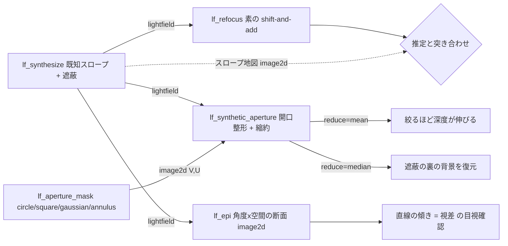

# ライトフィールド(plenoptic 撮像・リフォーカス・深度) — 使い方ガイド

## この族は何をする道具箱か

**マイクロレンズアレイ(MLA)を撮像素子の前に置くと何が計算できるようになるか**、の族です。各マイクロレンズが主レンズの射出瞳を自分の画素ブロックへ結像するので、1 回の露光が「どこに何 lx 届いたか」だけでなく「**どの方向から**届いたか」まで記録します。それが 4-D のライトフィールド `L(v, u, y, x)` で、画素を並べ替えるだけで少しずつ視点のずれた画像のグリッドが出てきます。そこから、**単一センサ・単一ショット**で: 2D 画像 / 後から合焦し直せる焦点スタック / 絞りを変えられる(そして遮蔽物を**透かして**撮れる)合成開口 / 密な深度マップ、が全部出ます。single-shot depth はマシンビジョンで活発な領域ですが、その基礎になる演算が fullseye には 1 つもありませんでした — `light_field` / `plenoptic` / `refocus` / `sub_aperture` / `microlens` / `epi` は全 op 名でヒット 0(2026-09-01 実測)。17 op / 5 カテゴリ(numpy + scipy のみ、台帳は `opslightfield.py`、実体は `lightfield.py`):

- **synthesis(1)** — `lf_synthesize`: **既知スロープ**の層でライトフィールドを合成する(遮蔽合成も可)。この族の全 op を「金画像」ではなく**閉形式の答え**と突き合わせるための土台で、返りは `(光場, スロープ地図)`。
- **decode(3)** — `lf_from_mla` / `lf_to_mla` / `lf_stats`: MLA 生画像 ⇄ 4-D 光場の並べ替え(補間なし・データを一切作らない純粋な再ソート。往復は**ビット一致**)と、形状・角度中心・「この配列で測れる最大スロープ」の申告。
- **views(4)** — `lf_subaperture` / `lf_center_view` / `lf_views` / `lf_epi`: 1 視点、中心視点(plenoptic カメラが「ついでに」出す普通の 2D 画像)、全視点を素の 2-D 画像 list に潰す橋、そして**直線の傾きが視差そのもの**であるエピポーラ平面画像(EPI)。
- **refocus(4)** — `lf_refocus` / `lf_focal_stack` / `lf_aperture_mask` / `lf_synthetic_aperture`: shift-and-add による任意面へのリフォーカス、焦点スタック、開口重み(circle / square / gaussian / annulus)、開口整形 + `mean`/`median`/`max`/`min` 縮約。**median が遮蔽越しの縮約**です。
- **depth(5)** — `lf_depth_from_focus` / `lf_epi_slope` / `lf_disparity_to_depth` / `lf_all_in_focus` / `lf_plenoptic_design`: 焦点掃引の鮮鋭度ピーク(無バイアス・掃引の解像度が上限)、EPI 構造テンソルの最小二乗スロープ(1 パスで密・ただし `|s| > 1` で過小評価)、`Z = f_px·b/|s|` の metric 換算、画素ごとに自分の面で合焦する全焦点合成、そしてカメラ自体の設計表。

データ種は既存語彙の再利用が基本です: **image2d**(サブアパーチャ画像・中心視点・EPI・リフォーカス像・開口マスク・**スロープ地図**)、**images**(焦点スタック・視点リスト = 既存の多画像 op へ無変換で流れる)、**depth**(`lf_disparity_to_depth` の返りだけ)、**table**(`lf_stats` / `lf_plenoptic_design` の dict)。**スロープ地図を `depth` と宣言していないのは意図的**で、中身は px/視点であって距離ではないため、`depth` を名乗ると下流の距離 op に単位違いを渡せてしまいます。距離を名乗るのは metric 換算した後だけです。

新語は 1 つだけ、**lightfield**(4-D の `(V, U, H, W)` 実配列)。角度 2 軸 + 空間 2 軸で、**角度がグリッドであること**が全 op の前提です(u と v の両方向で視差を取る / 開口マスクが `(V, U)` の 2-D / EPI が角度 1 軸と空間 1 軸の断面)。`images`(2-D の list)へ潰すと「どの視点か」が消えて refocus も EPI も定義できなくなり(`lf_views` がまさにその潰す操作)、`voxel` は 3-D、`pointmap` は `(H, W, 3)` 固定なので、4-D を表す既存語彙が台帳に 1 つも無く新設しました。

### 規約(ここを間違えると「もっともらしく間違った絵」が出ます)

- **並び** は `L[v, u, y, x]`。角度が先、空間が後なので `L[v, u]` は素の 2-D 画像になり、既存の画像 op がリシェイプ無しで乗ります。
- **角度中心** は `u_c = (U-1)/2`、`v_c = (V-1)/2`。偶数軸では**中心視点は実在しません** — `lf_center_view` は黙って隣を選ばず、`average`(中心を挟む 2 or 4 視点の平均)か `nearest`(半ステップずれることを承知で 1 視点)を明示させます。
- **スロープ** `s = dx/du = dy/dv` = 角度インデックス 1 ステップあたりの像の変位[px]。点は `x = x_c + s·(u - u_c)` に居ます。したがってリフォーカスは視点 `(v, u)` を `(-s·(v-v_c), -s·(u-u_c))` だけずらしてから平均する — **この符号が全部**で、逆にすると `-s` で鋭くなる完璧にもっともらしい絵が出ます。`s = 0` が既に合焦している面です。
- **符号の意味は decode 依存**なので `lf_disparity_to_depth` は `|s|` からしか距離を作りません(角度軸の向きは本モジュールには分からないため**推測しない**)。

## 既存 op との棲み分け(重複させていないもの)

| やりたいこと | 使う op | 置き場所 |
|---|---|---|
| レンズ・絞り・被写界深度の算術(薄レンズ結像、許容錯乱円ベースの深度) | `thin_lens` / `depth_of_field` | `optics`。**再実装せず呼んでいます** — `lf_plenoptic_design` は `depth_of_field` を**2 回**呼び(錯乱円 = 画素ピッチ / MLA ピッチ)、その比がリフォーカスゲインです |
| **2 眼**の視差・SGM・LR 整合 | `disparity_map` / `disparity_census` / `disparity_sgm` / `depth_from_disparity` / `lr_consistency` | `stereo`。ライトフィールドは「2 台のカメラ」ではなく**角度グリッド全体**を同時に使う(それが遮蔽ロバスト性と subpixel 視差の出所)。2 視点しか無いなら `stereo` の方が適任 |
| **実カメラ**を物理的に N 回合焦し直して融合する | `focus_stack` の一式 | `focus_stack`。`lf_focal_stack` は同じものを**単一露光から計算で**作り、返りが素の 2-D 画像 list なので `focus_stack` の融合機構がそのまま乗ります |
| 深度マップ → 点群 → 3-D フィット・位置合わせ | `depth_to_points` / ICP / RANSAC 一式 | `match3d` / `pointcloud` / `ransac_fit`。この族は metric depth map で止めます |
| 汎用の鮮鋭度・Laplacian・局所分散フィルタ | `ops` / `filters_freq` の各 op | `ops` / `filters_freq`。`lf_depth_from_focus` の焦点尺度は**意図的に private ヘルパ**にしてあり、新しい公開 sharpness op は増やしていません |
| FFT・複素画像・位相アンラップ | `cx_fft` 系 / `phase_unwrap` | `complexops` |

## ファミリ共通の入力契約(fail-closed)

全 op が入力を検証してから計算します。以下は 2026-09-01 の敵対監査で**実際に見つかったバグ**か、それを塞ぐために書いた罠です。

- **無言の Inf を 1 件潰した(実バグ)** — `lf_disparity_to_depth` は視差ゼロ(無限遠)の極を `far_depth` で明示させる設計にしていましたが、その先の `focal_px · baseline / |s|` **自体が float64 で溢れる**経路が残っていました。最小再現は `lf_disparity_to_depth(np.full((3,3), 1e-300), 1e300, 1e300, min_slope=1e-300)` で、`+inf` の配列が黙って返ってきます。返り値の有限性を検査して `ValueError` にしました。「単位が何桁もずれている」と「答えが無限大」は別の主張だからです。
- **numpy の生エラー漏れを 1 件潰した(実バグ)** — `lf_epi_slope` は「1 視点しか無ければ視差は無い」を `U >= 2` で見ていましたが、**空間側の要件を見ていませんでした**。制約は `E_u + s·E_x = 0` なので、1 列しかない画像(`W == 1`)には `E_x` が存在しません。最小再現 `lf_epi_slope(np.zeros((3,3,8,1)))` が numpy の `Shape of array too small to calculate a numerical gradient` をそのまま漏らしていました。方向ごとの門(`use_h = U>=2 and W>=2` / `use_v = V>=2 and H>=2`)に直したので、`W == 1` でも縦方向が使えれば動きます — 一律拒否ではありません。
- **サイズ上限の穴を 1 件潰した(実バグ)** — `lf_from_mla` の入力検証(2-D・有限)には要素数上限が無く、復号後の空間サイズが `MAX_SPATIAL` を**一度も検査していませんでした**。最小再現 `lf_from_mla(np.zeros((10000,12)), (2,2))` が 5000 px 側を通します。復号サイズの明示チェックを追加しました。
- **到達不能なガードを到達可能に直した** — `lf_synthesize` には「平滑化しすぎてテクスチャが定数になったら拒否」というガードを `1e-12` で置いていましたが、実測すると `texture_sigma = 400` を 8x8 に掛けてもレンジは 1e-6 台までしか落ちず(乱数系列によって 6.2e-7〜8.5e-7)、**一度も発火しない死んだコード**でした。閾値を `MIN_TEXTURE_RANGE = 1e-6` に直し、意味も「定数だから」ではなく「**float の塵を [0,1] に引き伸ばすと、視差の無いものが視差のあるテクスチャに化ける**から」に書き換えてあります。
- **オフバイワンは黙って切らない** — MLA ピッチで割り切れない生画像は既定で `ValueError`。端の半端なマイクロレンズ列を黙って捨てると**それ以降のマイクロレンズ中心が全部ずれ**、「見た目は正しく中身は間違った」光場になります。切りたいなら `crop=True` で明示的に同意します。`offset` も同じ理由で整数で明示。
- **文字列・bool・complex・masked array・NaN/Inf は全入力で `ValueError`** — `float("1.5")` が成功してしまうので、未パースの設定値がスロープとして通り抜ける経路を名指しで塞いでいます。
- **0 除算とその親戚を名指しで拒否**: 不透明な開口(全 0 のマスク → 加重平均が 0/0)、負の透過率、テクスチャの無い画素での構造テンソルの 0 除算(`min_energy` 未満は slope 0 + `energy` を返して**閾値は呼び手が切る**)、視差ゼロでの metric 換算。
- **非有限を返す op は 1 つも無い** — `optics` が `depth_of_field` の `far_mm = inf` を契約として返すのと対照的に、この族は無限遠を**値ではなく分岐**(`far_depth` の明示 or `ValueError`)で扱います。
- **サイズ上限**: `MAX_LF_ELEMENTS`(2²⁴ = 1677 万要素 = float64 で 134 MB)/ `MAX_ANGULAR`(64)/ `MAX_SPATIAL`(4096)/ `MAX_STACK_SLICES`(256)/ `MAX_STACK_ELEMENTS`(2²⁴)/ `MAX_LAYERS`(64)/ `MAX_ABS_SLOPE`(1024)。`V·U·H·W` は**それぞれ小さく見える 4 つの数の積**で、`(64, 64, 512, 512)` は何気なく読めて 10.7 億要素 = **8.6 GB** です。

この契約は連鎖ファザーでも確認済みで、1200 連鎖 × 長さ 6(seed 7001)で **lightfield 族 17/17 が到達**し、走行全体の 364 件の発見は**すべて `CONTRACT`**(= docstring に書いた `ValueError` 契約どおりの拒否)、クラッシュ・型不整合はゼロでした。

## 代表的なパイプライン(op の繋がり)

センサ生データから深度まで通す主筋(検証済み `examples/lightfield_depth.py` そのもの)。データ種が `image2d → lightfield → images/image2d → depth` で繋がります。

```mermaid
flowchart LR
    A[画素ピッチ・MLA ピッチ・f 値] --> B[lf_plenoptic_design 角度/空間分解能・基線]
    B -.optics.thin_lens / depth_of_field を呼ぶ.-> B
    C[MLA 生画像 image2d] --> D[lf_from_mla 並べ替え]
    D -->|lightfield| E[lf_stats 形状・測れる最大スロープ]
    D --> F[lf_center_view 2D 画像 image2d]
    D --> G[lf_focal_stack スロープ掃引 images]
    G --> H[lf_depth_from_focus 鮮鋭度ピーク image2d]
    D --> I[lf_epi_slope EPI 傾き 1 パス image2d]
    H --> J[lf_disparity_to_depth Z=f_px*b/|s| depth]
    I --> J
    H --> K[lf_all_in_focus 全焦点 image2d]
    G --> K
    B -->|focal_px・baseline| J
```

合成開口の筋。開口マスクで被写界深度を制御し、縮約を `median` に替えると**遮蔽物の裏**が出ます。`lf_synthesize` は同じ光場を既知の答えつきで作れるので、上の筋の検算に使えます。



## 使い方(最小の 1 本)

```python
import numpy as np
import lightfield as L

# 0) カメラを設計する(optics を再実装せず呼ぶ)
d = L.lf_plenoptic_design(focal_mm=50.0, f_number=8.0, object_mm=300.0,
                          pixel_um=3.45, mla_pitch_um=27.6,
                          sensor_px=(2048, 2448))
print(d["angular_u"], d["refocus_gain"])        # 8, 8.0038 = 角度分解能

# 1) 既知スロープ 2.0 px/視点 の場を合成 → MLA 生画像 → 復号(往復はビット一致)
lf, truth = L.lf_synthesize((2.0,), angular=(9, 9), shape=(64, 64),
                            occlusion=False, texture_sigma=3.0,
                            edge="wrap", seed=0)
assert np.array_equal(L.lf_from_mla(L.lf_to_mla(lf), (9, 9)), lf)

# 2) 掃引して鮮鋭度ピークから深度を出す(argmax は真値ちょうど)
sweep = np.round(np.linspace(-4.0, 4.0, 81), 6)
slope, conf = L.lf_depth_from_focus(lf, sweep, edge="wrap", subpixel=False)
print(float(np.median(slope)))                  # 2.0

# 3) metric 深度へ。視差ゼロ(無限遠)は無言の inf ではなく ValueError
f_px = 50.0 / 27.6e-3                           # サブアパーチャ画素 = MLA ピッチ
z = L.lf_disparity_to_depth(slope, focal_px=f_px, baseline=d["baseline_mm"])
print(float(np.median(z)))                      # 808.747 mm = f_px*b/2.0

# 4) 中心視点(= 普通の 2D 画像)と、その面に合焦した合成開口像
plain = L.lf_center_view(lf)
sharp = L.lf_refocus(lf, 2.0, edge="wrap")      # plain と 2.0e-15 以内で一致
```

## 実測値(このガイドの主張の根拠)

すべて 2026-09-01 に本モジュールで測った値です。再現は `tests/test_lightfield.py`(125 件)と `examples/lightfield_depth.py`(通しで PASS / 終了コード 0)。

| 主張 | 実測 |
|---|---|
| MLA 生画像 ⇄ 光場の往復 | `(1,1)` / `(2,3)` / `(5,5)` / `(3,7)` / `(9,9)` のすべてで **`np.array_equal` が True**(ビット一致) |
| 整数スロープ + `edge="wrap"` のリフォーカスは元テクスチャに戻る | 5x5(25 視点)で最大差 **5.6e-16**、9x9(81 視点)で **2.0e-15**(視点数ぶんの加算誤差) |
| EPI の端視点間ラグ = `s·(U-1)` | 9x9 で s=1.0 → 実測 8 px / 理論 8 px、s=2.0 → **実測 16 px / 理論 16 px** |
| `lf_depth_from_focus` の argmax は真値ちょうど | 121 点掃引 × (真値 0.0 / +0.5 / +1.0 / +1.5 / +2.0 / -1.0)×(テクスチャ σ = 1.5 / 3.0 / 5.0)= **18/18 で厳密一致**。サブピクセル補正もこの 18 件を動かさない |
| `lf_epi_slope` は速いが `\|s\| > 1` で過小評価 | σ=1.5: `+1.0→+1.0004` / `+0.5→+0.5285` / `+1.5→+1.3018` / `+2.0→+1.4614`(**26.9% 過小**)<br>σ=3.0: `+1.0→+1.0001` / `+2.0→+1.8716`<br>σ=5.0: `+1.0→+1.0003` / `+2.0→+1.9482`(2.6% 過小)。`s=0` は全 σ で厳密 0、符号は常に正しい |
| median 合成開口は遮蔽の裏を**厳密に**復元する | 9x9、遮蔽が中心視点の 25% を覆い、隠れ画素で塞がる視点が最大 46%(過半未満)のとき、隠れた真背景との RMS は **median 0.0000 / mean 0.1590 / 中心視点 0.5607** |
| ただし過半を超えると保証は消える | 被覆 35%(最大 60% の視点が塞がる)で **median 0.1329 / mean 0.2128**。median が mean より良いという話ではなく、**多数決が覆るかどうか**の話です |
| リフォーカスゲイン = 角度分解能(教科書結果) | f=50 mm, f/8, 物体 300 mm で MLA 20.7 µm → 角度 6・ゲイン **6.0016**、27.6 µm → 8・**8.0038**、34.5 µm → 10・**10.0075** |
| 角度分解能は空間分解能で買う | 2048x2448 センサが、角度 6 で 341x408 / 角度 8 で 256x306 / 角度 10 で 204x244 に。被写界深度は 1.656 mm → それぞれ 9.939 / 13.254 / 16.573 mm |
| 絞ると非合焦面のボケが減る | 合焦面から外れた面での残存コントラスト(分散)が 全開 **0.0049** → 半径 1 に絞って **0.0264** |
| 全焦点合成はどの単一スライスより鋭い | 2 層シーン(手前が 40% を遮蔽)で 勾配エネルギー **0.00574** 対 最良スライス **0.00490**(**1.17 倍**、最悪スライスは 0.00031) |
| metric 換算は閉形式 | f_px=1811.6 px, b=0.8929 mm, s=2.0 → **808.747 mm**(`f_px·b/\|s\|` と機械精度で一致) |
| 連鎖ファザーで全 op が到達可能 | 1200 連鎖 × 長さ 6(seed 7001)で **lightfield 17/17 到達**、走行全体の発見 364 件は**すべて `CONTRACT`** |

## アルゴリズムの正典(著者・年)

- **plenoptic カメラ / 単一レンズ視差**: Adelson & Wang, *Single Lens Stereo with a Plenoptic Camera*, IEEE TPAMI 14(2), 1992。
- **4-D ライトフィールドのパラメータ化と視点合成**: Levoy & Hanrahan, *Light Field Rendering*, SIGGRAPH 1996。
- **EPI(直線の傾き = 視差)**: Bolles, Baker & Marimont, *Epipolar-Plane Image Analysis*, IJCV 1(1), 1987。`lf_epi` / `lf_epi_slope` の土台。
- **shift-and-add リフォーカスと「角度分解能ぶん深度が伸びる」関係**: Ng et al., *Light Field Photography with a Hand-Held Plenoptic Camera*, Stanford Tech Report CTSR 2005-02。`lf_plenoptic_design` の `refocus_gain` はこれを数値で再現したもの。
- **EPI の構造テンソルによる密なスロープ推定**: Wanner & Goldluecke, *Globally Consistent Depth Labeling of 4D Light Fields*, CVPR 2012。本族は総最小二乗ではなく**通常の最小二乗**を使っており、そのぶんのバイアスは上の表で開示しています。
- **遮蔽越しの合成開口(median その他のロバスト縮約)**: Vaish et al., *Reconstructing Occluded Surfaces Using Synthetic Apertures*, CVPR 2006。
- **焦点からの深度(鮮鋭度ピーク)**: Nayar & Nakagawa, *Shape from Focus*, IEEE TPAMI 16(8), 1994(`measure="laplacian"` は同論文の Sum-Modified-Laplacian)。

## 正直な限界

- **`lf_epi_slope` は偏る**。通常の最小二乗 + 有限差分なので、EPI の直線が 1 視点あたり「テクスチャの相関長」程度より速く動くと過小評価します(上表のとおり σ=1.5 で s=2.0 が 26.9% 低い)。**速くて密な初期値**であって最終解ではありません。精度が要るなら `lf_depth_from_focus`(無バイアス)と併用してください — ただしこちらは**掃引に入れた面しか見えません**。
- **サブピクセルの MLA 較正はしていない**。`lf_from_mla` は**整数**画素格子と整数 `offset` で並べ替えます。実機の復号は白画像からマイクロレンズ中心をサブピクセルでフィットするところから始まります(MLA ピッチは画素ピッチの整数倍にならず、完全には整列しないため)。ここには**既に矯正済み**の生画像を渡してください。
- **口径食なし・マイクロレンズ回折なし・六角配列なし**。復号は矩形・非重複・一様照度の格子を仮定します。実センサは瞳の縁へ向かって強い口径食が出ますし(**まさにそのために `lf_aperture_mask` がある**)、公開されている設計には六角配列も多いです。
- **リフォーカスは shift-and-add = Lambertian・正対平面モデル**。鏡面ハイライトは視点とともに動くので**融合しません**。傾いた面は区分的にしか合いません。`reduce="median"` が非 Lambertian 現実への唯一の譲歩で、そのぶん解像度を払います。
- **遮蔽越しは多数決**であって魔法ではありません。隠れ画素で塞がる視点が過半を超えた時点で保証は消えます(上表の 25% と 35% の対比がそれ)。開口を広げるか、遮蔽物の視差を大きくするか、被覆を下げるか — どれもハードウェア側の話です。
- **角度分解能は空間分解能で買う**。`U·V` 倍の画素を角度に使うので、画像は `U·V` 分の 1 になります。`lf_plenoptic_design` はその取引を隠さず表に出します。
- **双線形リサンプリングはボケる**。整数スロープは厳密ですが(往復 5.6e-16)、非整数のずらしは毎回コントラストを落とします。`lf_all_in_focus` のように何枚も重ねると効いてくるので、そこが問題なら `interp="cubic"` を渡してください。
- **`lf_synthesize` の遮蔽ありモードでは真値地図が「前面の層」しか言わない**。透過重ね合わせ(`occlusion=False`)では他の層も同じ画素に居るので、深度推定器が真値地図と食い違うのは**正しい振る舞い**です。厳密な検算をしたいなら 1 層で使ってください。

---

© 2026 Kazufumi Furuse — Fullseye operator documentation. Licensed under Apache-2.0.
