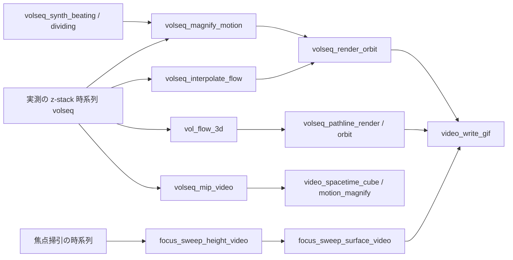

# 生きている組織の 3D+t を古典手法だけで「短い 3D 動画像」にする — 使い方ガイド

## この族は何をする道具箱か

動画生成 AI は「もっともらしい動き」を発明します。この族は内容を発明しない代わりに、**実在する動きを見える形にする** 4 つの道を numpy + scipy だけで用意します。どれも説明可能で、真値つきの合成系列(この族が自分で作る)で数値検証できます。

- **増幅** — 目に見えない微小な動き(半径 0.1 voxel の拍動)を α 倍にする(Eulerian の線形拡大、Wu et al. SIGGRAPH 2012 の 3 次元版)。
- **流れ** — 体積と体積の間の密な変位場(3 次元 Lucas–Kanade)。粒子を流して**軌跡を時刻の色**で 1 枚の立体にする。
- **補間** — 短い実測(ライトシートの z-stack は時間方向が粗い)の間を、前後の流れで合成した中間フレームで埋める。遮蔽は往復の一致で検出。
- **高さ場** — 焦点掃引の時系列から、合焦度の最大(放物線で副ボクセル)で高さ場の動画を起こす。

14 op / 5 カテゴリ(台帳は `opslive4d.py`、実体は `live4d.py`)。型は 1 語だけ足します: `volseq` = 体積の時系列 `(T, Z, Y, X)`。

- **synth(2)** — `volseq_synth_beating`(既知の半径則で拍動する殻)/ `volseq_synth_dividing`(既知の速さで分かれる塊)。真値つきの入力、テストと PoC とファザーの種。
- **series(2)** — `volseq_mip_video`(最大値投影で `video` に)/ `volseq_cut_video`(1 断面で `video` に)。ここから先は videocube(空間 × 時間の立方体)や `motion_magnify` にそのまま流れる。
- **flow(4)** — `vol_flow_3d`(2 体積の変位場 `flow_dense`、torch 版 `scene_flow_lk` の numpy 対応物)/ `volseq_speed`(隣り合うフレーム間の速さ)/ `volseq_pathline_render`(軌跡の立体 `rgb`)/ `volseq_pathline_orbit`(それを回す `rgbvideo`)。
- **time(3)** — `video_interpolate_flow` / `volseq_interpolate_flow`(流れで中間フレーム)/ `volseq_magnify_motion`(帯域内の動きを α 倍)。
- **render(3)** — `volseq_render_orbit`(時間を進めながら回す `rgbvideo`、`mode="speed"` で速さの色)/ `focus_sweep_height_video`(高さ場 `video`)/ `focus_sweep_surface_video`(陰影つきの高さ場 `rgbvideo`)。

回した動画は videocube の `video_write_gif` でそのまま GIF になります。

## 連鎖



## 最短の使い方

```python
import fullseye as fs
L = fs.ledger

# 真値つきの合成: 半径が 0.1 voxel だけ拍動する殻(目には見えない)
shell = L.volseq_synth_beating((28, 40, 40), n_frames=24, period=8.0, amplitude=0.1, radius=8.4)

# 帯域 [0.06, 0.19] Hz(fps = 1 なら周期 8 の基本波を含み倍音を含まない)の動きを 8 倍に
big = L.volseq_magnify_motion(shell, alpha=8.0, f_lo=0.5 / 8, f_hi=1.5 / 8, fps=1.0, sigma=0.0)

# 時間を進めながら回して GIF に(1 周で 2 拍)
frames = L.volseq_render_orbit(big, n_frames=36, loops=2, size=256)
L.video_write_gif(frames, "beating.gif", fps=8.0)

# 分かれる塊の流れと軌跡
div = L.volseq_synth_dividing((28, 40, 40), n_frames=24, split_frame=8, speed=0.75)
d = L.vol_flow_3d(div[20], div[21])          # (3, Z, Y, X)、成分 dz, dy, dx [voxel]
img = L.volseq_pathline_render(div, n_seeds=400, size=256)   # 軌跡は時刻の色(青 = 始め → 赤 = 終わり)

# 粗い時系列を 2 倍に
smooth = L.volseq_interpolate_flow(div[::2], factor=2)
```

## 読み方と限界(正直に)

- **増幅の倍率が成り立つのは小さな動きだけ**: 目安は `alpha · δ < λ / 8`(λ は空間の波長)。超えると像が壊れます(増幅でなく歪み)。雑音も同じ倍率で増幅されます(SNR は良くならない)。`sigma` > 0 で空間を平滑化すると、その尺度より細かい構造の倍率は α より小さくなります(既定 0.5)。
- **流れはテクスチャのある場所でだけ信じる**: 平坦部の流れは決まらず(開口問題)、ピラミッドの粗い段の推定がそのまま残ります。速さを読むときは勾配で重みづける(PoC はそうしている)。2 つの塊が重なっている間の流れは曖昧(実測 +18 %)。
- **補間が線形ブレンドに勝つのは、1 コマの動きが対象の大きさ(σ)を越える領域だけ**: 実測で約 0.8 σ が分かれ目。小さな動きではブレンドで足り、warp の再標本化が少し損をします。新しく現れる物や追えない大変位は補間できず二重像になります —— 補間は実測の間を埋める道具で、無いものを発明する道具ではありません。
- **高さ場はテクスチャの無い画素で決まらない**(合焦度が平ら)。掃引の途中で対象が動くと層の整合が崩れ、その時刻の高さが跳びます。

## 実データ

Cell Tracking Challenge の 3D+t(Fluo-N3DH-CHO は training で 98 MB、Fluo-N3DH-CE は線虫胚、Fluo-N3DL-DRO はショウジョウバエ胚のライトシート)を `FULLSEYE_CTC_DIR` に置けば、PoC `examples/poc_live4d.py` が同じ経路で通します。生データは commit しません。

## 関連

- `videocube`(空間 × 時間の立方体、`vol_render_transfer` / `video_write_gif` を共有)
- `motionmag`(2D+t の位相ベース動き拡大 `motion_magnify` / `riesz_motion_magnify`)
- `match3d.scene_flow_lk`(torch 版の 3 次元シーンフロー)、`reconstruction.depth_from_focus`(1 枚ぶんの焦点からの深度)
