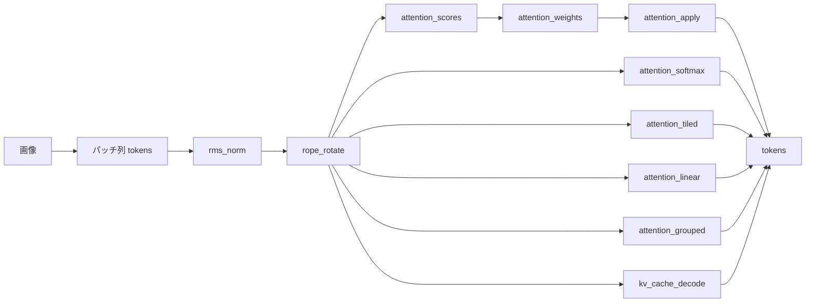

# LLM に至る系譜の芯(速くする工夫は、全部おなじ数の別の括り方) — 使い方ガイド

## この族は何をする道具箱か

状態機械 → RNN → Attention → Transformer という系譜に出てくる仕組みのうち、**厳密な等式・保存量・整数不変量が立つものだけ**をアルゴリズムとして持っています。「それらしく動く」ものは入れていません —— 蒸留も Sampler も Perplexity も、真値が無いのでこの箱の外です。RAG・Tool Calling・Guardrails は**系の設計であってアルゴリズムではない**ので、こちらではなく llmesh / llive の側に置きます。

なぜ画像の箱に入っているか: **注意はトークン列の上の演算**で、画像を格子に切ればそのまま ViT の入口になります。この族の op は `tokens` (T, d) を受けて `tokens` か `attnmap` (T, S) を返すだけなので、トークンが単語だろうが画素パッチだろうが同じ式で動きます。

10 op / 4 カテゴリ(**numpy だけ**。台帳は `opsllmcore.py`、実体は `llmcore.py`):

- **prepare(2)** — `rms_norm`(出力の RMS が**厳密に 1**)/ `rope_rotate`(回転なので**ノルムを保つ**、内積は**相対位置だけ**で決まる)。
- **score(3)** — `attention_scores`(生の QKᵀ/√d)/ `attention_weights`(行ごとの softmax + マスク。**行和 1、マスク位置は厳密に 0**)/ `attention_apply`(重みで混ぜる。**行和 1 を入口で検査する**ので、画像を重みの席に入れたら例外で止まります)。
- **attend(4)** — `attention_softmax`(一括の参照実装 = 答え合わせの基準)/ `attention_tiled`(タイル + online softmax = FlashAttention の芯)/ `attention_linear`((QKᵀ)V == Q(KᵀV))/ `attention_grouped`(GQA。両端が MHA と MQA に厳密一致)。
- **decode(1)** — `kv_cache_decode`(1 トークンずつ進める推論)。

## 連鎖



```python
import fullseye as fs
L = fs.ledger

q, k, v = patches @ Wq, patches @ Wk, patches          # (T, d) の列。画素パッチでよい
q, k = L.rope_rotate(q), L.rope_rotate(k)              # 位置符号(ノルムは動かない)

w = L.attention_weights(L.attention_scores(q, k), "causal")   # 行和 1 / 未来は厳密に 0
y = L.attention_apply(w, v)                                   # = attention_softmax(q,k,v,"causal")

y2 = L.attention_tiled(q, k, v, tile=32, mask="causal")       # (T,T) を作らない。答えは同じ
y3 = L.attention_linear(q, k, v, causal=True)                 # softmax を外すと結合則が効く
y4 = L.attention_grouped(q, k, v, n_heads=4, n_kv_heads=1)    # MQA(n_kv_heads=4 で MHA)
step = L.kv_cache_decode(q[-1:], k, v)                        # 1 トークンだけ進める
```

## 実測(画像パッチ 64 トークン、`examples/poc_attention_identities.py`)

| 主張 | 閉形式・真値 | 実測 |
|---|---|---|
| 注意の行和 | 1 | ずれ **2.22e-16** |
| マスク位置の重み | 0 | **0.0e+00**(許容差が要らない) |
| 因果の非ゼロ数 | T(T+1)/2 = 2080 | **2080**(整数で一致) |
| 窓の非ゼロ数(W=9) | Σ min(i+1,W) = 540 | **540**(整数で一致) |
| タイル + online softmax | 一括と同じ | 7 通りのタイルで最悪 **1.33e-15** |
| (QKᵀ)V == Q(KᵀV) | 0 | **1.18e-15** |
| 未来を書き換えたときの前半 | 0 | **0.0e+00**(後半は 0.403 動く) |
| KV Cache の逐次 | 一括と同じ | **5.92e-16** |
| 置換同変(位置符号なし) | 0 | **4.4e-16**(RoPE を入れると 0.018) |
| RoPE のノルム保存 | 0 | **4.44e-16** |
| RoPE の相対位置(絶対位置 40 通り) | 0 | **1.11e-15** |
| GQA == MHA / MQA | 0 | **0.0e+00 / 0.0e+00** |
| RMS 正規化 | 1 | ずれ **2.22e-16**(eps=1e-6 で 1.53e-04) |

**FlashAttention も線形 Attention も近似ではありません。** 速いのは計算を変えたからではなく、前者は (T, T) の行列を**作らない**から、後者は同じ積を**別の順で括る**から。交差点は **T == d** で、比は T/d に沿って育ちますが T=2048 では式が言う 32 倍に届かず 15〜16 倍で頭打ちになります(二次の側が帯域律速。これは時間の測定なので機械に依ります)。

★**外した予言を 2 つ残してあります**: タイルを細かくするほど誤差が積もる(→ 64 倍のタイル数で 1.1 倍にしかならない)/ online softmax の途中経過は答えに単調に近づく(→ 単調ではない。走っている最大値が更新されるたびに分母が組み替わるので、途中の値は答えの近似ですらない)。

## 型の話

新語を 2 つ足しました。基準はこの repo 共通の 1 つ ——「混ぜたときに例外ではなく、**もっともらしく間違った数値**が出るか」。

- `tokens` = (T, d) の実数列。**軸の順が意味を持ちます**。既存の `matrix` に載せると、転置した (d, T) がそのまま通って「長さ d の列を幅 T で」計算してしまい、例外ではなく別の数が返ります。`signal`(1-D)や `points`(3 列固定)とも別物です。
- `attnmap` = (T, S) の注意行列。生のスコアと softmax 後の重みの両方が座ります。`image2d` に載せると「画像として」平滑化やしきい値がかかって行和 1 が黙って壊れるので分けました —— `attention_apply` は行和を入口で検査するので、この席に画像を入れたら**例外で止まります**。

どちらも `backends_typed.TYPE_TO_SORT` には**入れていません**。2-D レジストリへの自動の橋(`tb_<op>`)が架かると、注意の入力として意味の無い 1 枚の画像が渡されて「走ったが全面が同じ値」になるからです。

**torch は使いません。** 上の恒等式は全部 numpy で書けます。任意依存を要る op は CI の一部の Python にしか入らず、環境によって落ちます(2026-09-24 に実際に落として学びました)。
