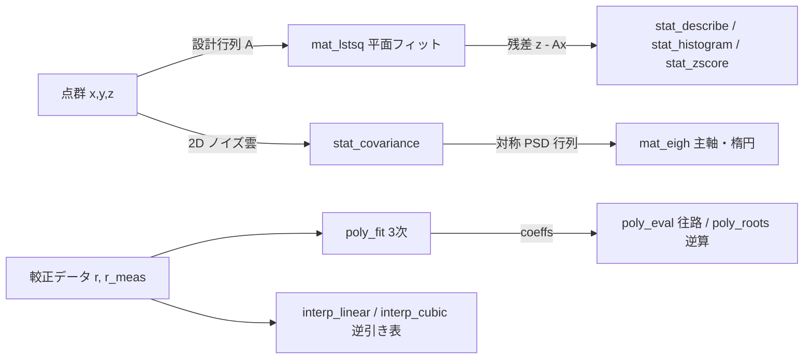
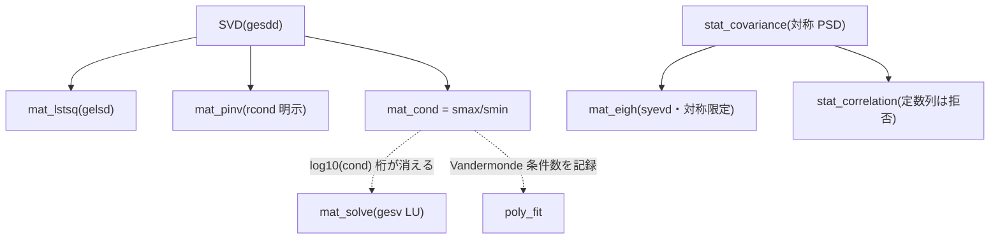
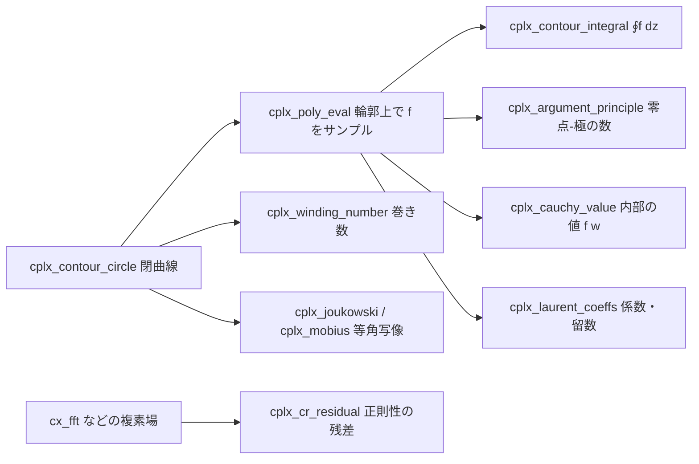

# 数学(計測を支える数値計算) — 使い方ガイド

## この族は何をする道具箱か

Fullseye の計測を **裏で支えている数学** を、第一級の op として表に出した族です。カメラ較正は最小二乗問題、ノイズ雲は共分散行列、主軸は固有ベクトル、歪みモデルは多項式、逆引きは補間 — `measure` / `measure3d` / `camera` の計測 op はすべてこの層の上で動いています。現在 4 分野 26 op(numpy + scipy のみ、台帳は `opsmath.py`):

- **linalg(6)** — `mat_solve` / `mat_lstsq` / `mat_svd` / `mat_eigh` / `mat_pinv` / `mat_cond`: 密行列の線形代数。数値の健全性の見張り役(`mat_cond`)を隠さず明示。
- **stats(5)** — `stat_describe` / `stat_histogram` / `stat_covariance` / `stat_correlation` / `stat_zscore`: 残差・ノイズの特徴づけ。
- **interp / poly(5)** — `interp_linear` / `interp_cubic` / `poly_fit` / `poly_eval` / `poly_roots`: 較正曲線とその逆引き。
- **complex(10、tier2)** — `cplx_contour_circle` / `cplx_poly_eval` / `cplx_contour_integral` / `cplx_winding_number` / `cplx_cauchy_value` / `cplx_argument_principle` / `cplx_laurent_coeffs` / `cplx_joukowski` / `cplx_mobius` / `cplx_cr_residual`: 複素解析の **計算可能な切り口**。閉曲線を点列として持つだけで、Cauchy の積分公式・偏角の原理(零点と極を数える)・Laurent 係数/留数・古典的な等角写像がすべて numpy の和に落ちます。op は Python の関数を呼び戻さない(輪郭上の `f` は呼び手がサンプルする)ので、**式でも実測データ(位相画像・伝達関数)でも同じ形**で扱えます。

データ種は画像ではなく数値配列: **matrix**(厳密に 2-D)、**signal**(厳密に 1-D)、標本集合は **(N, D)**(行 = 観測、列 = 変数)。**table**(dict)・**pairs**(counts, edges)・**measurement**(スカラ)・**roots**(complex 配列)を返す op もあります。FFT / 複素演算(`complexops` / `volfreq` / `dsp`)、1-D フィルタ(`dsp` / `funct1d`)、幾何フィット(`measure` / `measure3d` / `pcseg`)、codegen 参照実装の数値計算(`algo`)は既存モジュールの持ち場なので、ここには **重複させていません**。

## ファミリ共通の入力契約(fail-closed)

全 op が入力を検証してから計算します(2026-08 の敵対監査で確定したバグ族を、黙って通さず明示拒否):

- **complex 入力は `ValueError`** — float64 への強制変換は虚部を黙って捨てる(numpy は ComplexWarning だけ出して「もっともらしく間違った」実数を返す)。`.real` / `.imag` / `abs()` を明示するか、複素対応の `complexops` を使う。
- **例外は `cplx_*` 族だけ** — こちらは虚部こそがデータなので複素(実数も昇格して)を受けます。代わりに **str/bytes を拒否**(numpy は `"0"` を 0 と解釈してしまう)、そして **op の内部で溢れた結果**(Inf/NaN)も `ValueError`: 「積分が発散した」と「float64 が尽きた」は別の主張なので、後者を前者の顔で返さない。
- **masked array(masked 要素あり)は `ValueError`** — マスクを剥がして下の生値を使う暗黙変換を拒否。
- **NaN/Inf は全入力で `ValueError`**(非有限の件数を明示して拒否)。
- **形状は厳格**: 1-D↔2-D の暗黙昇格・ブロードキャスト無し。vector 枠に matrix(逆も)は `ValueError`。
- **サイズ上限**: 行列を取る op と `stat_histogram` の bins は `mathops.MAX_ELEMENTS`(2^26 ≈ 6700 万要素)超で `ValueError`。
- 特異行列・定数列・空入力・範囲外クエリなどの数学的に未定義/危険なケースは、silent NaN・silent clamp・silent 0 除算ではなく **問題を名指しする `ValueError`**。

## 代表的なパイプライン(op の繋がり)

深度カメラで平面(定盤)を測る計測ワークフロー(検証済み `examples/math_metrology.py` そのもの)。フィット → 残差統計 → 主軸化 → 較正 → 逆引きと、データ種が `matrix/signal → table → matrix → table → signal` で繋がります。



族の内部構造(裏の共有機構)。`mat_cond` は linalg 全体の健全性の見張り、SVD は `mat_lstsq` / `mat_pinv` / `mat_cond` / `poly_fit`(Vandermonde の条件数)の共通土台です。



## 使い方(op グループ別)

呼び出しは直接呼び: `import mathops; mathops.mat_lstsq(A, b)`(または `opsmath.get("mat_lstsq")`)。**HALCON 対応**は各 op ノート参照(linalg は *Matrix* 章、記述統計は *Tuple* 章が相当。共分散・相関・多項式フィット・求根は HALCON に公開 tuple op が無く、較正内部に隠れているものをここでは明示 op 化)。

### linalg(密行列 — 条件数を見てから信じる)

- **mat_solve**`(a, b)` — 正方系 `A x = b` を LU(LAPACK `gesv`)で解く。厳密に特異なら `ValueError`。**準特異は「解けてしまう」**のが罠: 解は `log10(cond(A))` 桁を失うので、先に `mat_cond` を見る。過剰決定系は `mat_lstsq` へ(エラーメッセージも誘導)。
- **mat_lstsq**`(a, b, rcond=None)` — 過剰決定系 `A x ≈ b` の SVD 最小二乗(`gelsd`)。`m >= n` 必須(劣決定系は拒否 → 最小ノルム解は `mat_pinv` の仕事)。戻りは dict `{x, residual_ss, rank, singular_values}` — フィットと健全性テレメトリを不可分に返す。`rank < n` は「データがパラメータを決め切れていない」印。
- **mat_svd**`(a, full_matrices=False)` — 特異値分解 `(U, s, Vt)`(`s` は降順)。既定は thin SVD。**符号の罠**: 特異ベクトル対は符号(縮退ブロック内は回転)まで しか決まらない — 検証は `s` や `U diag(s) Vt` で行い、`U`/`Vt` の生の値を比較しない。
- **mat_eigh**`(a)` — **対称行列専用**(検証つき)の固有分解(`syevd`)。`max|A - A.T|` がスケールの 1e-10 を超えると `ValueError` — 非対称行列を対称ソルバに食わせると片三角だけ読んで「もっともらしく間違う」+ 複素固有値をこの実数 API は表現できない、の二重の罠を fail-closed。ノイズで非対称なら `(A + A.T)/2` を明示。戻りは昇順 `w` と列固有ベクトル `V`。固有ベクトルにも符号不定あり。
- **mat_pinv**`(a, rcond=1e-12)` — Moore-Penrose 擬似逆行列。カットオフ `rcond`(= 正則化そのもの)を隠さず名前付き引数に。任意の `(m, n)` で動き、`m > n` は最小二乗解、`m < n` は最小ノルム解。
- **mat_cond**`(a)` — スペクトル条件数 `smax/smin`。族全体の数値カナリア: `~1e3` は快適、`~1e8` で半分の桁が消え、`> 1e12` では `mat_solve` を信じない(厳密特異は raise ではなく **inf を返す** — 「どれだけ悪条件か」への正直な答え)。

### stats(残差・ノイズの特徴づけ)

- **stat_describe**`(x)` — 1-D 標本の要約 dict `{n, mean, std, min, max, percentiles{p5..p95}}`。`std` は母集団版(`ddof=0`)。計測では裾が重要: RMS で合格でも `p5`/`p95` で不合格のフィットがある — 両方報告する。
- **stat_histogram**`(x, bins=10, range=None, density=False)` — ビニングを明示したヒストグラム。戻りは `(counts, edges)`(`edges` は `bins + 1` 個)。明示 `range` の外の値は **どのビンにも数えられない**(比較目的なら range 明示が正直)。`density=True` で全標本が range 外なら 0/0 になるため `ValueError`(`density=False` は正直な全ゼロを返す)。
- **stat_covariance**`(x)` — `(N, D)` 観測(行 = 観測。`np.cov` の既定とは転置の関係)の標本共分散 `(D, D)`。不偏 `ddof=1` なので `N >= 2` 必須。構成的に対称 PSD → そのまま `mat_eigh` に渡せる(共分散楕円ワークフロー)。
- **stat_correlation**`(x)` — Pearson 相関行列。対角は厳密に 1、値は [-1, 1] にクリップ。**定数列(分散ゼロ)は列番号を名指しして `ValueError`** — 0/0 の NaN を 3 op 下流に流さない。落とす/揺らすは呼び手が明示。
- **stat_zscore**`(x)` — 標準化 `(x - mean)/std`(`ddof=0`)。外れ値ゲートの共通通貨(`|z| > 3`)。**定数入力は `ValueError`** — 黙って全ゼロを返すと「全点が完璧に平均的」となり、一定値に張り付いたセンサが外れ値ゲートを素通りしてしまう。

### interp / poly(較正曲線と逆引き)

- **interp_linear**`(x, y, xq, out_of_range="raise")` — 区分線形補間。`x` は厳密に単調増加(未ソート・重複は **黙ってソートせず** `ValueError` — 黙ったソートは x と y を脱同期させる)。**範囲外は明示選択**: 既定 `'raise'`(較正表を較正範囲外で引くのは誤答予備軍)、`'clamp'` で端値保持。黙った線形外挿モードは意図的に無い。
- **interp_cubic**`(x, y, xq, out_of_range="raise", bc_type="not-a-knot")` — 3 次スプライン(`scipy.interpolate.CubicSpline`、C² 滑らか、4 点以上)。既定 `'not-a-knot'` は大域 3 次多項式を**厳密に**再現(テストが pin する性質)。スプライン外挿は 3 次で発散するため範囲外は同じく拒否。正直な注記: ノード間でオーバーシュートしうる(形状保存ではない)— 単調性が要るなら PCHIP 系(ここには無い、と明記)。
- **poly_fit**`(x, y, degree)` — Vandermonde 行列の SVD 最小二乗フィット。戻り dict `{coeffs(最高次から), degree, cond, rms_residual}` — フィットと健康診断を不可分に。**`cond > POLY_COND_WARN`(1e10)で `RuntimeWarning`** かつ数値も結果に同梱。高次 × 生座標は二重の罠(Vandermonde 列の近共線 + Runge 振動)— x を [-1, 1] へ中心化・スケールするか次数 ≤ ~6 に。`degree + 1` 点未満(劣決定)は拒否。
- **poly_eval**`(coeffs, x)` — Horner 法(`np.polyval`)で評価。係数は最高次から(`poly_fit` の `"coeffs"` そのまま)。スカラ入力はスカラ、配列は float64 を返す。評価は正しくできても悪条件な**フィット**は直せない(`poly_fit` の `cond` を見る)。
- **poly_roots**`(coeffs, real_only=False, imag_tol=1e-9)` — companion 行列の固有値として全根(複素含む)を決定的順序(実部→虚部)で返す。`x² + 1` の根は本当に `±i` — 隠すと多項式を偽ることになる。`real_only=True` で実根のみ float64(**空も正解**: `x² + 1` に実根は無い)。先頭係数 0 は「宣言次数が嘘」なので `ValueError`(明示 trim を要求)。高次・接近根の条件数悪化(Wilkinson)にも正直な注記あり。

### complex(複素解析 — 閉曲線は「点列」である)

輪郭は **複素点の 1-D 配列(`cpoints`)**、閉じる辺は暗黙(先頭点を末尾で繰り返さない)。向きが答えの符号そのものなので `orientation` は明示引数です。



- **cplx_contour_circle**`(center=0, radius=1, n=256, orientation="ccw")` — 積分路の標準形。`n` は `MAX_CONTOUR_POINTS`(2^22)で頭打ち(`n=10**9` を 16 GB の確保にしない)。正直な限界: これは円の**多角形近似**で、弦の求積は `O(n^-2)`。
- **cplx_poly_eval**`(coeffs, z)` — `poly_eval` の複素版(Horner)。`poly_eval` は複素を意図的に拒否する(虚部の黙った切り捨て)ので、輪郭上のサンプルはこちらで作ります。溢れた結果は `ValueError`。
- **cplx_contour_integral**`(z, fz)` — 弦の台形則による `∮f dz`。GT: `∮dz/z = 2πi`(実測 n=256 で相対誤差 1.0e-4、n=1024 で 6.3e-6 = 2 次収束)。時計回りなら符号が反転します。
- **cplx_winding_number**`(z, w=0)` — 巻き数(整数)。輪郭**上**の点は `ValueError`、1 辺が半回転以上を張る(= 粗すぎ)場合も `ValueError`。π/2 を超えたら `RuntimeWarning`: **数え落としは原理的に検出できない**(z⁵ を 4 点円で数えると 1)ので、分点を倍にして安定するまで確かめるのが唯一の検算です。
- **cplx_cauchy_value**`(z, fz, w)` — 境界の値から内部の値を復元。巻き数で割るので時計回り・二重巻きでも同じ答え。外の点(巻き数 0)と、輪郭から 1 標本刻み以内の点は `ValueError`(積分の峰が解像されていない)。
- **cplx_argument_principle**`(z, fz)` — 微分も求根もせず `Z - P` を数える(像曲線の原点まわりの巻き数)。**差しか出ない**(零点と極は分離できない)/ 単純・正の向きの輪郭でのみ `Z - P` に一致 / 粗いと低く数える、の 3 点を正直に。
- **cplx_laurent_coeffs**`(z, fz, kmin=-1, kmax=4)` — 一様サンプルの**円限定**(任意の輪郭では拒否)。`c₋₁` が留数、`k >= 0` は Taylor 係数。円上の台形則は指数収束します。標本の**順序を使わない**ので常に正の向きの係数を返す(`cplx_contour_integral` は向きで符号が変わる)— 突き合わせるときは向きを揃えてから。
- **cplx_joukowski**`(z, c=1.0)` — `w = z + c²/z`。単位円 → 実軸線分 `[-2c, 2c]`(`w = 2c cos t`、厳密)、半径 `R` の円 → 半軸 `R ± c²/R` の楕円、`z = c` を通るずらした円 → 尖った後縁の翼型。
- **cplx_mobius**`(z, a, b, c, d)` — `(az+b)/(cz+d)`。円と直線を円と直線に写す。`ad - bc ≈ 0`(定数写像に潰れる)と極 `z = -d/c` は `ValueError`。
- **cplx_cr_residual**`(f, spacing=1.0)` — 標本場の Cauchy-Riemann 残差(0 = 正則、2 = 共役)。**行が虚部の増える向き**という規約が答えの符号を決めます(画像配列は行が下向きなので、そのまま渡すと共役を測って 2 が出ます — `f[::-1]` で反転)。中心差分は 2 次まで厳密(`z²` は 0)、それ以上は `O(h²)` の床(実測: `z³` で h=0.05 のとき 1.7e-3、h/2 で 4.2e-4)。

## 動く最小例(検証済み)

repo 直下で `py -3.11` の対話環境か、`PYTHONPATH` に repo を通して実行。フィット厳密復元・PSD/直交性・SVD⇔固有値の交差検証・fail-closed(範囲外拒否)を数値で確認して `PASS` を出します(本ガイド作成時に実行し PASS を確認済み。16 op 全てを通すフル版は `py -3.11 examples/math_metrology.py`)。

```python
import numpy as np
import mathops as M

# GT: 直線 y = 2x + 1(ノイズ無し・決定的)を最小二乗で厳密復元
x = np.linspace(0.0, 1.0, 21)
y = 2.0 * x + 1.0
A = np.column_stack([x, np.ones_like(x)])     # (21, 2) 設計行列

fit = M.mat_lstsq(A, y)                       # SVD 最小二乗(健全性テレメトリ付き)
assert np.allclose(fit["x"], [2.0, 1.0], atol=1e-12) and fit["rank"] == 2
assert M.mat_cond(A) < 1e2                    # 条件数を必ず見る(健全)
assert fit["residual_ss"] < 1e-24             # ノイズ無しデータ → 残差ゼロ

d = M.stat_describe(y - A @ fit["x"])         # 残差統計: 実質ゼロ
assert d["n"] == 21 and abs(d["mean"]) < 1e-12

# 共分散 → 固有分解(主軸): 相関のある 2 変数の雲(seed 固定・決定的)
rng = np.random.default_rng(0)
u = rng.standard_normal(500)
cloud = np.column_stack([u, 0.5 * u + 0.1 * rng.standard_normal(500)])
C = M.stat_covariance(cloud)                  # (2,2) 対称・半正定値
w, V = M.mat_eigh(C)                          # 対称行列専用(対称性を検証してから解く)
assert w[0] >= -1e-12                         # PSD → 固有値は非負
assert np.allclose(V.T @ V, np.eye(2), atol=1e-12)   # 固有ベクトルは正規直交
assert M.stat_correlation(cloud)[0, 1] > 0.9  # 強い正相関(構成通り)
assert np.abs(M.stat_zscore(cloud[:, 0])).max() < 5.0  # 正規サンプルの z-score

# SVD 交差検証: centered データの s^2/(N-1) は covariance の固有値と一致
centered = cloud - cloud.mean(axis=0)
_, s, _ = M.mat_svd(centered)
assert np.allclose(sorted((s ** 2) / (cloud.shape[0] - 1)), w, rtol=1e-10)

# 較正曲線: y = 0.15 x^3 + x を 3 次 poly_fit で厳密復元(条件数もその場で確認)
pf = M.poly_fit(x, 0.15 * x ** 3 + x, 3)
assert np.allclose(pf["coeffs"], [0.15, 0.0, 1.0, 0.0], atol=1e-9)
assert pf["cond"] < M.POLY_COND_WARN          # 1e10 を超えると RuntimeWarning
assert abs(M.poly_eval(pf["coeffs"], 0.5) - (0.15 * 0.125 + 0.5)) < 1e-12
r = M.poly_roots([1.0, 0.0, 1.0])             # x^2 + 1 = 0 → ±i(複素も正直に返す)
assert np.allclose(sorted(r.imag), [-1.0, 1.0], atol=1e-12)
assert M.poly_roots([1.0, 0.0, 1.0], real_only=True).size == 0  # 実根は無し(空が正解)

# 補間: 範囲外クエリは既定で ValueError(clamp は明示指定)
tbl_x = np.array([0.0, 1.0, 2.0, 3.0])
tbl_y = tbl_x ** 2
assert M.interp_linear(tbl_x, tbl_y, 1.5) == 2.5   # 区分線形: (1+4)/2
assert abs(M.interp_cubic(tbl_x, tbl_y, 1.5) - 2.25) < 1e-12  # 3 次多項式は厳密再現
try:
    M.interp_linear(tbl_x, tbl_y, 9.0)             # fail-closed(外挿は既定拒否)
    raise AssertionError("out-of-range must raise")
except ValueError:
    pass
assert M.interp_cubic(tbl_x, tbl_y, 9.0, out_of_range="clamp") == 9.0  # 端値を保持

# ヒストグラム: 度数和 = サンプル数(明示ビニング)
counts, edges = M.stat_histogram(cloud[:, 0], bins=12)
assert int(counts.sum()) == 500 and edges.size == 13

print("PASS")
```

## 数式(必要な op のみ)

最小二乗(`mat_lstsq`)と擬似逆行列(`mat_pinv`)は同じ問題の二つの顔:

$$
\hat{x} = \arg\min_x \lVert A x - b \rVert_2^2, \qquad
A^{+} = V \, \Sigma^{+} U^{\top} \ \ (\sigma_i < \mathrm{rcond}\cdot\sigma_{\max} \text{ は } 0 \text{ 扱い})
$$

条件数(`mat_cond`)と「消える桁数」(Golub & Van Loan §2.6 — `mat_solve` を信じてよいかの判定):

$$
\kappa_2(A) = \frac{\sigma_{\max}(A)}{\sigma_{\min}(A)}, \qquad
\text{失う有効桁数} \approx \log_{10} \kappa_2(A)
$$

標本共分散(`stat_covariance`、`ddof=1`)と Pearson 相関(`stat_correlation`)、z-score(`stat_zscore`、`ddof=0`):

$$
C = \frac{1}{N-1} \sum_{i=1}^{N} (x_i - \bar{x})(x_i - \bar{x})^{\top}, \qquad
R_{jk} = \frac{C_{jk}}{\sigma_j \sigma_k}, \qquad
z_i = \frac{x_i - \bar{x}}{\sigma}
$$

多項式(`poly_fit` / `poly_eval`、係数は最高次から)と、そのフィットの条件数(Vandermonde 行列 $V_{ij} = x_i^{\,d-j}$ の $\kappa_2$ — `POLY_COND_WARN` = 1e10 超で警告):

$$
p(x) = \sum_{k=0}^{d} c_k \, x^{\,d-k}, \qquad
\hat{c} = \arg\min_c \lVert V c - y \rVert_2^2
$$

## サンプルデータ

この族の入力は画像ではなく数値配列なので、**seed 固定の合成データ + 解析的グラウンドトゥルース**(真の係数・真の固有値・厳密根)がそのまま最良のテストデータです — 上の最小例と `examples/math_metrology.py` がその作り方の見本(平面 + 既知ノイズ、回転楕円雲、樽型歪み風の較正曲線)。実測データに繋ぐなら、`measure` / `measure3d` の出力(残差列・点群座標)をそのまま `signal` / `(N, D)` として渡せます。画像系サンプルの台帳は [`../../SAMPLES.md`](../../SAMPLES.md)。

## 参考文献(正典)

台帳は [`../../../REFERENCES.md`](../../../REFERENCES.md)。この族の数値解析の古典(各 op の docstring が引用しているもの):

- Golub, G. H. & Van Loan, C. F., *Matrix Computations* (4th ed., 2013), §2.6 — 条件数と桁落ち(`mat_cond` / `mat_solve` の警告の根拠)。
- Anderson, E. et al. (1999), *LAPACK Users' Guide* (3rd ed.) — `gesv` / `gelsd` / `gesdd` / `syevd`(linalg 族の実体)。
- Runge, C. (1901), "Über empirische Funktionen und die Interpolation zwischen äquidistanten Ordinaten" — 等間隔ノード高次補間の発散(`poly_fit` の次数警告の根拠)。
- Wilkinson, J. H. (1984), "The perfidious polynomial" — 係数摂動に対する根の条件数悪化(`poly_roots` の注記の根拠)。
- Pearson, K. (1896), "Mathematical Contributions to the Theory of Evolution. III. Regression, Heredity, and Panmixia" — 積率相関係数(`stat_correlation`)。
- de Boor, C. (1978), *A Practical Guide to Splines*, Springer — 3 次スプラインと not-a-knot 境界条件(`interp_cubic`)。
- Cauchy, A.-L. (1831), *Mémoire sur la mécanique céleste et sur un nouveau calcul appelé calcul des limites* — 積分公式と偏角の原理(`cplx_cauchy_value` / `cplx_argument_principle`)。
- Trefethen, L. N. & Weideman, J. A. C. (2014), "The exponentially convergent trapezoidal rule", *SIAM Review* 56(3) — 円周上の台形則が指数収束する根拠(`cplx_laurent_coeffs`)。
- Zhukovsky, N. E. (1910), "Über die Konturen der Tragflächen der Drachenflieger" — Joukowski 翼型写像(`cplx_joukowski`)。

---
© 2026 Kazufumi Furuse — Fullseye operator documentation. Licensed under Apache-2.0.
