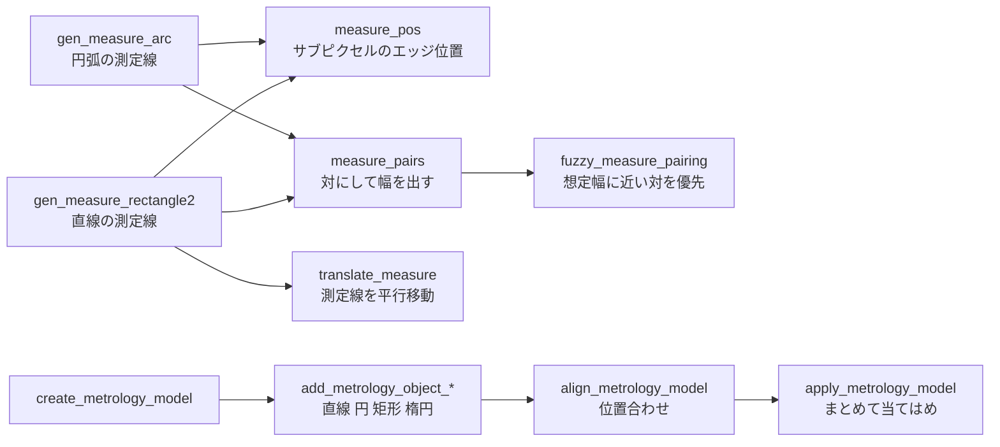

# サブピクセル計測(測定線と計測モデル) — 使い方ガイド

## この族は何をする道具箱か

**画像のどこを、どの向きに見るかを先に決めてから測る**層です。17 op / 4 カテゴリ:

- **caliper(6)** — `gen_measure_rectangle2` / `gen_measure_arc` /
  `translate_measure` / `measure_pos` / `measure_pairs` /
  `fuzzy_measure_pairing`: 測定線に沿ってエッジをサブピクセルで取り、対にして幅を出す。
- **model(6)** — `create_metrology_model` と `add_metrology_object_*` 5 本:
  直線・円・矩形・楕円をモデルに登録する。
- **apply(2)** — `align_metrology_model` / `apply_metrology_model`:
  モデルを画像へ当てて、当てはめ結果をまとめて返す。
- **scale(3、2026-09-15)** — `mm_per_px_from_reference` / `pixel_to_world` /
  `table_px_to_mm`: 画素を mm にする。文書だけを渡した AI の導線が **px で止まり**、
  4 層(`fs.` / `fs.ledger.` / `fs.op.` / `op_find`)のどこにも換算 op が無かったので足した。
  校正は「既知寸法の的を**同じ op で**測る」に固定する(公称倍率は使わない)。

用途からの導線(推奨パイプライン / 代替 / 限界 / 実寸校正)は
[`docs/capabilities/subpixel-2d-metrology.md`](../../../capabilities/subpixel-2d-metrology.md)、
[`inner-diameter-in-mm.md`](../../../capabilities/inner-diameter-in-mm.md)、
[`scratch-detection-and-width.md`](../../../capabilities/scratch-detection-and-width.md)。

## なぜ台帳に載せたか —— 見えていなかったから、ただし測ってから

2026-09-06、この 2 モジュールが**公開経路のどこからも呼べない**ことが分かりました
(`fs.` / `fs.ledger.` / `fs.op.` のいずれからも **0/14**)。

同じ日に、同じく埋もれていた `mosaic` を実測したところ `bundle_adjust_mosaic` が
36 枚中 30 枚を単位行列で返す(束調整ではない)ことが分かったので、
**出す前に実地で測る**方針を取りました(`examples/poc_dimensional_inspection.py`)。

結果は **14/14 が動作**。ゼロ点(大津の整数幅)比 **41 倍**で、スロット幅
50.50 px の偏りは −0.5000 → **−0.0113 px**、合成不確かさ u_c = 0.0196 px
= 0.245 µm。`mosaic` とは違い、これは出す価値がありました。

## 全体の流れ


```mermaid
flowchart LR
    A["gen_measure_rectangle2<br/>直線の測定線"] --> C["measure_pos<br/>サブピクセルのエッジ位置"]
    B["gen_measure_arc<br/>円弧の測定線"] --> C
    A --> D["measure_pairs<br/>対にして幅を出す"]
    B --> D
    D --> E["fuzzy_measure_pairing<br/>想定幅に近い対を優先"]
    A --> F["translate_measure<br/>測定線を平行移動"]
    G["create_metrology_model"] --> H["add_metrology_object_*<br/>直線 円 矩形 楕円"]
    H --> I["align_metrology_model<br/>位置合わせ"]
    I --> J["apply_metrology_model<br/>まとめて当てはめ"]
```

## いちばん短い例

```python
import numpy as np
import measuring1d as M

img = np.zeros((64, 128)); img[:, 40:80] = 1.0        # 真値 40.0 px の帯
meas = M.gen_measure_rectangle2(row=32.0, col=64.0, phi=0.0,
                                length1=50.0, length2=3.0, shape=img.shape)
pairs = M.measure_pairs(img, meas, sigma=1.0, threshold=0.1)
print(pairs[0]["width"])       # 40.0000
```

## 落とし穴 5 つ(どれも実測つき)

### 1. 斜めの測定線に cos 補正は入っていない

測定線が輪郭に対して斜めだと、測定値 / 真値がちょうど 1/cos になります
(70 度で 2.9105 対 2.9238)。**呼ぶ側が cos を掛けてください**。掛ければ
60 度まで 0.04 px 以内、70 度で −0.139 px 残ります。

### 2. エッジが近いと幅は必ず大きく出る。しかも失敗を返さない

壊れるのは「ぼけ」そのものではなく **エッジ間距離 / PSF 幅**です:

| w / σ | 幅の偏り |
|---|---|
| 3.09 | 0.05 px を超え始める |
| 2.06 | **+2.43 px** |
| 1.58 | それでも「対が見つかった」と 100 % 答える |

対が互いを押し広げるので**必ず大きい側**へ偏ります。`measure_pairs` は
信頼度を返さないので、危険域かどうかは呼ぶ側が見張るしかありません
(op ノートからもここへ辿れるよう docstring に書いてあります)。細い傷での実測
(幅 1 px で +2.25 px)は `2d/guides/gallery2d_contour_measure.md` の使い分け表。

### 3. 縁の定義を宣言しないと 16 px 動く

面取りや丸みのある実際の縁では「どこがエッジか」が定義依存です。実測:

| 縁の形 | 測定値 |
|---|---|
| 面取り 5 px | 90.35(底面幅側) |
| 面取り 6 px | **78.61(上面幅側)** |
| 丸み 8 px | 上面幅 74.50 / 底面幅 90.50 / 50 % 交差 87.55 |

面取りが PSF に対して分解できた瞬間、答えが**黙って 11.7 px 飛びます**。
定義の違いで **16 px = 200 µm** —— サブピクセルの 3 桁上です。

**丸い縁は必ず小さく出ます**。直径誤差 ≈ −σ²/ρ で、実測 / 予測は 1.24 / 1.09
/ 1.02(ρ=8、σ=0.8/1.2/2.0)、0.94(ρ=16)。円弧キャリパーの −0.311 px は
この光学側の偏りで説明でき、**道具自体はほぼ偏りません**。

### 4. `measure_pairs` は極性の順序を問わない

docstring は「立ち上がり→立ち下がり」と読めますが、実装は**極性が交互なら
順序を問いません**。円弧測定では「立ち下がり→立ち上がり」= 暗い穴を対に
します。**明るい構造の幅を期待して呼ぶと暗い構造の幅が返ることがあります**。
選ぶ引数(`transition`)がまだありません。

### 5. `metrology` の矩形は往復しない

`add` は (phi, l1, l2) を受けますが、`apply` は l1 ≥ l2 に正規化して返します。
l1 < l2 で入れると phi が 90 度回ります(実測: 入力 phi=0 / l1=25.25 /
l2=55.00 → 出力 phi=−90.00 / l1=55.020 / l2=25.256)。

矩形の当てはめは**最小面積外接矩形**(凸包の極値点のみ)なので、60 点中
1 点を 1.5 px 外へ動かすだけで幅が **+1.50 px** 動きます(最小二乗なら
0.050 px)。ただし rms が 0.022 → 0.734 に上がるので、**rms を必ずゲートに
してください**。

## 円計測の `n`(円周の標本数)の目安 — 実測

`add_metrology_object_circle_measure(..., n=40)` の既定 40 に根拠が書かれていなかったので、
被覆率で描いた円板(ぼけ σ=1 px)で測りました(2026-09-15)。

**偏りは n に依らない**(雑音なし、半径の偏り [px]):

| R [px] | n=6 | n=8 | n=16 | n=40 | n=120 | n=240 |
|---|---|---|---|---|---|---|
| 8 | −0.098 | −0.087 | −0.088 | −0.088 | −0.090 | −0.090 |
| 32 | −0.027 | −0.015 | −0.020 | −0.020 | −0.022 | −0.022 |
| 128 | −0.008 | −0.008 | −0.004 | −0.008 | −0.006 | −0.006 |

(偏り自体は縁の丸みで −σ²/ρ の側に出る光学の偏り。n を増やしても消えない。)

**効くのは散らばりで、円周の標本間隔 2πR/n が約 3 px を切ると頭打ち**(雑音 σ=0.03、100 試行、半径の std [px]。std·√n が一定なら標本が独立):

| R=16: n | 8 | 16 | 24 | 40 | 72 | 120 | 240 | 480 |
|---|---|---|---|---|---|---|---|---|
| 間隔 [px] | 12.6 | 6.3 | 4.2 | 2.5 | 1.4 | 0.84 | 0.42 | 0.21 |
| std | 0.043 | 0.029 | 0.024 | 0.017 | 0.017 | 0.016 | 0.016 | 0.015 |
| std·√n | 0.12 | 0.11 | 0.12 | 0.11 | **0.14** | 0.17 | 0.25 | 0.33 |

| R=64: n | 8 | 16 | 24 | 40 | 72 | 120 | 240 | 480 |
|---|---|---|---|---|---|---|---|---|
| 間隔 [px] | 50 | 25 | 17 | 10 | 5.6 | 3.4 | 1.7 | 0.84 |
| std | 0.042 | 0.032 | 0.022 | 0.019 | 0.013 | 0.012 | 0.008 | 0.008 |
| std·√n | 0.12 | 0.13 | 0.11 | 0.12 | 0.11 | 0.14 | 0.12 | **0.18** |

目安: **n ≈ 2πR / 3**(R=20 で 40 = 既定、R=64 で 130、R=128 で 270)。それ以上は
時間が増えるだけ(n=1000 で 22 ms)。ほかに実測した 2 つ:

- 参照半径のずれは `measure_length`(既定 ±6 px)が上限。+5.5 px は通り、+6.5 px で `params=None`。
- 円周の 25 % が欠けると n を増やしても偏りは直らない(−0.005 → −0.020 px)。欠けた側で
  縁が見つからないだけなら `rms` は**下がり**(0.051 → 0.018)、境界で偽の縁を拾えば跳ねる ——
  rms だけでは見えないので `edge_points` の本数も門にする(`examples/example_inner_diameter_mm.py`)。

## 窓の置き方が精度より効く

外形幅を測る列がボルト穴を踏むと 220.45 → **186.75**(−33.75 px)。
エラーも警告も出ません。サブピクセルの議論より前に、測定線がどこを通るかです。

## 関連

- `examples/poc_dimensional_inspection.py` —— この族を実地評価した PoC。
- `docs/ops/roughness/guides/surface_roughness.md` —— 面の粗さ(こちらは寸法)。
- `docs/ops/profile/guides/profile_metrology.md` —— 1-D 断面の形状計測。
