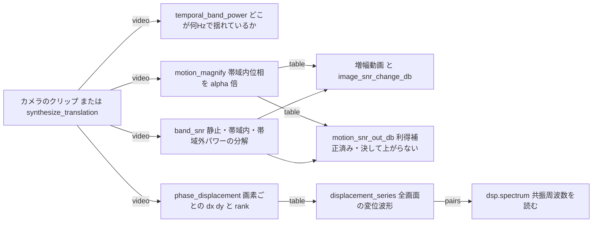
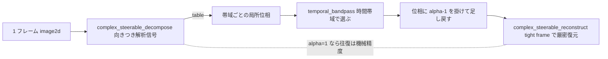

# モーション増幅・位相変位計測(微小振動を見せる/測る) — 使い方ガイド

## この族は何をする道具箱か

**動いているのに見えない**層です。カメラの前で機械の枠が共振で 0.1 画素だけ呼吸している、配管の壁が脈打っている、ボルト継手が 1 ミクロンずつ緩んでいる — どれも記録には入っているのに、人間の目にも普通の運動解析にも掛かりません。そこから欲しいものは 2 つあって、**別の問題**です。

- **見せてほしい。** 小さい変位を拡大して再合成し、人が見て分かる動画にする。= **増幅**。
- **何画素か教えてほしい。** 変位そのものを数値で返す。= **計測**。

どちらも同じ量から出ます。**向きつき帯域成分の局所位相**です。帯域制限された画像成分が `d` だけ平行移動すると、その成分の局所位相は `-k·d` だけずれます(`k` は成分の局所空間周波数、単位 rad/px)。位相はサブピクセル変位の**線形な符号化**なので、**位相を α 倍すれば変位が α 倍になります** — 運動場を一度も推定せずに、厳密に。9 op / 5 カテゴリ(numpy + scipy のみ、台帳は `opsmotionmag.py`、実体は `motionmag.py`):

- **synthesis(1)** — `synthesize_translation`: 既知振幅・既知周波数のサブピクセル平行移動クリップ。フーリエ位相ランプで動かすので**補間誤差がゼロ**で、真値が閉形式。この族の全主張はこの合成に対して測ってあります。
- **decompose(2)** — `complex_steerable_decompose` / `complex_steerable_reconstruct`: 1 枚を向きつきの**解析信号**(複素サブ帯域)に割り、戻す。tight frame として組んであるので往復が機械精度で厳密です。ここが厳密でないと「増幅のせいか再合成のせいか」が永久に切り分けられません。
- **temporal(3)** — `temporal_bandpass` / `temporal_band_power` / `band_snr`: 画素ごとの時間軸を帯域で切る、その帯域のパワー地図を返す(= どこが何 Hz で振動しているか)、そしてクリップの帯域内容と雑音床を分解して測る。
- **magnify(1)** — `motion_magnify`: 帯域内の位相を `alpha - 1` 倍して足し戻し、再合成する。返り値は動画**と** SNR 一式。
- **measure(2)** — `phase_displacement` / `displacement_series`: 画素ごとの変位場 `dx` / `dy`(と観測可能性の rank)、および全画面の変位波形 `(T, 2)`。後者はそのまま `dsp.spectrum` に流せば共振周波数が読めます。

`alpha` は**変位利得**として定義してあります: 出力の変位が `alpha * d`。`alpha = 1` が恒等、`0` が運動の除去、`-1` が反転です。公開文献は増幅後を `1 + alpha_paper` 倍と書きますが、本族の `alpha` は `1 + alpha_paper` に当たります。理由は検証可能性で、**呼び出し側が書いた数と測定値を、足し引きなしにそのまま比較できる**ようにするためです。

データ種は既存語彙の再利用が基本です: **image2d**(帯域パワー地図)、**table**(分解結果 dict・SNR 計測 dict・増幅結果 dict・変位場 dict)、**pairs**((n,2) 配列 = 変位波形。MTF 曲線や `funct1d` と同じ規約)。新語は **video** の 1 つだけで、`(T, H, W)` の float64 フレーム列です。これは `videops` が使っている規約をそのまま踏襲しています。

## 既存 op との棲み分け(重複させていないもの)

**「どこがどれだけ動いたか」と「サブピクセルの周期運動を帯域で選んで増幅する」は別の問題です。** 前者はオプティカルフローの守備範囲で、後者がこの族です。混同すると、動かない答えを何時間も追うことになります。

| やりたいこと | 使う op | 置き場所 |
|---|---|---|
| **1 画素以上**の運動、独立に動く物体、遮蔽をまたぐ追跡 | `optical_flow_lk` / `optical_flow_hs` / `warp_by_flow` / `track_points` | `flow`(輝度不変を空間窓で解く。この族は一切呼ばないし再実装もしない — レジームが違う) |
| 推定済みフロー場の**解釈**(全体運動モデル・残差・運動分割) | `dominant_motion` / `residual_motion` / `motion_segments` | `motion`(無関係・不変) |
| 時間方向の**低域**平滑、背景モデル、運動エネルギー地図 | `moving_average` / `spatiotemporal_gaussian` / `background_subtraction` / `motion_energy` | `videops`(`temporal_bandpass` は同じ族の**帯域選択**メンバであって、これらの重複ではない) |
| 方向づきエッジ応答(実数) | `tf_steerable_filter` | `backends_transform2`(直交対でなく**位相を持たず**可逆でもないので増幅には使えない。別物としてそのまま残す) |
| FFT・複素画像・2-D 位相アンラップ・Wiener 復元 | `cx_fft` 系 / `phase_unwrap` / `cx_wiener_deconvolve` | `complexops`(FFT 畳み込み・相関は `filters_freq`) |
| 変位波形の周波数解析 | `spectrum` / `signal_features` | `dsp`(`displacement_series` の `(T, 2)` をそのまま食える。ラップし直さない) |

ステアラブル束だけは `numpy.fft` の上に自前で組んであります。**tight frame でないと再合成が厳密にならない**ためで、厳密さがこのモジュールの契約そのものだからです。

## ファミリ共通の入力契約(fail-closed)

全 op が入力を検証してから計算します。以下は 2026-09-01 の敵対監査で**実際に見つかったバグ**か、それを塞ぐために書いた罠です。この族が探したのは「例外が出る」ことではなく「**黙って間違った数字を返す**」ことでした。

### 見つかった実バグ 5 件

1. **同じサブ帯域に 2 つの格子が落ちると、増幅が静かに間違う。** 最初の合成は縦横で同じ波長を使っていたため、両方の格子が同じ帯域に入りました。帯域の局所位相は「和の位相」になり、和の位相は変位の線形関数では**ない**。結果、`alpha = 2` が `2d` ではなく **`0.939 * (2d)`** を返し、`alpha = 0` は運動の **7.9 %** を消し残しました。恐ろしいのは**誤差が `d` に依存しない**ことです — 微小変位で消えないので「線形性の限界」では説明がつかず、非線形の言い訳が通りません。もっともらしく間違った数字の教科書例で、対策は `synthesize_translation` の既定波長を `(8.0, 16.0)` と**オクターブを分ける**ことにして、狭帯域条件を合成の側で可視化しました。
2. **時間方向の `np.unwrap` が雑音帯を乱歩に変える。** 大きな運動に届かせようと位相を時間方向にアンラップすると、**信号を持たないサブ帯域**ではフレーム間位相が `-pi` 〜 `pi` の一様乱数になり、アンラップはランダムウォークになります。実測: 0.05 px の運動に sigma = 0.02 の雑音を載せたクリップで、増幅器が実際に適用した最大位相増分は **12.27 rad** — 意図は **0.039 rad** でした。例外も NaN も出ず、単に違う動画が出ます。対策はアンラップの撤去で、`angle(z * conj(z_mean))` は構成上 `pi` で有界なので、雑音帯の寄与は利得前で最大 `pi` に抑えられます。届く範囲は代わりに正直に開示しました(後述)。
3. **`band_snr` を増幅後クリップにそのまま当てると、起きていない改善を報告する。** `band_snr` は帯域内の雑音床を**帯域外**のビンから推定しますが、増幅は帯域外に触りません。増幅後の動画に当てると「帯域内パワーだけが `alpha^2` 倍、雑音推定は据え置き」となり、実測 `alpha = 2` で **+6.86 dB** の運動 SNR 改善を報告しました。**録画に無かった確からしさが計算で生えることはない**ので、これは嘘です。「評価指標を出力に当てると嘘になる」典型で、対策として `motion_magnify` は利得を知っているので**入力側の雑音床**を基準に補正した `motion_snr_out_db` を返します。素の `result["snr_out"]["motion_snr_db"]` は使わないでください。
4. **`linear_regime` が間違ったものを測っていた。** 適用位相増分の**最大値**で判定していたため、コントラストを持たない雑音帯に引きずられて常に False になっていました。現在は**コントラスト加重 RMS**(`phase_shift_rms_rad`)で判定し、最大値は「どこかで起きた最悪」として別に返します。RMS が利得に厳密比例することはテストで固定してあります。
5. **開口問題でゼロを返していた。** 一方向の縞しか無い場面では正規方程式が rank 1 になり、観測できるのはその向きの成分だけです。素の逆行列は観測不能な方向に巨大な嘘を返し、画素を捨てると**測れた成分まで捨てる**ことになります。現在は最小ノルム擬似逆で、観測できた成分を返し、観測できない方向を厳密に 0 にし、`rank` を画素ごとに返します。

### 塞いである罠

- **単位と型の取り違え** — `float("30")` は成功してしまうので、`fps` / `f_lo` / `f_hi` / `alpha` の**文字列は `ValueError`**(未パースの設定値が周波数として通り抜けるのを止める)。**bool も拒否**(`True == 1` の暗黙昇格は、fps なら 1 Hz のタイムベース、利得なら恒等という別物になる)。**complex も拒否**(虚部の無言切り捨て)。配列側は complex / masked / NaN / Inf をすべて `ValueError`。
- **エイリアシングは折り返さず拒否** — `f_hi > fps/2` はそのクリップに存在しない時間周波数なので、黙って低い周波数に畳まずに拒否します。`fps` と帯域の取り違え(`fps=4` に `3-5 Hz` を要求)もこの検査で捕まります。`synthesize_translation` も Nyquist を超える運動周波数を拒否します。
- **0 除算とその親戚** — `fps <= 0`、`f_lo >= f_hi`、そして **DC に触れる通過帯域**(`f_lo <= 0`)。最後のものは静止位相 = 「シーンがどこに在るか」を増幅してしまい、巨大で完全に架空の変位を作ります。
- **空の通過帯域** — 帯域がクリップの周波数分解能 `fps/T` より狭いと DFT ビンを 1 本も含まず、フィルタは**黙ってゼロを返します**。ビン数 0 は `ValueError` で、メッセージに分解能を書きます。`band_snr` は帯域外ビンが 1 本も残らない場合も拒否します(雑音床を推定する材料が無いため)。
- **退化入力** — 静止クリップ、定数画像、全ゼロクリップ、`T = 1`、2x2 フレーム、ぼろぼろのフレーム列。どれも数字を作らず、静止なら入力をそのまま返します。
- **無言の NaN / Inf を出さない** — SNR は測定パワーの比なので、合成データでは分母も分子も厳密に 0 になり得ます(無雑音クリップに帯域外パワーは無い)。`+-100 dB` の窓に**クランプし、クランプしたこと自体を `snr_clamped` で返します**。「float64 が溢れた」と「答えが無限大」は別の主張だからです。
- **小さい引数から巨大な内部確保** — ピラミッドは 段数 x 向き数 x フレーム数で爆発します。`MAX_FRAMES`(4096)、`MAX_FRAME_PIXELS`(2²²)、`MAX_VIDEO_ELEMENTS`(2²⁴、軽い時間 op 用)、`MAX_PYRAMID_ELEMENTS`(2²²、複素コピーを同時に数本持つ op 用 ≈ 400 MB)、`MAX_SCALES`(8)、`MAX_ORIENTATIONS`(16)、`MAX_FILTER_ELEMENTS`(2²⁴)、`MAX_ALPHA`(200)。上限が無ければ「300 フレームの 1024x1024」という無害に見える指定が 30 GB を要求します。

## α と SNR の取引(この族に固有の正直さ)

**SNR を同時に報告しない増幅は嘘です。** 増幅は帯域内の位相を `alpha` 倍しますが、それは帯域内の**運動**と帯域内の**雑音**を同じ係数で倍にします。したがって:

- **運動 SNR は決して上がりません。** 増幅は運動を**見せる**装置であって、録画になかった確からしさを作る装置ではありません。
- **画像 SNR は必ず下がります。** 出力フレームの時間変動が `alpha^2` で増える一方、静止シーンは増えないからです。

実測(64x64 / 64 frame / 32 fps、0.2 px の 4 Hz 運動、sigma = 0.01 のセンサ雑音、帯域 3-5 Hz):

| alpha | image SNR [dB] | image 変化 [dB] | motion_snr_out [dB] | motion 変化 [dB] | band_power_ratio |
|---|---|---|---|---|---|
| 1 | 29.2574 | -0.0000 | 11.9404 | +0.0000 | 1.000000 |
| 2 | 24.4304 | -4.8270 | 11.6285 | -0.3119 | 0.934861 |
| 4 | 18.9039 | -10.3535 | 11.2270 | -0.7134 | 0.857626 |
| 8 | 13.7428 | -15.5146 | 9.7565 | -2.1839 | 0.628551 |

倍ごとにおよそ 5 dB の画像 SNR を払っています。増幅した帯域が雑音収支を支配しきると、代数の漸近値である **`20*log10(2) = 6.02 dB` / 倍**に近づきます。単調減少は sigma = 0.002 / 0.005 / 0.01 / 0.02 / 0.05 のすべてで実測・テスト固定済みです(雑音が大きいほど最初の一段の損失は小さくなります。帯域がもともと雑音床より下だと、倍にしても全変動のごく一部しか倍にならないためで、これは欠陥ではありません)。

`band_power_ratio` は測定値 `band_power_out / (alpha^2 * band_power_in)` です。**1.0 なら増幅は線形に効いており、不足分は位相変調が高調波に投げ捨てたエネルギー**です。仮定ではなく毎回測っているので、線形領域を出たことが返り値から分かります。

## 代表的なパイプライン(op の繋がり)

「見せる」と「測る」が同じ分解を共有し、`band_snr` が**両方に代償を貼り付ける**構図です。データ種は `video → table → video / pairs / image2d` で繋がります。



増幅の内側は分解 → 位相編集 → 再合成の一本道で、**`alpha = 1` が厳密な恒等であること**が全体の検算になります(実測 7.77e-16)。



## 使い方(最小の 1 本)

```python
import motionmag as M

# 見えない振動: 0.2 px を 4 Hz で、64 frame / 32 fps のクリップに入れる
clip = M.synthesize_translation((64, 64), 64, amplitude_px=0.2,
                                frequency_hz=4.0, fps=32.0, noise_sigma=0.01)

# (a) 測る — 何画素動いたか
series = M.displacement_series(clip, 3.0, 5.0, 32.0)   # (T, 2) の dx, dy
print(abs(series[:, 0]).max())          # 0.2003278... px  真値 0.2

# (b) 見せる — 8 倍に増幅し、その代償を同じ返り値で受け取る
r = M.motion_magnify(clip, alpha=8.0, f_lo=3.0, f_hi=5.0, fps=32.0)
print(r["snr_in"]["image_snr_db"], r["snr_out"]["image_snr_db"])   # 29.25 -> 13.74 dB
print(r["motion_snr_change_db"])        # -2.18 dB  上がることは無い
print(r["band_power_ratio"])            # 0.629    線形からの外れ具合
print(abs(M.displacement_series(r["video"], 3.0, 5.0, 32.0)[:, 0]).max())
                                        # 1.6029... px = 8 * 0.2
```

## アルゴリズムの正典(著者・年)

- **ステアラブルフィルタ**: Freeman & Adelson, *The Design and Use of Steerable Filters*, IEEE PAMI 13(9), 1991。
- **ステアラブルピラミッド**: Simoncelli & Freeman, *The Steerable Pyramid: A Flexible Architecture for Multi-Scale Derivative Computation*, ICIP 1995 / Portilla & Simoncelli, IJCV 40(1), 2000。角度マスクの正規化に使う恒等式 `sum_k cos^(2K-2)(theta - pi k/K) = K*C(2K-2, K-1)/2^(2K-2)`(theta に依らず一定)はここから。
- **時間帯域通過による Eulerian 増幅**: Wu, Rubinstein, Shih, Guttag, Durand & Freeman, *Eulerian Video Magnification for Revealing Subtle Changes in the World*, ACM TOG 31(4), 2012。
- **振幅でなく位相を増幅する**: Wadhwa, Rubinstein, Durand & Freeman, *Phase-Based Video Motion Processing*, ACM TOG 32(4), 2013。
- **Bessel 関数 J₀ の第 1 零点 2.4048255577**: 標準表(例 Abramowitz & Stegun, §9.5)。後述の崖の位置はこの定数だけで決まります。

## 実測値(この族が主張していること)

| 主張 | 実測 |
|---|---|
| 分解 → 再合成の往復 | 6.66e-16(64x64 既定)/ 7.22e-16(31x37、奇数・非正方)/ 最悪 7.77e-16(段数 1-8 x 向き 1-16 の全 128 通り) |
| **増幅後の変位 = alpha * d** | 最悪絶対誤差 **1.58e-14**、最悪相対誤差 **3.26e-13**(alpha は 0, ±0.5, ±1, ±2, ±4, 8, 20 / d は 0.01 から 0.5 px) |
| alpha = 1 は雑音クリップでも厳密な恒等 | 7.77e-16 |
| 符号が反転していない | `d(+3) + d(-3)` の最大絶対値 5.34e-15 |
| **帯域外の運動は増幅されない** | 増幅率 **1.000000000000**(alpha = 1, 4, 16, **100**。alpha = 100 でも波形のずれは 8.53e-14) |
| 時間帯域通過が単一成分を復元 | 4.36e-15(DC 0.5 + 4 Hz 1.0 + 12 Hz 0.3 の混合から 4 Hz だけ) |
| 帯域パワー = 振幅²/2(Parseval) | 相対誤差 3.08e-16 |
| 開口問題 | 全画素 rank 1、`dx = 0.3000000000000001`、`dy = 0.0`(厳密) |
| テスト | `tests/test_motionmag.py` 124 passed / 1 skipped(skip は構成上わざと線形領域の外に置いた 1 件) |

変位計測の精度と、それが止まる場所(64x64x64 / 32 fps / 8 px 格子 / 4 Hz / 無雑音):

| 真値 d [px] | k*d [rad] | 実測 [px] | 相対誤差 | reference_coherence |
|---|---|---|---|---|
| 0.001 | 0.0008 | 0.00100000 | 8.7e-15 | 1.00000 |
| 0.010 | 0.0079 | 0.01000000 | 3.1e-15 | 0.99999 |
| 0.100 | 0.0785 | 0.10000000 | 1.8e-15 | 0.99923 |
| 0.500 | 0.3927 | 0.50000000 | 6.7e-16 | 0.98091 |
| 1.000 | 0.7854 | 1.00000000 | 4.4e-16 | 0.92582 |
| 2.000 | 1.5708 | 2.00000000 | 6.7e-16 | 0.73600 |
| 3.000 | 2.3562 | 3.00000000 | 5.9e-16 | 0.51283 |
| 3.050 | 2.3954 | 3.05000000 | 2.9e-16 | 0.50252 |
| 3.100 | 2.4347 | 1.72842712 | 4.4e-01 | 0.50761 |
| 4.000 | 3.1416 | 2.10461396 | 4.7e-01 | 0.65142 |
| 6.000 | 4.7124 | 2.35441757 | 6.1e-01 | 0.62047 |

雑音下では精度は方法ではなく雑音で決まります: `d = 0.5 px` で sigma = 0.001 / 0.01 / 0.05 のとき相対誤差 2.2e-04 / 1.8e-03 / 1.9e-03。

## この族でできないこと

### 崖の位置は経験則ではなく J₀ の第 1 零点で決まる

上の表は `d = 3.05 px` まで丸め誤差の精度で、`d = 3.10 px` で**突然**壊れます。これは調整の失敗ではなく、閉形式で位置が言えます。

時間方向の位相基準に使っているのは、その帯域の**時間平均** `z_mean` です。振幅 `A`、角周波数 `w` の正弦的変位に対して、帯域の複素応答は `z(t) = c * exp(i*phi0 - i*k*A*sin(w t))` なので、時間平均は Bessel 関数の積分表示そのものになり

```
z_mean = c * exp(i*phi0) * (1/T) ∫ exp(-i*k*A*sin(w t)) dt = c * exp(i*phi0) * J0(k*A)
```

です。`J0` は `k*A = 2.4048255577`(第 1 零点)で**符号を変えます**。そこを越えた瞬間に基準の振幅がゼロを通過し、位相が `pi` 跳ぶので、その基準に対して測った偏差はすべて `pi` ずれます。波長 8 px の格子では `k = 2*pi/8` なので

```
A_限界 = 2.4048255577 / (2*pi/8) = 3.061919 px
```

となり、**通った 3.05 と壊れた 3.10 のちょうど間**に落ちます。返り値の `reference_coherence` は `|z_mean| / mean_t|z|`、すなわちこの `|J0(k*A)|` を帯域で混ぜたもので、実測 1.00000(0.001 px)から 0.50252(3.05 px、限界の直前)まで**単調に落ちます** — 基準が退化しつつあることの実行時警告です。

その先にはもっと硬い上限があります。変位は `-k*d` から復元するので、`|k*d|` が `pi` に達すると答えが折り返します。波長 `L` の帯域では `|d| < L/2`(上の例で 4.0 px)で、返り値の `wrap_limit_px` が**実測した局所周波数から**この値を返します。単一帯域の位相からこれを越える手段は、どの位相ベース手法にもありません。

### 狭帯域条件 — 各サブ帯域が単一の運動成分を運ばないと厳密でない

`alpha * d` が厳密なのは、1 つのサブ帯域に動く成分が 1 つだけ入っているときです。広帯域テクスチャは 1 つの帯域に複数の空間周波数を入れ、**和の位相は変位の線形関数ではありません**。実測(等方性雑音を Gaussian で平滑したテクスチャ、0.2 px の運動、`alpha = 3`):

| 平滑 sigma [px] | 計測の相対誤差 | 増幅後の不足 |
|---|---|---|
| 1.0 | 1.6e-03 | 4.8 % |
| 1.5 | 5.7e-04 | 5.5 % |
| 3.0 | 1.0e-03 | 9.1 % |

**帯域を共有する空間周波数が多いほど不足が増えます。** 計測側は局所周波数を画素ごとに推定するので影響が小さく、増幅側が受け止める形です。これは位相ベース処理に内在するもので、調整で消える種類の誤差ではありません。`synthesize_translation` の既定波長がオクターブを分けてあるのは、この条件を合成の側で**目に見えるように**しておくためです。

### その他

- **残差帯域は増幅しません。** 低域残差・高域残差・補完残差は局所空間周波数が一意に定まらないので、そのまま再合成されます。エネルギーがまるごと残差に居る内容は増幅されません(だから合成の格子は帯域中心に置いてあります)。
- **振幅加重の空間位相平滑を入れていません。** 2013 年の論文はこれを足して位相雑音を抑えますが、本族では意図的に外してあります。測定可能な厳密関係(`alpha * d`)を、定量化していないバイアスと引き換えにしないためです。
- **これはオプティカルフローではありません。** 大きな運動、遮蔽、独立に動く物体は守備範囲外で、そこは `flow` と `motion` の仕事です。
- **増幅は運動 SNR を改善しません。** 上の節のとおりで、そう見える指標があればそれは指標の当て方が間違っています。

---

© 2026 Kazufumi Furuse — Fullseye operator documentation. Licensed under Apache-2.0.
