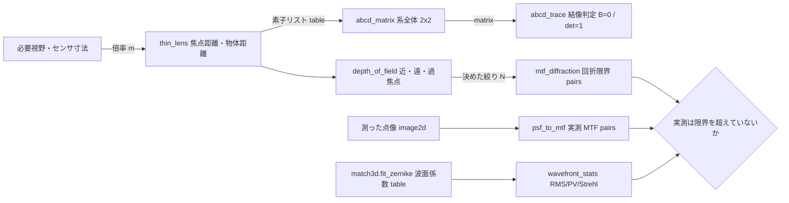
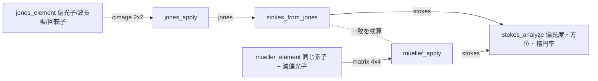

# 光学(レンズ・回折・偏光) — 使い方ガイド

## この族は何をする道具箱か

**レンズより上、画素より下**の層です。産業ビジョン(検査ライン)でも Physical AI(ロボット知覚)でも、画像処理を始める前に誰も撮っていない決定があります — どの焦点距離か、絞りはどこか、被写界深度はどれだけか、回折で潰れる最小欠陥は何 µm か、偏光板でテカりは消えるか。それらは全部**閉形式の計算**で、この族はそれを第一級の op にしたものです。18 op / 4 カテゴリ(numpy + scipy のみ、台帳は `opsoptics.py`、実体は `optics.py`):

- **geometric(5)** — `thin_lens` / `abcd_matrix` / `abcd_trace` / `depth_of_field` / `relative_illumination`: ガウス結像、近軸光線伝達(系全体を 1 つの 2x2 に畳む ABCD 代数)、被写界深度の三点セット(近限界・遠限界・過焦点距離)、cos⁴ の自然口径食。
- **wave(4)** — `airy_pattern` / `angular_spectrum_propagate` / `fraunhofer_pattern` / `gaussian_beam`: 円形瞳の回折限界 PSF、角スペクトル法による**厳密な**自由空間伝搬(近軸近似をしない)、開口の遠方回折像、ガウシアンビームの q パラメータ伝搬。
- **imaging(3)** — `psf_to_mtf` / `mtf_diffraction` / `wavefront_stats`: 測った点像を分解能曲線に変える PSF → OTF → MTF の鎖、それと突き合わせる回折限界の閉形式、Zernike フィットから出す波面統計(RMS / PV / Strehl)。
- **polarization(6)** — `jones_element` / `jones_apply` / `stokes_from_jones` / `mueller_element` / `mueller_apply` / `stokes_analyze`: 完全偏光を扱う Jones 計算と、**部分偏光**まで運べる Stokes/Mueller 計算(偏光カメラが実際に測るのは後者)。

データ種は既存語彙の再利用が基本です: **table**(dict、計測値の束/ABCD 素子リスト)、**matrix**(ABCD 2x2・Mueller 4x4 の実行列 — `mat_svd` や `mat_cond` にそのまま流せる)、**image2d**(PSF・開口・強度像)、**cimage**(2-D complex = 複素場と Jones 行列)、**pairs**((n,2) の曲線 = MTF・cos⁴)。新語は 2 つだけ、**jones**(長さ 2 固定の complex ベクトル)と **stokes**(長さ 4 固定 + 偏光度 ≤ 1 の物理制約)で、これは `signal` / `cpoints` に相乗りさせると「256 点の正弦波を Stokes 枠に渡せる」という**型レベルの嘘**になるためです。

## 既存 op との棲み分け(重複させていないもの)

| やりたいこと | 使う op | 置き場所 |
|---|---|---|
| 面で曲がる**実際の光線**(反射・Snell 屈折・Fresnel 反射率・全反射) | `reflect` / `refract` / `snell_angle` / `fresnel_reflectance` / `normal_from_reflection` | `match3d`(この族は近軸・スカラなので、光線と面の相互作用はそちら) |
| 円板画像から Zernike 係数を**フィット**する | `fit_zernike` | `match3d`(`wavefront_stats` はその返り dict をそのまま食い、**match3d 自身の基底ビルダーを再利用**するので規約がずれない) |
| PSF による**ぼかし・逆畳み込み** | `vol_gaussian_psf` / `vol_richardson_lucy` / `cx_wiener_deconvolve` | `volrestore` / `complexops`(`psf_to_mtf` は特性化するだけで復元はしない) |
| FFT・複素画像・位相アンラップ | `cx_fft` 系 / `phase_unwrap` | `complexops` |
| 位相シフト干渉法・縞投影(N-step) | `wrapped_phase` / `unwrap_phase_2d` / `phase_to_height` | `fringe`(一般 N-step が既にあるので 4-step PSI は置かない) |

## ファミリ共通の入力契約(fail-closed)

全 op が入力を検証してから計算します。以下は 2026-09-01 の敵対監査で**実際に見つかったバグ**か、それを塞ぐために書いた罠です:

- **単位は引数名に埋め込む** — `_mm` / `_um` / `_deg` / `_mrad`。mm と µm の取り違えは crash ではなく「もっともらしく間違った答え」なので名前で防ぐ。大きさから単位を推測する処理は一切しない。
- **文字列は `ValueError`** — `float("50")` は成功してしまうので、未パースの設定値が長さとして通り抜ける(実測: `thin_lens("50", "200")` が 66.667 mm を返していた)。bool も `True == 1` の暗黙昇格として拒否。
- **complex / masked array は `ValueError`**(実数枠のみ。虚部の無言切り捨て・マスク剥がしを拒否)。**NaN/Inf は全入力で `ValueError`**。
- **0 除算とその親戚を名指しで拒否**: 焦点距離 0・曲率半径 0・屈折率 ≤ 0・不透明な開口(全 0 → 正規化が 0/0)・総和 ≤ 0 の PSF・S0 = 0 の Stokes ベクトル・物体が前側焦点(像が無限遠)。
- **非有限を返すのは 2 op だけ、しかも契約として明記**: `depth_of_field` の過焦点距離以遠の `far_mm = inf`(それが過焦点距離の定義)と `gaussian_beam` のウエストでの `wavefront_radius_mm = inf`(平面波面の曲率半径)。どちらも有限の相棒(`far_is_infinite` / `curvature_per_mm`)を併せて返す。**それ以外の無言 NaN/Inf は内部で検出して `ValueError`** —「float64 が溢れた」と「答えが無限大」は別の主張だから。
- **サイズ上限**: 生成格子 `MAX_GRID`(4096)、供給された場/PSF/開口 `MAX_FIELD_ELEMENTS`(2²⁴)、ABCD 素子列 `MAX_SYSTEM_ELEMENTS`(1024)、Zernike は `MAX_ZERNIKE_TERMS`(512)/ `MAX_ZERNIKE_ORDER`(40)/ `MAX_ZERNIKE_BASIS`(2²⁵)。小さな引数から巨大な内部確保が起きる経路(実測: n_max=40 × 4096² で 108 GB)を塞ぐ。
- **物理的に不可能な状態も拒否**: 偏光度 > 1 の Stokes ベクトル、負の透過率、負の強度、n−|m| が奇数などの不正な Zernike 添字。

## 代表的なパイプライン(op の繋がり)

検査機を 1 台、紙の上で設計しきる筋(検証済み `examples/optics_imaging.py` そのもの)。倍率 → 系の行列 → 深度 → 回折限界 → 収差 → 偏光、とデータ種が `table → matrix → table → pairs → table` で繋がります。



偏光の筋は独立した 2 本立てで、**互いの検算**になります(同じ素子を両方の代数で組み、同じ Stokes ベクトルに落ちることを確かめる — 符号規約の取り違えはこの突き合わせでしか捕まりません)。



## 使い方(最小の 1 本)

```python
import optics as O

# 20 mm の視野を倍率 -0.43 で撮る 50 mm レンズ
lens = O.thin_lens(focal_mm=50.0, object_mm=50.0 * (1 - 1 / -0.43))
system = O.abcd_matrix([("free", lens["object_mm"]), ("lens", 50.0),
                        ("free", lens["image_mm"])])
print(O.abcd_trace(system)["imaging"])          # True = 本当に共役面

# 許容錯乱円 2 画素(3.45 µm 画素)での被写界深度と、その絞りの回折限界
dof = O.depth_of_field(50.0, 5.6, lens["object_mm"], coc_mm=2 * 3.45e-3)
mtf = O.mtf_diffraction(f_number=5.6, wavelength_um=0.55)
print(dof["depth_mm"], mtf[-1, 0])              # 深度 [mm], カットオフ [cyc/mm]

# 金属面のテカりを直交偏光で消す(Jones)
blocked = O.jones_apply(O.jones_element("polarizer", 90.0)
                        @ O.jones_element("polarizer", 0.0), [1.0, 0.0])
print(abs(blocked).max())                        # 0.0
```

## アルゴリズムの正典(著者・年)

- **ガウス結像 / ABCD 行列**: Gauss (1841) の近軸結像式、行列光学は Kogelnik & Li, *Laser Beams and Resonators*, Appl. Opt. 5(10), 1966(ガウシアンビームの q パラメータもここ)。
- **被写界深度・過焦点距離**: 錯乱円モデルの標準式(例 Ray, *Applied Photographic Optics*, 3rd ed., 2002)。
- **cos⁴ 則**: 自然口径食の古典。距離の逆二乗が 2 回、射出瞳の傾きが 1 回、像面の傾きが 1 回。
- **Airy パターン**: Airy (1835)。第 1 暗環は J₁ の第 1 零点 3.8317 → 半径 1.2197 λN。
- **角スペクトル法**: Goodman, *Introduction to Fourier Optics*, §3.10(Helmholtz 方程式の**厳密**解。Fresnel と違い近軸近似が要らない)。
- **回折限界 MTF**: Goodman §6.3、`(2/π)(arccos x − x√(1−x²))`、カットオフ 1/(λN)。
- **Zernike 多項式と Maréchal の Strehl 近似**: Born & Wolf, *Principles of Optics*, §9.2。`exp(−(2πσ)²)` は級数の打ち切りなので、RMS 0.1 波あたりから楽観側にずれます(`marechal_valid` がそれを明示)。
- **Jones 計算**: Jones (1941), *A New Calculus for the Treatment of Optical Systems*, JOSA 31(7)。**Stokes / Mueller**: Stokes (1852), Mueller (1943)。本族の符号規約は `exp(−iωt)`、`S3 > 0` が右回り円偏光(テストで固定済み)。

## 正直な限界

- **幾何 op はすべて近軸・薄肉**。収差なし、厚みなし、瞳収差なし、機械的口径食なし。実レンズは `1/f = 1/s + 1/s'` からも cos⁴ からもずれます — **設計の出発点**であってレンズモデルではありません。
- **スカラ回折**なので偏光と高 NA を無視します。`airy_pattern` / `mtf_diffraction` は円形・無遮蔽・無収差の瞳が前提(中央遮蔽のある反射望遠鏡はリング構造が変わります)。
- **角スペクトルの離散伝達関数は周期的**なので、配列の端を越えて回折した光は巻き込みます。場をパディングして伝搬後の広がりを内側に収めるのが実務上の対策で、配列だけからこれを確実に検出する方法はないため**警告を捏造していません**。
- **`wavefront_stats` の動径求積は離散**で、誤差は `(n_max/radial)²` に比例(実測 1.2e-4 @ n=2、1.7e-3 @ n=6、4.3e-2 @ n=20、いずれも既定 `radial=128`)。`radial >= 16*n_max` を割ると `RuntimeWarning` が出ます。さらに共有基底ビルダーは高次で桁落ちするため(実測 max|Z| が n=46 で 1.41、n=50 で 71.5、理論上界は 1)、n > 40 は拒否します。
- **`fraunhofer_pattern` の出力面は入力面と別のサンプル間隔**(`λz/(N·dx)`)。画像はそれを運べないので docstring の式で計算してください。Fresnel 数が 1 未満でなければ `RuntimeWarning` が出ます(返す値は要求どおりの Fourier 変換ですが、その距離の**物理**ではない、という意味です)。

---

© 2026 Kazufumi Furuse — Fullseye operator documentation. Licensed under Apache-2.0.
