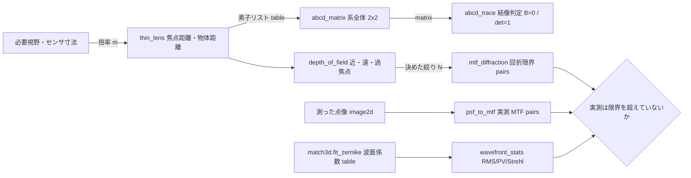
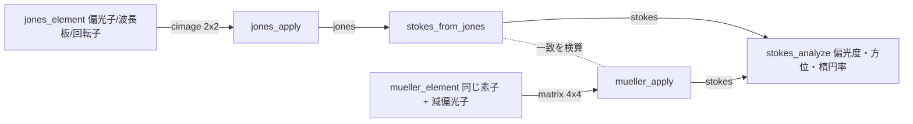
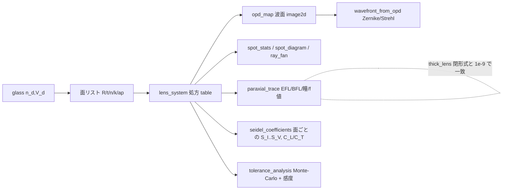

# 光学(レンズ・回折・偏光) — 使い方ガイド

## この族は何をする道具箱か

**レンズより上、画素より下**の層です。産業ビジョン(検査ライン)でも Physical AI(ロボット知覚)でも、画像処理を始める前に誰も撮っていない決定があります — どの焦点距離か、絞りはどこか、被写界深度はどれだけか、回折で潰れる最小欠陥は何 µm か、偏光板でテカりは消えるか。それらは全部**閉形式の計算**で、この族はそれを第一級の op にしたものです。18 op / 4 カテゴリ(numpy + scipy のみ、台帳は `opsoptics.py`、実体は `optics.py`):

- **geometric(5)** — `thin_lens` / `abcd_matrix` / `abcd_trace` / `depth_of_field` / `relative_illumination`: ガウス結像、近軸光線伝達(系全体を 1 つの 2x2 に畳む ABCD 代数)、被写界深度の三点セット(近限界・遠限界・過焦点距離)、cos⁴ の自然口径食。
- **wave(4)** — `airy_pattern` / `angular_spectrum_propagate` / `fraunhofer_pattern` / `gaussian_beam`: 円形瞳の回折限界 PSF、角スペクトル法による**厳密な**自由空間伝搬(近軸近似をしない)、開口の遠方回折像、ガウシアンビームの q パラメータ伝搬。
- **imaging(3)** — `psf_to_mtf` / `mtf_diffraction` / `wavefront_stats`: 測った点像を分解能曲線に変える PSF → OTF → MTF の鎖、それと突き合わせる回折限界の閉形式、Zernike フィットから出す波面統計(RMS / PV / Strehl)。
- **polarization(6)** — `jones_element` / `jones_apply` / `stokes_from_jones` / `mueller_element` / `mueller_apply` / `stokes_analyze`: 完全偏光を扱う Jones 計算と、**部分偏光**まで運べる Stokes/Mueller 計算(偏光カメラが実際に測るのは後者)。
- **design(12、実体は `raytrace.py`)** — `lens_system` / `thick_lens` / `glass` / `example_system` / `paraxial_trace` / `spot_diagram` / `spot_stats` / `ray_fan` / `opd_map` / `wavefront_from_opd` / `seidel_coefficients` / `tolerance_analysis`: 上の 4 カテゴリが**近軸・閉形式**なのに対し、こちらは球面/円錐面の逐次処方に**実光線**を通す設計層(下の「設計(design)」節)。

データ種は既存語彙の再利用が基本です: **table**(dict、計測値の束/ABCD 素子リスト)、**matrix**(ABCD 2x2・Mueller 4x4 の実行列 — `mat_svd` や `mat_cond` にそのまま流せる)、**image2d**(PSF・開口・強度像)、**cimage**(2-D complex = 複素場と Jones 行列)、**pairs**((n,2) の曲線 = MTF・cos⁴)。新語は 2 つだけ、**jones**(長さ 2 固定の complex ベクトル)と **stokes**(長さ 4 固定 + 偏光度 ≤ 1 の物理制約)で、これは `signal` / `cpoints` に相乗りさせると「256 点の正弦波を Stokes 枠に渡せる」という**型レベルの嘘**になるためです。

## 既存 op との棲み分け(重複させていないもの)

| やりたいこと | 使う op | 置き場所 |
|---|---|---|
| 面で曲がる**実際の光線**(反射・Snell 屈折・Fresnel 反射率・全反射) | `reflect` / `refract` / `snell_angle` / `fresnel_reflectance` / `normal_from_reflection` | `match3d`(この族は近軸・スカラなので、光線と面の相互作用はそちら) |
| 円板画像から Zernike 係数を**フィット**する | `fit_zernike` | `match3d`(`wavefront_stats` はその返り dict をそのまま食い、**match3d 自身の基底ビルダーを再利用**するので規約がずれない) |
| PSF による**ぼかし・逆畳み込み** | `vol_gaussian_psf` / `vol_richardson_lucy` / `cx_wiener_deconvolve` | `volrestore` / `complexops`(`psf_to_mtf` は特性化するだけで復元はしない) |
| FFT・複素画像・位相アンラップ | `cx_fft` 系 / `phase_unwrap` | `complexops` |
| 位相シフト干渉法・縞投影(N-step) | `wrapped_phase` / `unwrap_phase_2d` / `phase_to_height` | `fringe`(一般 N-step が既にあるので 4-step PSI は置かない) |

## ファミリ共通の入力契約(fail-closed)

全 op が入力を検証してから計算します。以下は 2026-09-01 の敵対監査で**実際に見つかったバグ**か、それを塞ぐために書いた罠です:

- **単位は引数名に埋め込む** — `_mm` / `_um` / `_deg` / `_mrad`。mm と µm の取り違えは crash ではなく「もっともらしく間違った答え」なので名前で防ぐ。大きさから単位を推測する処理は一切しない。
- **文字列は `ValueError`** — `float("50")` は成功してしまうので、未パースの設定値が長さとして通り抜ける(実測: `thin_lens("50", "200")` が 66.667 mm を返していた)。bool も `True == 1` の暗黙昇格として拒否。
- **complex / masked array は `ValueError`**(実数枠のみ。虚部の無言切り捨て・マスク剥がしを拒否)。**NaN/Inf は全入力で `ValueError`**。
- **0 除算とその親戚を名指しで拒否**: 焦点距離 0・曲率半径 0・屈折率 ≤ 0・不透明な開口(全 0 → 正規化が 0/0)・総和 ≤ 0 の PSF・S0 = 0 の Stokes ベクトル・物体が前側焦点(像が無限遠)。
- **非有限を返すのは 2 op だけ、しかも契約として明記**: `depth_of_field` の過焦点距離以遠の `far_mm = inf`(それが過焦点距離の定義)と `gaussian_beam` のウエストでの `wavefront_radius_mm = inf`(平面波面の曲率半径)。どちらも有限の相棒(`far_is_infinite` / `curvature_per_mm`)を併せて返す。**それ以外の無言 NaN/Inf は内部で検出して `ValueError`** —「float64 が溢れた」と「答えが無限大」は別の主張だから。
- **サイズ上限**: 生成格子 `MAX_GRID`(4096)、供給された場/PSF/開口 `MAX_FIELD_ELEMENTS`(2²⁴)、ABCD 素子列 `MAX_SYSTEM_ELEMENTS`(1024)、Zernike は `MAX_ZERNIKE_TERMS`(512)/ `MAX_ZERNIKE_ORDER`(40)/ `MAX_ZERNIKE_BASIS`(2²⁵)。小さな引数から巨大な内部確保が起きる経路(実測: n_max=40 × 4096² で 108 GB)を塞ぐ。
- **物理的に不可能な状態も拒否**: 偏光度 > 1 の Stokes ベクトル、負の透過率、負の強度、n−|m| が奇数などの不正な Zernike 添字。

## 代表的なパイプライン(op の繋がり)

検査機を 1 台、紙の上で設計しきる筋(検証済み `examples/optics_imaging.py` そのもの)。倍率 → 系の行列 → 深度 → 回折限界 → 収差 → 偏光、とデータ種が `table → matrix → table → pairs → table` で繋がります。



偏光の筋は独立した 2 本立てで、**互いの検算**になります(同じ素子を両方の代数で組み、同じ Stokes ベクトルに落ちることを確かめる — 符号規約の取り違えはこの突き合わせでしか捕まりません)。



## 使い方(最小の 1 本)

```python
import optics as O

# 20 mm の視野を倍率 -0.43 で撮る 50 mm レンズ
lens = O.thin_lens(focal_mm=50.0, object_mm=50.0 * (1 - 1 / -0.43))
system = O.abcd_matrix([("free", lens["object_mm"]), ("lens", 50.0),
                        ("free", lens["image_mm"])])
print(O.abcd_trace(system)["imaging"])          # True = 本当に共役面

# 許容錯乱円 2 画素(3.45 µm 画素)での被写界深度と、その絞りの回折限界
dof = O.depth_of_field(50.0, 5.6, lens["object_mm"], coc_mm=2 * 3.45e-3)
mtf = O.mtf_diffraction(f_number=5.6, wavelength_um=0.55)
print(dof["depth_mm"], mtf[-1, 0])              # 深度 [mm], カットオフ [cyc/mm]

# 金属面のテカりを直交偏光で消す(Jones)
blocked = O.jones_apply(O.jones_element("polarizer", 90.0)
                        @ O.jones_element("polarizer", 0.0), [1.0, 0.0])
print(abs(blocked).max())                        # 0.0
```

## 設計(design) — 近軸の先を実光線で

上の 4 カテゴリは「設計の出発点」を閉形式で出します。実レンズがそこからどれだけずれるか — 像はどこに結び、どれだけボケ、どの面が原因で、製造ばらつきで歩留まりはどうなるか — は面を 1 枚ずつ**実光線**で通さないと分かりません。`raytrace.py` はそのための逐次光線追跡で、台帳では `opsoptics` の `design` カテゴリ(12 op)に載ります。全 op の共通入力は `lens_system` が返す**検証済みの処方(table)** です:

- **処方**: `lens_system(surfaces, stop, object_mm, wavelength_um, ...)`。面は `{"R", "t", "n", "k", "ap", "mirror", "decenter", "tilt"}`(R は曲率中心が +z 側で正、`inf` で平面、`k` は円錐定数、`n` は面の**後ろ**の媒質 = 数値 / `(n_d, V_d)` / `glass`)。`thick_lens` は空気中の厚肉レンズの閉形式(lensmaker + 主点)、`glass` は d 線と F–C 分散から 2 項 Cauchy を張る硝材モデル、`example_system` は singlet / doublet / paraboloid / sphere_mirror。
- **近軸**: `paraxial_trace` → EFL / BFL / FFL / 主点 / 入射・射出瞳 / f 値 / 倍率 / Lagrange 不変量 / 周辺・主光線。
- **実光線**: `spot_stats`(RMS・幾何スポット半径、口径食本数)/ `spot_diagram`(主光線基準の (x, y) pairs)/ `ray_fan`(横収差曲線 pairs)。口径食・面外れ・全反射は **NaN で報告**(黙って切らない)。
- **波面**: `opd_map`(射出瞳基準球に対する OPD、波数、image2d)→ `match3d.fit_zernike` → `optics.wavefront_stats` を `wavefront_from_opd` が一本に繋ぐ(Zernike 係数・RMS/PV/Strehl・フィット非依存の直接 RMS)。符号は Welford: 補正不足の球面収差が `W040 = +S_I/8`。
- **三次収差**: `seidel_coefficients` → 面ごとの S_I…S_V と色収差 C_L / C_T(mm × 8、`waves` 併記、`W040 = S_I/8` 等の波面換算つき)。小口径の厳密 OPD をフィットすると W040 が 0.3 %、W131 が 1 %(1 deg)で一致し、5 deg では**高次が 10 % 上乗せされる**(実光線ならではのずれ)。
- **公差**: `tolerance_analysis` → 半径 % / 厚み mm / 屈折率 / 偏心 mm / 傾き deg を全面独立に一様乱数で振る Monte-Carlo(EFL と rms_spot の mean / std / p5 / p95 / worst)と、面 × パラメータごとの中心差分感度。seed で決定的。



**1. singlet を近軸 → スポット → Seidel と流す**(検証済み `examples/lens_design_demo.py` の筋):

```python
import raytrace as RT

lens = RT.lens_system()                          # 平凸 BK7 f=100 f/4、絞りは第 1 面
p = RT.paraxial_trace(lens)
print(round(p["efl"], 3), round(p["bfl"], 3), p["fno"])      # 100.0 96.704 4.0
spot = RT.spot_stats(lens)                       # 軸上の RMS スポット半径 [mm]
se = RT.seidel_coefficients(lens, field=5.0)     # 面ごとの三次収差
print(round(spot["rms_radius"], 4), round(se["waves"]["S_I"] / 8, 2))   # 0.1304 11.29
assert abs(p["efl"] - 100.0) < 1e-6 and se["waves"]["S_I"] > 0            # 補正不足(正)
assert abs(sum(r["S_I"] for r in se["per_surface"]) - se["total"]["S_I"]) < 1e-12
```

**2. 放物面鏡は軸上で完全結像(OPD が 0)、同半径の球面鏡はそうでない**:

```python
import numpy as np
import raytrace as RT

para = RT.example_system("paraboloid")           # R=-200, k=-1, f=100
sph = RT.example_system("sphere_mirror")
opd = RT.opd_map(para, fill=np.nan)              # 射出瞳基準球に対する OPD [waves]
print(np.nanmax(np.abs(opd)) < 1e-6)             # True: 無収差(stigmatic)
print(RT.spot_stats(para)["rms_radius"] < 1e-9,  # True
      round(RT.spot_stats(sph)["rms_radius"], 3))  # 0.119(球面収差)
assert RT.spot_stats(para, field=1.0)["rms_radius"] > 0.01     # 軸外はコマ
```

**3. 公差表 — どの面のどの誤差が効くか**:

```python
import raytrace as RT

tol = RT.tolerance_analysis(RT.lens_system(),
                            {"radius_pct": 0.5, "thickness_mm": 0.05,
                             "index": 0.001, "decenter_mm": 0.02, "tilt_deg": 0.05},
                            trials=20, seed=1)
r = tol["rms_spot"]
print(round(tol["nominal"]["rms_spot"], 4), round(r["p95"], 4), tol["failed"])
top = tol["sensitivity"][0]                      # |d_rms_spot| の大きい順
print(top["surface"], top["parameter"], round(top["d_efl"], 3))   # 0 R 0.5
assert tol["failed"] == 0 and top["parameter"] == "R"
```

**棲み分け**: optics = 近軸/波動(閉形式、設計の出発点)、raytrace = 実光線・設計(処方から数値で)。面での反射・屈折のスカラ公式(`match3d.refract` 等)を 1 本の光線に使うのは今までどおり match3d、**系を通す**のが raytrace です。

## 結像シミュレーション(imaging_sim) — 設計したレンズで撮る

「擬似物理空間に光学系を組み、AI 学習用の欠陥画像を生成したい」という要望の出口が `lensimage.py`(台帳では `opsoptics` の `imaging_sim` カテゴリ、4 op)です。処方(`lens_system` の table)から**センサが記録する画像**まで通します:

- **PSF**: `psf_from_opd(system, field, size, pixel_pitch_um, oversample)` — 実収差瞳の回折 PSF。`raytrace.opd_samples` の OPD(波数)から瞳関数 `P = mask·exp(i2πW)` を作り、ゼロ詰め FFT の `|FFT(P)|²`(インコヒーレント結像)。像面のサンプル間隔は `λ·F#/oversample`(`F# = 1/(2·NA_image)`、`paraxial_trace` から)。`size=None` は瞳の位相を 0.4 波/サンプル以下に保つ格子を自動で選び、明示 `size` がエイリアスするなら拒否します。`pixel_pitch_um` を与えると微細 PSF を**画素面積で積分**(点サンプルではない)。`psf_field_grid` は複数視野の PSF と Strehl(無収差ピークとの比)・RMS スポットを表で返します。
- **歪曲**: `distortion_map(system, image_size, pixel_pitch_um, fields)` — 各視野の実主光線像高 vs 近軸 `f·tanθ`(有限物体は `m·H`)、`distortion_pct`(負 = 樽型)、奇数次多項式フィット、そして**実センサ画素ごとに「理想像のどの座標を見るか」の逆写像格子**(`grid_rows` / `grid_cols`、`map_coordinates` 用)。
- **描画**: `render_through_lens(image, system, pixel_pitch_um, field_of_view, zones, noise, seed, illumination)` — (a) 理想像を逆写像で歪曲、(b) `zones×zones` タイルの中心視野ごとに画素積分 PSF(+y 視野の PSF をタイル方位へ回転)で畳み込み、テント重みで線形ブレンド(継ぎ目なし)、(c) 周辺光量 = **追跡した光線束の到達率(口径食)× cos⁴**(`"traced"`、既定)/ `"cos4"` / `"none"`、(d) センサ: 露光 × full_well で電子数 → ショット雑音(`photoncount.photon_sample`)→ 読出雑音 → `bits` に量子化。`noise=None` は雑音なしの実数(決定的)。
- **データセット**: `defect_dataset(n, system, size, kinds, pixel_pitch_um, noise, seed, out_dir)` — `defectgen` の傷/孔食/割れ/しみを `surface_texture` 背景に合成してレンズ越しに描き、**マスクは同じ歪曲だけ通す**(ぼかさない)ので注釈が像に揃う。`out_dir` で PNG と COCO 風 `annotations.json`。

グラウンドトゥルース(`tests/test_lensimage.py`): 無収差瞳(singlet を 1 mm 絞り)は Airy — 第 1 暗環 1.22·λ·F# の 0.1 % 以内、暗環内エネルギー 83.8 %。f/4 singlet(球面収差 11 波)の Strehl 0.011。放物面鏡の歪曲 < 1e-7 %、singlet は樽型 −0.065 %(15 deg)。δ 画像を放物面鏡で描くと画素積分 Airy PSF と 1e-12 で一致。傷マスクの歪曲後 IoU 0.77。

**1. PSF・Strehl・歪曲を singlet と doublet で見比べる**(検証済み `examples/lens_defect_dataset_demo.py` の筋):

```python
import raytrace as RT
import lensimage

sg, db = RT.example_system("singlet"), RT.example_system("doublet")
psf = lensimage.psf_from_opd(sg, pixel_pitch_um=5.5)      # 画素積分 PSF、和 = 1
print(psf.shape, round(float(psf.sum()), 6))
g = lensimage.psf_field_grid(db, fields=(0.0, 4.0))
print([round(s, 4) for s in g["strehl"]], [round(r, 4) for r in g["rms_spot_mm"]])
d = lensimage.distortion_map(sg, fields=[0.0, 5.0, 10.0, 15.0])
print([round(v, 4) for v in d["distortion_pct"]])          # 0, ..., -0.0649 (樽型)
assert d["distortion_pct"][-1] < 0.0
```

**2. 欠陥画像を doublet 越しに 2 枚作り、注釈が像に揃っていることを確かめる**:

```python
import numpy as np
import raytrace as RT
import lensimage

recs = lensimage.defect_dataset(2, system=RT.example_system("doublet"),
                                size=(96, 96), seed=1)  # out_dir=... で PNG + annotations.json
r = recs[0]
print(r["image"].shape, r["mask"].dtype, [(d["kind"], d["bbox"]) for d in r["defects"]])
print({k: round(v, 4) for k, v in r["lens"].items()})   # efl / fno / rms_spot / 歪曲
assert r["image"].shape == r["mask"].shape and r["mask"].any()
same = lensimage.defect_dataset(2, system=RT.example_system("doublet"), size=(96, 96), seed=1)
assert np.array_equal(r["image"], same[0]["image"])       # seed で再現
```

**正直な限界**: 単色・インコヒーレント結像(色ごとの PSF が要るなら波長を変えて呼び足し合わせる)。視野依存 PSF は `zones²` 点の線形補間で、軸外 PSF は +y 視野の PSF をタイル方位へ回した近似(回転対称な処方が前提 — 偏心・傾きのある処方は +y の PSF のみ)。周辺光量は光線の到達数 × cos⁴ で、瞳収差の重みは入っていません。センサは線形・一様の雑音モデルのみ(クロストーク・PRNU・カラーフィルタなし)。

## アルゴリズムの正典(著者・年)

- **ガウス結像 / ABCD 行列**: Gauss (1841) の近軸結像式、行列光学は Kogelnik & Li, *Laser Beams and Resonators*, Appl. Opt. 5(10), 1966(ガウシアンビームの q パラメータもここ)。
- **被写界深度・過焦点距離**: 錯乱円モデルの標準式(例 Ray, *Applied Photographic Optics*, 3rd ed., 2002)。
- **cos⁴ 則**: 自然口径食の古典。距離の逆二乗が 2 回、射出瞳の傾きが 1 回、像面の傾きが 1 回。
- **Airy パターン**: Airy (1835)。第 1 暗環は J₁ の第 1 零点 3.8317 → 半径 1.2197 λN。
- **角スペクトル法**: Goodman, *Introduction to Fourier Optics*, §3.10(Helmholtz 方程式の**厳密**解。Fresnel と違い近軸近似が要らない)。
- **回折限界 MTF**: Goodman §6.3、`(2/π)(arccos x − x√(1−x²))`、カットオフ 1/(λN)。
- **Zernike 多項式と Maréchal の Strehl 近似**: Born & Wolf, *Principles of Optics*, §9.2。`exp(−(2πσ)²)` は級数の打ち切りなので、RMS 0.1 波あたりから楽観側にずれます(`marechal_valid` がそれを明示)。
- **Jones 計算**: Jones (1941), *A New Calculus for the Treatment of Optical Systems*, JOSA 31(7)。**Stokes / Mueller**: Stokes (1852), Mueller (1943)。本族の符号規約は `exp(−iωt)`、`S3 > 0` が右回り円偏光(テストで固定済み)。

## 正直な限界

- **幾何 op はすべて近軸・薄肉**。収差なし、厚みなし、瞳収差なし、機械的口径食なし。実レンズは `1/f = 1/s + 1/s'` からも cos⁴ からもずれます — **設計の出発点**であってレンズモデルではありません。
- **スカラ回折**なので偏光と高 NA を無視します。`airy_pattern` / `mtf_diffraction` は円形・無遮蔽・無収差の瞳が前提(中央遮蔽のある反射望遠鏡はリング構造が変わります)。
- **角スペクトルの離散伝達関数は周期的**なので、配列の端を越えて回折した光は巻き込みます。場をパディングして伝搬後の広がりを内側に収めるのが実務上の対策で、配列だけからこれを確実に検出する方法はないため**警告を捏造していません**。
- **`wavefront_stats` の動径求積は離散**で、誤差は `(n_max/radial)²` に比例(実測 1.2e-4 @ n=2、1.7e-3 @ n=6、4.3e-2 @ n=20、いずれも既定 `radial=128`)。`radial >= 16*n_max` を割ると `RuntimeWarning` が出ます。さらに共有基底ビルダーは高次で桁落ちするため(実測 max|Z| が n=46 で 1.41、n=50 で 71.5、理論上界は 1)、n > 40 は拒否します。
- **`fraunhofer_pattern` の出力面は入力面と別のサンプル間隔**(`λz/(N·dx)`)。画像はそれを運べないので docstring の式で計算してください。Fresnel 数が 1 未満でなければ `RuntimeWarning` が出ます(返す値は要求どおりの Fourier 変換ですが、その距離の**物理**ではない、という意味です)。

---

© 2026 Kazufumi Furuse — Fullseye operator documentation. Licensed under Apache-2.0.
