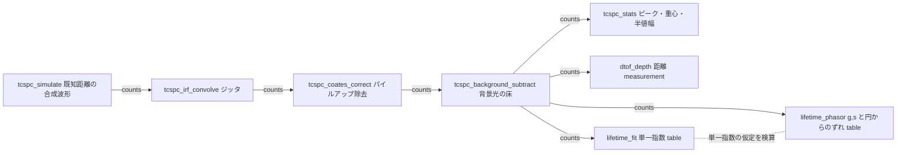
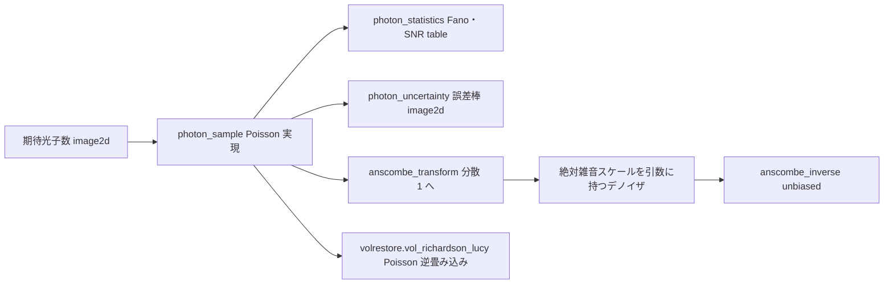
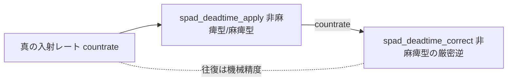

# 光子計数・時間分解(SPAD・TCSPC・dToF・寿命) — 使い方ガイド

## この族は何をする道具箱か

**画素値になる前**の層です。普通のセンサーは光子を積分して階調にしますが、単一光子検出器(SPAD)は**光子を何個数えたか**と**いつ届いたか**を返します。そこから先は算術が変わります — 測定値は Poisson カウントで、雑音は調整項ではなく `sqrt(N)`、検出器は 1 個数えるたびに一定時間目が見えなくなり、到達時刻のヒストグラムには距離(直接飛行時間 = dToF)と蛍光寿命が入っています。それらは全部**閉形式の計算**で、この族はそれを第一級の op にしたものです。17 op / 6 カテゴリ(numpy + scipy のみ、台帳は `opsphoton.py`、実体は `photoncount.py`):

- **counting(3)** — `photon_sample` / `photon_statistics` / `photon_uncertainty`: 期待光子数を Poisson 実現に変える(seed で決定的)、そのフレームが本当にショット雑音限界か測る(Fano 因子、`SNR = sqrt(N)`)、画素ごとに誤差棒を付ける。
- **transform(2)** — `anscombe_transform` / `anscombe_inverse`: 分散安定化変換。古典形と一般化形(gain + 読み出し雑音)、代数逆と厳密不偏逆の両方。
- **spad(3)** — `spad_deadtime_apply` / `spad_deadtime_correct` / `tcspc_coates_correct`: 非麻痺型・麻痺型のデッドタイム則、非麻痺型の**厳密逆**、そして TCSPC のパイルアップ(先頭光子だけを記録することによる早い側への偏り)を**厳密に**戻す Coates 推定量。
- **tcspc(4)** — `tcspc_simulate` / `tcspc_irf_convolve` / `tcspc_background_subtract` / `tcspc_stats`: 答えの分かっている合成到達時刻ヒストグラム、装置応答(タイミングジッタ)の畳み込み、背景光の床除去、ヒストグラム記述子(ピーク・重心・半値全幅・背景・信号対背景比)。
- **dtof(3)** — `dtof_depth` / `dtof_cube_simulate` / `dtof_cube_depth`: 到達時刻から距離 `d = c*t/2` を、1 画素分と **(H, W, T) ヒストグラム立方体**の両方で(後者が SPAD アレイが実際に吐くもの)。
- **lifetime(2)** — `lifetime_fit` / `lifetime_phasor`: 単一指数減衰のフィットと、単一指数の軌跡が universal semicircle になる phasor(周波数領域)表現。

データ種は既存語彙の再利用が基本です: **image2d**(光子カウント画像 — 整数値を float64 に載せた 2-D なので既存のフィルタ・閾値・morphology がそのまま意味を持つ)、**depth**((H, W) の距離マップ = stereo / range_image 側の depth op へ直結)、**measurement**(単一画素の距離)、**table**(統計・フィット結果の dict)。

新語は 3 つ、いずれも「既存語彙で宣言すると型レベルの嘘になる」ものだけです:

- **counts** — 時間 bin で添字づけられた**非負**の光子カウント列(1-D)。
- **countrate** — SPAD の**計数レート列(Hz)**(1-D、非負)。counts と形は同じですが値域が 7 桁違う別の量です。
- **histcube** — 画素ごとの到達時刻立方体 **(H, W, T)、時間軸が最後**。既存の `voxel` は (D, H, W) の空間格子で、軸の意味が違います。

この 3 語を分けた理由は次節の入力契約と合わせて読んでください(特に **counts** は、分けなかったせいで op が一度も実行されない事故が実際に起きています)。

## 既存 op との棲み分け(重複させていないもの)

| やりたいこと | 使う op | 置き場所 |
|---|---|---|
| **加法ガウス読み出し雑音**(アンプ + ADC、信号に依存しない) | `aug_read_noise` | `backends_aug`。こちらは**乗法的**(分散 = 平均)な光子ショット雑音。両者が出会う唯一の場所が `anscombe_transform` の一般化形で、`gain` / `read_sigma` は `aug_read_noise` が注入するパラメータそのもの |
| 学習データ増強としての正規化ショット雑音 | `aug_shot_noise` | `backends_aug`(`Poisson(v*K)/K` を [0, 1] にクリップして返す)。`photon_sample` は**カウント N そのもの**を返す — Fano / Anscombe / Coates / dToF はすべて N が要るので、再スケール + クリップは不可逆 |
| **Poisson 逆畳み込み**(光子制限データのデブラー) | `vol_gaussian_psf` / `vol_richardson_lucy` | `volrestore`。Richardson–Lucy は**まさにこの族が生成する Poisson モデル下の最尤デブラー**なので、両者は合成関係にあります: `photon_sample` または `dtof_cube_simulate` が光子制限データを作り、そちらが復元する。ここでは一切デブラーしないし、あちらは一切サンプリングしない |
| 光学設計(PSF・MTF・回折・被写界深度) | `airy_pattern` / `psf_to_mtf` / `depth_of_field` ほか | `optics`。`tcspc_irf_convolve` はその**時間軸版**であり、空間側は複製しない |
| 1-D 信号処理(フィルタ・スペクトル・リサンプル) | `lowpass` / `envelope` / `spectrum` / `smooth_funct_1d_gauss` ほか | `dsp` / `funct1d`。ヒストグラムは素の 1-D float64 配列なので**そのまま渡せます**(ラップし直していません)。非対称なのは意図的で、ヒストグラムは常に signal op に渡せますが、任意の signal はヒストグラムではありません(光子カウントは非負) |
| 位相シフト干渉法・縞投影(位相からの距離) | `wrapped_phase` / `phase_to_height` | `fringe`。あれは**間接**飛行時間(位相)、こちらは**直接**飛行時間(到達時刻)。原理が違うので別族です |

## ファミリ共通の入力契約(fail-closed)

全 op が入力を検証してから計算します。以下は 2026-09-01 の敵対監査で**実際に見つかったバグ**か、それを塞ぐために書いた罠です。**罠を仕掛けた理由も併記**します — 「なぜそこを守るのか」が分からないと、後から善意で外されるからです。

- **単位は引数名に埋め込む** — `_ps` / `_ns` / `_hz` / `_m`。ピコ秒とナノ秒の取り違えは crash ではなく**距離が 1000 倍ずれた、もっともらしい答え**になります。大きさから単位を推測する処理は一切しません。
- **bin の代表時刻は中心** — bin `k` は `[k*dt, (k+1)*dt)` を覆い、代表時刻は `(k + 0.5)*dt`。全 op(ピーク・重心・サブ bin 補間・シミュレータ)が同じ規約なので、`t0` に立てたパルスは `t0` で返ってきます。
- **系遅延 `offset_ps` は「引く」向き** — `t_flight = t_measured - offset_ps`。正の offset は距離を**近く**します。符号を間違えて負の飛行時間になる設定は、負の距離を返さず `ValueError`。
- **決定性は契約** — 標本化 op は必ず整数 `seed` を取り `numpy.random.default_rng(seed)` を使います。グローバル RNG も `seed=None` の逃げ道もありません。`noise=False` は標本化を一切せず**厳密な期待値**を返し、それが閉形式テストの突き合わせ相手です。

### 実際に見つかった 5 件のバグと、そこに置いた罠

1. **denormal による無言 NaN(最も危険だったもの)**。`irf_fwhm_ps=5e-324`(正の最小の double)は `> 0` の検査を通りますが、`5e-324 / 2.3548` は **0.0 に underflow** します。すると erf の引数 `(edge - t0)/0` はほぼ全域で `inf`(erf は飽和して正しく見える)、しかし **bin 境界がパルス中心に一致した画素だけ `0/0` = NaN** になります。最小再現 `tcspc_simulate(0.0149896229, bins=8, bin_ps=100.0, irf_fwhm_ps=5e-324, noise=False)` は `[nan, nan, 0, 0, 0, 0, 0, 0]` を**例外なしで**返していました。「有限を返す」と書いてある op から無言の NaN が出るのが最悪なので、sigma が 0 に落ちた時点で `ValueError` にしています。教訓は「正の数かどうか」と「割り算に使える数かどうか」は別の検査だ、ということです。
2. **flat ヒストグラムで `argmax` が bin 0 を拾う**。全 bin が同じ値のヒストグラムにピークはありませんが、`argmax` は黙って 0 を返し、`dtof_depth` は最初の bin の距離(100 ps bin なら 0.0075 m)を**測定値として**返していました。例外も警告も出ません。これは一様な (D, H, W) ボリュームを立方体として渡したときにちょうど起きる経路でもあります(実測: 全画素 0.0075 m)。いまは 1-D 側は `ValueError`、立方体側は該当画素を empty 判定します(二重防御)。**`histcube` を `voxel` から分けたのはこの経路を型で塞ぐため**で、型と実行時検査の両方で守っています。
3. **文字列の暗黙パース**。`dtof_cube_depth(cube, empty_value="3")` が成功していました。`float("3")` はパースに成功するので、**一度も解釈されなかった設定値が「深度 3 m」として通り抜ける**。長さ・時刻・レートを取る全引数で str / bool / complex を名指しで拒否しています。
4. **型レベルの嘘**。`anscombe_transform(np.arange(5.0))` が 1-D を返していました。台帳は `image2d -> image2d` と宣言しているので、これは連鎖ファザーが検出すべき TYPEMISS を素通りさせる穴です。厳密 2-D 化しました(1-D ヒストグラムを安定化したいなら `hist[None, :]` と明示的に書く)。
5. **既定値の地雷**。`leading_bins=8` が固定だったため、8 bin 未満のヒストグラムでは `method="leading"` の**既定呼び出しが必ず失敗**していました。誰も選んでいない定数のために失敗するのは契約ではなく事故なので、`None` → `min(8, len(hist))` に変えています。

### 型語彙を分けた理由(連鎖ファザーの実測に基づく)

`counts` を最初は既存の `signal` で宣言していました。**1200 連鎖 × 長さ 6(seed 7001)の実測で、photon 族 17 op のうち 7 op が一度も実行されていない**ことが分かりました。ファザーの `signal` プールは**負値を持つ正弦波**で、光子カウントを要求する op は毎回こう落ちます:

```
dtof_depth: hist has 127 negative bin(s) (min -1.17595) — a photon count cannot be negative
```

fail-closed は完璧に効いていました。**そしてそれが問題でした** — 「発見ゼロ」が頑健さの証拠に見えて、実際には未実行だったからです。これは `opsoptics` が `jones` / `stokes` を専用プールにしたのと同じ状況(「signal へ相乗りさせると常に CONTRACT にしかならない = 偏光連鎖を一度も通らない」)で、同じ判断をしました。新語彙にしたあとは **17/17 op が実行され、CONTRACT も TYPEMISS もゼロ**です。

`countrate` を `counts` からさらに分けたのは、2 つの実測理由によります。(a) 値域が 7 桁違うため、counts スケールの配列を `spad_deadtime_apply` に渡すと**恒等写像に限りなく近い値が例外なく返る**(実測: ピーク 2212.5 カウントで相対変化 1.11e-04、既定の `tcspc_simulate()` のピーク 23.0 なら 1.15e-06。本物のレート列 1e3–1e7 Hz は 33.3% 動く)。op は「到達」しても、飽和・`1/tau` の fail-closed・麻痺型の非単射性は一度も踏まれません。(b) 物理が違います。デッドタイムは**検出器のレート流**に効くのであって、TCSPC の時間 bin ヒストグラムに bin ごとに掛かるものではありません(ヒストグラムに対する正しい歪みモデルは Coates)。同じ語彙にすると、進化探索が「ヒストグラムにデッドタイム補正を掛ける」という物理的に誤った連鎖を**正当な型接続として**学習します。

## 代表的なパイプライン(op の繋がり)

単一光子距離計を 1 台仕立てる筋(検証済み `examples/photon_timeresolved.py` そのもの)。`counts` を軸に、`counts -> counts` で整形し、`table` / `measurement` / `depth` へ抜けます。



SPAD アレイ(画素配列)の筋は `depth` で入って `depth` で出るので、既存の 3-D 知覚族へそのまま繋がります。


光子制限画像の筋は、デノイズと復元で既存族へ橋渡しします。**線形平滑には Anscombe を挟まないのが正解**である点に注意(実測は次節)。



計数レートの筋は独立した 2 op で、互いに厳密逆です。



## 使い方(最小の 1 本)

```python
import photoncount as P

# 3 m 先の対象。256 bin x 100 ps = 一意測距範囲 3.84 m、1 bin = 1.50 cm
hist = P.tcspc_simulate(distance_m=3.0, bins=256, bin_ps=100.0,
                        signal_photons=300.0, ambient_photons=1500.0, seed=0)
clean = P.tcspc_background_subtract(hist, "median")     # 屋外の日射を引く
print(P.dtof_depth(clean, bin_ps=100.0, mode="gaussian"))   # ≈ 3.0 m

# 光子計数画像の誤差棒は校正不要 — Poisson は分散 = 平均
counts = P.photon_sample(scene, photons_per_unit=100.0, seed=0)
print(P.photon_statistics(counts)["fano_factor"])       # ≈ 1.0 なら本当に Poisson
sigma = P.photon_uncertainty(counts)                    # sqrt(N)

# 蛍光寿命は 2 通りで出して突き合わせる
fit = P.lifetime_fit(decay, bin_ps=25.0, background=0.0)
ph = P.lifetime_phasor(decay, bin_ps=25.0)
print(fit["lifetime_ps"], ph["tau_phi_ps"], ph["semicircle_residual"])
```

## 実測値(この族の性能と、その正直な内訳)

すべて実測です。Poisson の期待値表は**標本化せず pmf を直接足した厳密値**なので、誰でも再現できます。

| 量 | 実測値 | 条件 |
|---|---|---|
| Fano 因子(平坦場) | 1.001089 | λ=100、512x512、seed 0(平均 99.9796、SNR 実測 9.9935 / 理論 9.9990) |
| Fano 因子(傾斜場) | 22.4102 | 同じ検出器で 20→180 光子のランプ。**両方とも「正しい」が意味があるのは一方だけ** |
| `var(A)`(Anscombe) | 0.717443 / 0.924297 / 0.998754 / 1.000910 / 1.000006 | λ = 1 / 2 / 4 / 10 / 100(厳密) |
| 代数逆変換の往復 | 最大絶対誤差 2.7e-12、最大相対誤差 3.7e-16 | x を [0, 1e4] に 100001 点、相対は x > 1 |
| デッドタイム往復 | 最大要素別相対誤差 6.0e-16 | τ=50 ns、1e3–5e7 Hz を 2000 点(飽和の 71.4% まで) |
| Coates の逆変換 | 最大相対誤差 1.6e-15 | 最終 bin が真値の 14.8% まで潰れた重いパイルアップから |
| dToF 重心(雑音なし) | 4.4e-16 m | 2.4371 m、256 bin x 100 ps、IRF 500 ps |
| 立方体の重心(雑音なし) | RMS 3.2e-16 m | 32x32、1.0–3.0 m の傾斜平面 |
| 寿命フィット(雑音なし) | 相対誤差 0.0、R² = 1.0 | τ=2000 ps。bin 積分で作っても厳密(全 bin が同じ定数倍なので傾きが変わらない) |
| phasor の離散化誤差 | 残差 +6.07e-05 → 3.79e-06 | 256 bin → 1024 bin で**ちょうど 16.00 倍**改善(= `O(bin^2)` の中点則、偏りではない) |

**推定量の選択は、雑音が入ると意味を失います。** 2.4371 m の合成復路での距離誤差:

| mode | 雑音なし | ショット雑音下(信号 200 + 背景 200 光子、seed 0) |
|---|---|---|
| `peak` | 1.286 mm | 13.7 mm |
| `centroid` | 4.4e-16 m | 146.5 mm(背景除去つき) |
| `parabolic` | 0.067 mm | 8.5 mm |
| `gaussian` | 9.4e-09 m | 8.0 mm |

雑音なしでは 3 桁の差が付きますが、ショット雑音下では `peak` と `gaussian` の差は 1.7 倍しかありません。**推定量を凝る前に光子を増やすべき**、というのがこの表の読み方です。重心だけは崩れます(中央値で床を引いても窓全体に残る雑音が一次モーメントを中央へ引くため)。

**平均値だけを見ると誤解する例**も残しておきます。32x32 の傾斜平面を反射率 0.3–1.0、光子 20 個/画素 + 背景 5 で撮ると、深度誤差は**中央値 14.9 mm に対し RMS 165.6 mm**。10 cm を超える外れ値が 3.0% あり(暗い列では 1 画素 4–6 光子)、それが RMS を支配しています。

### docstring の数値を自分で 3 件訂正した話

この族の docstring には「実測してから書く」規律を当てていますが、**最初に書いた数値のうち 3 件は間違っていて、自分の検証で見つけて直しました**。どれも「もっともらしいので誰も疑わない」種類の誤りです。

1. **厳密不偏逆変換が負になる点**。「D = 0.6867 あたりで負に転じる」と書いていました。実際に測ると、閉形式の**正の根は厳密に `A(0) = 1.2247448714`**(根と `A(0)` の差は 0.0)で、これは `anscombe_transform` が返しうる最小値そのものです。したがって**有効域では丸め誤差しか負になりません**(A(0) から 6 までを 500001 点で測って最小 -1.11e-16)。最初の -3.97e-05 という値は、`1.2247` と桁を切って**有効域の外側**を測っていたための誤りでした。有効域の外(D = 1.20 で -0.0217)は本当に負なので、そこは clip ではなく拒否しています。
2. **立ち上がりを含めると寿命は「短く」出る、が逆だった**。直感的には「立ち上がりを入れると速く見える」ですが、実測は逆です。2000 ps の減衰を 600 ps の IRF でぼかした波形で、ピーク(bin 4)から始めると 2008.0 ps(+0.40%)、`start_bin=0` を強制すると **2100.7 ps(+5.0%)** — 4 bin 余分に入れるだけで偏りが 12 倍悪化し、しかも**長い側**へ動きます(立ち上がりが log の傾きを寝かせるため)。
3. **「Anscombe を挟むとデノイズが良くなる」が、線形平滑では成り立たない**。ガウシアンフィルタを直接カウントに掛けると RMSE 2.387、Anscombe 経由だと 2.459 で**わずかに負け**ます。当然で、Poisson カウントの平均を取るのは既に正しい操作なので、先に分散を安定化しても得がありません。変換が効くのは**絶対雑音スケールを引数に持つ**デノイザ(閾値・シグマフィルタ・ウェーブレット収縮・NLM・BM3D)で、そこでは 1 個の定数が全域で正しくなります。実測(4 と 64 光子/画素の 2 段シーン、seed 5、5x5 シグマフィルタ):変換域で 3σ 閾値 → **1.191**、生カウント域で同じ 3σ 則を全体推定 sigma で当てて **2.307**。ただし**真値を知って掃引した「神託」閾値 24 なら生カウント域でも 1.080** に届くので、正直な見出しは「常に勝つ」ではなく「**調整済みの当て推量が、原理的な定数 1 個で置き換わる**」です。

三件とも、テストに測定値ごと固定してあるので docstring が静かに元へ戻ることはありません。

## 正直な限界(この族にできないこと)

- **Poisson だけです。** `photon_statistics` は Fano 因子を返しますが、`Fano = 1` が Poisson 統計の証拠になるのは**平坦場のときだけ**です。構造のある被写体ではシーン自身の空間分散が支配して、比は大きく無意味になります(実測 22.4102)。op はどちらの状況かを判別できませんし、しようともしていません。数字ではなく docstring を読んでください。
- **デッドタイムの逆変換は非麻痺型だけです。** 麻痺型 `m = n*exp(-n*tau)` は単射ではなく(`n = 1/tau` で最大 `1/(e*tau)` を取り、その先は**減る**)、測定レート 1 つに真のレートが 2 つ対応します。片方を黙って選ぶのは補正ではなく捏造なので、麻痺型の補正 op は**置いていません**。分岐は独立な測定(減光フィルタを 1 段入れる等)で決めてください。
- **Coates は 1 サイクル 1 検出を仮定します。** 古典的な先頭光子 TCSPC のパイルアップモデルの厳密逆であって、それ以外ではありません。アフターパルス、サイクル内の先頭光子則を超えるデッドタイム、1 サイクル複数光子を扱う電子回路はモデルに入っていません。
- **単一指数フィットは単一指数です。** 実際の蛍光は多成分であることが多く、`lifetime_fit` は二成分の減衰にも 1 つの数を平然と返します(実測: 500 ps と 4000 ps の等量混合に 2379 ps)。その正直な相棒が `lifetime_phasor` で、多成分は universal semicircle の**内側**に落ちます(実測 残差 -0.0924 に対し単一指数は +6.07e-05、1500 倍の差)。
- **log 線形フィットは Poisson 雑音下で高めに偏ります。** 20000 光子・`min_counts=10` で seed 0–19 を平均して 2014.3 ps(**+0.72% の系統偏り**)、seed 間のばらつきは 18.2 ps(0.9%)。偏りは疎な裾での `E[ln N] < ln E[N]` から来ます。完全な Poisson 最尤なら消せますが、この op はそれをしていません。
- **半値全幅の推定量は太めに出ます。** `tcspc_stats` は半値交差を bin 間の線形補間で探すので、ガウシアンの幅を系統的に過大評価します(実測: 真値 500 ps に対し 100 ps bin で 508.41、50 ps bin で 503.07)。bin を細かくすれば縮む、推定量側の性質です。
- **一意測距範囲の外は「戻す」のではなく拒否します。** 実センサーは折り返して短い距離として記録しますが、この族はそれを**捏造しません**(`ValueError` で範囲を明示)。位相アンラップに相当する距離のアンラップ機能はありません。
- **IRF はガウシアンだけです。** 実際の SPAD は裾を引く非対称な応答(拡散尾)を持ちますが、`tcspc_irf_convolve` と 2 つのシミュレータはガウシアンを仮定します。`gaussian` モードのサブ bin 補間もその仮定に乗っています。
- **すべて単一画素・単一チャンネルの時間モデルです。** SPAD 画素間のクロストーク、背景光の空間相関、光学的マルチパス(2 回目の反射が「そこに面が無い」場所に返り値を作る現象)、センサーのタイリング/ビニング幾何は一切入っていません。
- **サイズ上限で fail-closed**: `MAX_BINS`(2²⁰)、`MAX_IMAGE_ELEMENTS`(2²⁴)、`MAX_CUBE_ELEMENTS`(2²³)、`MAX_LAMBDA`(1e12)。立方体は `H*W*T` で伸びるので(512x512x256 は上限の 8 倍)、小さな引数から巨大な確保が起きる経路を型ではなく数で塞いでいます。

## アルゴリズムの正典(著者・年)

- **分散安定化変換**: Anscombe, *The transformation of Poisson, binomial and negative-binomial data*, Biometrika 35(3-4), 1948。一般化形(gain + 読み出し雑音)は Starck, Murtagh & Bijaoui, *Image Processing and Data Analysis*, CUP 1998。
- **厳密不偏逆変換の閉形式**: Makitalo & Foi, *Optimal inversion of the Anscombe transformation in low-count Poisson image denoising*, IEEE TIP 20(1), 2011。
- **パイルアップ補正**: Coates, *The correction for photon 'pile-up' in the measurement of radiative lifetimes*, J. Phys. E 1(8), 1968。
- **デッドタイムの 2 法則(麻痺型・非麻痺型)**: Knoll, *Radiation Detection and Measurement*, Wiley。
- **TCSPC のヒストグラム形成と寿命フィット**: Becker, *Advanced Time-Correlated Single Photon Counting Techniques*, Springer 2005。
- **phasor 表現と universal semicircle**: Digman, Caiolfa, Zamai & Gratton, *The phasor approach to fluorescence lifetime imaging analysis*, Biophys. J. 94(2), 2008。単一指数で `g = 1/(1+(w*tau)^2)`、`s = w*tau/(1+(w*tau)^2)` が厳密になるのは、周期励起の下で 1 周期を積分するときです(本族はその規約)。
- **光速**: `c = 299792458` m/s(1983 年以降 SI 定義値)。距離は真空/空気換算で、屈折率 n の媒質ではこれを割ってください。

---

© 2026 Kazufumi Furuse — Fullseye operator documentation. Licensed under Apache-2.0.
