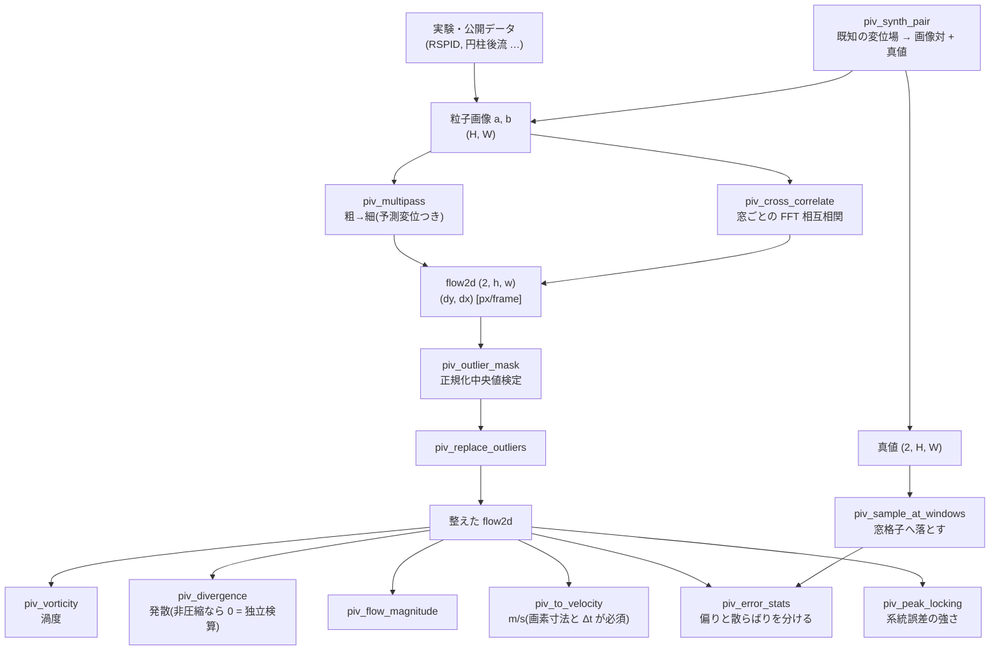

# 粒子画像流速測定(画像対から密な変位を測る) — 使い方ガイド

## この族は何をする道具箱か

**2 枚の画像から、どこがどれだけ動いたかを測る**層です。入力はトレーサ粒子を写した画像対、出力は窓ごとの変位ベクトル場 `(2, h, w)`(成分 `(dy, dx)`、単位は画素/フレーム)。流体計測(PIV)が本来の用途ですが、原理は相互相関なので、模様があるものなら粒子でなくても動きが取れます。

23 op / 6 カテゴリ(numpy と scipy のみ。台帳は `opspiv.py`、実体は `pivops.py`):

- **synth(3)** — `piv_synth_particles` / `piv_synth_pair` / `piv_synth_sequence`: 既知の変位場を持つ画像対と画像列を作る。**この族の全テストの真値の供給源**。
- **estimate(4)** — `piv_cross_correlate` / `piv_multipass` / `piv_deform_pass` / `piv_ensemble_correlate`: 本体。窓ごとの FFT 相互相関、粗→細の多段、窓変形、相関の合算。
- **validate(2)** — `piv_outlier_mask` / `piv_replace_outliers`: 正規化中央値検定と穴埋め。
- **field(8)** — `piv_vorticity` / `piv_divergence` / `piv_flow_magnitude` / `piv_to_velocity` / `piv_velocity_gradient` / `piv_q_criterion` / `piv_swirling_strength` / `piv_strain_rate`: 場の微分・不変量・単位変換。
- **visualise(2)** — `piv_flow_to_rgbimage` / `piv_line_integral_convolution`: 出口。これが無いと `flow2d` は「作れるが見られない」型になる。
- **assess(4)** — `piv_sample_at_windows` / `piv_error_stats` / `piv_peak_locking` / `piv_time_statistics`: 真値との突き合わせ、系統誤差、時間統計。

## なぜ足したか —— 在庫を数えた結果

2026-09-06 に型付きカタログ全体(900 op)を走査したところ、**画像対から密な変位を出す op が 1 つも無い**ことが分かりました。近いものはあります:

| 既にあるもの | 何をするか | なぜ代わりにならないか |
|---|---|---|
| `scene_flow_lk` | Lucas-Kanade の密なフロー | **3 次元の体積用**(`(3,D,H,W)`)。平面の画像対は入らない |
| `estimate_flow` / `nearest_neighbor_flow` | シーンフロー | **点群同士**。画像を食わない |
| `correlation_score` | 相関 | 体積同士の**スカラ 1 個**。場を返さない |
| `match_keypoints` | 対応点 | **疎**。窓ごとの密な場ではない |
| `optical_flow_magnitude_stream` | 動画の流れの大きさ | 大きさのみ。ベクトルを返さない |

`flow_dense` 型は存在しますが、述語が `ndim == 4 and shape[0] == 3` で、作る op は `scene_flow_lk` の 1 本だけでした。

## 使う順序



## 最小の例(そのまま動きます)

```python
import numpy as np

import pivops

# 1) 既知の変位場を決めて画像対を作る —— 真値は定義そのもの
cy, cx = 127.5, 127.5


def rigid_rotation(rows, cols):
    """画面上で時計回りに回る場。渦度は -2w になる(下の assert 参照)。"""
    w = 0.01
    return w * (cols - cx), -w * (rows - cy)


a, b, truth = pivops.piv_synth_pair((256, 256), rigid_rotation,
                                    density=0.02, diameter_px=2.5, seed=7)

# 2) 粗い窓から細かい窓へ(多段)
flow, info = pivops.piv_multipass(a, b, windows=(64, 32), overlap=0.5)

# 3) 外れ値を見つけて埋める
bad = pivops.piv_outlier_mask(flow, threshold=2.0)
flow = pivops.piv_replace_outliers(flow, bad, "median")

# 4) 場の量
vort = pivops.piv_vorticity(flow, info["step"])
div = pivops.piv_divergence(flow, info["step"])

# 5) 真値と突き合わせる(格子を揃えてから)
t = pivops.piv_sample_at_windows(truth, info)
stats = pivops.piv_error_stats(flow, t)

assert stats["rms"] < 0.12                       # 実測 0.05 前後
assert abs(stats["bias_dy"]) < 0.02              # 零方向への偏りは補正済み
# 渦度は閉形式 -2w = -0.02 に一致する(**負**なのが規約どおり)
assert abs(np.mean(vort[1:-1, 1:-1]) - (-0.02)) < 0.0015
# 発散は 0 —— 真値と比べるのとは**別経路**の検算
assert abs(np.mean(div[1:-1, 1:-1])) < 5e-4

# 6) 物理速度へ。画素寸法と時間差は**必須引数**(既定値を置いていない)
v = pivops.piv_to_velocity(flow, pixel_size_m=1e-5, dt_s=2e-4)   # 10 um/px, 200 us
assert np.isfinite(v).all()
```

## 零方向への偏りと、その補正(この族でいちばん大事な実測)

素の相互相関は**変位を零へ引き寄せます**。窓をずらすと重なる領域が減り、相関の値そのものが変位とともに落ちるからです。実測(窓 32、Hann、`dx` を振る):

| 真の dx [px] | 偏り(補正なし) | 偏り / (d/N) |
|---:|---:|---:|
| 0.5 | -0.0203 | 1.30 |
| 1.0 | -0.0402 | 1.29 |
| 2.0 | -0.0802 | 1.28 |
| 4.0 | -0.1600 | 1.28 |
| 6.0 | -0.2406 | 1.28 |

**比が一定**であることが、原因の説明(重なり面積)が合っている証拠です。値が小さいことではありません。

補正は 2 つを**必ず対で**入れます: (a) 窓関数の自己相関で割る(`normalize="overlap"`)、(b) 探索を窓の 1/4 に絞る(`search_limit=0.25`、PIV の「1/4 則」)。片方だけだと悪化します:

| 設定 | 偏り dy | 偏り dx | RMS |
|---|---:|---:|---:|
| 両方あり(既定) | -0.0045 | +0.0039 | **0.0648** |
| 正規化なし | -0.0867 | +0.1030 | 0.1535 |
| **正規化だけ(探索無制限)** | -0.1910 | +0.2329 | **2.9094** |

正規化だけを入れると RMS が **45 倍**に悪化します。縁では割る量が 0 に近づき、そこに偽のピークが立つためです。「補正を足したのだから良くなったはず」を測らずに信じない、という戒めがそのまま設定の既定になっています。

## 既知の系統誤差 —— 出るはずのものが出るか

サブピクセル推定は、真の変位の小数部を整数へ引き寄せる偏り(**ピークロッキング**)を持ちます。小数部を 0 から 0.9 まで振った実測:

| 推定法 | 小数部誤差の RMS | 最大絶対誤差 | 0.1 の答え | 0.9 の答え |
|---|---:|---:|---:|---:|
| `gauss3`(既定) | 0.0037 px | 0.0088 px | 0.099 | 0.896 |
| `parabolic` | 0.0104 px | 0.0151 px | 0.091 | 0.904 |
| `centroid` | 0.2259 px | 0.3701 px | **0.021** | **0.978** |

`centroid` の S 字は教科書どおりで、**出ないほうがおかしい**。3 つを残しているのは選択肢のためではなく、系統誤差の違いを測れるようにするためです。

## 閉形式との一致(320x320、多段 64→32)

| 変位場 | 閉形式 | 渦度の実測 | 発散の実測 |
|---|---|---:|---:|
| 剛体回転 ω=0.01 | 渦度 -2ω = -0.02、発散 0 | -0.01997 | -0.00006 |
| 一様膨張 s=0.01 | 発散 2s = 0.02、渦度 0 | +0.00009 | +0.01985 |
| 単純せん断 g=0.02 | 渦度 g = 0.02、発散 0 | +0.01996 | -0.00003 |

**回転の渦度が負**なのは規約どおりです。テストを書いたとき最初に `+2ω` と書いて落ちましたが、間違っていたのは**テストの側**でした(`(ω(c-cx), -ω(r-cy))` は画面上では時計回りに見える場)。規約を使って書いたテストでは規約の反転を捕まえられないので、向きが分かる最小の場で別に固定してあります。

## 型を 1 つだけ新設した理由 —— `flow2d`

`flow_dense` の述語は `(3, D, H, W)` 限定なので、2 成分の平面フローは**そもそも該当しません**。名前を借りると台帳が「3 成分を返す」と宣言しながら 2 成分を返すことになります。

型を増やすときの本 repo の条件(**種を持つ op が無ければ永久に未実行になる**)は満たしています —— 生成が 7 op、消費が 13 op、族の中で閉じています。**出口(可視化 2 op)も必ず持たせています** —— 作れるが見られない型は連鎖の途中で行き止まりになります。両方向の fail-closed も実測済み:

- `reprconv.flow_magnitude(2-D flow)` → `ValueError: this op takes DENSE scene flow (3, D, H, W) …`
- `piv_vorticity(3-D scene flow)` → `ValueError: flow must be (2, h, w) …`

**型では守れないもの**も正直に書いておきます。`piv_to_velocity` の出力は単位が m/s に変わりますが**型は同じ `flow2d`** です。単位を型で分ける案は、m/s を作る op が 1 本・消費する op が 0 本の型を生むので採りませんでした(「証拠が出てから増やす」の順序に反する)。代わりに画素寸法と時間差を**必須引数**にしてあります。

## 規約(取り違えると静かに間違う)

| 規約 | 値 | 破ったときに何が起きるか |
|---|---|---|
| 変位の単位 | **画素/フレーム** | m/s と混ぜると桁が変わる。例外は出ない |
| 成分順 | **(dy, dx)** | 転置した場が出る。絵は自然に見える |
| `dy` の正の向き | **行が増える向き**(画像の下) | 上下反転 |
| 渦度の定義 | `d(dx)/dy - d(dy)/dx` | **反時計回りが正**。符号を決めずに書くと渦の向きが黙って反転する |
| ベクトルの位置 | 窓の中心(`info["rows"]` / `["cols"]`) | 真値と半窓ずれて比較され、勾配のある場で誤差が水増しされる |
| `piv_to_velocity` の 2 引数 | **既定値なし** | 既定値を置くと単位事故が既定になる |

## 使い分けの目安(実測に基づく)

* **窓の大きさ** —— 粒子が窓あたり 5-10 個になるように選ぶ。密度 0.02 なら 32x32 で約 20 個。窓 16 まで下げると 5 個になり、実測で RMS が 0.060 → 0.113 と悪化した(多段 64→32→16)。**細かくすれば良くなるわけではない**。
* **多段** —— 格子を密にしたいときに効く。実測では窓 64 単段(格子 7x7、RMS 0.038)に対して 64→32(格子 15x15、RMS 0.060)。**密度と精度は交換関係**であって、多段は精度を上げる道具ではなく、精度をあまり落とさずに密度を上げる道具。
* **窓関数** —— `hann` は縁のリークを減らすが有効粒子も減らす。実測(補正なし・窓 32)で RMS 0.154(hann)対 0.213(none)なので既定は hann。
* **`peak_ratio`** —— 第 1 ピーク / 第 2 ピーク。1 に近い窓は当てにならない。雑音を足すと下がることを実測で固定してある。

## 渦とせん断を分ける(派生 op)

渦度だけを見ると**せん断層も光ります**。層流の壁近傍が渦のように見えるのはそのためで、渦を取り出したいときは速度勾配テンソルの不変量を使います。3 つとも同じ 4 つの微分から出るので、`piv_velocity_gradient` が一度にまとめて返します。

解析場を直接置いた実測(PIV を通さない、定義そのものの検算):

| 場 | 渦度 | Q 基準 | 渦回転強度 λ_ci | ひずみ速度 |
|---|---:|---:|---:|---:|
| 剛体回転 ω=0.01 | -0.020000 | **+1.0e-4** (= ω²) | **0.010000** (= ω) | 0.000000 |
| 一様膨張 s=0.01 | 0.000000 | -1.0e-4 (= -s²) | 0.000000 | **0.020000** (= 2s) |
| 単純せん断 g=0.02 | **+0.020000** | **0.000000** | **0.000000** | 0.020000 (= g) |

最下行が要点です。**せん断の渦度は回転と同じ大きさなのに、Q も λ_ci も 0**。この差がこの 2 つを足した理由そのものです。

> Q も λ_ci も**閾値を必要とする**量です。`Q > 0` だけでは薄い領域まで拾うので、閾値をどう決めたかを書かない渦可視化は、絵の美しさが閾値の産物である可能性を隠しています。閾値を振ったときの面積変化を併記してください。

## 見せ方(可視化の 2 つ)

- `piv_flow_to_rgbimage` — 色相 = 向き、明度 = 速さ。`reprconv.flow_to_rgbimage` の 2 次元版(あちらは 3-D シーンフロー専用)。**`scale` を省くと図ごとに色の意味が変わる**ので、複数の図を並べるなら固定すること。色相環の凡例は図の側で必ず一緒に焼く。
- `piv_line_integral_convolution` — 流れに沿って白色雑音を平均した模様。矢印は密にすると潰れ、疎にすると構造を見落としますが、LIC は画素ごとに積分するので密度の選択が要りません。**向きの情報は落ちる**(前後を区別しない)ので、回転の向きを見たいときは矢印か色相図と併用します。積分長を伸ばすと滑らかになりますが、渦の芯のように曲率が大きい場所では**構造が伸びて嘘になります**。

## 精度を上げる 2 つの道(実測つき)

### 窓変形 —— 窓の中で変位が変わる場に効く

整数ずらしは「窓の中で変位が一定」を仮定します。回転やせん断ではこれが崩れて相関ピークが潰れるので、予測の半分ずつ 2 枚を逆向きに歪めてから相関します(中央差分の変形)。

| 手順 | RMS | 偏り (dy, dx) |
|---|---:|---|
| 多段 64→32 のみ | 0.0576 | (-0.0055, -0.0014) |
| **+ 窓変形 1 段** | **0.0272** | (+0.0012, -0.0003) |

回転場(ω=0.01、256x256)で **2.1 倍**。

### アンサンブル相関 —— 疎で雑音の多いデータに効く

1 対ずつ測って平均すると「外れたベクトルの平均」になります。**相関マップの段階で足す**と、弱いピークが同じ場所に積み上がって立ち上がります(定常流が前提)。

| 手順 | RMS | 1 px 超の外れ |
|---|---:|---:|
| 1 対のみ | 4.21 | 47 / 81 |
| **10 対を合算** | **1.55** | **9 / 81** |

密度 0.004(窓 32 あたり約 4 個)+ 雑音 0.25 という厳しい条件での実測です。**完全には直りません** —— 2.7 倍良くなるが、9 本はまだ外れたまま。そう書いておきます。

## 時間統計 —— 平均・変動・レイノルズ応力

`piv_time_statistics` は画像列から、時間平均・変動の RMS・レイノルズ応力 ⟨u'v'⟩ を返します。乱流の記述はこの 3 つが出発点で、⟨u'v'⟩ の符号と大きさが運動量輸送そのものになります。

検証は `piv_synth_sequence` に**既知の乱れ**を仕込んで行います。実測: 仕込み 0.3 px → 測定 0.287 px、定常流(乱れ 0)なら 0.013 px。

> ★ ここで一度失敗しています。最初は**独立な画像対を並べたもの**を「列」として渡し、平均 0.73 px に対して変動の RMS が 4.05 px という数字を得ました。隣り合う 2 枚に対応関係が無いので、流れではなく**列の作り方**を測っていたのです。`piv_synth_sequence` は同じ粒子を追い続けます。
>
> もう一つ。乱れを**粒子ごとに独立**に振ると、窓の中で平均されて粒子数の平方根ぶん小さくなり、仕込み 0.3 に対して 0.15 しか出ませんでした。これは PIV の性質であって誤りではありませんが、時間統計の検証には使えないので、`jitter` は**コマごとに場全体を揺らす**形にしてあります。

## 次にどこへ繋がるか

* **公開データ** —— 合成で閉じたら RSPID(合成粒子画像 + 真値)、円柱後流の時間分解 PIV(ストローハル数 0.2 前後という独立検算が効く)、タービン翼列。RAD コーパス `fullseye_poc_datasets_corpus_v2` のノート 060-064 に URL の実測結果とライセンスの注意がある。
* **航空・流体** —— 渦度から Q 基準・λ2 へ(速度勾配テンソルの不変量)。同コーパスのノート 036。
* **既存の族** —— 出力の `image2d` は 2-D op 一式(閾値・morphology・疑似カラー・図注)へそのまま渡せる。時系列にすれば `videostream` 族。
