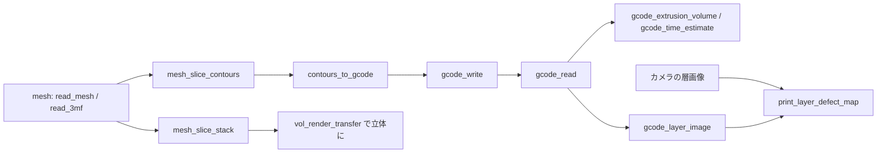

# 3D プリンタのデータ(G-code / 3MF / スライス / 層画像の検査) — 使い方ガイド

## この族は何をする道具箱か

3D プリンタのデータは「形(メッシュ)→ 層(スライス)→ 経路(G-code)→ 印刷中の層画像」と流れます。この族はその往復を、Fullseye の既存語彙(`mesh` / `voxel` / `table` / `image2d` / `measurement` / `text`)だけで、numpy + 標準ライブラリで閉じます。新しい型は作りません。

17 op / 5 カテゴリ(台帳は `opsprintpath.py`、実体は `printpath.py`):

- **gcode(5)** — `gcode_read`(G0/G1 を線分の表 `table` に: x0 y0 z0 x1 y1 z1 e f layer。G90/G91、M82/M83、G92、G20/G21、`;` コメント、層は `;LAYER:n` か Z の増加。円弧 G2/G3 は拒む)/ `gcode_write`(表を G1 に書き戻す)/ `gcode_extrusion_volume`(Σe × フィラメント断面積 [mm³])/ `gcode_time_estimate`(Σ 距離 / 送り、加速度を無視した下限 [s])/ `gcode_layer_image`(1 層の経路を線幅つきのラスタに = 期待の層画像)。
- **slice(3)** — `mesh_slice_contours`(平面 z で切った輪郭 `table`: ring x y。三角形の法線で向きを付け、外輪郭は反時計回り・穴は時計回り)/ `mesh_slice_stack`(層ごとの塗りつぶしマスク `voxel`、nonzero winding で穴は穴のまま)/ `contours_to_gcode`(輪郭を周回する経路の表、押し出し量 = 線分長 × 線幅 × 層厚 / 断面積)。
- **format(2)** — `read_3mf` / `write_3mf`(zip + XML の最小構成、単位換算、`<build>` の変換行列)。
- **inspect(1)** — `print_layer_defect_map`(観測の層画像と期待の層画像を比べ、+1 = あるはずの所に無い(欠け)、−1 = 無いはずの所にある(はみ出し・糸引き)、`tolerance_px` で位置ずれと線幅の揺れを許す)。

## 流れ



## 最短の使い方

```python
import fullseye as fs
L = fs.ledger

V, F = fs.read_mesh("part.stl")                       # STL / OBJ / PLY / OFF、または L.read_3mf("part.3mf")
stack = L.mesh_slice_stack((V, F), layer_mm=0.2, px_per_mm=10.0)     # (Z, Y, X) の層マスク
c = L.mesh_slice_contours((V, F), z=3.1)              # 1 層の輪郭
g = L.contours_to_gcode(c, z=3.1, layer=15)            # 周回の経路(最小のスライサ)
path = L.gcode_write(g, "part.gcode")

t = L.gcode_read("part.gcode")                        # どのスライサの出力でも(円弧は展開しておく)
print(L.gcode_extrusion_volume(t), "mm^3", L.gcode_time_estimate(t), "s (lower bound)")
expected = L.gcode_layer_image(t, layer=15, px_per_mm=10.0, bounds=(0, 0, 60, 40))
defects = L.print_layer_defect_map(camera_layer_15, expected, tolerance_px=3)   # +1 欠け / −1 はみ出し
```

## 真値で確かめてある性質(`tests/test_printpath.py`、`examples/poc_print_layer_inspection.py`)

- 角穴つきの箱を切った層の面積 = 200 − 16 mm² と厳密一致、穴だけが残る層は空(nonzero winding)。歯車状の柱と円い穴は 0.1 % 以内。
- 輪郭を周回する経路の押し出し量 = 周長 × 線幅 × 層厚 / フィラメント断面積(閉形式)、G-code の書き読みで往復(E の総和 1e-5 mm 以内)。
- 相対座標(G91)・相対 E(M83)・リトラクト・G92・インチ(G20)を正しく読む。円弧と座標の欠けは ValueError。
- 3MF は書いて読んで頂点・面が一致、単位 inch は 25.4 倍。
- 注入した欠陥(欠け 6・はみ出し 6、1〜4 mm)を許容 3 px(0.3 mm)で再現率 0.96・偽陽性 0。カメラを 0.2 mm ずらすと再現率は約 0.9 に落ちる(ずれの分だけ縁を食われる)、偽陽性は 5 %。

## 罠

- **円弧 G2/G3 は扱わない**(黙って直線にすると押し出し体積を過小評価する)。スライサ側で直線に展開して出力すること。
- **層の切り方は方言がある**: Cura は `;LAYER:n`、PrusaSlicer は `;LAYER_CHANGE`。タグが無ければ「押し出しを伴う Z の増加」で切る(`layer_from="z"` で強制)。
- **時間の見積もりは下限**: 加速度・ジャーク・リトラクトを無視するので、細かいインフィルほど実機より短く出る。
- **スライスは面の向きが揃っている前提**(STL / 3MF の規約)。向きが壊れたメッシュは穴が埋まる。`mesh_orientation_consistent` で先に直す。
- **位置合わせはしない**: カメラ像は先に `gcode_layer_image` と同じ画素格子(`bounds` / `px_per_mm`)へ写す。
- **stroke(6)** — `stipple_points_from_image` / `stipple_energy` / `stroke_tour_closed` / `mst_length` / `stroke_resample_closed` / `stroke_tone_error`: **写真の濃淡を 1 本の閉じた線にする**層(TSP art)。濃淡を点の密度に写し(重みつき Lloyd)、その点を 1 回ずつ通って戻る巡回路に並べ、等弧長に打ち直して、**描いた濃淡が目標とどれだけ違うか**を返します。ペンプロッタの経路と 3D プリンタの経路は同じ対象なので、出口は既存の `contours_to_gcode` → `gcode_time_estimate` をそのまま使えます(「この絵は 1 本の線で紙の上に何メートル、何分で描けるか」)。★質は**下界との比**で言います —— 閉じた巡回路は最小全域木より短くなれません。

## 関連

- `mesh`(STL / OBJ / PLY / OFF の読み書き、`mesh_*` 族)、`videocube.vol_render_transfer`(層の積みを立体に)
- 検査ワークフロー層(計測 → 仕様照合 → 根拠つきの判定)に載せる先: `print_layer_defect_map` の +/− の面積を仕様と比べる
