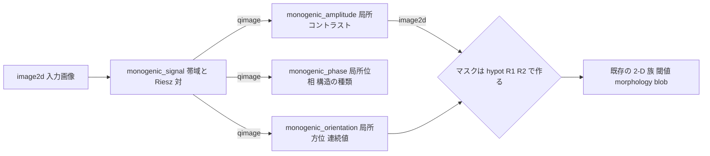
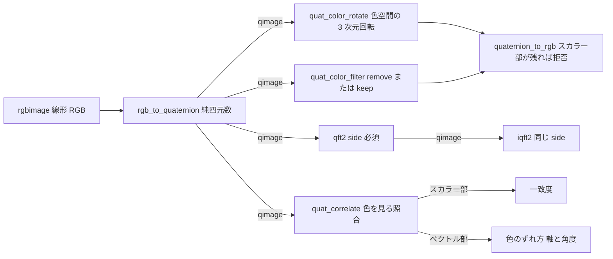
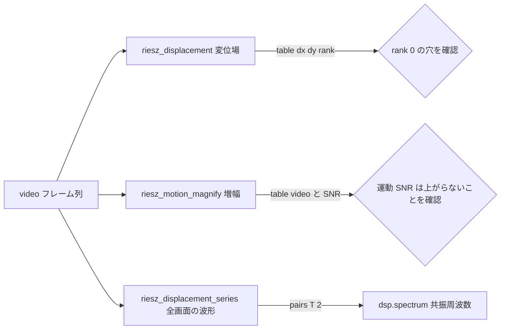

# 四元数画像(Riesz・モノジェニック信号・色代数) — 使い方ガイド

## この族が答えている問い

出発点は 1 つの問いでした ―― 「複素数画像が使えるのはわかったが、**4 元数画像**も使えたら面白いことができるか?」

**答え: 本物の能力差は 1 か所だけあります。** 複素数の画素は 2 次元の値で、掛け算 `exp(iθ)·z` が回せる軸は 1 本しかありません。四元数の画素の純虚部 `(0, R, G, B)` は **3 次元ベクトル**で、`q·x·q*` は色空間そのものの 3 次元回転になります。ここから 2 つのことが出てきます。

1. **2 次元信号に本物の位相が付く。** 1 次元の解析信号 `f + i·H(f)` が作れるのは「90 度後ろ」の向きが 1 つに決まるからで、2 次元にはその向きがありません(向きを 1 つ選ぶ操作が、そのまま方向づきフィルタ束です)。等方的な一般化は **Riesz 変換**で、それは**対** `(R1 f, R2 f)` なので、変換後の自然な値は 3 つ組 `(f, R1 f, R2 f)` ―― つまり四元数になります。その絶対値が局所**振幅**、偏角が局所**位相**、ベクトル部の向きが局所**方位**で、3 つが同時に、しかも等方的に出ます。これが Felsberg & Sommer (2001) のモノジェニック信号で、**方向づきフィルタ束を持たずに**位相ベースの処理ができます ―― フィルタは `scales × orientations` 本ではなく **2 本**、方位は束に量子化されず画素ごとの連続値です。
2. **色に代数が付く。** RGB を純四元数 `0 + R i + G j + B k` と書くと(Sangwine 1996)、`q·x·q*` が「ある色相を別の色相へ回す」操作になります。**チャンネルごとのパイプラインでは原理的に表現できません** ―― チャンネルを混ぜないからです。

以上を 19 op / 7 カテゴリにしたのがこの族です(numpy のみ、台帳は `opsquat.py`、実体は `quatimage.py`):

- **convert(3)** — `rgb_to_quaternion` / `quaternion_to_rgb` / `quat_norm`: 色画像を純四元数へ入れる/戻す、画素ごとの絶対値。戻す側は**スカラー部が残っていたら拒否**します(無言の切り捨てを許さない)。
- **algebra(3)** — `quat_conjugate_image` / `quat_normalize_image` / `quat_image_multiply`: 共役、単位化(零画素は fail-closed)、画素ごとの Hamilton 積(`side` 必須)。
- **riesz(5)** — `riesz_transform` / `monogenic_signal` / `monogenic_amplitude` / `monogenic_phase` / `monogenic_orientation`: 2 次元の解析信号と、そこから読む振幅・位相・方位。
- **color(2)** — `quat_color_rotate` / `quat_color_filter`: 色空間の 3 次元回転と、色方向の抽出・除去。
- **fourier(2)** — `qft2` / `iqft2`: 四元数フーリエ変換。**非可換なので左右で別の変換**、`side` は既定値なしの必須引数。
- **motion(3)** — `riesz_motion_magnify` / `riesz_displacement` / `riesz_displacement_series`: Riesz ピラミッドによるモーション増幅とサブピクセル変位計測(Wadhwa et al. 2014)。
- **match(1)** — `quat_correlate`: 色を見るテンプレートマッチング。スカラー部が一致度、ベクトル部が色のずれ方。

データ種は既存語彙の再利用が基本です: **image2d**(振幅・位相・方位マップ、`quat_norm` の出力 ―― 閾値・morphology・blob がそのまま掛かる)、**rgbimage**(`specularity` と共有の線形 RGB)、**video** / **table** / **pairs**(`motionmag` の規約をそのまま踏襲、`riesz_displacement_series` の `(T,2)` は `dsp.spectrum` に直に流せる)。新語は **qimage** ひとつだけで、`(H, W, 4)` float64・成分順 `(w, x, y, z)`(`pose_quat` と同じ並びにしてあるので、そちらで作った回転子をそのまま渡せます)。

## 既存 op との棲み分け(重複させていないもの)

| やりたいこと | 使う op | 置き場所 |
|---|---|---|
| 複素場・スペクトル・位相アンラップ・Wiener 逆畳み込み | `cx_fft` 系 / `phase_unwrap` / `cx_wiener_deconvolve` | `complexops`(**重複しない**。2 次元の解析信号は複素数の中に存在しない、というのがこの族の前提) |
| 位相ベースのモーション増幅・変位計測(**複素ステアラブル版**) | `motion_magnify` / `phase_displacement` / `displacement_series` | `motionmag`。同じ問いへの別解で、優劣は下の節に実測表がある。`band_snr` は再実装せず **import して呼ぶ**ので、2 つの増幅器は自分のコストを同じ物差しで報告する |
| 剛体変換の四元数(pose / 二重四元数 / スクリュー) | `axis_angle_to_quat` / `quat_to_hom_mat3d` ほか 28 関数 | `pose_quat`。`quat_color_rotate` は**そこから import して**回転子を作り行列にする。画像側に出てくるのはこの 2 つだけで、残りは並進・Euler 順序・スクリュー軸 = 四元数「画像」には引数の埋めようがない |
| 二色性反射モデル・鏡面分離・光源色推定 | `specular_free_transform` ほか | `specularity`。`quat_color_filter(mode="remove")` は**同じ射影**なので作り直さず **delegate する**(一致は偶然でなく構成による。実測 0.0) |
| 実数の方向づきエッジ応答 | `tf_steerable_filter` | `backends_transform2`。直交対でなく位相を持たず可逆でもないので、別物としてそのまま残す |
| 1 画素以上の運動・独立運動体 | `optical_flow_lk` / `optical_flow_hs` | `flow`。レジームが違う(こちらは帯域制限成分のサブピクセル変位) |

## 零点との比較 ―― まず負けから

この族の Riesz 系 3 op は、既存の `motionmag`(複素ステアラブル)と**同じ問いに対する別解**です。同じクリップ・同じ閉形式の真値(Fourier 位相ランプ)・同じ帯域で突き合わせました。**先に負けを書きます。**

### 負け 1: 同一オクターブに 2 方位があると、静かに 13% ずれる

半径方向の帯域には**方位の添字がありません**。それがこの分解の身上(フィルタが 19 本ではなく 4 本)であると同時に、致命的な前提を持ち込みます ―― 1 つの帯域に入る成分が 1 つの平面波であること。同じオクターブに違う方位の格子が 2 つ入ると、モノジェニック信号の背後にある単一平面波モデルが**単に偽**になります。

| クリップ | Riesz 相対誤差 | steerable 相対誤差 |
|---|---|---|
| λ = (8, 16) px ―― `synthesize_translation` の**既定** | **1.299e-01** | 4.441e-16 |
| λ = (8, 32) px ―― 2 オクターブ離す | 2.220e-16 | 0.0 |
| λ = (8, 8) px ―― 完全に同一帯域 | **6.256e-01** | 1.329e-02 |

例外も NaN も出ません。しかも**変位に依りません** ―― 小変位極限で誤差は 12.500%(A=0.01 px)、12.519%(0.1 px)、12.986%(0.5 px)で、変位を小さくしても消えない定数バイアスです(大変位では 14.490% @ 1 px、20.445% @ 2 px と悪化する)。「小さく測れば精度が上がる」という直感が効かない種類の誤りです。

**2 オクターブ離すと機械精度に戻る**ので、原因は測定側でも数値誤差でもなく**分解側の単一平面波モデル**だと特定できています。実際の景色は大抵、1 オクターブに複数方位のテクスチャを持ちます ―― つまり**悪いほうの条件が既定**です。

この事実はドキュメントではなくテストで固定してあります(`tests/test_quatimage.py::test_the_riesz_route_LOSES_on_multi_orientation_texture`)。将来この失敗を黙って消す変更は、このテストを書き換えて理由を述べる必要があります。

> 独立検算との差について: 別の検証系では同じクリップで **6.49e-02** と出ます。これはちょうど半分で、理由は判明しています ―― そちらは `(dx, dy)` 2 成分の誤差を平均しており、この設定では `dy` が恒等的に 0(実測 max|dy| = 1.6e-16)なので、`dx` の 1.2986e-01 が 2 で割られて 6.4932e-02 になります。**指標の畳み方の違いであって、所見の違いではありません。**

### 負け 2: 画素の 25% では測れない

波数ベクトルは Riesz ベクトルから読みます。ところが Riesz ベクトルは**偶対称点**(局所位相 0 または π ―― 明線・暗線の頂上)で消えます。そこでは**振幅は満点のまま**方位が定義されません。実測、1 成分クリップで **1024 / 4096 画素(25.0%)が rank 0** です。steerable 側は方位をフィルタから得るので **0 / 4096**、退化しません。

該当画素は `rank` で印が付き重み 0 になるので答えを汚しませんが、変位場には穴が空きます。

### 負けとまでは言わないが: 理論上の勝ちが実現しなかった

「方位が連続値なので、4 方位の束が持たない角度の斜め構造で勝つはず」―― これは実測で**起きません**。steerable 束の raised-cosine 角度窓は既に厳密に内挿しています。

| 格子方位 | Riesz 相対誤差 | steerable 相対誤差 |
|---|---|---|
| 0.0 度 | 3.331e-16 | 0.0 |
| 20.6 度 | 4.441e-16 | 4.441e-16 |
| 45.0 度 | 4.441e-16 | 4.441e-16 |
| 69.4 度 | 4.441e-16 | 4.441e-16 |
| 90.0 度 | 3.331e-16 | 0.0 |

### J₀ の天井は Riesz でも上がらない

1 帯域に 1 成分だけの場合(モノジェニック信号自身の前提が成り立つ場合)、両者は**同じ**です ―― d = 0.001 px で 1.46e-13 / 1.69e-13、0.1 px 以上では両方とも 0.0 から 4.4e-16 の間。そして **両方とも同じ場所で崩れます**: 3.06 px では両方とも機械精度、3.07 px では両方とも相対誤差 1.573。

これは経験的な閾値ではなく閉形式です。時間平均を位相の基準にすると、その基準の振幅は `J0(k·A)` に比例し、第一零点 `k·A = 2.4048` で基準の位相が π 反転します。8 px 格子なら `A = 2.4048/(2π/8) = 3.0619 px` ―― 表の崩れる位置そのものです。**天井は分解側ではなく「時間平均を基準に使っている」ことの性質**なので、Riesz に替えても上がりません。上げたければ基準の取り方を変える必要があります。

### 本物の勝ち 2 つ

**雑音下で約 2 倍正確。** 4 本の帯域しか作らないので、雑音しか入っていない部分帯域が正規方程式に参加する数が 19 本より少ない ―― 構造的な理由があります(1 成分、A = 0.5 px)。

| sigma | Riesz 相対誤差 | steerable 相対誤差 |
|---|---|---|
| 0.001 | 1.812e-05 | 2.329e-05 |
| 0.01 | 3.008e-04 | 5.119e-04 |
| 0.05 | 4.047e-03 | 8.670e-03 |

**速い。** 64x64x64 クリップ、best of 7: 変位計測 **0.0888 s 対 0.1063 s(1.20 倍)**、増幅 **0.1034 s 対 0.2163 s(2.09 倍)**(独立検算では増幅 2.21 倍)。作る部分帯域が 4 本対 19 本の割には差が小さいのは、Riesz の 1 帯域が逆 FFT を 3 回(帯域画像・R1・R2)使うのに対し steerable の 1 帯域は 1 回だからです。

増幅そのものの品質は**ほぼ互角**です(0.2 px / sigma=0.01、画像 SNR 変化 dB と帯域線形性):

| alpha | 画像 SNR 変化 Riesz | 同 steerable | 帯域線形性 Riesz | 同 steerable |
|---|---|---|---|---|
| 2 | -4.8611 | -4.8260 | 0.937704 | 0.935433 |
| 4 | -10.3616 | -10.3504 | 0.861162 | 0.858130 |
| 8 | -15.3515 | -15.5097 | 0.629948 | 0.628597 |

`alpha = 1` の恒等性は 5.55e-16(steerable 7.77e-16)、利得は **独立な**推定器で測って 12 桁一致(alpha = 0 / 2 / 4 / -1 / 20 のすべて、反転も含む)。**運動 SNR は決して上がりません** ―― 帯域内の位相を alpha 倍すれば帯域内の雑音も同じだけ増えるからで、増幅は見せる技術であって測る技術ではありません。

### 結論(正直に)

1 オクターブに複数方位が入る景色 ―― つまり普通の景色 ―― では **steerable を使ってください**。この族が向くのは狭帯域の被写体、雑音の多いクリップ、そして 2 倍の速度が効く場面です。四元数はモノジェニック信号を持つための**正しい入れ物**で、方位をただで付けてきます。しかし測定を良くはしません。

## 四元数でしかできないこと / できないこと

**できる(チャンネルごとには原理的に不可能)。** 純赤 `(1,0,0)` を青軸まわりに 90 度回すと `(-2.2e-16, 1.0, 0.0)` になります。チャンネルごとのフィルタは対角行列を掛けるだけなので、**零のチャンネルから緑を作れません** ―― 利得が 0 でも 1 でも -3.5 でも 1e6 でも緑は 0 のままです。灰色軸の射影 `I - g gᵀ` についても同じで、最良の対角近似との差は作用素ノルムで **‖P − diag(P)‖₂ = 0.666667**、純赤 1 画素での誤差は **0.471405**(正解 `(0.666667, -0.333333, -0.333333)` に対し最良対角は `(0.666667, 0, 0)` までしか届かない)。これは調整不足ではなく構造です。

**できない差(3x3 行列でも同じことができる)。** `SO(3)` と単位四元数は同型なので、この族の色回転は **3x3 直交行列と完全に同じ写像**です ―― 明示的な `Rz(30 度)` との差は **2.220e-16**、画素ごとの `pose_quat.quat_rotate_point_3d` との差は **4.441e-16**、往復は **2.220e-16**、色の大きさの保存も **2.220e-16**。四元数固有の利得は表現の閉性だけで、**それも極めて小さい**: 10 万回のランダム微小回転を合成すると、四元数(毎回再正規化、除算 4 回)のノルム逸脱は **0.0**、行列(掛けるだけ、再直交化なし)は **|RᵀR − I| = 4.33e-14**。

> **この数字については訂正の履歴があります。** 初版では行列側が **4.4e-10** と出て、四元数の決定的な優位に見えました。原因は四元数でも行列でもなく、`pose_quat` が `norm + 1e-12` で割っていたために毎ステップ僅かに非直交な行列を 10 万回積んでいたことでした(2026-09-01 に厳密除算へ修正済み)。正しい値は 4 桁小さい 4.33e-14 ―― ただの丸めです。**自分の作っているものに都合の良い数字が出たら、それを最初に測り直す**。

**QFT は何も買いません。** 対称分解が色チャンネルについて線形なので、四元数フーリエ変換は 3 回のチャンネル FFT の**固定された線形再結合**にすぎません ―― R・G・B 平面の `fft2` 3 回から `qft2(q, "left")` を組み直すと **1.14e-13** で一致します。速くもなりません: 256x256、best of 20 で **8.246 ms 対 3.409 ms、約 2.4 倍遅い**(実数変換 4 本分のデータを動かし、対称分解の詰め替え代を払うため)。買えるのは「4 つの数が 1 つの代数対象であり続ける」ことだけです。**過大に売らないこと。**

本物なのは左右が別物であることのほうです(次節)。

## ファミリ共通の入力契約(fail-closed)

### 筆頭: 非可換性は数学の問題ではなく API の問題

四元数の積は可換ではないので、「四元数フーリエ変換」は核をどちら側から掛けるかで**2 つの別の変換**になります。**side に依存する op はすべて `side` を既定値なしの必須引数**にしてあります(`qft2` / `iqft2` / `quat_image_multiply`。`quat_color_filter` の `mode` も同じ扱い)。既定値を置くことは呼び出し側に代わって黙って選ぶことで、**間違った側は例外も NaN も出さず、もっともらしい別の答えを返します**。

取り違えるとどれだけ違うかを測ってあります:

- 回転子を左から掛けた場合と右から掛けた場合: **max|L − R| = 3.143**、mean 0.4948 ―― データ自身の振れ幅が 3.372 なので、**答えがデータと同じだけ違う**。
- 左右の QFT スペクトル: ランダム色画像で max|F_L − F_R| = **33.35**(ピーク係数 892.9 の 3.7%)、二色性レンダリングで **19.11**(1045 の 1.8%)。
- 往復で側を取り違えた場合 ―― `iqft2(qft2(q, "left"), "right")` ―― ランダム色画像で **max|err| = 1.113**(データの振れ幅 0.9994)。つまり完全に別の絵。**危ないのはむしろ灰色軸に偏った画像のほう**で、そこでは誤差 0.054(振れ幅 1.076)、**目視では通ってしまう大きさ**です。

文字列は正確一致でのみ通します(`"Left"` は拒否)。大文字小文字を吸収すると、打ち間違いが推測で通ってしまうからです。

### 2 つの qimage を取り違えさせない

`qimage` プールには**意味の違う 2 種類**が入ります ―― モノジェニック信号 `(band, R1, R2, 0)` と色四元数 `(0, R, G, B)`。構造はどちらも `(H, W, 4)` float64 なので、**形状検査では区別できません**。色画像を `monogenic_orientation` に渡すと `atan2(G, R)` という**滑らかで完全にもっともらしい**方位マップが返ります ―― 何のでもない方位マップが。

そこでデータそのもので機械的に判定します: モノジェニック信号の k 成分は構成上恒等的に 0、色四元数の k 成分は青チャンネルで O(1)。相対 1e-9 を超えたら拒否します(2 回の FFT を通った本物の 0 は 1e-16 台、青チャンネルは 1e0 台。**その間には何も住んでいません**)。逆向きも同じで、`quaternion_to_rgb` はスカラー部が残っていたら拒否します(`allow_scalar=True` で明示的に opt-in できる)。

### 実際に見つかったバグ ―― 折り畳まれた位相

**この族の実装中に、零点との比較が実バグを 1 件掘り出しました。** 変位計測の波数ベクトルを、最初は steerable 側と同じ式 `Im(conj(z)·∂z)/|z|²` で求めていました。ところがモノジェニック信号の基準は構成上 `Im ≥ 0` なので、その偏角は **[0, π] に折り畳まれています**。折り畳まれた位相の微分は画像の半分で符号が逆です。

結果は例外でも NaN でもなく、**振幅に依らない 23.42% の定数バイアス**でした。加えて sigma = 0.001 の雑音で 89 倍という壊れ方をしました。どちらも「動いている」ように見えます。

閉形式の恒等式で直しました。局所平面波 `A cos ψ` について、帯域画像とその Riesz 対は

    ∂ₓI = −|k|·R1 ,  ∂_yI = −|k|·R2

を**厳密に**満たします。方位が反転すると両辺が同時に反転するので、modulo-π の曖昧さに免疫があります。修正後は 1 成分クリップで 2.2e-16。この経緯はコードのコメントに残してあります ―― **失敗した実装も消さずに記録する**。

### その他の契約

- **文字列・bool・complex・masked・NaN/Inf は全入力で `ValueError`**。`float("4")` は成功してしまうので、未パースの設定値が角度として通り抜けます。`True == 1` の暗黙昇格も拒否(gain なら恒等、fps なら 1 Hz 時間軸になる)。
- **回転子の退化を二重に塞ぐ**。`quat_color_rotate` は**回転子を引数に取りません**(軸と角度を取ります)ので、非単位の回転子 ―― 回転に拡大縮小が混じったもの ―― は**そもそも表現できません**。加えて零軸を名指しで拒否し、出来上がった回転子のノルムも検査します。上流の `pose_quat` も 2026-09-01 に零長 fail-closed へ直りましたが、**下流の砦は残します**(依存先が正しく振る舞う間しか成立しない検査は検査ではない)。`quat_normalize_image` も零画素を拒否します ―― 色画像に真っ黒な画素 `(0,0,0,0)` は普通にあり、`norm + eps` で割ると零が返り、それを回転子に使うと**単位行列**になるからです。
- **サイズ上限は float64 昇格の前に効かせる**。`MAX_PIXELS`(2²⁴)、`MAX_FRAMES`(4096)、`MAX_PYRAMID_ELEMENTS`(2²²)、`MAX_SCALES`(8)、`MAX_ALPHA`(200)。昇格の**後**に検査しても、防ぐはずのコピーは既に要求済みです ―― この教訓は `specularity._precheck_size` に記録されています。テストは `broadcast_to` で「巨大な形だがメモリ 0」の配列を使うので、順序を間違えていれば 2 GB を確保しようとして落ちます。
- **時間帯域はクリップ自身のサンプリングに照らして検証**: `fps <= 0`、DC に触れる帯域(運動ではなく**シーンの位置**を増幅してしまう)、Nyquist 超え(黙って折り返さず拒否)、`fps/T` より狭い空の帯域(黙って零を返してしまう)。
- **退化形状は変換せず拒否**: 1x1 画像、T = 1、4x4 未満のフレーム、2 px 以下の波長(Nyquist 越え)。定数画像は例外ではなく**厳密な零と rank 0** を返します(丸め雑音を丸め雑音で割った数を返さない)。

## 代表的なパイプライン(op の繋がり)

**構造解析の筋** ―― 1 枚の画像から局所の振幅・位相・方位を取り、既存の 2-D 族へ戻す。データ種は `image2d → qimage → image2d` で繋がるので、方位マップをそのまま閾値・morphology・blob に流せます。



**色の筋** ―― 色を回す・落とす・照合する。`rgbimage` から入り `rgbimage` へ戻るので、`specularity` の二色性反射ファミリと同じ土俵に居続けます。



**運動の筋** ―― `motionmag` と同じ `video` 種で入り、同じ `table` / `pairs` で出るので、2 つの解を差し替えて比較できます(比較そのものが `tests/test_quatimage.py` に入っています)。



## 使い方(最小の 1 本)

```python
import quatimage as Q

# 1) 局所の振幅・位相・方位を一度に取る
mono = Q.monogenic_signal(image, wavelength_px=8.0)
amp = Q.monogenic_amplitude(mono)
ori = Q.monogenic_orientation(mono)
live = (mono[..., 1] ** 2 + mono[..., 2] ** 2) ** 0.5 > 0.1   # 振幅ではなく |R| でマスク

# 2) 色空間の回転 ― チャンネルごとにはできない操作
q = Q.rgb_to_quaternion(rgb)
turned = Q.quaternion_to_rgb(Q.quat_color_rotate(q, (0.0, 0.0, 1.0), 1.57))

# 3) 灰色軸を落として色味だけ残す(鏡面不変部分空間)
chroma = Q.quat_color_filter(q, (1.0, 1.0, 1.0), "remove")     # mode に既定値はない

# 4) 四元数フーリエ変換 ― side は必須、往復は同じ side で
spec = Q.qft2(q, "left")
back = Q.iqft2(spec, "left")                                   # "right" にすると別の絵

# 5) サブピクセル変位(狭帯域の被写体向け。広帯域なら motionmag を使うこと)
series = Q.riesz_displacement_series(video, 3.0, 5.0, 32.0)    # (T, 2) の dx, dy
```

## アルゴリズムの正典(著者・年)

- **Riesz 変換 / モノジェニック信号**: M. Felsberg & G. Sommer, *The monogenic signal*, IEEE Trans. Signal Processing 49(12), 3136-3144 (2001)。局所振幅・位相・方位を同時に与える 2 次元の解析信号。
- **Riesz ピラミッドによるモーション増幅**: N. Wadhwa, M. Rubinstein, F. Durand, W. T. Freeman, *Riesz Pyramids for Fast Phase-Based Video Magnification*, ICCP 2014。帯域を `I·cos(shift) − R_proj·sin(shift)` で描き直す構成はここ。
- **位相ベースのモーション処理(比較対象の系譜)**: Wu et al., ACM TOG 31(4) 2012(時間帯域通過による Eulerian 増幅)/ Wadhwa et al., ACM TOG 32(4) 2013(振幅でなく**位相**を増幅する)。
- **四元数による色画像 / 超複素フーリエ変換**: S. J. Sangwine, *Fourier transforms of colour images using quaternion, or hypercomplex, numbers*, Electronics Letters 32(21), 1979-1980 (1996)。T. A. Ell & S. J. Sangwine, *Hypercomplex Fourier transforms of color images*, IEEE TIP 16(1), 22-35 (2007) ―― 対称分解による高速化と左右変換の区別。
- **四元数相関**: S. J. Sangwine & T. A. Ell, *Hypercomplex auto- and cross-correlation of color images*, ICIP 1999。
- **鏡面不変部分空間**(`quat_color_filter` が委譲する射影): S. P. Mallick, T. Zickler, D. J. Kriegman, P. N. Belhumeur, *Beyond Lambert: Reconstructing specular surfaces using color*, CVPR 2005。
- **ステアラブルピラミッド**(比較対象の分解): Freeman & Adelson, IEEE PAMI 13(9) 1991 / Simoncelli & Freeman, ICIP 1995。

`qft2` の高速経路は対称分解によるものですが、**定義から素直に書いた O(N²) の四元数 DFT と突き合わせて検証**してあります(3 通りの変換軸 × 左右の 6 組合せすべてで最大誤差 8.2e-15)。速い経路が自分自身を基準にすることは許していません。内部基底 `nu` の取り方が結果を変えないことも独立実装で確認済み(最大差 1.4e-14)。

## この族でできないこと(正直な限界)

- **`riesz_transform` を生画像に掛けたときの Nyquist 残差は無視できません。** 実部を取ることで自己共役ビンの寄与を落としますが、ランダム画像ではそれが実部の L1 の **16.17%** に達します(乱数画像は Nyquist 隅にエネルギーを持つため)。帯域通過後は**厳密に零**(実測 4.1e-17 対 信号 2.1e-01)―― `monogenic_signal` がまず帯域通過するのはこのためで、生画像への `riesz_transform` は注意して読んでください。
- **方位は「振幅の高い所」でも退化します。** マスクすべきは `monogenic_amplitude` では**ありません**。45 度格子での実測、方位誤差が最悪の画素は誤差 **0.2764 rad**、そこでの振幅は **1.0000**(満点)、`hypot(q[...,1], q[...,2])` は **6.8e-16**。**マスクは Riesz ベクトルの大きさに掛けること。** 振幅でマスクすると偶対称点を素通しします。
- **`quat_correlate` の角度読み取りが厳密なのは、色が回転軸に直交する平面にある時だけ**です。その条件下では 30 度回転が **30.000000 度**、スカラー比が **0.866025 = cos 30 度**、ベクトル方向が `(0, 0, -1)`(共役が積の左にあるので**回転軸の符号反転**)。条件を外れると、一様乱数の色で 30 度回転が **22.53 度**、軸が `(0.247, 0.419, -0.874)` と出ます ―― 画素ごとの外積の和を取ることに内在する偏りで、**結果からは検出できません**。前提は契約の一部です。
- **`qimage` の型としての危うさ。** `(H, W, 4)` float64 は `voxel` / `sdf` / `labels` / `video` / `score` / `histcube` の述語も**同時に満たします**(いずれも `ndim == 3` だけを見るため)。逆向きは安全で、既存プールのどれも `shape[2] == 4` を満たしません。台帳のどの op も `qimage` をそれらの型として宣言しないので混入経路はありませんが、**手で配線するときに `qimage` を `video` 欄へ流すと、32x32x4 が「32 フレームの 32x4 クリップ」として読まれ、例外なく数字が返ります**。型は入れ物の形ではなく意味の約束です。
- **増幅は測定ではありません。** `riesz_motion_magnify` は運動 SNR を改善しません(帯域内の位相を alpha 倍すれば帯域内の雑音も同じだけ増える)。改善するように見える指標があれば測り方を疑ってください ―― 帯域外から雑音床を推定する素朴な SNR は、増幅済みクリップに対して起きていない改善を報告します。この族は `motionmag.band_snr` を呼んだうえで利得補正済みの `motion_snr_out_db` を返します。
- **色回転は四元数の専売ではありません。** 3x3 行列で同じことができます(2.2e-16 で一致)。この族を使う理由は「色も Riesz も同じ代数で扱える」ことであって、回転そのものの優位ではありません。

---

© 2026 Kazufumi Furuse — Fullseye operator documentation. Licensed under Apache-2.0.
