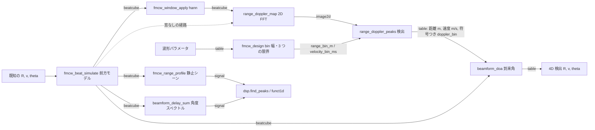

# コヒーレント測距(FMCW レンジ-ドップラーとビームフォーミング) — 使い方ガイド

## この族は何をする道具箱か

**コヒーレント測距センサの信号処理層**です。ここが空いていたことは推測ではなく実測で、それが本族の存在理由そのものです。

fullseye には測距の**幾何**はありました — `lidar_scan` / `pseudo_lidar` は光線を飛ばして面に当て、距離を返します。しかし**信号処理層が丸ごと空**で、`doppler` / `radar` / `beamform` / `delay_and_sum` はどの在庫表面(型付きカタログ・進化レジストリ・`api.py`・ソース全体の静的 `def` 走査)でも 0 件でした。結果として速度は「不正確」だったのではなく、**表現する型が存在しませんでした**。

飛行時間だけを測るセンサは「どれだけ遠いか」に答えます。**コヒーレント**なセンサ — 周波数変調連続波(FMCW)レーダ、あるいは周波数掃引型のライダ — は、戻ってきた波の**位相**を保つので、**同じ 1 回の取得から「どれだけ遠いか」と「どれだけ速いか」の両方**に答えます。しかもそれは追加の測定ではなく、チャープを繰り返した軸にもう 1 回 Fourier 変換をかけるだけで落ちてきます。両軸とも閉形式です。

8 op / 4 カテゴリ(numpy のみ、台帳は `opsrangedoppler.py`、実体は `rangedoppler.py`):

- **design(1)** — `fmcw_design`: 波形パラメータだけから bin 幅・分解能・3 つのエイリアス限界を返す。データが 1 バイトも無い段階で「この波形で見たいものが見えるか」に答える。`visiondesign` が光学に対して取っている「画像でなく**限界**を返す」立場と同じです。
- **simulate(1)** — `fmcw_beat_simulate`: 前方モデル。既知の距離・速度・到来角・振幅を入れると複素ビート立方体が出る。**この族の全テストのグラウンドトゥルースの供給源**。
- **process(4)** — `fmcw_window_apply` / `range_doppler_map` / `range_doppler_peaks` / `fmcw_range_profile`: 2 次元 FFT(高速時間 → 距離、低速時間 → 速度)、主ローブ幅とサイドローブ準位を交換する窓、bin 番号をメートルと m/s に戻す検出段、そして静止シーン用の 1 次元レンジプロファイル。
- **beamform(2)** — `beamform_delay_sum` / `beamform_doa`: 直線配列(ULA)から角度軸を取り出す古典的な遅延和(Bartlett)ビームフォーマ。1 つのレンジ-ドップラーセルに適用します。

物理は 4 行で、この族のテストはほぼ全部この 4 行から導いた恒等式です(Mahafza, *Radar Systems Analysis and Design*, CRC / Richards, *Fundamentals of Radar Signal Processing*, McGraw-Hill / Van Trees, *Optimum Array Processing*, Wiley 2002 / Harris, *Proc. IEEE* 66(1), 1978):

1. 傾き `S` [Hz/s] のチャープが距離 `R` から `tau = 2R/c` 遅れて戻り、混合後に **ビート周波数 `f_b = 2SR/c`** を残す → レンジ bin `f_b*N_s/f_s`。
2. チャープ間隔 `T_c` の間に標的は `v*T_c` 動き、これは搬送波位相で **`4*pi*v*T_c/lambda`** → 速度 bin `2*v*T_c*N_c/lambda`。
3. 到来角 `theta` の平面波は素子間隔 `d` ごとに **`2*pi*d*sin(theta)/lambda`** 位相が進む → 位相を除いて足すと真の `theta` でピーク。
4. 上の 3 つはどれも Fourier 対なので、どれにもエイリアス限界がある: `R < c*f_s/(2S)`、`|v| < lambda/(4*T_c)`、`|sin theta| < lambda/(2d)`。**これは意見ではなく数です。**

データ種は既存語彙の再利用が基本です: **image2d**(レンジ-ドップラーマップ)、**signal**(角度スペクトル・レンジプロファイル)、**table**(設計値・検出表・DOA 結果)。新語は 1 つだけ、**beatcube**(`(n_antennas, n_chirps, n_samples)` の **complex** 3 次元配列)です。

`beatcube` を新設した理由は 3 つで、どれも実測に基づきます。(a) 3 次元 complex の既存語彙が無い(`cimage` は 2 次元 complex)。(b) dToF の `histcube` と共有できない(次節)。(c) **実(real)配列を受け付けないという契約がこの型の本体**(後述の入力契約)。

なお `beatcube` は `voxel` / `sdf` / `labels` / `pairs` / `score` の述語も同時に満たします(どれも `ndim == 3` しか見ないため)。これは `qimage` が置かれているのと同じ状況で、連鎖ファザーのプールは**宣言型の名前で引かれる**ので分離は成立します。逆向き(既存の生成器が `beatcube` を名乗る)は起きないことを全生成器で実測確認済みです。

「狭い sort」にならないための入口と出口も設計に入っています。入口は `fmcw_beat_simulate`(引数だけの源)と `fmcw_window_apply`(beatcube → beatcube)、出口は `range_doppler_map` → **image2d(本 repo で最大のプール)**、`fmcw_range_profile` / `beamform_delay_sum` → **signal**、`range_doppler_peaks` / `beamform_doa` → table。1500〜3000 連鎖の実測で **8 op すべてが到達し、未実行ゼロ**です。

## 既存 op との棲み分け(重複させていないもの)

| やりたいこと | 使う op | 置き場所 |
|---|---|---|
| **どこに面があるか**(光線を飛ばして当てる) | `lidar_scan` / `pseudo_lidar` | `lidar_sim`。**本族は光線を 1 本も飛ばしません** — 距離は入力として与えられ、こちらは「その距離と速度がコヒーレントセンサでどんな信号になるか」を作ります。両者は上下に積む関係で、競合しません |
| **直接飛行時間(dToF)による距離** | `dtof_depth` / `dtof_cube_simulate` / `dtof_cube_depth` / `tcspc_*` | `photoncount`。同じ「距離」を**逆の原理**で出します(次項) |
| 1 次元スペクトル・帯域通過・ピーク検出・包絡線 | `spectrum` / `bandpass` / `find_peaks` / `envelope` / `smooth_funct_1d_gauss` | `dsp` / `funct1d`。`fmcw_range_profile` と `beamform_delay_sum` の返りは**素の 1 次元 float64** なので、あちらの op がそのまま適用できます(ラップし直していません) |
| 軸受診断・次数分析・騒音レベル・2 チャネル伝達関数 | `envelope_spectrum` / `order_spectrum` / `equivalent_level` / `coherence` / `transfer_function` | `acoustics`(**遅延和ビームフォーミングとの関係は下記**) |
| マップ上の輝点を拾う(閾値・morphology・ラベリング・blob 計測) | 2 次元 op 一式 | fullseye 本体。`range_doppler_map` が `image2d` を返すのは意図で、CFAR 型の検出器はまさにこれらの部品でできています |
| レンズ・回折・被写界深度・偏光 | `thin_lens` / `mtf_diffraction` / `stokes_analyze` ほか | `optics`。あちらは**光学系の設計**、こちらは**受信後の信号処理**で、層が違います |

### `photoncount`(dToF)との関係 — 型を分けた実測上の理由

同じ「距離」を返しますが、原理が逆です。dToF は**光子の到達時刻**を数えて、非負の**カウント**ヒストグラムから `d = c*t/2` を読みます。FMCW は戻った波の**位相**を測って、**複素のビート周波数**から `f_b = 2SR/c` を読みます。dToF に速度軸は存在せず、FMCW は単一光子を数えられません。

型を共有しない判断は実測に基づきます。素の状態では**両方向とも fail-closed が効きます**(複素の `beatcube` を `dtof_cube_depth` に渡すと photoncount 側が complex を拒否し、実の `histcube` を `range_doppler_map` に渡すとこちらが real を拒否)。**しかしキャスト 1 回で破れます**:

- `np.abs(beatcube)` を `dtof_cube_depth` に渡す → 例外なく深度マップ(実測 0.0150〜1.2142 m)が返る
- `histcube.astype(complex)` を `range_doppler_map` に渡す → 例外なくマップ(実測 26.74〜2265.5)が返る

どちらも「もっともらしく間違った答え」です。dtype の検査だけでは連鎖ファザーの型接続としては守れないので、**宣言型のレベルで分けました** — `histcube` を `voxel` から分けたのとまったく同じ判断です(形は両方 `(4, 32, 64)` の 3 次元で一致し、dtype だけが違う)。

### `acoustics`(音響・振動)との関係 — 数学は同じ、置き場所が違う

**遅延和ビームフォーミングはマイクロホンアレイと数学的に同一**です。素子間隔 `d` の直線配列に、到来角 `theta` から平面波が来ると、素子ごとに位相が `2*pi*d*sin(theta)/lambda` ずつ進む。この位相を除いて足す(= 遅延和)とピークが真の方向に立つ。音波でも電磁波でも、変わるのは波長 `lambda = c/f` の `c` が音速か光速かだけで、式は 1 文字も変わりません。したがって本族の `beamform_delay_sum` / `beamform_doa` は、原理的には**音響アレイの音源方位推定にもそのまま使える**式です。

にもかかわらず op を分けていない(あちらに複製していない)理由は、`acoustics` が**アレイ型を持っていない**からです。実測で確認したところ、`opsacoustics` の 19 op はすべて `signal` の単チャネルか 2 チャネル(`coherence` / `transfer_function`)で、`beamform` に相当する op も、多素子スナップショットを表す型もありません。本族のビームフォーマは `beatcube` の 1 つのレンジ-ドップラーセルから取り出した**素子ごとの複素スナップショット**に対して働くもので、その入り口が `acoustics` 側には存在しません。

**将来アレイ型を足すなら**、`beatcube` に相乗りさせるのではなく別の型にすべきです — こちらは「アンテナ × チャープ × 高速時間」で、音響アレイのスナップショットは「マイク × 時間」あるいは「マイク × 周波数」で軸の意味が違い、渡し違えても例外は出ないからです。共有すべきなのは**式の実装**であって型ではありません。

## ファミリ共通の入力契約(fail-closed)

全 op が入力を検証してから計算します。以下は 2026-09-01 の敵対監査で**実際に見つかったバグ 5 件**と、それを塞ぐために書いた罠です。**5 件とも例外を出しませんでした。全部、自信満々に間違った数を返していました** — この repo が最も危険とみなす種類の失敗です。

### 罠 1: 角度が `sin()` で黙って折り返される

`fmcw_beat_simulate(angles_deg=[95.0])` が生成する立方体は、`angles_deg=[85.0]` のものと **ビット完全に同一**でした(`max|diff| = 0.0`)。`beamform_doa` はそれを 85.0 度として復元します。190 度は −10 度になりました。

原因は `sin(95°) == sin(85°)` で、直線配列に**後方半球は存在しない**のに `sin()` が後方を前方へ折り畳んでしまうことです。頼んだシーンと違うシーンの立方体が、何の診断も無しに返っていました。対策は `sin()` を呼ぶ**前**に `|theta| <= 90` を検査すること。**順序が効いています** — `sin()` の後では情報が既に失われています。

### 罠 2: 開口の無い配列が「−90 度」を自信を持って返す

8 素子・素子間隔 `1e-12` m で角度スペクトルを取ると、ピークと谷の差が **厳密に 0.0**(完全に平坦)になり、`beamform_doa` は **`[-90.0]`** を返しました。これは格子の先頭の点で、`argmax` のタイブレークの産物であって方向ではありません。同じ構成で `fmcw_design` は角度分解能を **2.5e10 度** と無言で報告していました(1 素子でも 101.5 度 — どちらも「分解能」ではありません)。

「方向が無い」には 2 通りあり、どちらも同じでっち上げに終わります: **素子が 1 つ**(基線が無い)と、**多素子だが波長よりずっと短い開口に詰まっている**。対策は両方を拒否すること — 条件は `0.886*lambda/(N*d) < pi`、つまり開口が約 0.28 波長より長いこと。あわせて `fmcw_design` は解けない構成で `angular_resolution_deg` に**数ではなく `None`** を返し、`aperture_wavelengths` で理由が見えるようにしました。**まだ評価できてしまう式は、答えがあることの証明ではありません。**

### 罠 3: セル指定の半分が黙って無視される

2 標的(レンジ bin 3 と 20)の立方体に `beamform_doa(cube, range_bin=20)` を呼ぶと、**bin 3 の標的の角度が返り、しかも返り値の `range_bin` フィールドも 3 と報告**していました。片方の標的について聞いたのに、別の標的について答えられ、答えた相手も嘘をついていたことになります。

原因は「`range_bin` か `doppler_bin` のどちらかが `None` なら最強セルを使う」という分岐でした。対策は**両方指定か両方省略のみ許可**すること。ついでに入力の `doppler_bin` の規約を `range_doppler_peaks` が返す**符号つき** bin に統一したので、検出結果をそのまま渡せます(下の 4D 検出パイプライン)。

### 罠 4: 最終レンジ bin の標的が黙って捨てられる

`range_doppler_peaks` がレンジ軸の最初と最後の列をマスクしていたため、**マップの `argmax` そのものである** bin 63 の標的で検出が **`[]`(ゼロ件)** になりました。マップで最も強いセルが、検出表に 1 行も出ないという状態です。

対策は端をマスクせず −inf でパディングし、「**存在する隣接セルとだけ比較する**」に変えること。ドップラー軸は**巡回**で比較します(速度は FFT の中で本当に周期的で、最も速く遠ざかる bin の隣は最も速く近づく bin です)。レンジ軸は**開いて**比較します。レンジ bin 0 も普通に報告します — 実機ではそこは送信漏れ(DC)であって標的ではないことが多いのですが、他人のデータに黙って方針を適用するより、閾値は呼び出し側で切ってもらうほうが正直です。

### 罠 5: オーバーフローした FFT が NaN だらけのマップを返す

`amplitudes=[1e307]` で作った立方体は全要素が有限で、入力検査を素通りします。その後 `range_doppler_map` が返したマップの最大値は **`nan`** で、知らせるものは numpy の `RuntimeWarning` だけでした。N 点の FFT は最大サンプルの N 倍まで大きくなり得るので、有限の入力が無限の出力になります。

対策は変換の直後に有限性を検査し、原因(オーバーフローした軸と入力の最大絶対値)を名指しして `ValueError` にすること。読めない警告 + 汚染された配列を、明示的な拒否に交換しています。

### エイリアスは黙って通さない

3 つのエイリアス限界はどれも `fmcw_design` が返す数で、`fmcw_beat_simulate` が**同じ数**で拒否します。「通していたら何になったか」も計算できるので併記します(既定波形 = 64 サンプル × 32 チャープ、`S` = 2e13 Hz/s、`f_s` = 10 MHz、`T_c` = 50 µs、`lambda` = 3.8934 mm)。

| 頼んだもの | 挙動 | 通していたらこう見えた(実測値) |
|---|---|---|
| `R` = 76.12 m(`R_max` = 74.95 m) | 拒否 | レンジ bin 1.0 = **1.17 m**。74 m 手前の**別の標的**になる |
| `v` = +21.90 m/s(`v_max` = 19.467 m/s) | 拒否 | 速度 bin −14 = **−17.03 m/s**。遠ざかる標的が**近づく標的として報告される**(符号が反転) |
| `v` = 72(km/h のつもり) | 拒否 | `v_max` を超えるので**偶然**捕まる(下記) |
| `theta` = 40 度、素子間隔 2λ | 拒否 | グレーティングローブが主ローブと区別できない |
| `theta` = 95 度 | 拒否 | 85 度の立方体と**ビット完全に同一**(罠 1) |

**正直な限界: 単位の取り違えのうち、窓の中に収まるものは検出できません。** 72(km/h のつもり = 20 m/s)は `v_max` = 19.467 m/s を超えるので拒否されますが、これは**上限による偶然の防御**です。**30 km/h(= 8.3 m/s)を m/s と取り違えたら、30 m/s は窓の中なので何も起きません** — もっともらしい速度が、もっともらしく間違ったまま返ります。これを機械的に検出する方法は無く、防げているふりもしません。

### その他の契約

- **実(real)配列は `ValueError`**。これが `beatcube` 型の本体で、理由は次節の「できないこと」に実測つきで書いてあります。
- **単位は引数名に埋め込む** — `_m` / `_ms`(メートル毎秒)/ `_s` / `_hz` / `_deg`。大きさから単位を推測する処理は一切しません。
- **文字列・bool・complex は `ValueError`**。`float("77")` は成功してしまうので、配列は**生の dtype の kind** を cast の前に検査します(`np.asarray(["77"], float)` も成功するため)。bool は `True == 1.0` の暗黙昇格として拒否。
- **波長の上限 `MAX_WAVELENGTH_M` = 1e4 m**。これは**証明ではなく境界**で、仕事は 1 つだけ — 搬送波**周波数**(例 `77e9`)をメートルの引数に渡す取り違えを捕まえることです。その値だとエイリアス検査が全部素通りし、速度軸が意味を失いながら絵だけはマップに見えます。
- **チャープ 1 本 / サンプル 1 点は拒否**。1 チャープの取得にはドップラー bin が 1 つしか無く、それを「v = 0」と報告すると**どんなに速い標的も静止と札を貼られます**。
- **「検出するものが無い」は拒否**。全ゼロのマップに `argmax` を掛けるとセル (0, 0) が返り、それは測定ではなく捏造された検出です。
- **サイズ上限は complex128 昇格の**前**に効かせる** — `MAX_CUBE_ELEMENTS`(2²², complex128 で 67 MB)/ `MAX_SAMPLES`(2²⁰)/ `MAX_CHIRPS`(2¹⁶)/ `MAX_ANTENNAS`(2¹²)/ `MAX_TARGETS`(2¹⁶)/ `MAX_ANGLES`(2¹⁶)。立方体は `N_a * N_c * N_s` で伸びるので、小さな引数から巨大な確保が起きます。**昇格の後に置いた上限は上限として機能しません**(complex64 の入力なら、検査する頃には既に倍にしてしまっている)。検査は宣言された `shape` だけを読み、データには触れません。
- **角度格子は狭義単調増加**が必要。順序の無い格子では「スペクトルの局所最大」が定義できません(これで**間違った数**は作れませんでしたが、契約として先に書いてあります)。

## 窓関数 — サイドローブと主ローブの取引

`fmcw_window_apply` を `range_doppler_map` に畳み込まず独立の op にしてあるのは、この取引を**差分として測れる**ようにするためです(そして変換 op を純粋な 2 次元 FFT のままにするため)。

窓自身を 2¹⁸ 点で零詰めして変換し、第 1 零点より外の最大ローブを取る — これが**ピークサイドローブ準位(PSL)の定義そのもの**なので、下の数値は本モジュールで測ったものであって引き写しではありません。

| 窓 | 文献値 PSL | **実測 PSL** | **実測 −3 dB 主ローブ** |
|---|---|---|---|
| `rect` | −13.3 dB | **−13.25 dB** | 0.885 bin |
| `hann` | −31.5 dB | **−31.47 dB** | 1.438 bin |
| `hamming` | −42.7 dB | **−42.45 dB** | 1.301 bin |
| `blackman` | −58.1 dB | **−58.11 dB** | 1.641 bin |

`hamming` だけ文献値と **0.25 dB** ずれます。理由は分かっていて、文献値が最適係数 0.53836 / 0.46164 のものであるのに対し、ここは**教科書の 0.54 / 0.46** を使っているからです。値を合わせにいくのではなく、使った係数で実際に出る値を書いてあります。

窓は**周期形(DFT-even)**です。`np.hanning` が返す対称形(分母が `n-1`)はフィルタ設計向けで、スペクトル解析には**誤った窓**です — 周期延長したときに 1 サンプルの不連続が残り、上の文献値が成り立ちません。差はサンプル 1 個ですが、その 1 個が −31.5 dB と別の数の差です。

### 実用効果(端から端まで実測)

強い標的を bin 10.5(半 bin ずれ = 漏れが最悪になる位置)に置き、そこから 10 bin 離れた bin 20 に **45 dB 弱い**標的を置きます。

| 窓 | ピーク損失 | bin 20 の高さ(真値 −45 dB) | 局所最大か |
|---|---|---|---|
| `rect` | −3.92 dB | **−24.57 dB** | **いいえ** |
| `hann` | −7.44 dB | −43.56 dB | はい |
| `hamming` | −7.10 dB | −39.15 dB | はい |
| `blackman` | −8.63 dB | −43.90 dB | はい |

**窓なしでは弱い標的はピークですらありません** — 強い標的の漏れの裾に埋もれ、真値より 20 dB も高い −24.57 dB のところに乗っています。`hann` を掛けると **−43.56 dB のきれいな局所最大**として出てきます。これが窓を op にしてある理由です。

ついでに `rect` のピーク損失 **−3.92 dB** は半 bin ずれのスキャロッピング損失 **2/π** ちょうどで、これは `rect` が本当に恒等窓であることの閉形式の検算になっています。

## 代表的なパイプライン(op の繋がり)

1 回の取得から距離・速度・角度の 3 つを取り出す筋(検証済み `examples/fmcw_range_doppler.py` そのもの)。データ種が `table → beatcube → image2d → table` と繋がり、検出の `doppler_bin` を**そのまま** `beamform_doa` に渡せます(符号規約が同じ)。



## 使い方(最小の 1 本)

```python
import rangedoppler as R

# 1) 波形を紙の上で設計する(データはまだ無い)
d = R.fmcw_design(n_samples=64, n_chirps=32, n_antennas=8)
dr, dv = d["range_bin_m"], d["velocity_bin_ms"]
print(round(dr, 4), round(dv, 4))                  # 1.1711 m, 1.2167 m/s
print(round(d["max_unambiguous_range_m"], 2),      # 74.95 m
      round(d["max_unambiguous_velocity_ms"], 3))  # 19.467 m/s

# 2) 既知の (距離, 速度, 到来角) からビート立方体を合成する
cube = R.fmcw_beat_simulate([3 * dr, 20 * dr], [4 * dv, -2 * dv],
                            angles_deg=[10.0, -40.0], amplitudes=[1.0, 0.4],
                            n_samples=64, n_chirps=32, n_antennas=8)

# 3) 2D FFT -> 検出 -> 角度。bin 幅を渡さないと返りは「メートル」ではなく
#    「ビン番号」になる(単位の落とし穴の節を参照)
rdmap = R.range_doppler_map(R.fmcw_window_apply(cube, "hann"), normalize=True)
for p in R.range_doppler_peaks(rdmap, dr, dv, n_peaks=2)["peaks"]:
    doa = R.beamform_doa(cube, range_bin=p["range_bin"],
                         doppler_bin=p["doppler_bin"])   # 符号つき bin をそのまま
    print(round(p["range_m"], 4), round(p["velocity_ms"], 4), doa["angles_deg"])
# 3.5132 4.8667 [10.0]
# 23.4213 -2.4334 [-40.0]
```

## 単位の落とし穴

**`range_doppler_peaks` の `range_bin_m` / `velocity_bin_ms` の既定値 1.0 は「メートル」ではなく「ビン番号がそのまま返る」という意味です。**

```python
R.range_doppler_peaks(rdmap)["peaks"][0]["range_m"]          # 3.0  <- ビン番号
R.range_doppler_peaks(rdmap, dr, dv)["peaks"][0]["range_m"]  # 3.5132 <- メートル
```

これは実際に踏まれた落とし穴です(配線時の一次検証で「距離が合わない」と読まれ、原因は bin 幅を渡さずに既定のまま呼んだことでした)。返り値のフィールド名が `range_m` / `velocity_ms` なので、渡し忘れると**単位の名前だけが正しく、値がビン番号**という状態になります。

既定値をこの族の標準波形に合わせなかったのは意図的です。ここで特定の波形を既定にすると、**まったく別の波形で撮ったマップからメートルを読めてしまう**からです。1.0 は「まだ換算していない」という意味の中立値で、`fmcw_design` の返りをそのまま渡すのが正しい使い方です。

同じ規約が `beamform_doa` の `range_bin_m` / `velocity_bin_ms` にもあります。こちらは既定が `None` で、渡さなければ `range_m` / `velocity_ms` は数ではなく `None` が返ります — **単位の分からない数を返すより、答えないほうが正直**だからです。

## アルゴリズムの正典(著者・年)

- **FMCW のビート周波数とレンジ-ドップラー処理**: Mahafza, *Radar Systems Analysis and Design Using MATLAB*, CRC / Richards, *Fundamentals of Radar Signal Processing*, McGraw-Hill。デチャープ後の位相 `2*pi*(f_c*tau + S*t*tau)` と、その低速時間微分としてのドップラー項。
- **遅延和(Bartlett)ビームフォーマと ULA のビーム幅**: Van Trees, *Optimum Array Processing*, Wiley 2002, §2.4。ボアサイトの 3 dB ビーム幅 `0.886*lambda/(N*d)`、ボアサイトから外れると `1/cos(theta)` で広がる(これは数ではなく関数なので `fmcw_design` は報告しません)。
- **窓関数とサイドローブ**: Harris, "On the use of windows for harmonic analysis with the discrete Fourier transform", *Proc. IEEE* 66(1):51-83, 1978, Table 1。周期形の定義もここ。
- **スキャロッピング損失 2/π**: 同上。半 bin ずれの矩形窓の閉形式。
- **光速**: SI 定義値 299792458 m/s(1983 年以降は定義)。媒質中はこれを屈折率で割ります。

## この族でできないこと(正直な限界)

### 実(real)サンプリングを受け付けない理由 — 最初に書いた説明は間違っていました

`_as_beat_cube` は real 配列を dtype の段階で拒否します。**この拒否は正しいのですが、初稿の docstring が書いていた理由は誤りでした。テストがそれを摘発しました。**

初稿の主張は「実サンプリングでは共役対称性により `+v` と `-v` が同じ bin に落ちるので、**速度の符号が失われる**」でした。これは**レンジ軸だけの 1 次元実信号については正しく、2 軸そろった場合には誤り**です。テストを書いて実際に測ったところ、`np.allclose` が通らず、そこで初めて自分の説明が間違っていたことが分かりました。

実際に起きることはこうです。レンジ bin 10・速度 bin +4 の標的を実サンプリングすると、ピークは **2 つ** 立ちます:

| 速度 bin | レンジ bin | 距離 | 振幅(実測) |
|---|---|---|---|
| **+4** | **10** | 11.71 m | **0.5000** |
| **−4** | **54** | 63.24 m | **0.5000** |

本物(bin 10)と**まったく同じ振幅の幽霊**が、**でっち上げの距離** bin 54 = 63.24 m に、**速度の符号を反転して**立ちます。2 つの Fourier 軸がそろっていれば符号そのものは保たれています — 失われるのは「**対のどちらが本物か**」であって、マップ上にそれを見分ける材料は何もありません。加えて振幅は半分になり、使える一意測距範囲も半分になります。

複素(I/Q)の立方体なら、同じ標的はピーク 1 つ・振幅 1.0 です。**結論(real は拒否)は変わりませんでしたが、理由は書き直しました。**「もっともらしく聞こえる説明」を、テストが測った事実に置き換えた記録です。実サンプリングのデータを持っている場合は、高速時間軸(この族では軸 2)に沿って解析信号を明示的に作ってください。

### 残留ビデオ位相の見積もりが 10 桁ずれていた

前方モデルは、デチャープ後の厳密な位相に含まれる `pi*S*tau^2` 項(残留ビデオ位相)を落としています。これ自体は教科書どおりの扱いですが、**初稿の docstring はその理由を「`S*tau^2` は ~1e-10 サイクルだから」と書いていました。これは 10 桁の誤りです。**

既定波形で実際に計算すると:

| 距離 | `tau` | `pi*S*tau^2` |
|---|---|---|
| 3.5 m | 2.335e-08 s | 0.034 rad(0.0055 サイクル) |
| 74.87 m(一意測距範囲の端) | 4.995e-07 s | **15.68 rad = 2.495 サイクル** |

端では 2.5 周も回っています。**小さくありません。**

落としてよい本当の理由は「小さいから」ではなく、**高速時間 `n` に依存しないのでレンジ bin を 1 つも動かさないから**です。低速時間方向には効きますが、その傾きをドップラー項の傾きと比べると `S*tau*lambda/c` で、実測 **6.065e-6(3.5 m)〜 1.297e-4(74.87 m)** — 速度 bin の 1e-4 未満のバイアスです。

ただしこの比は**傾きにも距離にも線形に増えます**。もっと高い傾き・もっと長い距離の構成ではこの項が必要になり、**そこに達したことを警告する仕組みはこの族にありません**。

### その他

- **レンジ-ドップラー結合(レンジマイグレーション)を模擬していません。** 標的はコヒーレント処理区間の全体を通じて 1 つのレンジ bin に居ると仮定しています。既定波形では良い近似で(最大非曖昧速度でも 1.6 ms の間に 0.031 m = レンジ bin の 2.7% しか動かない)、しかし実際に bin をまたぐ標的は滲みます。**この前方モデルはその滲みを作りません。**
- **伝搬もレーダ方程式もクラッタもありません。** `amplitudes` は呼び出し側が渡した数がそのまま使われます。`1/R^4` も、大気減衰も、地面反射も、マルチパスも、受信機雑音指数もありません。あるのは明示的な `sigma` を持つ加法的な円対称ガウス雑音だけです。
- **ビームフォーマは古典的なものです。** 遅延和の分解能は開口で決まり(ボアサイトで約 `0.886*lambda/(N*d)`、8 素子 λ/2 で実測 12.69 度)、**1 つのビーム幅の中の 2 標的は分離できません**。実測では ±30 度の 2 標的は 2 本として出ますが、±2 度の 2 標的は **1 本に融合します** — 2 本あるふりはしません。超分解能推定(MUSIC / ESPRIT)は共分散推定とモデル次数を要求し、壊れ方も違う**別の契約**なので、同じ名前の裏に紛れ込ませていません。
- **エイリアス限界の外は拒否するだけで、外挿しません。** 折り返した答えを返さないというのは、折り返された生データから真の値を復元してみせる、という意味ではありません(それには複数の波形か、複数の PRF が要ります)。
- **角度は 1 つの平面内です。** 直線配列なので方位 1 軸だけで、仰角は分離できません。`theta` は配列軸を含む平面内のボアサイトからの角度です。

### この族がどれだけ検証されているか(実測)

- `tests/test_rangedoppler.py`: **71 件が通過**。bin 中心の標的はピーク振幅が **ちょうど 2048.0 = `N_s*N_c`(相対誤差 0.0)**、3 標的でも距離誤差 **0.0 m** / 速度誤差 **0.0 m/s** / 振幅誤差 5.6e-17、ビームフォーマのピーク電力は **ちょうど 268435456 = `(N_a*N_c*N_s)^2`**、−80 度から +80 度を 5 度刻みで掃引した 33 角の到来角推定は **最大誤差 0.0 度**。
- ランダムな**有効構成 3588 通り**(奇数の `n_samples` 3/5/17/33/65、奇数の `n_chirps` 3/7/15/31、最小 2×2、素子数 1〜16、波長 1 µm〜10 cm、傾き 1e11〜1e14)で、ピーク位置・振幅・検出の自己整合・開口利得の**違反ゼロ**。
- 連鎖ファザー **3000 連鎖**で 8 op すべてが 33〜46 回実行され、**本族の finding ゼロ**。

---

© 2026 Kazufumi Furuse — Fullseye operator documentation. Licensed under Apache-2.0.
