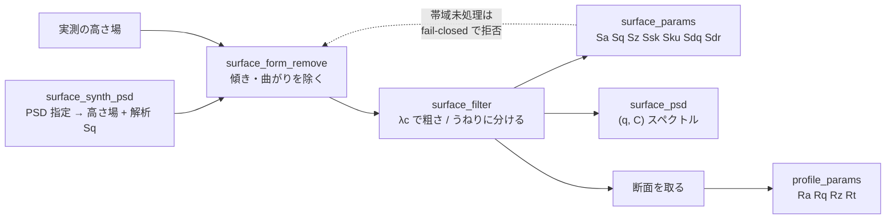

# 表面粗さ(測る前に帯域を決める) — 使い方ガイド

## この族は何をする道具箱か

高さ場から**粗さのパラメータを出す**層です。6 op / 3 カテゴリ(numpy と
`scipy.ndimage` のみ。台帳は `opsroughness.py`、実体は `roughness.py`):

- **synth(1)** — `surface_synth_psd`: 指定した PSD から高さ場を作り、
  **解析 Sq を一緒に返す**。この族のテストの真値の供給源。
- **prepare(2)** — `surface_form_remove` / `surface_filter`:
  形状(傾き・曲がり)を除き、帯域を粗さとうねりに分ける。
- **measure(3)** — `surface_params` / `profile_params` / `surface_psd`:
  面の Sa/Sq/Sp/Sv/Sz/Ssk/Sku/Sdq/Sdr、断面の Ra/Rq/Rz/Rt/Rp/Rv/Rsk/Rku、
  パワースペクトル密度。

## なぜ足したか

2026-09-06、表面粗さの PoC(`examples/poc_surface_roughness.py`)が
「**粗さパラメータの op が 1 つも無い**」と実測つきで報告しました。

| 既にあったもの | なぜ代わりにならないか |
|---|---|
| `roughness_map(grid, window)` | 局所標準偏差の**画像**であってパラメータではない |
| `opsprofile` の 12 op | 翼型断面の計測(厚み・キャンバー・前縁半径)で無関係 |
| `vol_fft_lowpass` / `highpass` | 3-D 体積向け。2-D 高さ場に**カットオフ波長**を指定する口が無い |
| `fs.fit_plane_ransac` | (N,3) 点群しか受けない(512² で毎回 26 万点へ展開) |
| `fs.radial_power_spectrum` | 規約が docstring に無い(面 PSD なのか動径なのか) |

## 全体の流れ



**`surface_params` は既定で「うねりを含んで見える」配列を拒否します。**
生の rms を Sq と呼ぶと実測で **20 倍**間違うためです。真値どおりに測るなら
必ず `surface_form_remove` → `surface_filter` を通してください。急ぐときだけ
`assume_filtered=True` で門を外せます。

## いちばん短い例

```python
import roughness as R

z, sq_true = R.surface_synth_psd(n=256, dx=1.0, hurst=0.8,
                                 lambda_lo=4.0, lambda_hi=64.0, sq=0.5, seed=0)
p = R.surface_params(z, dx=1.0, assume_filtered=True)
print(sq_true, p["Sq"])        # 0.5 と 0.5 —— 実測で相対差 0.00e+00
```

## 落とし穴 3 つ(このガイドの数値はすべて上の面での実測)

### 1. パラメータごとに標本化への強さが違う

同じ面(256², H=0.8, λ 4〜64)を間引いたときの相対誤差 [%]:

| 間引き | Sa | Sq | Sz | Ssk | Sku |
|---|---|---|---|---|---|
| ×2 | 0.0 | −0.0 | −1.4 | −0.1 | −0.0 |
| ×4 | 0.2 | 0.1 | **−6.9** | **−6.5** | −0.9 |
| ×8 | −0.4 | −0.5 | **−12.5** | −8.9 | −2.9 |
| ×16 | −1.9 | −3.0 | **−30.0** | **−71.5** | −16.5 |

**Sz と Ssk がまず壊れ、Sa と Sq は最後まで持ちます**。×8 の時点で
**Sa は −0.4 %(合格)なのに Sz は −12.5 %(不合格)** —— 同じデータで
結論が反転します。

面に依らないのはこの「Sz・Ssk が先、Sa・Sq が後」という順序だけです。
**Sa と Sq のどちらが強いかは面によって入れ替わります**(この面では
×16 で Sa −1.9 % / Sq −3.0 % と Sa のほうが良く、PoC の面では逆でした)。
どちらか一方を「頑健」と覚えないでください。

### 2. Sz は「どれだけ長く見たか」を測っている

同じ面から窓を切って Sz の平均を取ると:

| 窓 | Sz 平均 | 枚数 |
|---|---|---|
| 32² | 2.1791 | 64 |
| 64² | 2.6814 | 16 |
| 128² | 3.2380 | 4 |
| 256² | **3.8196** | 1 |

**頭打ちがありません**(32² から 256² で +75 %)。Sz は極値統計なので、
評価領域を広げれば必ず増えます。**Sz で合否を決めるなら評価領域を
先に固定しないと意味がありません**。Sq にはこの依存がありません。

### 3. `surface_form_remove` のロバスト化が効くのは「広い外れ値」

深い傷ではなく**面積の広い**外れ値のときに最小二乗が壊れます。PoC の実測
(傷の面積比 → 最小二乗 / RANSAC の Sq 誤差):

| 面積比 | 最小二乗 | RANSAC | 改善 |
|---|---|---|---|
| 5.6 % | −1.94 % | −0.39 % | 5.0 倍 |
| 16.3 % | −6.47 % | −3.03 % | 2.1 倍 |
| 31.0 % | −13.79 % | −11.53 % | 1.2 倍 |
| 46.0 % | −23.80 % | −23.56 % | **1.0 倍(改善ゼロ)** |

外れ値が多数派になると、多数決が傷のほうを選びます。**しかも誤差は必ず
過小側**(粗さを小さく見積もる)なので、検査では危険な向きです。

なお **λc を後段に置くと最小二乗と RANSAC の差はほぼ消えます**
(+0.00 % / −0.00 %)。ロバスト性が要るのは λc を掛けない運用
(平面度・形状偏差)のほうです。費用も違います —— 1024² で最小二乗 47 ms、
RANSAC 1.8 秒(**38 倍**)。

## 規約をはっきりさせてあるところ

- `surface_psd(z, dx, kind="areal"|"radial")` —— **規約を引数で明示**します。
  2 つの規約の傾きは厳密に 1.0 違います。面 PSD は Parseval を満たします
  (2-D 全格子和が Sq² と一致、実測 ±0.0000 %)。
- `profile_params` は **Rz(基準長さ 5 分割の平均)と Rt(全体)を両方返します**。
  孤立した傷があると 3.63 倍違うので、どちらの定義かを黙って選ばせません。
- `surface_filter` の `end_effect="reject"`(既定)は、循環畳み込みで汚れる
  ±λc/2 の帯を**返しません**。返した領域は大きな面から切り出した真値と
  厳密に一致します(実測 0.0e+00)。

## 関連

- `examples/poc_surface_roughness.py` —— この族を作らせた PoC。
- `docs/ops/profile/guides/profile_metrology.md` —— 1-D 断面の**形状**計測
  (こちらは粗さではなく厚みやキャンバー)。
- `docs/ops/interferometry/` —— 高さ場を実際に得るところ。
