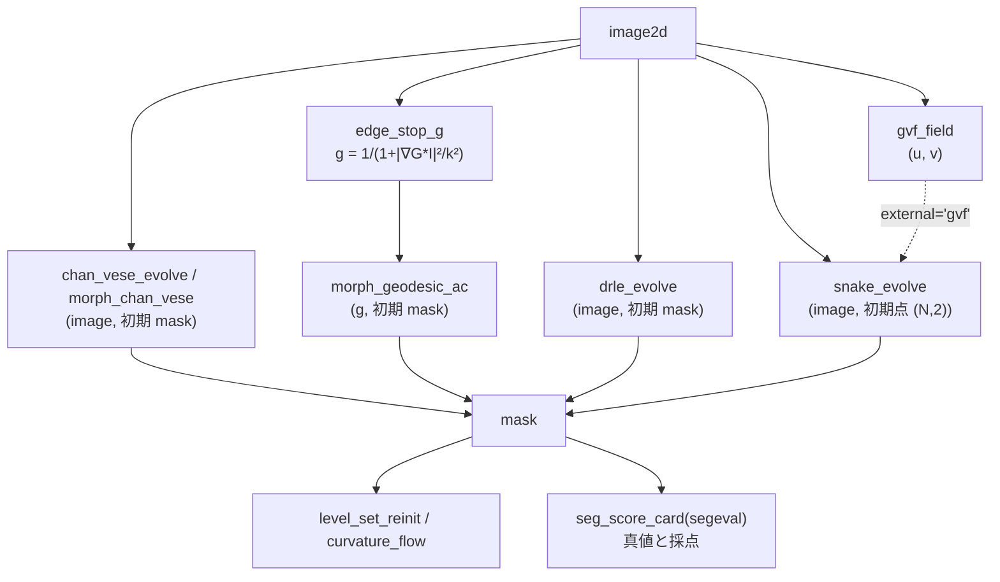

# 変分・動的輪郭とレベルセット — どの輪郭がどこで止まり、何を保証するか

セグメンテーション拡充 第 2 陣のカテゴリ **contour**(実体 `segcontour`、10 op)です。
閾値や分水嶺が「画素を一度に振り分ける」のに対し、ここの手法は **曲線(または曲線を零等高線に
持つ関数 φ)を、エネルギーが下がる向きに少しずつ動かす** ものです。学習器は載せません —— どの op も
**定理か第 2 実装の門** を持ちます(下の表)。

規約(全 op 共通): 画素の添字は (row, col)。snake の点は (N, 2) の [row, col]。レベルセットは
**φ < 0 が内側**。マスク(bool)を渡すと距離変換の符号付き距離に直してから使います。
返りはどれも `table`(dict)で、`mask` を持つ op はそれが最終の領域です。入力が不正なら `ValueError`
(黙って直しません)。

## 3 つの系統

- **パラメトリック(点列)** — `snake_evolve`: Kass–Witkin–Terzopoulos 1988 の半陰的更新
  x_t = (A + γI)^(-1)(γ x_(t-1) − f_x)。外力は `external` で `edge`(勾配の大きさ)/ `gvf` / `potential` / `none`。
  `gvf_field` は Xu–Prince 1998 の勾配ベクトル流(縁から離れた所まで力を拡散した場)で、snake を
  **凹部へ引き込む** ための外力です。
- **領域の当てはめ(縁を使わない)** — `chan_vese_energy` / `chan_vese_evolve`(Chan–Vese 2001。
  内外の平均 c1・c2 で近似した 2 値画像との差 + 長さ)、`morph_chan_vese`(Márquez-Neila ら 2014 の
  形態学的近似、MorphACWE)。
- **縁で止まる(測地的)** — `edge_stop_g`(g = 1 / (1 + |∇G_σ*I|² / k²)、縁で小さい)、
  `morph_geodesic_ac`(形態学的 GAC、MorphGAC。入力は g)、`drle_evolve`(Li ら 2010 の距離正則化
  レベルセット、再初期化なし)。
- **レベルセットの道具** — `level_set_reinit`(φ を同じ零等高線の符号付き距離に直す、Sussman ら 1994 +
  Russo–Smereka 2000)、`curvature_flow`(平均曲率流。閉曲線の面積は dA/dt = −2π で減る)。

## 門(何が保証され、何が保証されないか)

| op | 門(真値の出どころ) | 保証しないこと |
|---|---|---|
| `snake_evolve` | 外力 0 の円は 1 反復で半径が γ/(γ + λ₁) 倍(巡回行列の固有値、厳密)。γ ≥ L(外力の Lipschitz)ならエネルギーは単調非増加(降下補題)。第 2 実装 = skimage `active_contour` | γ < L・`max_px_move`・`resample_every` を使うと単調性は途切れる(`n_increase` に実測) |
| `gvf_field` | Euler 方程式が線形 → 疎行列の直接解と反復の 2 通りで解き、残差 ≈ 0 と一致 | 時間刻みの安定条件は記憶による(`method="direct"` を推奨) |
| `chan_vese_*` | 離散エネルギーの厳密な勾配 + Armijo の後退で単調非増加。凸緩和版は双対ギャップを返す | 論文自体は単調減少を主張していない(ここでの離散化の性質) |
| `morph_*` | データ段の前後で当てはめのエネルギーは単調非増加(画素ごとに分離)。第 2 実装 = skimage の同名関数 | 平滑段はエネルギーを上げうる(実測を返す) |
| `level_set_reinit` | 帯の中で \|∇φ\| ≈ 1、零等高線の Hausdorff ≤ 1 px、距離変換の符号付き距離と一致 | 帯の外の値 |
| `drle_evolve` | 零等高線の近くの \|∇φ\| の分位点を測って返す(Li の主張「距離の形を保つ」の確認) | エネルギーは陽的な刻みのため増えることがある(`n_increase`) |
| `curvature_flow` | dA/dt = −2π(回転数 1、凸でなくても)、円なら r² = r₀² − 2t | 曲線が消える時刻以降 |

## 流れ



## 最短の使い方

```python
import numpy as np
import fullseye as fs

yy, xx = np.mgrid[0:64, 0:64]
truth = (yy - 32) ** 2 + (xx - 31) ** 2 <= 14 ** 2           # 半径 14 の円盤(真値)
img = 0.2 + 0.6 * truth                                       # 明るい円盤

init = np.zeros((64, 64), bool)
init[10:50, 12:52] = True                                     # 食い違う四角から始める
cv = fs.ledger.chan_vese_evolve(img, init, n_iter=60)          # 縁を使わない当てはめ
assert cv["n_increase"] == 0                                  # エネルギーは 1 度も増えない

g = fs.ledger.edge_stop_g(img, sigma=1.0, k=0.1)["g"]         # 縁で小さい画像
outer = np.pad(np.ones((56, 56), bool), 4)                   # 外から囲んで縮める
gac = fs.ledger.morph_geodesic_ac(g, outer, n_iter=150, balloon=-1.0, threshold=0.5)
# ★threshold を省くと(auto = g の 40 % 点)、平坦な合成画像では g ≡ 1 が 4 割を超えて閾値 = 1 になり
#   風船が一度も働かない —— 輪郭は初期の四角のまま止まる(下の症状表)。

for m in (cv["mask"], gac["mask"]):
    card = fs.ledger.seg_score_card(m.astype(int), truth.astype(int))
    assert card["dice"] > 0.95

flow = fs.ledger.curvature_flow(truth, t_end=20.0)            # 面積は dA/dt = −2π で減る
assert abs(flow["area_rate"] - flow["area_rate_theory"]) < 0.05 * abs(flow["area_rate_theory"])
```

## 症状 → 原因

| 症状 | 原因 | 手当て |
|---|---|---|
| snake が凹部(U 字の内側)に入らない | 勾配の外力は縁の近くにしか無い(Xu–Prince 1998 の図の現象) | `gvf_field` を外力に(`external="gvf"`)、または `resample_every` で点を打ち直す |
| snake が縁に届く前に点になって縮み切る | 外力が届かない所では内部エネルギー(α・β)だけが効き、円は γ/(γ+λ₁) 倍ずつ縮む | 初期輪郭を縁に近づける、`sigma` を上げて外力の届く範囲を広げる、`kappa` を上げる |
| snake のエネルギーが増える(`n_increase` > 0) | γ < L(`gamma_ge_lipschitz` が False)か `max_px_move` で近接勾配の性質が失われた | γ を `lipschitz` 以上にする |
| Chan–Vese が照明の勾配で半分を丸ごと取る | 大域の 2 平均は照明のむらを「2 つの領域」と見る(縁を使わない手法の限界) | 縁で止まる `morph_geodesic_ac` / `drle_evolve`、または先にフラットフィールド補正 |
| 触れ合う粒が 1 つの領域になる | 輪郭法は 2 相(内と外)しか持たず、粒の間を割る力が無い | 結果の mask を分水嶺(`watersheds_marker`)や `blob_split` で割る |
| `level_set_reinit` / `curvature_flow` が `ValueError` | φ に内側(φ < 0)と外側の両方が無い(一様な画像を φ として渡した) | マスクを渡す(内外の両方を含む) |
| `drle_evolve` が `ValueError`(CFL) | μ·dt ≥ 1/4 | `mu` を既定(0.2/dt)にする、`dt` を下げる |
| GAC の輪郭が初期のまま 1 画素も動かない | `threshold="auto"`(g の 40 % 点)が平坦な背景で 1 になり、風船の効く画素(g > threshold/\|balloon\|)が無い | `threshold` を数で与える(例 0.5)。返りの `threshold` が 1.0 なら疑う |
| GAC が全面に広がる / 消える | 風船 `balloon` の符号が初期の置き方と逆 | 外から囲むなら負(縮める)、内に置くなら正(膨らませる) |

## 一次情報

- Kass, Witkin, Terzopoulos 1988, "Snakes: Active contour models": <https://doi.org/10.1007/BF00133570>
- Xu, Prince 1998, "Snakes, shapes, and gradient vector flow": <https://doi.org/10.1109/83.661186>
- Chan, Vese 2001, "Active contours without edges": <https://doi.org/10.1109/83.902291>
- Caselles, Kimmel, Sapiro 1997, "Geodesic active contours": <https://doi.org/10.1023/A:1007979827043>
- Márquez-Neila, Baumela, Álvarez 2014, "A morphological approach to curvature-based evolution of curves and surfaces": <https://doi.org/10.1109/TPAMI.2013.106>
- Sussman, Smereka, Osher 1994, "A level set approach for computing solutions to incompressible two-phase flow": <https://doi.org/10.1006/jcph.1994.1155>
- Russo, Smereka 2000, "A remark on computing distance functions": <https://doi.org/10.1006/jcph.1999.6345>
- Li, Xu, Gui, Fox 2010, "Distance regularized level set evolution and its application to image segmentation": <https://doi.org/10.1109/TIP.2010.2069690>
- Gage, Hamilton 1986, "The heat equation shrinking convex plane curves": <https://doi.org/10.4310/jdg/1214439902>
- Grayson 1987, "The heat equation shrinks embedded plane curves to round points": <https://doi.org/10.4310/jdg/1214441371>

`segcontour` の docstring に、原論文の版面で確かめた式と、二次資料・記憶にとどまる箇所(GVF の時間刻みの
安定条件、形態学的作用素の PDE との同値性の文言、DRLSE の CFL 条件の出典)を分けて書いてあります。

## 関連

- `segeval`(採点の物差し)と `segworld`(真値つきの合成世界): `segmentation_scoring_and_worlds` ガイド。
  輪郭法の限界(照明の勾配・影・触れ合う粒)は合成世界の上で数で見えます(PoC `examples/poc_active_contours.py`)。
- 既存の `sk_chan_vese`(2-D レジストリ、skimage の Chan–Vese): `chan_vese_evolve` の照合相手。
- HALCON Segmentation 章の 9 op(`halcon_segmentation` ガイド): 画素を一度に振り分ける側。
