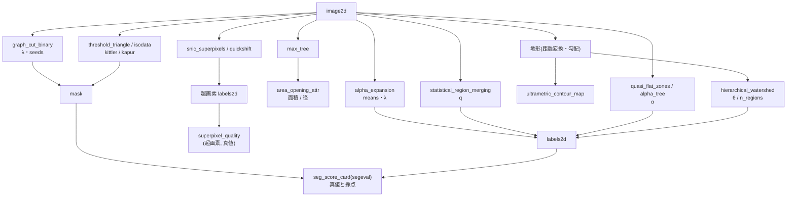

# グラフ・階層・閾値の定理でつくる分割 — 何が厳密で、どこで割れ方が倒れるか

セグメンテーション拡充 第 3 陣のカテゴリ **graph**(12 op)と **threshold**(4 op)です。実体はどちらも
`seggraph`。学習器は載せません(numpy + scipy のルールベース)。どの op も **定理か第 2 実装の門** を持ち、
その門を下の表に書きます。

規約(全 op 共通): 画素の添字は (row, col)。4 近傍の辺は「右」と「下」の 2 枚。ラベル画像は int64 で
**1 から** 振る(0 = マスクの外 / 背景)。2 値の結果は bool の `mask`。返りはどれも `table`(dict)で、
入力が不正なら `ValueError`(黙って直さない)。乱数は使わない(quick shift の同点は画素番号で決める)。
1 枚の画素数は `MAX_PIXELS` = 100 万まで(Python の Union-Find / 待ち行列を回すので、先に断る)。

## 4 つの系統

- **エネルギーの最小化(グラフカット)** — `graph_cut_binary`: 2 値の E = Σ D_p(x_p) + λ Σ w_pq [x_p ≠ x_q] を
  s-t グラフの最小カットで **厳密に** 最小化(Boykov–Jolly 2001)。`seeds`(labels2d、1 = 背景・2 = 物体)で硬く縛れる。
  `alpha_expansion`: 多ラベル版。各ラベル α への「替える / 替えない」の 2 値移動を graph cut で厳密に解き、
  下がる時だけ受け入れる(Boykov–Veksler–Zabih 2001)。大域解ではなく **E ≤ 2c E\*** の保証つき局所解。
- **併合と木(階層)** — `statistical_region_merging`(SRM、Nock–Nielsen 2004): 隣の差の昇順に併合の述語で結ぶ。
  `max_tree` / `area_opening_attr`: 成分木を作り、面積(または外接矩形の径)の小さい節を消す属性開放
  (Salembier ら 1998)。`quasi_flat_zones` / `alpha_tree`: 隣の差が α 以下の経路で結べる画素の同値類(Soille 2008)。
- **地形の階層(分水嶺)** — `hierarchical_watershed`: 最小全域森の辺に dynamics(浅い側の盆地の深さ)を付け、
  閾値 θ 以下の辺で結ぶ(Najman–Schmitt 1996、Cousty ら 2009)。`ultrametric_contour_map`: 隣り合う 2 画素が
  「同じ領域になる最小の θ」を縁の強さとして持つ地図(UCM)。**1 本の木から全部の θ の分割が読める**。
- **超画素と採点** — `snic_superpixels`(Achanta–Süsstrunk 2017、非反復)、`quickshift`(Vedaldi–Soatto 2008)、
  `superpixel_quality`(境界の再現率・CUSE・ASA・UE、超画素と真値の labels2d 2 枚)。
- **閾値(threshold カテゴリ)** — `threshold_triangle`(Zack ら 1977)/ `threshold_isodata`(Ridler–Calvard 1978)/
  `threshold_kittler`(Kittler–Illingworth 1986、最小誤差)/ `threshold_kapur`(Kapur–Sahoo–Wong 1985、最大エントロピー)。
  どれも `threshold`・`mask` に加えて **基準の曲線**(距離・J・H)を返す —— 閾値の根拠を後から見られる。

## 門(何が保証され、何が保証されないか)

| op | 門(真値の出どころ) | 保証しないこと |
|---|---|---|
| `graph_cut_binary` | 最大フロー = 最小カット(整数の容量で厳密一致、`flow_value_int` = `cut_value_int`)、カットの値 + 定数 = エネルギー、12 画素以下で総当たりの最小と一致、λ = 0 で画素ごとの判定 | 実数の入力は `scale` 倍して丸めた整数のエネルギーを最小化する → 実数の最小との差は `quantization_bound` 以下(返す) |
| `alpha_expansion` | 受け入れの列 `energies` は単調減少、各移動の 2 値の最小 ≤ 今の値、E ≤ 2c E\*(BVZ 2001 Theorem 6.1、Potts c = 1) | 大域解。PoC の 3×3 の罠で E = 72 / E\* = 57(比 1.26、上界 2 の内側) |
| `statistical_region_merging` | なし(述語の係数・誤差上界の定理の文言を原論文で確認できていない) | q に対する領域数の単調性 —— 実測として返すだけで門にしない |
| `max_tree` / `area_opening_attr` | 開放は冪等・反拡大・増加(増加する属性の連結開放は代数的開放)、skimage の `area_opening` / `diameter_opening` と画素一致・節の数一致 | 増加しない属性(この op は面積と径だけを受ける) |
| `quasi_flat_zones` / `alpha_tree` | 「差 > α の辺を落とした連結成分」=「最小全域木の重み ≤ α の辺の連結成分」(最小全域木の切断性質)、α を増やすと入れ子 | α が大きいと **連鎖効果** で勾配沿いに全部つながる(α-連結の性質そのもの) |
| `hierarchical_watershed` / `ultrametric_contour_map` | 盆地の間の距離は ultrametric(全 3 つ組で d(x, z) ≤ max(d(x, y), d(y, z)))、θ を上げると入れ子、生き残る盆地の数 = dynamics > θ の極小の数 | 地形の作り方(距離変換・勾配の大きさ …)は呼ぶ側の責任 |
| `snic_superpixels` / `quickshift` | SNIC の全ラベルが 4-連結(数えて返す `all_connected`)、quick shift は τ(`max_dist`)を増やすと入れ子、第 2 実装 = skimage `slic` / `quickshift` と境界の再現率が近い | SNIC の距離の形は SLIC の 2 乗の形(論文の式 (1) の抽出が崩れていて要確認) |
| `threshold_isodata` | 不動点 t = (μ_≤t + μ_>t)/2 を **画素の上で** 厳密に満たす(残差 `residual` = 0)、skimage と 1 ビン以内 | 照明の勾配がある画像(下の症状表) |
| `threshold_triangle` | skimage と 1 ビン以内 | 端点の高さ 0・裾の側の選び方は skimage / ImageJ の規約(原典は要確認) |
| `threshold_kittler` | 2 ガウスの混合で Bayes の最小誤差の閾値(2 次方程式の根)に 2.5 ビン以内、SimpleITK と数ビン以内(在れば) | J が平らな区間(空のビン)での位置(同点は最初のビン) |
| `threshold_kapur` | 総当たりの最大エントロピーと一致、SimpleITK と数ビン以内(在れば) | 同上 |

## 流れ



## 最短の使い方

```python
import numpy as np
import fullseye as fs

rng = np.random.default_rng(0)
yy, xx = np.mgrid[0:64, 0:64]
truth = (yy - 32) ** 2 + (xx - 30) ** 2 <= 15 ** 2                 # 半径 15 の円盤(真値)
img = np.clip(0.2 + 0.55 * truth + 0.12 * rng.standard_normal((64, 64)), 0.0, 1.0)

gc = fs.ledger.graph_cut_binary(img, lam=0.1)                        # 平滑項つきの 2 値化(厳密な最小)
assert gc["flow_value_int"] == gc["cut_value_int"]                  # 最大フロー = 最小カット
iso = fs.ledger.threshold_isodata(img)
assert iso["residual"] == 0.0                                       # 画素の上の不動点
for m in (gc["mask"], iso["mask"]):
    card = fs.ledger.seg_score_card(m.astype(int), truth.astype(int))
    print(round(card["dice"], 3))                                   # graph cut のほうが雑音に強い

# 地形の階層: 距離変換の窪みを盆地にして、θ を振らずに「2 領域になる最小の θ」を引く
from scipy import ndimage as ndi
two = ((yy - 32) ** 2 + (xx - 22) ** 2 <= 100) | ((yy - 32) ** 2 + (xx - 41) ** 2 <= 100)
relief = -ndi.distance_transform_edt(two)
hw = fs.ledger.hierarchical_watershed(relief, n_regions=2, mask=two)
assert hw["n_regions"] == 2                                         # 触れ合う 2 粒がくびれで割れる

sp = fs.ledger.snic_superpixels(img, n_segments=64)
assert sp["all_connected"]                                          # SNIC の構成上の保証(数えて確かめる)
q = fs.ledger.superpixel_quality(sp["labels"], truth.astype(int))
print(round(q["boundary_recall"], 3), round(q["cuse"], 3))
```

## 症状 → 原因

| 症状 | 原因 | 手当て |
|---|---|---|
| graph cut の λ を上げたら雑音は消えたが、細い線(幅 1〜3 px)も消えた | 平滑項は「細い物」と「雑音」を区別しない(縁の長さに罰を掛けるだけ)。PoC で λ = 0.1 は粒の Dice +0.13、線の Dice −0.11〜−0.15 | `contrast_sigma` で縁の強い所の罰を下げる、細い物は `seeds` で縛る、または別の op(稜線の検出)で拾う |
| `alpha_expansion` が画素ごとの判定のまま 1 度も動かない(`n_accepted` = 0) | 雑音が段の差に比べて小さく、画素ごとの判定が既に最小。または λ が小さすぎる | 異常ではない。`energies` と `move_minima` を見て、平滑項を試したいなら λ を上げる |
| `alpha_expansion` の結果が大域解より悪い | expansion は局所解(E ≤ 2c E\* の保証だけ)。1 回の移動は 1 ラベルしか広げないので、2 つのラベルを同時に動かさないと抜けられない局所解がある(PoC の 3×3、λ = 12: 全画素がラベル 2 で止まり E = 72、大域解 57) | `init` を変えて回し直し小さいほうを取る、`pairwise` / λ を見直す。比が上界 `bound_factor` を超えることは無い |
| SRM がどの q でも質感の違う 2 領域を 1 つにする | 述語は **領域の平均** しか見ない。平均が同じで質感だけ違う世界は割れない(PoC で 3 seed とも「全部 1 領域」より良くならない) | 先に局所の分散・テクスチャ特徴の画像を作って渡す |
| SRM が `ValueError`(範囲の外) | 画素の値を `value_range`(既定 (0, 1))で [0, g − 1] に写す。範囲の外の値は黙って切らない | `value_range` を画像の実際の範囲にする |
| 照明の勾配で isodata が半分を丸ごと取る | isodata は 2 群の平均の中点。勾配があると「明るい側」と「暗い側」が 2 群になる(PoC で Dice 0.29〜0.41) | Kittler(2 群の分散を別々に持つ、同じ世界で Dice 0.93〜0.99)、または先にフラットフィールド補正 |
| 三角法・Kapur の閾値が背景の山の裾に張り付く | 三角法は「山頂と裾の端を結ぶ線から最も遠いビン」、Kapur はエントロピーの和 —— どちらも大きな山の裾で決まりやすい。二峰がはっきりしていれば 4 法とも Dice ≥ 0.95 | 物体が小さく背景の山が大きい画像向けの道具だと割り切る。二峰なら isodata / Kittler |
| Kittler / Kapur の閾値が SimpleITK と大きく違うのに `mask` は同じ | 2 峰の間に空のビンが続くと J / H はその区間で平ら(どこで割っても同じ分割)。ここでは **最初のビン** を取る(実測: 雑音 0.03 の 2 段の画像で 0.29 と 0.47、マスクは同一) | 閾値の値でなく `mask` と基準の曲線(`criterion` / `entropy`)で比べる |
| 階層分水嶺が θ = 0 で粒より多く割れる | 距離変換の地形には浅い偽の極小がある(過分割)。PoC で 10 粒が θ = 0 で 19 領域 | θ を上げる(PoC では θ = 0.5〜3.5 で粒の数ちょうど)、または `n_regions` で数を与える |
| 階層分水嶺が大きな θ で粒を 1 つにまとめる | dynamics が θ 以下の盆地は併合される(未分割)。θ = 8 で 1 領域 | `ultrametric_contour_map` を見て、粒の数が安定する θ の帯を選ぶ |
| quick shift が全面 1 領域 | 特徴は (y, x, ratio·I)。ratio = 1 だと明るさの段(0..1)が空間の 1 画素より小さく、枝が段で切れない | `ratio` を上げる(段 0.55 に ratio 20 で 11)、`max_dist` を下げる |
| 影のある部品をどの手法でも取れない(Dice < 0.5) | 影と暗い面は明るさで部品と区別できない(第 1・2 陣と同じ限界) | 照明を変える、影を別に推定する。この層の op の外 |
| どの op も `ValueError`(MAX_PIXELS) | 1 枚 100 万画素を超える入力は先に断る(Python のループを回すため) | 縮小する、関心領域を切り出す |

## 一次情報

- Boykov, Jolly 2001, "Interactive graph cuts for optimal boundary & region segmentation of objects in N-D images": <https://doi.org/10.1109/ICCV.2001.937505>
- Boykov, Veksler, Zabih 2001, "Fast approximate energy minimization via graph cuts": <https://doi.org/10.1109/34.969114>
- Nock, Nielsen 2004, "Statistical region merging": <https://doi.org/10.1109/TPAMI.2004.110>
- Salembier, Oliveras, Garrido 1998, "Antiextensive connected operators for image and sequence processing": <https://doi.org/10.1109/83.663500>
- Najman, Couprie 2006, "Building the component tree in quasi-linear time": <https://doi.org/10.1109/TIP.2006.877518>
- Soille 2008, "Constrained connectivity for hierarchical image partitioning and simplification": <https://doi.org/10.1109/TPAMI.2007.70817>
- Najman, Schmitt 1996, "Geodesic saliency of watershed contours and hierarchical segmentation": <https://doi.org/10.1109/34.546254>
- Cousty, Bertrand, Najman, Couprie 2009, "Watershed cuts: minimum spanning forests and the drop of water principle": <https://doi.org/10.1109/TPAMI.2008.173>
- Achanta, Süsstrunk 2017, "Superpixels and polygons using simple non-iterative clustering": <https://doi.org/10.1109/CVPR.2017.520>
- Vedaldi, Soatto 2008, "Quick shift and kernel methods for mode seeking": <https://doi.org/10.1007/978-3-540-88693-8_52>
- Zack, Rogers, Latt 1977, "Automatic measurement of sister chromatid exchange frequency"(三角法): <https://doi.org/10.1177/25.7.70454>
- Ridler, Calvard 1978, "Picture thresholding using an iterative selection method": <https://doi.org/10.1109/TSMC.1978.4310039>
- Kittler, Illingworth 1986, "Minimum error thresholding": <https://doi.org/10.1016/0031-3203(86)90030-0>
- Kapur, Sahoo, Wong 1985, "A new method for gray-level picture thresholding using the entropy of the histogram": <https://doi.org/10.1016/0734-189X(85)90125-2>

`seggraph` の docstring に、原論文の版面で確かめた式(BVZ 2001 の Theorem 6.1・Boykov–Jolly の重みの表・SNIC の
Algorithm 1 と CUSE の式 (2)・quick shift の木)と、記憶や広く使われる実装にとどまる箇所(SRM の述語の係数、
Kittler / Kapur / 三角法の作図の規約、分水嶺カット = 最小全域森の定理の文言)を分けて書いてあります。

## 関連

- `segeval`(採点の物差し)と `segworld`(真値つきの合成世界): `segmentation_scoring_and_worlds` ガイド。
  どの世界でどれが勝つか(触れ合う粒・雑音と細い線・質感・照明の勾配)は PoC
  `examples/poc_graph_hierarchy_segmentation.py` が数で見せます。
- 既存の 2-D レジストリ: `sk_area_opening`(skimage、`area_opening_attr` の照合相手)、`sk_slic` / `sg_slic_superpixels`
  (SLIC)、`binary_threshold` / `auto_threshold`(大津)、`xsitk_maxentropy_thresh`(SimpleITK の最大エントロピー、
  マスクだけを返す —— `threshold_kapur` は基準の曲線つき・依存なしの版)。
- 動的輪郭とレベルセット(`active_contours_and_level_sets` ガイド)、HALCON Segmentation 章の 9 op
  (`halcon_segmentation` ガイド): 同じ台帳 `opssegmentation` の他のカテゴリ。
