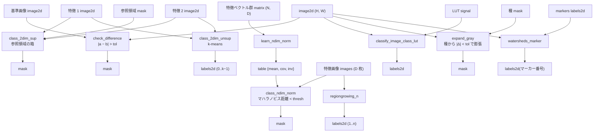

# 画素分類・領域成長・マーカー分水嶺(HALCON Segmentation 章の 9 op) — 使い方ガイド

## この族は何をする道具箱か

**グレー値・特徴空間から領域を作る**層です。入力は画像 1 枚(`image2d`)、2 枚、
または多チャネルの特徴画像(`images` = 2-D の list)と、参照領域・学習済みクラス・
マーカー画像。出力は画素ごとの真偽(`mask`)かラベル画像(`labels2d`)。

HALCON の "Segmentation" 章にある 9 演算子の genuine 実装(numpy + scipy、分水嶺だけ
skimage)で、`segmentation.py` が実体、`opssegmentation.py` が台帳です。

9 op / 4 カテゴリ:

- **compare(1)** — `check_difference`: 基準画像との差が `tol` を超える画素。
- **classify(5)** — `class_2dim_sup`(参照領域の 2 特徴の箱)/ `class_2dim_unsup`
  (2 特徴の k-means、ラベル 0..k−1)/ `learn_ndim_norm` → `class_ndim_norm`
  (N 次元の正規分布クラスを学習し、マハラノビス距離 < `thresh` で分類)/
  `classify_image_class_lut`(グレー値 → LUT 引き)。
- **grow(2)** — `expand_gray`(種から |Δ| < `tol` で膨張)/ `regiongrowing_n`
  (多チャネル特徴の近さで全画素をラベル付け)。
- **watershed(1)** — `watersheds_marker`(マーカー制御の分水嶺、skimage immersion 型)。

## なぜ台帳に載せたか —— 在庫を数えた結果

`segmentation.py` は 2026-08 から wheel に同梱され、`fullseye.vision.segment.<名前>`
(HALCON 名の facade)からは届いていました。しかし `fullseye.ledger` / `fullseye.op` /
`fullseye.<名前>` のどれにも無く、`tests/test_public_reachability.py` の数え方では
9 本とも「公開経路から呼べない関数」でした。`examples/poc_cell_counting.py` と
`examples/poc_particle_sizing.py` は揃って「2-D の分水嶺が公開経路に無い」を道具の穴に
挙げ、`docs/ops/blob/guides/blob_analysis.md` も同じ行を持っていました。

| 引いた先 | 何が在ったか | なぜ代わりにならないか |
|---|---|---|
| `fullseye.op.watersheds` / `regiongrowing` / `regiongrowing_mean` | 2-D レジストリの分水嶺・領域成長 | **画像 1 枚 + a/b ノブ**の形で、マーカー画像・参照画像・学習済みクラスを渡せない |
| `fullseye.ledger.blob_split` | 距離の降順で回す分水嶺 | 目的は同じだが別算法(numpy/scipy だけで閉じる)。`blob2d` の docstring が「skimage 不在時に黙って別算法に落ちる `watersheds_marker` は使わない」と書いている —— 同じ台帳に混ぜると「割る」が同名の別物を 2 本持つ |
| `fullseye.vision.segment.watersheds_marker` | facade(統一 registry) | HALCON 名で引く層で、docs/ops のノート・連鎖ファザー・`op_run` の入力補助には乗らない |

## 流れ



## 最短の使い方

```python
import numpy as np
import fullseye as fs

rng = np.random.default_rng(0)
im = rng.random((64, 64))
im[16:48, 16:48] = 0.5 + rng.normal(0.0, 0.01, (32, 32))        # 平坦な島

# 種から育てる(|im − 種の平均| < tol の 4 連結成分)
seed = np.zeros((64, 64), bool)
seed[30:34, 30:34] = True
island = fs.ledger.expand_gray(im, seed, tol=0.05)

# マーカー制御の分水嶺(尾根で割れる)
y, x = np.mgrid[0:64, 0:64]
valley = -np.abs(x - 32).astype(float)
markers = np.zeros((64, 64), int)
markers[32, 4] = 1
markers[32, 60] = 2
basins = fs.ledger.watersheds_marker(valley, markers)             # 左 = 1、右 = 2

# N 次元の正規分布クラス: 学習 → 分類
X = rng.normal(size=(500, 2)) * np.array([2.0, 0.5])
model = fs.ledger.learn_ndim_norm(X)
inside = fs.ledger.class_ndim_norm([im, im ** 2], model, thresh=2.0)
```

## 罠(実測、直していない)

- `regiongrowing_n` の `min_size` は**受け取るが使われない**。小さな領域も残る。
- `expand_gray` と `regiongrowing_n` は**種(走査で最初に当たった画素)の値**と比べる。
  HALCON は隣接画素どうしの差で判定するので、なだらかな勾配では**この実装のほうが
  早く止まる**(勾配 0.04/px・tol 0.05 で 2 列ずつ切れる)。参照値で比べる形は HALCON の
  `expand_gray_ref` に近い。
- `class_2dim_sup` は参照領域の特徴を**外接箱**で近似する(HALCON は特徴空間の領域そのもの)。
  L 字の参照は全域に膨らむ。参照領域が空だと理由の無い `ValueError`。
- `class_2dim_unsup` の初期中心は一様に引く(k-means++ 無し・再試行無し)。よく離れた
  3 クラスタでも 1 つを割り 2 つを併せる局所解に落ちうる。`n_clusters` > 画素数で
  理由の無い `ValueError`。返りのラベル 0 は**クラス**であって背景ではない ——
  `blob_features` に渡す前に 1 から振り直すこと。
- `class_ndim_norm` に **1 枚の 2-D 画像**を渡すと `(H, W, D)` の unpack で落ちる
  (`regiongrowing_n` は受ける)。list か `(H, W, D)` で渡す。
- `watersheds_marker` は skimage 不在時に**マーカーからの最近傍**(画像を見ない)へ黙って
  落ちる。同じ関数名で別物が返るので、本番では skimage の有無を確かめること。
- `classify_image_class_lut` は float 画像を `[0, 1]` とみなして `round(v·(L−1))` で引く
  (HALCON は byte 画像 + LUT ハンドル)。2-D の LUT を渡すと `(H, W, k)` が返り、
  台帳の `labels2d` にならない。

## 同じ台帳の他のカテゴリ(採点・真値つき世界・動的輪郭)

この台帳(`opssegmentation`)には HALCON 章の 9 op の後に、分けた結果を**採点する**側・**真値を作る**側・**輪郭で分ける**側が
同居している。詳しくは [分割の採点と真値つき合成世界](segmentation_scoring_and_worlds.md) と
[動的輪郭とレベルセット](active_contours_and_level_sets.md)。

| カテゴリ | op |
|---|---|
| score(採点) | `seg_confusion_table` / `seg_dice_jaccard` / `seg_boundary_f` / `seg_hausdorff` / `seg_mean_surface_distance` / `seg_under_over_segmentation` / `seg_object_counts_match` / `seg_score_card` |
| world(真値つき合成世界) | `world_blobs_touching` / `world_grains_voronoi` / `world_parts_with_shadow` / `world_texture_regions` / `world_gradient_illumination` / `world_thin_structures` / `lens_area` / `voronoi_cells` |
| contour(動的輪郭・レベルセット) | `snake_evolve` / `gvf_field` / `chan_vese_energy` / `chan_vese_evolve` / `morph_chan_vese` / `morph_geodesic_ac` / `edge_stop_g` / `level_set_reinit` / `drle_evolve` / `curvature_flow` |

HALCON 側の op で分けた結果は、そのまま `seg_score_card` に真値と一緒に渡せる(背景 0 の約束だけ揃える)。

## 関連

- `blob_analysis`(`opsblob`): 分けたあとに**物体ごとに測って選ぶ**側。`watersheds_marker` /
  `regiongrowing_n` のラベルは背景 0 の約束が違うので、`blob_features` の前に振り直す。
- `fullseye.op.watersheds` / `regiongrowing` / `segment_image_mser`: 画像 1 枚で済む
  ときの 2-D レジストリ側。
