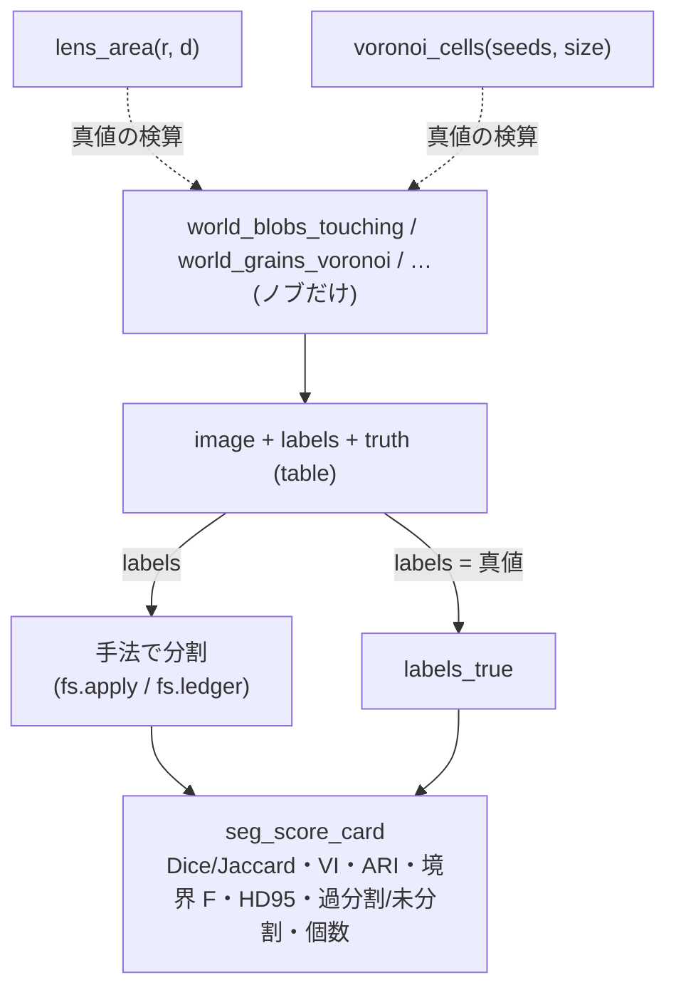

# 分割の採点と真値つき合成世界 — どの物差しがどの壊れ方に盲目か

セグメンテーション拡充 第 1 陣の 2 カテゴリ。`segeval`(**score**、採点の物差し 8 本)と
`segworld`(**world**、閉形式の真値を持つ合成世界 8 本)です。前者は「予測と真値がどれだけ
違うか」を数え、後者は「原理的に 1 つの手法を壊す」入力を真値つきで作ります。学習器は
載せません —— どの物差しも **定理か第 2 実装の門**、どの世界も **閉形式の真値** を持つものだけ。

## score(`segeval`): 1 枚の予測ラベル × 1 枚の真値ラベル → 数

入口はどちらも `labels2d`(非負整数、0 は背景)。出力は `table`(平らな dict)。

- **分割表と対応** — `seg_confusion_table`: 行 = 真、列 = 予測の画素数の表。対応は Hungarian で
  なく **最大重なり**(行ごと・列ごとの argmax)、相互に選び合えば `mutual`、全体が 1 対 1 なら
  `unique_matching`。
- **領域の重なり** — `seg_dice_jaccard`: マスク(背景以外の和)か `per_label` でラベルごとに。
  恒等式 D = 2J/(1+J) が門。
- **境界の近さ** — `seg_boundary_f`(許容距離 τ 以内に相手の境界があるか = Martin 流の BF 値)/
  `seg_hausdorff`(最悪のずれ、HD95 も)/ `seg_mean_surface_distance`(平均表面距離 ASSD)。
- **数え方の壊れ** — `seg_under_over_segmentation`(過分割・未分割を多数決の多重度で)/
  `seg_object_counts_match`(分裂・融合・欠落・偽・一致を 2 部グラフの次数で)。
- **採点表** — `seg_score_card`: 上の全部 + 既存 `segcompare` の VI・Rand・ARI を 1 枚に。

## world(`segworld`): ノブ → 画像 + 真値ラベル + 閉形式の真値

`world_*` は入力を取らず(ノブだけ)、`image`・`labels`・`truth` を持つ `table` を返します。
各世界は **1 つの手法を壊す理由** を持ちます:

- `world_blobs_touching` — 触れ合う円(閾値 + 連結成分では融合する。真値 = レンズの面積の閉形式)。
- `world_grains_voronoi` — 結晶粒(粒界の細線。真値 = ボロノイ多角形の面積・辺の長さ)。
- `world_parts_with_shadow` — 影つき工業部品(閾値を欺く暗い面と影)。
- `world_texture_regions` — 平均が同じで質感だけ違う領域(閾値では切れない)。
- `world_gradient_illumination` — 照明の勾配の上の暗い物体(大域閾値が壊れ、フラットフィールドで直る)。
- `world_thin_structures` — 幅 1〜3 px の線とひび(平滑化で消える)。
- `lens_area` — 等半径 2 円の重なりの面積(閉形式、`world_blobs_touching` の真値の芯)。
- `voronoi_cells` — 矩形内のボロノイ分割(多角形・面積・内部の辺長。`world_grains_voronoi` の芯)。

## 流れ



## 最短の使い方

```python
import fullseye as fs

wld = fs.ledger.world_blobs_touching(n=8, overlap=0.25, seed=0)   # ノブ → 真値つきの世界
truth_labels = wld["labels"]

# 手法の予測(ここでは真値をそのまま採点 = 満点を確かめる)
card = fs.ledger.seg_score_card(truth_labels, truth_labels)
assert card["dice"] == 1.0 and card["voi"] == 0.0 and card["counts_match"]

# 融合に盲目なマスクの物差し vs 融合を見る個数の物差し
merged = truth_labels.copy()
merged[merged > 0] = 1                                            # 全部 1 つにつぶす(最悪の未分割)
cm = fs.ledger.seg_object_counts_match(merged, truth_labels)
assert cm["merged"] == 1 and not cm["counts_match"]               # Dice は高いままでも個数は崩れる
```

## 症状 → 原因(採点でだまされないために)

| 症状 | 原因 | 見る物差し |
|---|---|---|
| Dice・Jaccard は高いのに物体が足りない | マスクの物差しは **融合・分裂に盲目**(画素の重なりしか見ない) | `seg_object_counts_match` の `merged` / `split`、`seg_under_over_segmentation` |
| 境界 F は高いのに領域が無数にある | 境界の物差しは **過分割に盲目**(割れ目が合っていれば満点) | `seg_under_over_segmentation` の `over`、`seg_score_card` の `voi` |
| ASSD は小さいのに 1 か所だけ大きく外す | 平均は **外れ値に鈍い** | `seg_hausdorff`(最悪、HD95) |
| `seg_hausdorff` が `ValueError` | 片方が 1 色(境界が無い)= 測る表面が無い | 入力に 2 つ以上のラベルがあるか確認 |
| `class_2dim_unsup` のラベル 0 が背景に化ける | k-means の **0 はクラス番号**であって背景ではない | `blob_features` に渡す前に 1 から振り直す |
| 真値どおりなのに満点にならない | 手法が **全画素分割**(背景の概念が無い)を返している | マスクの Dice は `—`、ARI / VI で比べる |

## 一次情報

- Martin et al. 2004, "Learning to Detect Natural Image Boundaries"(許容距離つき境界の適合率・再現率):
  <https://www2.eecs.berkeley.edu/Research/Projects/CS/vision/grouping/papers/mfm-pami-boundary.pdf>
- Perazzi et al. 2016, DAVIS benchmark(境界 F 値 の運用): <https://davischallenge.org/>
- Meilă 2007, "Comparing clusterings — an information based distance"(VI): <https://doi.org/10.1016/j.jmva.2006.11.013>
- Hubert & Arabie 1985, "Comparing partitions"(adjusted Rand index): <https://doi.org/10.1007/BF01908075>
- Taha & Hanbury 2015, "Metrics for evaluating 3D medical image segmentation"(Dice/Jaccard/Hausdorff/ASSD の整理): <https://doi.org/10.1186/s12880-015-0068-x>

## 関連

- `segcompare`(VI・Rand・ARI の実体)。`seg_score_card` はこれを呼ぶ。
- `metrics3d.voxel_dice` / `voxel_iou` / `hausdorff_distance`(マスクの Dice・点群の Hausdorff の第 2 実装、テストの門)。
- HALCON Segmentation 章の 9 op(`docs/ops/segmentation/guides/halcon_segmentation.md`): 分割を **作る** 側。
  この 2 カテゴリは作った分割を **採点する** 側。
