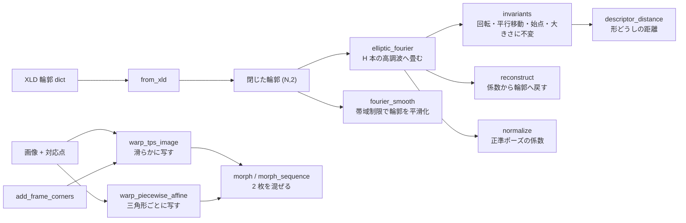

# 2-D の形を記述して写す(EFD とランドマークワープ) — 使い方ガイド

## この族は何をする道具箱か

**閉じた輪郭を係数に畳んで比べる**層と、**対応点で画像を写す**層です。
13 op / 2 カテゴリ(numpy と scipy のみ。台帳は `opsshape2d.py`、実体は
`fourierdesc.py` と `imagemorph.py`):

- **descriptor(7)** — `elliptic_fourier` / `reconstruct` / `invariants` /
  `normalize` / `descriptor_distance` / `fourier_smooth` / `from_xld`:
  閉輪郭 → 楕円フーリエ係数 → 不変量 → 形どうしの距離。
- **morph(6)** — `warp_tps_image` / `warp_piecewise_affine` / `morph` /
  `morph_sequence` / `blend` / `add_frame_corners`:
  ランドマークの対応で画像を変形する。

## なぜ台帳に載せたか —— 見えていなかったから

2026-09-06 に数え直したところ、この 2 モジュールは

- wheel に**同梱されていて**(`pyproject.toml` の `py-modules`)、
- 専用テストがあって **7/7・6/6 の関数が実際に呼ばれていて**、
- それでも `fullseye.<名前>` にも `fullseye.ledger.<名前>` にも
  `fullseye.op.<名前>` にも**一つも出ていませんでした**。

呼んでいたのはギャラリー生成器とテストだけ。つまり**実装した・テストも
書いた、で終わっていて、利用者から見ると存在しない**状態でした。

見落とした理由がはっきりしています。`docs/ops` の drift 検査も
op→example のカバレッジも、**すでに登録された op** を数える門です。
登録されなかったものは母集団にすら入らないので、どの検査も緑のまま
気づけません。同じ形の穴を数える門を
`tests/test_public_reachability.py` に立てました。

## 全体の流れ



## いちばん短い例

```python
import numpy as np
import fourierdesc as F

t = np.linspace(0, 2 * np.pi, 240, endpoint=False)
r = 30 + 6 * np.cos(3 * t)                      # 3 葉の突起を持つ形
pts = np.c_[60 + r * np.cos(t), 60 + 0.7 * r * np.sin(t)]

model = F.elliptic_fourier(pts, n_harmonics=10)  # 係数へ畳む
inv = F.invariants(model)                        # 向きも大きさも消した記述子
d = F.descriptor_distance(model, model)          # 同じ形なら 0.0
```

## 落とし穴 4 つ(どれも実測つき)

### 1. 高調波を増やしても、ある所から先は下がらない

上の 3 葉 + 7 葉の形(240 点)で、係数から戻した輪郭と元の輪郭の
最近傍距離を測ると:

| 高調波の本数 | 最大 | 中央値 |
|---|---|---|
| 2 | 4.4221 px | 1.3359 px |
| 6 | 2.0614 px | 0.5836 px |
| 8 | 1.0931 px | 0.3299 px |
| 12 | **0.4123 px** | 0.2175 px |
| 20 | 0.3729 px | 0.2038 px |
| 40 | 0.3811 px | 0.1875 px |

H=12 で頭打ちになり、40 本にしても最大誤差は**むしろ少し増えます**。
残っている 0.37 px は形の情報ではなく、`reconstruct` が弧長で等間隔に
点を打ち直すことによる標本化の床です。**「まだ誤差があるから高調波を
増やす」は、この床から先は効きません**。元の形に鋭い角があるとき以外、
実務では H=10〜15 で足ります。

### 2. 不変量は本当に不変(そこは信じてよい)

同じ形を動かして `invariants` を比べた実測:

| 変換 | 記述子の最大差 |
|---|---|
| 回転 37 度 | 3.3e-16 |
| 平行移動 +(13, −7) | 2.2e-16 |
| 2.5 倍に拡大 | 3.3e-16 |
| 始点を 60 点ずらす | 5.6e-16 |

4 つとも倍精度の丸め誤差です。この族で「回転不変」と書いてあるものは
**下請けの任意性に引きずられていません** —— 同じ主張を持つ 3-D の記述子
(`fpfh` / `ppf`)は法線の符号の任意性で実際に壊れていたので、平面の
輪郭でも念のため測りました。

### 3. 距離は「形の違いの量」に比例しない

形を周期 5 で `k` の割合だけ膨らませて距離を測ると:

| 歪み k | 距離 |
|---|---|
| 0.00 | 0.00000 |
| 0.02 | 0.02637 |
| 0.05 | 0.06195 |
| 0.10 | 0.10673 |
| 0.20 | 0.18250 |

**順序は保ちますが、比例しません**(k を 10 倍にしても距離は 6.9 倍)。
歪みが大きいほど頭打ちになるので、「距離 0.1 は距離 0.05 の 2 倍おかしい」
とは読めません。**閾値を切る用途には使えて、量を言う用途には向きません**。

### 4. TPS と区分アフィンは「どこまで影響するか」が違う

96x128 の滑らかな傾斜画像で、5 つの制御点のうち**中央の 1 点だけ**を
(8, 0) 動かしたときの実測:

| 手法 | 制御点の凸包の内 | 凸包の外 | 変位場の二階差分 rms |
|---|---|---|---|
| `warp_piecewise_affine` | 0.0312 | 0.0288 | 0.00020 |
| `warp_tps_image` | 0.0313 | **0.0333** | **0.00006** |

**TPS のほうが変位場は 3.3 倍滑らかで、そのぶん凸包の外まで効きます**
(薄板スプラインは大域的な基底なので当然の帰結です)。顔や生物のように
連続した変形を作りたいなら TPS、部品ごとに独立に動かしたいなら区分
アフィン、という使い分けになります。

なお、**制御点を全部同じだけ動かした形の検査では両者の差は出ません**
(一様な平行移動はどこでもアフィンなので当たり前)。最初にその形で
測って「差が無い」と書きかけました —— 探針が 1 枚だと差が出ないことの
ほうが多いので、必ず**一様でない変形**で比べてください。

## 縁を止めたいときは枠の点を足す

制御点だけを渡すと、画像の縁も一緒に動きます。`add_frame_corners` は
四隅と辺の中点を固定点として足します(4 点 → 12 点)。同じ変形での実測:

| | 点数 | 画像の上下端の変化 | 中央の変化 |
|---|---|---|---|
| 枠なし | 4 | 0.0547 | 0.0547 |
| `add_frame_corners` | 12 | **0.0256** | 0.0472 |

縁の動きは半分以下になり、中央の変形はほぼ保たれます。

## 関連

- `docs/ops/shapestat/guides/shape_statistics.md` —— 3-D のランドマークを
  **群**で比べる層。こちらは 2-D の輪郭を 1 つずつ記述する層。
- `docs/ops/profile/guides/profile_metrology.md` —— 1-D 断面の計測。
- `examples/contour_fourier.py` —— この族を使う例。
