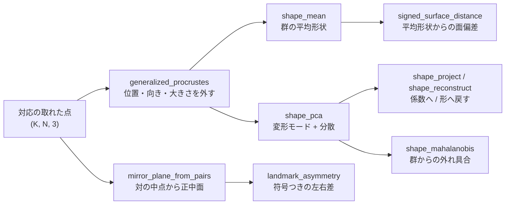

# 形態統計(形の群を比べる) — 使い方ガイド

## この族は何をする道具箱か

**1 つの形ではなく、形の群を比べる**層です。入力は対応の取れた点(ランドマーク、
または同じ手順で再標本化した頂点)、出力は共通の枠へ揃えた形・平均形状・
主成分・異常度・正中面・符号つきの面距離。

16 op / 5 カテゴリ(numpy と scipy のみ。台帳は `opsshapestat.py`、実体は
`shapestats.py`):

- **synth(2)** — `shape_synth_family` / `shape_perturb`: 既知の変形モードを
  持つ形の群と、既知の 1 変形。**この族の全テストの真値の供給源**。
- **procrustes(5)** — `procrustes_fit` / `procrustes_align` /
  `procrustes_distance` / `generalized_procrustes` / `shape_mean`:
  位置・向き・大きさを取り除く。
- **model(6)** — `shape_pca` / `shape_project` / `shape_reconstruct` /
  `shape_mahalanobis` / `shape_explained_variance` / `shape_synthesize`:
  統計形状モデル。
- **symmetry(2)** — `mirror_plane_from_pairs` / `landmark_asymmetry`:
  左右の対から正中面を出し、符号つきで測る。
- **deviation(1)** — `signed_surface_distance`: 3-D の符号つき面距離。

## 全体の流れ



左の枝が「群と比べる」、右の枝が「自分の中の左右で比べる」。真値が要るときは
`shape_synth_family` と `shape_perturb` で既知の変形を作ってから同じ経路を通します。

## なぜ足したか —— 在庫を数えた結果

2026-09-06、左右非対称性の PoC(`examples/poc_bilateral_asymmetry.py`)が
「形を 1 つずつ扱う道具は揃っているのに、**群で比べる層が無い**」と具体的に
列挙しました。

| 既にあったもの | 何をするか | なぜ代わりにならないか |
|---|---|---|
| `kabsch` | 対応つき点の**剛体**当てはめ | 大きさを吸収できない。群の平均も出ない |
| `icp` / `point_to_plane_icp` | 対応**無し**の位置合わせ | ランドマークの対応を活かせない |
| `pca_align` | 主軸で揃える | 素の直方体で 83 % が反転した象限を掴む |
| `symmetry3d.detect_reflection_symmetry` | 残差最小の鏡映面 | **片側の変形に引きずられる**(下記) |
| `profileops.profile_deviation` | 1-D 輪郭の符号つき偏差 | 3-D に相当が無かった |

**工業検査との違いは 1 点だけ** —— 設計 CAD が無い。だから基準が「図面との差」
ではなく「群集平均との差」「左右対称性」「成長の軸」になる。それ以外は同じ
パイプライン(抽出 → 位置合わせ → 特徴量化 → 群比較 → 異常検出)に載ります。

## いちばん短い例

```python
import shapestats as ss

fam = ss.shape_synth_family(n_shapes=20, n_points=64, seed=0)   # (20, 64, 3)
model = ss.shape_pca(fam)                    # 平均形状 + 主成分 + 分散
score = ss.shape_mahalanobis(model, fam[0])  # この個体は群からどれだけ外れているか
```

## 落とし穴 3 つ(どれも実測つき)

### 1. `scaling` の選択で主成分が変わる

Procrustes は 3 段階で情報を捨てます: 平行移動 → 回転 → **大きさ**。3 段目は
既定で有効です。ところが「長軸の伸び縮み」というモードは一様拡大とよく似て
いるので、**スケール除去がその半分以上を持っていきます**。

`shape_synth_family` は第 1 モードを伸び、第 2 を曲げにし、重みの比を
0.30 : 0.12 にしてあるので**分散比の真値は 6.25** です。実測(K=40、N=80):

| 前処理 | 分散比 | 寄与率(第 1 / 第 2) |
|---|---|---|
| `align=False` | 6.981 | 0.8747 / 0.1253 |
| GPA(`scaling=False`) | 6.981 | 0.8747 / 0.1253 |
| `align=True`(既定) | **2.565** | 0.7188 / 0.2803 |

間違いではなく定義の帰結です。**「大きさを形質に数えるか」を先に決めてから**
使ってください。成長や体格差を形の話に含めたいなら `align=False`。

### 2. Mahalanobis は裾を切らないと意味を失う

K 個体の群から出る主成分は K−1 本ですが、後ろのほうは分散が数値的なゼロまで
落ちます。実測(K=12、N=80、真のモードは 2 本)の分散:
`3.2e-02, 5.6e-03, 4.0e-05, 6.7e-13, …, 1.0e-31`。この裾で割ると:

| 使う本数 | 群内の個体 | 0.5 の膨らみを注入 |
|---|---|---|
| 2 | 0.885 | 2.617 |
| 5 | 1.373 | 1393035.060 |
| 11(全部) | **46613.636** | 9.3e+13 |

11 本では**群内ですら 46614**。「異常度」ではなく「数値ゼロで割った回数」を
測っています。既定は累積寄与率 0.99 までで打ち切ります(上の群では 2 本)。

### 3. 正中面は「残差が小さい面」ではない

`symmetry3d.detect_reflection_symmetry` は残差を最小にする面を選びます。それは
**症状を左右に均して残差を買っている**ので、片側の変形があると面自体が
引きずられます。PoC の実測: 6.4 mm の片側変形で面が真の正中面から
**2.92 mm / 1.72 度**ずれ、非対称量の **46 %** が消えました(利得 0.54)。
対の中点から決める `mirror_plane_from_pairs` なら利得 1.03。

**見つけるなら残差最適面、量を言うならランドマーク面**、が両者の使い分けです。

ただしランドマーク面にも限界があります。**片側が一様に広がる変形は面が丸ごと
吸います**(中点が半分だけ動き、面もそこへ動く)。実測でその場合の左右差は
4.9e-35。外から面を与えるか、正中線上のランドマーク(`midline`)を足してください。

## 検査の床を先に測る

「差が出た」と言う前に、**同じものを測って出る差**を測ってください。PoC の
実測(15000 点、点間隔 1.09 mm):

| 測り方 | 床(完全対称な標本での rms) |
|---|---|
| 点対点 | 1.3262 mm(点間隔 x 1.2) |
| 点対面 | 0.0297 mm(**45 倍改善**) |
| 近傍中央値で平滑 | 0.0116 mm |

測る距離だけでなく**合わせる距離**も効きます。ICP を点対点にすると床は
0.1554 mm(点対面の 13 倍)。両方を接平面にして初めて床に届きます。

## 実データへ

比較形態学なら MorphoSource(<https://www.morphosource.org/>)に骨・歯・頭蓋・
化石の CT とメッシュがあります。**リポジトリには同梱せず**、
**標本やファイルごとに寄託機関が条件を付ける**ので個別に確認してください。

実スキャンで増える条件が 3 つあります: 単位が mm とは限らない / 破損標本には
trimmed ICP が要る / 非閉曲面では重心基準の法線向き付けが使えない。

## 関連

- `examples/poc_bilateral_asymmetry.py` —— この族を作らせた PoC。
- `docs/ops/3d/` の位置合わせ・点群・メッシュ修復 —— 前段の道具。
- `docs/ops/profile/guides/profile_metrology.md` —— 1-D 断面の同型問題。
