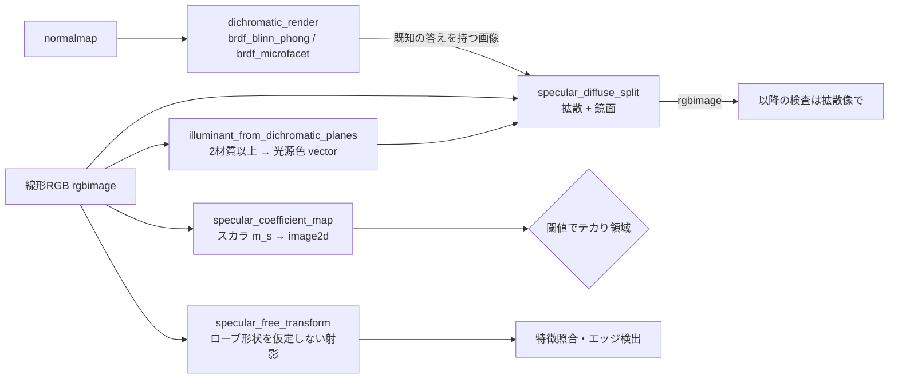
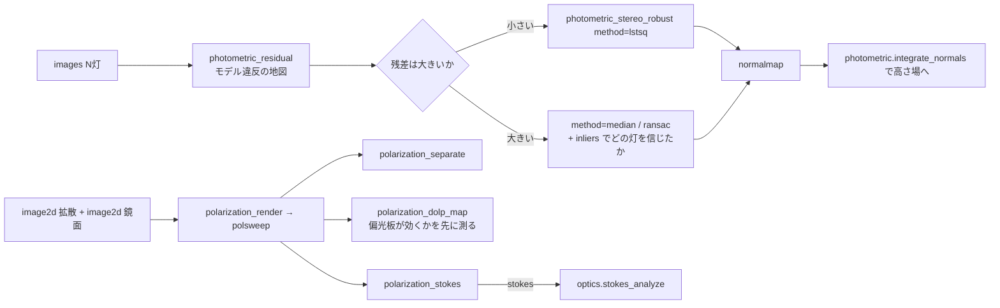

# 鏡面反射の分離と頑健フォトメトリックステレオ — 使い方ガイド

## この族は何をする道具箱か

**Lambertian 前提が壊れる場所**の道具箱です。`photometric` は自分の docstring でこう書いています — 線形最小二乗が厳密なのは「Lambertian + 既知光源 + 影なし」のときだけで、**影とスペキュラは線形性を破る**から頑健版が別途要る、と。本族はその「別途」であり、加えて**形状復元にかける前にハイライトそのものを取り除く** 2 つの経路(色・偏光)を第一級の op にしたものです。金属・塗装・樹脂といった光る面の外観検査は、ここが無いと最初の一歩で崩れます。13 op / 4 カテゴリ(numpy のみ、台帳は `opsspecular.py`、実体は `specularity.py`):

- **dichromatic(4)** — `specular_diffuse_split` / `specular_coefficient_map` / `specular_free_transform` / `illuminant_from_dichromatic_planes`: 二色性反射モデル(誘電体の放射輝度は「面の色を持つ body 項」と「光源の色を持つ interface 項」の和)。鏡面成分は光源色方向の**1 次元部分空間**に載るので、除去は最適化ではなく**射影**です。分離した拡散像、閾値にかけるスカラの鏡面係数、ローブ形状を知らずに済ませる鏡面不変部分空間、そして光源色そのものを画像から求める null 空間計算。
- **reflectance(3)** — `brdf_blinn_phong` / `brdf_microfacet` / `dichromatic_render`: 順方向モデル。既知のハイライトを描いて、分離して、入れた値と突き合わせる — ループが閉じます。ローブ形状を **2 種類**用意したのは意図的で、分離器がローブの形に依存していないことは片方だけでは示せません。
- **photometric(2)** — `photometric_stereo_robust` / `photometric_residual`: Woodham の 3 灯解を、Fischler-Bolles の最大合意と Rousseeuw の最小メディアン二乗で包んだもの。3 灯部分集合の列挙は**網羅的かつ決定的**なので、2 回走らせればビット単位で同じ答えが返ります。残差マップは「頑健版に手を出す前に、そもそも必要かどうか」を答える診断です。
- **polarization(4)** — `polarization_render` / `polarization_separate` / `polarization_dolp_map` / `polarization_stokes`: 検光子を回した掃引は、無偏光成分と直線偏光成分へ閉形式で割れます。最後の 1 つは Stokes ベクトルを `optics.stokes_analyze` へそのまま手渡します。

データ種は既存語彙の再利用が基本です: **image2d**(鏡面係数・残差・偏光度などのスカラ地図。閾値処理や形態素へそのまま流せる)、**images**(光源を切り替えた N 枚)、**normalmap**(`photometric` と同じ規約の法線場。+z がカメラ向き)、**vector**((3,) の光源色)、**labels**((H,W) の材質地図 — 既存のセグメンテーション出力がそのまま入口になる)、**stokes**(既存の偏光語彙)。新語は 2 つだけで、どちらも**既存語では型レベルの嘘になる**ものです。**rgbimage**((H,W,3) の線形 RGB)は `pointmap` / `normalmap` と構造が完全に同じですが、そこへ計量 XYZ や単位法線を渡しても例外は出ず「もっともらしく間違った分離結果」が出ます。**polsweep**((N,H,W) の検光子掃引)は `images` と構造が同じで、これを分けた理由は §「入力契約」の最後に実測つきで書いてあります。

## 既存 op との棲み分け(重複させていないもの)

本族は既存資産を**再実装せず import して合成**します。下表の右列は「そちらを呼びなさい」という意味です。

| やりたいこと | 使う op | 置き場所 |
|---|---|---|
| Lambertian の**順方向レンダ** | `render_lambertian` / `synthesize_ps_images` | `photometric`。`dichromatic_render` は body 項をこれで**計算させて**おり、ビット単位で一致することをテストで固定しています(光源の正規化規約とクリップが 2 モジュールで食い違わない唯一の担保) |
| 影もスペキュラも無い場合の**素の**フォトメトリックステレオ | `photometric_stereo` | `photometric`。`photometric_stereo_robust(method="lstsq")` はこれを**呼ぶだけ**で、だから「素の版がここで壊れる」が主張ではなく測定になります |
| 法線場 → 高さ場の積分(Frankot-Chellappa) | `integrate_normals` / `integrate_gradients` | `photometric`。本族は法線までを出し、積分はそちらへ渡します |
| 偏光度・方位角・楕円率・利き手の**解釈** | `stokes_analyze` | `optics`。`polarization_stokes` はその入力になる Stokes ベクトルを作るだけで、解釈は一切しません |
| Jones / Mueller の**代数**(偏光子・波長板・回転子) | `jones_element` / `mueller_element` ほか | `optics`。本族は実測から Stokes を作る側で、素子のモデルは持ちません |
| 面で曲がる**実際の光線**と**厳密な** Fresnel 反射率 | `reflect` / `refract` / `fresnel_reflectance` / `normal_from_reflection`(デフレクトメトリ) | `match3d`。`brdf_microfacet` は Schlick **近似**を名指しで使います(それが microfacet 文献の指定)。厳密な曲線が要るならそちら |
| 色空間変換・ホワイトバランス・デモザイク | color backends | 本族は**線形 RGB を受け取る前提**で、各 docstring にそう書いてあります |

## ファミリ共通の入力契約(fail-closed)

全 op が入力を検証してから計算します。以下は敵対監査で**実際に見つかったバグ**か、それを塞ぐために書いた罠です。この族が探したのは「例外が出る」ことではなく「**黙って間違った数字を返す**」ことでした。

- **rank ガードだけでは足りない — この族で一番重い教訓。** 単一材質なら、画像の光源色に直交する成分は**厳密に rank 1** です。だから第 2 特異値と第 1 特異値の比を見れば 2 材質は弾ける、と考えて最初はそれだけを実装しました。**破れます。** 逆平行に近い色度を持つ 2 つのアルベドは、射影後もやはり 1 本の直線に乗るので rank は 1 のままです。実測した比は **0.0815** で、既定閾値 0.1 を**下回って素通り**しました。そのとき返るのは、最大値 0.99 の画像に対して**1.03 ずれた**拡散像です — 例外も NaN も警告も無く、100% を超える誤差の配列が正常な顔で返ってきます。本 repo が最も嫌う「もっともらしく間違った数字」の教科書例でした。塞いだのは**別の物理量**です: body 係数は定義上**非負**で、1 材質なら決して負になりません。この画像では**画素の 50%** が負になっていました。よって現在は rank 比と負値割合の**2 つ**でガードします。片方だけでは不十分だということが、この族で最も高くついた発見です。
- **単位と型の取り違えは crash ではなく「もっともらしい答え」になる。** `float("50")` は成功するので、未パースの設定値が長さや指数として通り抜けます。文字列・bool(`True == 1` の暗黙昇格)・complex(虚部の無言切り捨て)・masked array(マスク剥がし)は全て `ValueError` です。配列は**変換前に生の dtype を見ます** — `np.asarray(["1","2"], dtype=float)` は成功してしまうので、後から見たのでは手遅れだからです。
- **サイズ上限が「後で」効いていて、防ぐはずの確保を防げていなかった。** 上限を float64 昇格の**後**に検査していたため、float32 の 8192x8192x3 画像(0.8 GB)は **1.6 GB の複製を要求してから**例外になっていました。ndarray の形は読むのが只なので、変換前に検査するよう直しました。テストスイート全体の実行時間が **74 秒から 1.3 秒**へ落ちたのが、確保が本当に起きていた証拠です。上限は `MAX_PIXELS` / `MAX_STACK_ELEMENTS` / `MAX_LIGHTS` / `MAX_ROBUST_PIXELS` / `MAX_ROBUST_WORK` / `MAX_SUBSETS` / `MAX_MATERIALS`。頑健版は 3 灯部分集合を網羅するので、コストが**ユーザー制御の 3 つの数の積**になり、どれか 1 つの打ち間違いで破綻します。
- **法線が単位ベクトルでないことを黙って信じない。** モデルは `albedo * normal` なので、法線場を 2 倍すればモデルが 2 倍になります。`photometric_residual` に 2 倍した法線を渡すと、**厳密に Lambertian な場面**に対して残差 **0.552** を返していました(真値 0)。呼んだ人は「うちの面は Lambertian ではない」と結論します。黙って正規化するのも駄目で、それは「normals と称して `albedo * normal` を渡している呼び手」を隠します。よって名指しで拒否します。
- **満たせない要求は黙って無効化しない。** `min_inliers` に光源数より大きい値を渡すと、合意集合による再当てはめが静かに無効化され、全画素がこっそり 3 灯最小解に落ちていました。現在は「その光源数では決して満たせない」と言って止まります。
- **1 画素の画像で生の `IndexError` を出さない。** (1,3) 行列の SVD は特異値を 1 つしか返さないので第 2 特異値の読み出しで落ちていました。正直な失敗は「添字が範囲外」ではなく「1 画素では body 方向が決まらない」です。既知 body 色の経路は画素ごとなので、そちらは 1 画素でも動きます。
- **`polsweep` を `images` から分けたのも同じ規律です。** 汎用の `images` プールが偏光 op で毎回 fail-closed になり、消費側 3 op が 1200 連鎖で一度も実行されなかった、という症状が発端でした。しかし**分けるべき本当の理由は両方向とも黙って間違うから**です。(A) 本物のライトスタックを `polarization_separate` に渡すと**例外は出ません**。無偏光の場面なのに偏光度 5.4% を平然と返し、無作為な光源方向で試して **50 回中 50 回すべてが受理**されました。fail-closed 検査が捕まえるのは乱数であって、もっともらしいが種類の違うスタックではありません。(B) 逆はもっと悪く、本物の偏光掃引を `photometric_stereo_robust` に渡すと、真の法線が厳密に (0,0,1) の完全な平面に対して平均 **33.99 度**ずれた法線を、もっともらしいアルベドと **21%** の残差つきで返します。同じ op が同じ光源配置の本物の測光データでは **0.000115 度**なので、比は **296,000 倍** — これは失敗ではなく自信のある嘘です。**なお型が守れるのは容器・形・フレーム数 3 以上・有限・非負までで、「これは本当に掃引か」も「フレーム順が角度列と対応しているか」も守れません。**構造検査は掃引・ライトスタック・乱数を 5 項目すべて通します。分離しているのは**プール名**であって述語ではない、と台帳に書き分けてあります。

## 代表的なパイプライン(op の繋がり)

光沢面の検査は「ハイライトを**消す**」か「ハイライトに**耐える**」かの二択で、本族は 3 本の道を用意します。色を使う道・偏光を使う道・多灯で押し切る道です。検証済み `examples/specular_photometric.py` がこの筋そのものです。



多灯の道は**判断が先**です。残差マップが静かなら素の最小二乗で十分で、頑健版は要りません。偏光の道は独立していて、色を一切使わないので多材質のテクスチャ面でも効きます。



## 使い方(最小の 1 本)

```python
import numpy as np
import specularity as SP

# 塗装面のテカりを色で落とす(1 材質・白色光源)
diffuse, specular = SP.specular_diffuse_split(image_rgb)
glare = SP.specular_coefficient_map(image_rgb) > 0.2      # 閾値でテカり領域

# 8 灯のうち何灯かが遮蔽されている前提で形状を復元する
normals, albedo, inliers = SP.photometric_stereo_robust(images, lights,
                                                        method="ransac")
print(inliers.mean(axis=(1, 2)))        # どの灯を、どれだけ信じたか

# 偏光板を回した 4 枚から分離し、Stokes を光学族へ渡す
import optics as O
d, s = SP.polarization_separate(frames)                   # 既定 0/45/90/135 度
print(O.stokes_analyze(SP.polarization_stokes(frames))["dop"])
```

## 実測値(すべて実行して得た数字)

分離の厳密性 — 既知の鏡面成分を足した合成画像からの最大絶対誤差:

| 経路 | 拡散の誤差 | 分割の閉じ |
|---|---|---|
| 単一材質(body 色を推定) | 5.0e-16 | 1.1e-16 |
| body 色を与える | 4.0e-15 | 2.1e-15 |
| body 色を画素ごとに与える(テクスチャ面) | 2.9e-15 | — |
| 有色光源 | 1.1e-15 | — |

光源色の推定は 3 材質から最大成分誤差 4.4e-14(角度誤差は 0.0 度に丸まる)。鏡面不変部分空間は、任意の強さ・任意の形のハイライトを足しても出力の変化が 2.2e-16。

反射ローブ — `brdf_blinn_phong` の相反性は**厳密に 0 差**、`brdf_microfacet` は 1.7e-16。microfacet の法線入射値は閉形式 `f0 / (4 pi roughness^4)` を粗さ 0.3 / 0.5 / 1.0 で**ビット単位**に再現し、粗さ 0.1 でも 3.3e-16(GGX の分母を教科書どおり書くと桁落ちして 2.2e-13 ずれるので、代数的に等価な形に書き換えてあります)。GGX の分布は半球上で 1 に積分され、20000 点の中点則で相対誤差 3.2e-07 / 6.3e-08 / 4.0e-09(粗さ 0.2 / 0.3 / 0.6)、200000 点にすると**ちょうど 100 分の 1** — 残差が求積であってモデルではないことがこれで分かります。

頑健フォトメトリックステレオ — 8 灯のうち k 灯が投影影で潰れたときの平均角度誤差:

| k | `lstsq` | `median` | `ransac` |
|---|---|---|---|
| 1 | 31.70 度 | 0.00011 度 | 0.00011 度 |
| 2 | 53.11 度 | 0.00011 度 | 0.00011 度 |
| 3 | 64.40 度 | 0.00011 度 | 0.00011 度 |
| 4 | 70.52 度 | 0.00011 度 | 0.00011 度 |
| 5 | — | **NaN**(解けない) | 0.00011 度 |
| 6 | — | **NaN**(解けない) | **NaN**(解けない) |

k=4 の行は以前 **70.52 度 / 70.20 度**でした。それが直った経緯は下の「ゼロの測定は証拠ではない」を読んでください ―― **数字が良くなったこと自体より、悪かったときに診断が「異常なし」と言っていたことの方が重要**です。

0.00011 度は「ほぼ正しい」ではなく**下限**です — 返る法線は float32(`photometric` と同じ規約)で、真の法線を float32 に丸めて戻すだけで同じ 0.000115 度が出ます。露出を 1e-3 倍・1e3 倍・1e6 倍しても inlier マスクは**ビット単位で同一**(閾値が画素ごとの最大測定値に対する相対値だから)、法線の差はやはり 0.000115 度。光源の並び替えに対する不変性は 2.0e-16。ハイライトで 1 灯が汚れた場合も同じで、`lstsq` が 58.54 度のところ頑健版は 0.0001 度です。残差は真値を float64 で与えれば 1.4e-16、内部で解かせると float32 精度の 4.5e-08、3 灯遮蔽で 0.50。

偏光 — `polarization_render` との往復は 4 角度で 3.9e-16、最小構成の 3 角度で 4.4e-16。偏光度は閉形式と 2.8e-16 で一致し、露出を 1e-4 倍から 1e8 倍まで振っても 3.9e-16 しか動きません。`polarization_stokes` の S0 は場面の平均全放射輝度と一致し、`optics.stokes_analyze` は入れた方位角 30 度をそのまま返します。

## この族でできないこと(正直な限界)

**ここが一番読む価値のある節です。** 上の数字はすべて「仮定が成り立っていれば」の話で、成り立たないときに何が起きるかを測ってあります。

- **2 つのガードは「粗い違反」しか縛れません。閾値を賢くしても直りません。** 色度が body 方向から**離れていく**テクスチャは rank 比 0.633 で捕まりますが、body 方向に**沿って漂う**テクスチャは rank 比 **0.0641**(既定閾値を下回る)で、しかも body 係数は全部正なので第 2 のガードも黙ったままです。返る拡散像は **0.198** ずれます。そしてこれは雑音と**区別できません** — 同じ場面に 1% のガウス雑音を足すと 0.0348、2% で 0.0694 で、このテクスチャはその間に座っています。テクスチャがありうる面に対する答えは、ここの数字を弄ることではなく `body_rgb` を渡すことです。
- **鏡面成分が厳密にゼロの画素が 1 つも無いと、分離できない定数が残ります。** 光源色が既知でも body 色は**光源色方向の成分だけ決まりません**。body 色に `eps * 光源色` を足し、鏡面係数から同じだけ引くと、**画素単位で同一の画像**ができるからです。これはモデルの真の曖昧性で、解法の弱さではありません。標準的な逃げ道(鏡面係数は非負で、その最小値が 0)を使っていますが、面の全部が光っていると**画像だけからは検出できない**ずれが定数分残ります。実測すると、そのずれは**フレーム中で一番暗いハイライトそのもの**です: 鋭さ 8 のローブで裾 0.243・ずれ 0.175、鋭さ 48 で 0.00264・0.00190、鋭さ 200 で 9.1e-11・6.5e-11。
- **既知 body 色の経路は、面の色が光源色に近づくほど悪条件になります。** 誤差は body 色と光源色のなす角の余弦 b に対して 1/(1-b^2) で増幅されます。白色光源のもとでほぼ無彩色のグレー(b が 0.99999、増幅率 6.4e+04)まで行くテクスチャで 5.9e-12、同じテクスチャを b が 0.965 以下に留めれば 2.9e-15 でした。**無彩色に近い面は色による分離が最も苦手とする場所**で、計算をどう丁寧にやっても変わりません。
- **フレーム列と角度列・光源列の対応は、配列からは検証できません。** 順番を入れ替えた掃引は「別の場面の正しい掃引」であって、配列の中に矛盾は生じません。実測では、真値が拡散 0.5・鏡面 0.2 の掃引を 4 枚並べ替えると **0.559 と 0.141** を、例外も無く綺麗に返しました。`images` と `lights` の対応も同じです。これはメタデータであって配列の外にあり、型でも検査でも守れません。だから隠さず書いてあります。
- **線形放射輝度とガンマ符号化は区別できません。** 8 bit の表示用画像は受理され、float に変換され、分離され、そして**答えは間違っています** — 二色性モデルの加法性は線形放射輝度でしか成り立たないからです。配列を見て見分ける方法はありません。
- **偏光分離の「拡散」は正確には「無偏光成分」です。** 掃引から厳密に取り出せるのは無偏光の放射輝度 `2 * I_min` と直線偏光の放射輝度 `I_max - I_min` で、前者を拡散・後者を鏡面と呼ぶのは**追加の物理的仮定**です。誘電体の Brewster 角近傍では正しく、**法線入射では偽**(そこでは鏡面反射も無偏光なので、この op は鏡面成分を全部「拡散」として返します)、金属でも当てになりません。また直線検光子だけでは円偏光は測れないので **S3 は常に厳密に 0** で、これは測定値ではなく限界です。
- **頑健版の破綻点は「半分が汚染されたとき」で、それは今も残っています。** ただし**遮蔽(ゼロ)と正の外れ値(ハイライト)は別物**です。ハイライトは方程式を持っているので多数決でしか捨てられず、8 灯中 4 灯に `+3.0` を足すと実測 `ransac` **65.42 度** / `median` **7.42 度**で壊れます(1〜3 灯なら 0.00011 度)。これが本当の 50% 破綻点で、直っていませんし、直せません。**そしてこのとき返るのは NaN ではなく間違った数字です** ―― 汚染された測定も「解ける」からです。多数決規則の正直な限界としてここに書いてあります。また頑健推定は attached shadow を外れ値として捨てるので、**実効的な光源数は N より少なくなります**。生き残りが 3 灯を切った画素は法線が決まらず、**NaN で返ります**(以前は最小ノルム解を黙って返していました。次項)。
- **ゼロの測定は証拠ではない ―― 一番外している所で「異常なし」と言っていた話。** Woodham のモデルは `I = albedo * max(n·L, 0)` なので、遮蔽された測定値 0 が主張しているのは `n·L <= 0` という**不等式**です。ところが線形解法はそれを `n·L = 0` という**別の、より強い等式**として読みます。さらに悪いことに `g = 0`(真っ黒な面)は潰れた全フレームを**厳密に**再現するので、遮蔽された灯の集合は**それ自体完全に無矛盾な仮説**として真の側を上回れてしまいます。敵対監査で実測した中身は、平均誤差の表よりずっと悪いものでした:

  | 遮蔽 k/8 | 修正前の `median` 誤差 | inlier マスクの主張 | 実際 |
  |---|---|---|---|
  | 4 | 70.52 度 | **8 灯すべてを信じた** | 4 枚はゼロだった |
  | 5 | 8.99 度 | 5 灯を信じた | 信じた 5 灯が**ゼロの方**だった |
  | 6 | 8.99 度 | 6 灯を信じた | 信じた 6 灯が**ゼロの方**だった |

  k=4 の行が要点です ―― **一番外している所で、診断は満点を報告していました**。k=5 / k=6 の 8.99 度は「惜しい」のではなく、アルベド 0 の退化解が `(0,0,1)` に落ちた値がこの浅い丘ではたまたま近かっただけで、別の形状なら任意に外れます。しかも劣決定(生きた灯 2 本 = 未知数 3・式 2)で、例外も NaN も出ませんでした。

  規則はこう直しました: **ある灯を信じるのは「当てはめがその測定値を手法の許容差の内側で説明でき」かつ「その測定値自身が同じ許容差より 0 から離れている」ときだけ**。同じ許容差を両方の条件に使います(`ransac` は `threshold × 画素最大値`、`median` は `max(2.5σ, 1e-9 × 画素最大値)`)。許容差の内側でゼロと区別できない測定を「一致した」と数えるのは、アルベド 0 がどんな法線のもとでもそれを予測する以上、**トートロジーを数えている**だけだからです。これは発見的な閾値ではなく厳密な規則で、1 灯だけをかすめ入射にした場面では信じたマスクが `I_n > threshold × 画素最大値` と**画素単位で完全一致**します(40x40、93.2% の画素で採用、誤差 0.00011 度)。

  副作用として推定そのものも直りました(真っ黒な面が合意を勝ち取れなくなるため): k=4 は両手法とも 70.52 → **0.000115 度**、`ransac` の k=5 は 8.99 → **0.000115 度**。そして生きた灯が 3 本を切る画素は `normals` / `albedo` とも **NaN** で返します。`numpy.isnan(albedo)` は `inliers.sum(axis=0) < min_inliers` と一致するよう作ってあり、確認しない呼び出し側には「もっともらしい数字」ではなく NaN が伝播します。
- **誤差は遮蔽灯数に対して単調ではありません(バグではなく性質)。** 修正前の `median` の k=0..6 は 0.00011 / 0.00011 / 0.00011 / 0.00011 / **70.52** / 8.99 / 8.99 で、**最悪値が真ん中に来ます**。中央値の破綻点はちょうど 50% なので、k=4 では 2 つの仮説の支持が拮抗して誤った側が満点の自信で選ばれ、k=5,6 では真っ黒な面が完全に勝って退化した `(0,0,1)` が返り、それが浅い面ではたまたま近い ―― という順序です。**k が大きいのに誤差が小さいことを「回復した」と読んではいけません。**
- **BRDF ローブは陰影モデルであって光輸送ではありません。** 相互反射も投影影も表面下散乱もありません。既知のハイライトを持つ画像を作って分離を検証するために存在しており、`visiondesign` が「画像ではなく限界を返す」と引いた線と同じ場所に立っています。

---

© 2026 Kazufumi Furuse — Fullseye operator documentation. Licensed under Apache-2.0.
